# Snowflake Learning Map

> [!abstract] Learning outcome
> Move from Snowflake foundations to governed production recommendations: explain the feature, diagnose the client problem, compare trade-offs, and connect the decision to cost, security, and operations.

Use this as the main entry point for Snowflake. The graph is intentionally structured as:

`Snowflake Learning Map -> area overview -> individual topic notes`

That keeps Graph View readable while still allowing selected cross-links between topics that belong together.

## Learning Path

```mermaid
flowchart LR
    A["1<br/>Core architecture"] --> B["2<br/>Security and governance"]
    B --> C["3<br/>Data engineering"]
    C --> D["4<br/>Performance"]
    D --> E["5<br/>Analytics and AI"]
    E --> F["6<br/>Cost and ecosystem"]
    F --> G["7<br/>Enterprise production"]

    classDef input fill:#E8F0FE,stroke:#4C6EF5,color:#172B4D
    classDef control fill:#FFF3BF,stroke:#D69E2E,color:#3D2E00
    classDef snowflake fill:#E6FCF5,stroke:#2F9E7B,color:#123C34
    classDef platform fill:#F1F3F5,stroke:#868E96,color:#212529
    classDef output fill:#F3E8FF,stroke:#805AD5,color:#2D1B4E

    class A input
    class B,C,D,E,F snowflake
    class G output
```

## Suggested Path

1. Foundation: [[01 Snowflake/01 Core Architecture and Concepts/Core Architecture and Concepts Overview|Core Architecture and Concepts]], with caching introduced through the performance area.
2. Security and governance: [[01 Snowflake/03 Security and Governance/Security and Governance Overview|Security and Governance]].
3. Data engineering: [[01 Snowflake/04 Data Engineering/Data Engineering Overview|Data Engineering]].
4. Performance: [[01 Snowflake/02 Performance and Optimization/Performance and Optimization Overview|Performance and Optimization]].
5. Advanced analytics and AI: [[01 Snowflake/05 Advanced Analytics and AI/Advanced Analytics and AI Overview|Advanced Analytics and AI]].
6. Operations and ecosystem: [[01 Snowflake/06 Cost Management and Operations/Cost Management and Operations Overview|Cost Management and Operations]] and [[01 Snowflake/07 Ecosystem and Integration/Ecosystem and Integration Overview|Ecosystem and Integration]].
7. Enterprise production layer: [[01 Snowflake/08 Enterprise Snowflake in Production/Enterprise Snowflake in Production Overview|Enterprise Snowflake in Production]].

## Area Hubs

- [[01 Snowflake/01 Core Architecture and Concepts/Core Architecture and Concepts Overview|Core Architecture and Concepts]]
- [[01 Snowflake/02 Performance and Optimization/Performance and Optimization Overview|Performance and Optimization]]
- [[01 Snowflake/03 Security and Governance/Security and Governance Overview|Security and Governance]]
- [[01 Snowflake/04 Data Engineering/Data Engineering Overview|Data Engineering]]
- [[01 Snowflake/05 Advanced Analytics and AI/Advanced Analytics and AI Overview|Advanced Analytics and AI]]
- [[01 Snowflake/06 Cost Management and Operations/Cost Management and Operations Overview|Cost Management and Operations]]
- [[01 Snowflake/07 Ecosystem and Integration/Ecosystem and Integration Overview|Ecosystem and Integration]]
- [[01 Snowflake/08 Enterprise Snowflake in Production/Enterprise Snowflake in Production Overview|Enterprise Snowflake in Production]]

## Cross-Tool Context

- [[80 Comparisons and Decision Notes/Comparisons and Decision Notes Overview|Comparisons and Decision Notes]]
- [[80 Comparisons and Decision Notes/Modern Data Stack Overview|Modern Data Stack Overview]]
- [[02 dbt/dbt Learning Map|dbt Learning Map]]
- [[03 Fivetran/Fivetran Learning Map|Fivetran Learning Map]]
- [[04 Docker/Docker Learning Map|Docker Learning Map]]
- [[05 APIs/API Learning Map|API Learning Map]]
