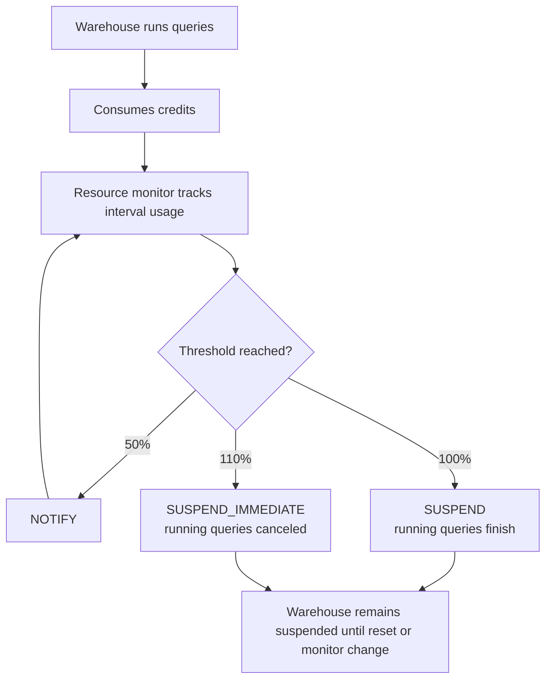

# Resource Monitors

> Credit guardrails for virtual warehouse usage. Consultant lens: Use them as spend circuit breakers, not full Snowflake cost management.

## Executive Summary

- **What it is:** A Snowflake object that tracks warehouse credit usage against a quota and triggers actions such as notification, suspension, or immediate suspension.
- **Why it matters:** It helps prevent runaway warehouse spend, especially in governed environments where teams need clear cost boundaries.
- **Mental model:** A spending circuit breaker for warehouse compute: set a credit quota, define thresholds, then decide what happens when usage crosses them.
- **Best used when:** A team, workload, sandbox, reader account, or whole Snowflake account needs a warehouse-compute safety net.
- **Avoid or reconsider when:** You need to monitor serverless or AI service spend, need exact per-credit enforcement, or cannot tolerate workload suspension without an operational response plan.

## What It Can Do

- Track credit usage for user-managed virtual warehouses and the cloud services used to support those warehouses.
- Send notifications when usage reaches configured thresholds.
- Suspend assigned warehouses after currently running statements finish.
- Suspend assigned warehouses immediately and cancel running statements.
- Work at the account level or at the warehouse level.
- Reset usage on a schedule such as daily, weekly, monthly, yearly, or never.

## What It Cannot Do

- Control all Snowflake costs; serverless features and AI services should be monitored with budgets instead.
- Guarantee an exact hard ceiling down to the individual credit.
- Replace warehouse sizing, auto-suspend, chargeback, usage reviews, or ownership discipline.
- Fix inefficient SQL, poor workload design, or long-running jobs by itself.
- Suspend cloud services usage directly, even though related cloud services credits can count toward monitor usage.

## Core Concepts

| Concept             | Meaning                                                                  | Why it matters                                                 |
| ------------------- | ------------------------------------------------------------------------ | -------------------------------------------------------------- |
| Credit quota        | Number of credits allocated to the monitor for the interval.             | Defines what 100% usage means.                                 |
| Threshold trigger   | A percentage of the quota that fires an action.                          | Allows early warnings before suspension.                       |
| `NOTIFY`            | Sends a notification but does not suspend a warehouse.                   | Useful for progressive alerts at 50%, 75%, or 90%.             |
| `SUSPEND`           | Suspends assigned warehouses after running statements finish.            | Safer for active workloads, but usage can exceed the quota.    |
| `SUSPEND_IMMEDIATE` | Suspends assigned warehouses immediately and cancels running statements. | Stronger cost protection, but operationally disruptive.        |
| Account monitor     | Monitors credit usage for all warehouses in the account.                 | Acts as a global warehouse-compute safety net.                 |
| Warehouse monitor   | Monitors one or more assigned warehouses.                                | Supports workload, team, or client-specific guardrails.        |
| Schedule            | Defines when monitoring starts and when used credits reset.              | Aligns controls to monthly, weekly, or other operating cycles. |

## How It Works (Simple Flow)

1. An administrator creates a resource monitor with a credit quota.
2. The monitor gets a schedule, usually monthly by default.
3. Threshold triggers define what happens at percentages of the quota.
4. The monitor is assigned to the account or to one or more warehouses.
5. Snowflake tracks credit usage during the interval.
6. When a threshold is reached, Snowflake sends notifications, suspends warehouses, or suspends immediately depending on the trigger.
7. If a suspend action fires, assigned warehouses stay suspended until the next interval starts or the monitor/quota/assignment is changed.
8. At the next interval, used credits reset and the monitor starts tracking the new period.

## Visuals



## Readable Snippets

```sql
-- Warehouse-level monitor with early warnings and suspension guardrails
USE ROLE ACCOUNTADMIN;

CREATE OR REPLACE RESOURCE MONITOR analytics_rm
  WITH CREDIT_QUOTA = 1000
  FREQUENCY = MONTHLY
  START_TIMESTAMP = IMMEDIATELY
  TRIGGERS ON 50 PERCENT DO NOTIFY
           ON 80 PERCENT DO NOTIFY
           ON 100 PERCENT DO SUSPEND
           ON 110 PERCENT DO SUSPEND_IMMEDIATE;

ALTER WAREHOUSE analytics_wh
  SET RESOURCE_MONITOR = analytics_rm;
```

```sql
-- Account-level warehouse-compute safety net
CREATE OR REPLACE RESOURCE MONITOR account_safety_rm
  WITH CREDIT_QUOTA = 5000
  TRIGGERS ON 80 PERCENT DO NOTIFY
           ON 100 PERCENT DO SUSPEND;

ALTER ACCOUNT
  SET RESOURCE_MONITOR = account_safety_rm;
```

```sql
-- Quick visibility checks
SHOW RESOURCE MONITORS;
SHOW WAREHOUSES;
```

## Consultant Talking Points

- **Client question this answers:** How do we prevent a warehouse, team, sandbox, or account from accidentally burning unlimited credits?
- **Trade-offs to mention:** `SUSPEND` is less disruptive but can overshoot; `SUSPEND_IMMEDIATE` protects spend faster but can cancel critical work.
- **Risk or governance angle:** Resource monitors need ownership, notification setup, and an escalation path; a suspended production warehouse can become an incident.
- **Cost/performance angle:** Resource monitors limit blast radius, but auto-suspend, warehouse right-sizing, and workload isolation are still needed to reduce waste.

## Common Pitfalls

- Creating a monitor in SQL but forgetting to assign it to an account or warehouse.
- Treating the quota as an exact spending ceiling instead of a guardrail with possible lag.
- Assigning unrelated warehouses to one shared monitor, causing one team to suspend another team's workload.
- Using `SUSPEND_IMMEDIATE` on production jobs without understanding that running statements can be canceled.
- Assuming notifications work automatically; users must have notifications enabled and email set up where relevant.
- Assuming resource monitors control serverless and AI service spend.

## When to Recommend What (Decision Table)

| Situation | Recommend | Why | Watch-outs |
|---|---|---|---|
| Strict cost governance across warehouse compute | Account-level monitor plus warehouse-level monitors for major workloads | Provides both global and workload-specific guardrails | Still does not cover all Snowflake spend |
| Team-owned BI, ELT, or data science warehouse | Dedicated warehouse-level monitor | Gives the team a clear credit boundary | Avoid sharing quotas across unrelated teams |
| Analyst sandbox or training environment | Small quota with early `NOTIFY` and `SUSPEND` | Contains exploratory usage risk | Too-low quotas can frustrate legitimate learning |
| Critical production ELT | Early notifications, cautious suspend thresholds | Protects cost while avoiding surprise outages | `SUSPEND_IMMEDIATE` can break jobs mid-run |
| Reader account managed by provider | Dedicated monitor on reader-account warehouses | Provider is responsible for compute usage | Pair with auto-suspend and usage review |
| Serverless or AI cost monitoring | Snowflake Budgets and Account Usage views | Resource monitors do not cover those services | Budgets are primarily monitoring/alerting, not identical hard stops |

## Related Topics

- [[01 Snowflake/01 Core Architecture and Concepts/Core Architecture and Concepts Overview]]
- [[01 Snowflake/01 Core Architecture and Concepts/01 Virtual Warehouses]]
- [[01 Snowflake/06 Cost Management and Operations/44 Credit Consumption Model]]
- [[01 Snowflake/06 Cost Management and Operations/45 Account Usage Views]]
- [[01 Snowflake/06 Cost Management and Operations/46 Warehouse Scheduling and Auto-suspend]]
- [[01 Snowflake/06 Cost Management and Operations/47 Budgets]]

## Related Decision Notes

- [[80 Comparisons and Decision Notes/Comparisons/Snowflake/Comparison - Resource Monitors vs Budgets]]
- [[80 Comparisons and Decision Notes/Decision Notes/Snowflake/Decisions - Choosing a Warehouse Strategy by Workload Type]]
- [[80 Comparisons and Decision Notes/Comparisons/Snowflake/Comparison - Direct Share vs Reader Account]]

## Questions

- Which warehouses need strict suspension controls versus notification-only monitoring?
- Who should receive alerts, and what should they do when a threshold is reached?
- Which costs are warehouse-based versus serverless or AI-based?
- Should any workloads have separate monitors to avoid shared-quota blast radius?

## Sources To Revisit

- Snowflake docs: Working with resource monitors - https://docs.snowflake.com/en/user-guide/resource-monitors
- Snowflake SQL reference: CREATE RESOURCE MONITOR - https://docs.snowflake.com/en/sql-reference/sql/create-resource-monitor
- Snowflake docs: Monitor credit usage with budgets - https://docs.snowflake.com/en/user-guide/budgets
