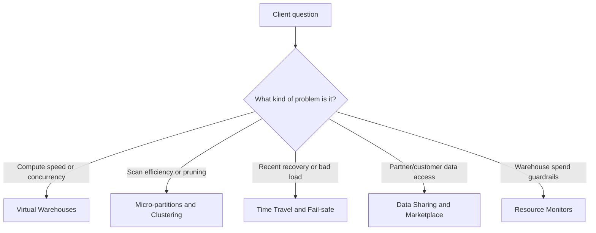

# Core Architecture and Concepts Overview

> Foundational Snowflake mechanics: compute, storage, recovery, sharing, and spend guardrails.

## Chapter Summary

This chapter explains the foundation underneath most Snowflake consulting conversations: how compute runs, how storage is organized, how recent mistakes can be recovered, how data can be shared without copy-based pipelines, and how warehouse credit usage can be controlled. The recurring pattern is separation of concerns: storage is separate from compute, recovery is separate from historical analytics, sharing is separate from file movement, and cost guardrails are separate from performance tuning. If you can explain these five topics clearly, you can usually diagnose whether a client problem is about compute, storage layout, recovery, collaboration, or cost control.

## Topics

- [[01 Snowflake/01 Core Architecture and Concepts/01 Virtual Warehouses|01 - Virtual Warehouses]]
- [[01 Snowflake/01 Core Architecture and Concepts/02 Micro-partitions and Clustering|02 - Micro-partitions and Clustering]]
- [[01 Snowflake/01 Core Architecture and Concepts/03 Time Travel and Fail-safe|03 - Time Travel and Fail-safe]]
- [[01 Snowflake/01 Core Architecture and Concepts/04 Data Sharing and Marketplace|04 - Data Sharing and Marketplace]]
- [[01 Snowflake/01 Core Architecture and Concepts/05 Resource Monitors|05 - Resource Monitors]]

## Topic Summaries

### [[01 Snowflake/01 Core Architecture and Concepts/01 Virtual Warehouses|01 - Virtual Warehouses]]

Virtual warehouses are the compute clusters that run queries, loads, and transformation jobs independently of Snowflake storage. The core consultant lens is that size affects power per query, multi-cluster settings affect concurrency, and running time drives credit cost. Recommend separate, right-sized warehouses when workloads interfere with each other, and pair them with auto-suspend, ownership, and monitoring. Do not treat warehouse scaling as a cure for poor SQL, weak modeling, or missing governance.

### [[01 Snowflake/01 Core Architecture and Concepts/02 Micro-partitions and Clustering|02 - Micro-partitions and Clustering]]

Micro-partitions are Snowflake's automatic columnar storage units, and pruning is the mechanism that lets Snowflake skip irrelevant chunks of data. Clustering is useful when large, important tables have predictable filter patterns and poor pruning consistency. The practical question is not "should every table be clustered?" but "which high-value tables justify ongoing clustering maintenance cost?" Use query profile, scan metrics, and real workload patterns before recommending clustering.

### [[01 Snowflake/01 Core Architecture and Concepts/03 Time Travel and Fail-safe|03 - Time Travel and Fail-safe]]

Time Travel is the self-service recovery window for recent mistakes: query old data, clone a prior state, or undrop an object while retention still applies. Fail-safe is Snowflake-managed last-resort protection for permanent table data after Time Travel expires; it is not a normal SQL restore feature. Consultant advice should connect retention to business criticality, detection time, and storage cost. Time Travel helps recover from incidents, but it should not be sold as a full historical analytics or audit strategy.

### [[01 Snowflake/01 Core Architecture and Concepts/04 Data Sharing and Marketplace|04 - Data Sharing and Marketplace]]

Data sharing lets a provider expose curated data to consumers without copying files or building duplicate ingestion pipelines. Direct shares fit known Snowflake consumers, listings and Marketplace fit productized distribution, and reader accounts fit consumers without Snowflake when the provider accepts more operational and cost responsibility. The main consultant warning is that zero-copy does not mean zero governance. Shared data should be curated, documented, access-controlled, and supported like a data product.

### [[01 Snowflake/01 Core Architecture and Concepts/05 Resource Monitors|05 - Resource Monitors]]

Resource monitors are credit guardrails for virtual warehouse usage. They track warehouse credits against a quota and can notify, suspend, or immediately suspend assigned warehouses when thresholds are reached. Use them as spend circuit breakers for teams, sandboxes, reader accounts, and account-wide warehouse compute risk. They do not control every Snowflake cost, especially serverless and AI services, so pair them with budgets and Account Usage views for broader cost visibility.

## Visuals

## Consultant Synthesis

| Client signal | Start with | Why |
|---|---|---|
| "Dashboards are slow during business hours." | Virtual warehouses, then query profile and clustering | Separate concurrency problems from scan/design problems. |
| "This huge table scans too much data." | Micro-partitions and Clustering | Pruning behavior usually explains whether clustering can help. |
| "We overwrote good data yesterday." | Time Travel and Fail-safe | Recent recovery is usually self-service if retention still applies. |
| "We need to give a partner live data." | Data Sharing and Marketplace | Avoid file exports when governed zero-copy sharing fits. |
| "A team burned too many credits." | Resource Monitors | Put a warehouse-compute circuit breaker around the workload. |
| "Can we control all Snowflake spend with one feature?" | Resource Monitors plus Budgets and Account Usage | Warehouse guardrails and broader spend monitoring are different controls. |

## What You Should Be Able To Explain

- Why Snowflake separates compute from storage, and why that matters for cost and workload isolation.
- Why micro-partition pruning can make similar-looking queries perform very differently.
- Why Time Travel is for recovery, while modeled history is for analytics.
- Why zero-copy sharing still needs governance, contracts, and support expectations.
- Why resource monitors are useful guardrails, but not complete FinOps.

## How To Use This Area

Use this note as the local hub for this chapter. The global [[00 Home/Snowflake Learning Map|Snowflake Learning Map]] links here, and the topic notes link back here so Graph View forms a cleaner hierarchy.

## Related Areas

- [[00 Home/Snowflake Learning Map|Snowflake Learning Map]]
- [[01 Snowflake/02 Performance and Optimization/Performance and Optimization Overview|Performance and Optimization]]
- [[01 Snowflake/03 Security and Governance/Security and Governance Overview|Security and Governance]]
- [[01 Snowflake/06 Cost Management and Operations/Cost Management and Operations Overview|Cost Management and Operations]]
- [[80 Comparisons and Decision Notes/Comparisons and Decision Notes Overview|Comparisons and Decision Notes]]
