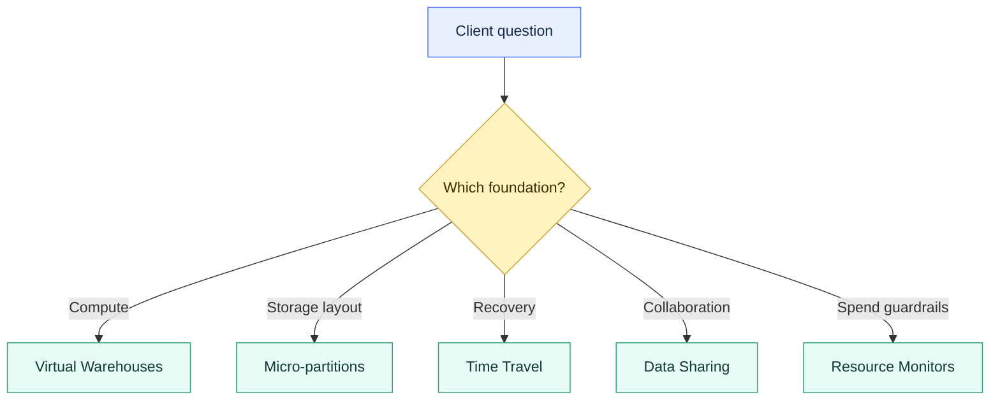

# Core Architecture and Concepts Overview

> [!abstract] Chapter outcome
> Explain how Snowflake separates compute, storage, recovery, sharing, and spend guardrails — then identify which layer a client problem belongs to.

## Topics

- [[01 Snowflake/01 Core Architecture and Concepts/01 Virtual Warehouses|01 - Virtual Warehouses]]
- [[01 Snowflake/01 Core Architecture and Concepts/02 Micro-partitions and Clustering|02 - Micro-partitions and Clustering]]
- [[01 Snowflake/01 Core Architecture and Concepts/03 Time Travel and Fail-safe|03 - Time Travel and Fail-safe]]
- [[01 Snowflake/01 Core Architecture and Concepts/04 Data Sharing and Marketplace|04 - Data Sharing and Marketplace]]
- [[01 Snowflake/01 Core Architecture and Concepts/05 Resource Monitors|05 - Resource Monitors]]

## Chapter Map

## Topic Summaries

| Topic | What it unlocks |
|---|---|
| [[01 Snowflake/01 Core Architecture and Concepts/01 Virtual Warehouses\|Virtual Warehouses]] | Separate, right-size, scale, and suspend compute. Size affects per-query power; cluster count affects concurrency; runtime drives cost. |
| [[01 Snowflake/01 Core Architecture and Concepts/02 Micro-partitions and Clustering\|Micro-partitions and Clustering]] | Diagnose pruning and decide whether a high-value table justifies ongoing clustering cost. |
| [[01 Snowflake/01 Core Architecture and Concepts/03 Time Travel and Fail-safe\|Time Travel and Fail-safe]] | Match self-service recovery windows to business criticality, detection time, and storage cost. Recovery is not historical modeling. |
| [[01 Snowflake/01 Core Architecture and Concepts/04 Data Sharing and Marketplace\|Data Sharing and Marketplace]] | Share curated live data without copy pipelines. Zero-copy still requires governance, contracts, and support. |
| [[01 Snowflake/01 Core Architecture and Concepts/05 Resource Monitors\|Resource Monitors]] | Add warehouse-compute circuit breakers. Pair them with budgets and Account Usage for broader cost visibility. |

## Consultant Synthesis

| Client signal | Start with | Why |
|---|---|---|
| "Dashboards are slow during business hours." | Virtual warehouses, then query profile and clustering | Separate concurrency problems from scan/design problems. |
| "This huge table scans too much data." | Micro-partitions and Clustering | Pruning behavior usually explains whether clustering can help. |
| "We overwrote good data yesterday." | Time Travel and Fail-safe | Recent recovery is usually self-service if retention still applies. |
| "We need to give a partner live data." | Data Sharing and Marketplace | Avoid file exports when governed zero-copy sharing fits. |
| "A team burned too many credits." | Resource Monitors | Put a warehouse-compute circuit breaker around the workload. |
| "Can we control all Snowflake spend with one feature?" | Resource Monitors plus Budgets and Account Usage | Warehouse guardrails and broader spend monitoring are different controls. |

## What You Should Be Able To Explain

- Why Snowflake separates compute from storage, and why that matters for cost and workload isolation.
- Why micro-partition pruning can make similar-looking queries perform very differently.
- Why Time Travel is for recovery, while modeled history is for analytics.
- Why zero-copy sharing still needs governance, contracts, and support expectations.
- Why resource monitors are useful guardrails, but not complete FinOps.

## How To Use This Area

Start with the chapter map to classify the problem, then open the matching topic note. Use the synthesis table to distinguish adjacent concerns before recommending a feature.

## Related Areas

- [[00 Home/Snowflake Learning Map|Snowflake Learning Map]]
- [[01 Snowflake/02 Performance and Optimization/Performance and Optimization Overview|Performance and Optimization]]
- [[01 Snowflake/03 Security and Governance/Security and Governance Overview|Security and Governance]]
- [[01 Snowflake/06 Cost Management and Operations/Cost Management and Operations Overview|Cost Management and Operations]]
- [[80 Comparisons and Decision Notes/Comparisons and Decision Notes Overview|Comparisons and Decision Notes]]
