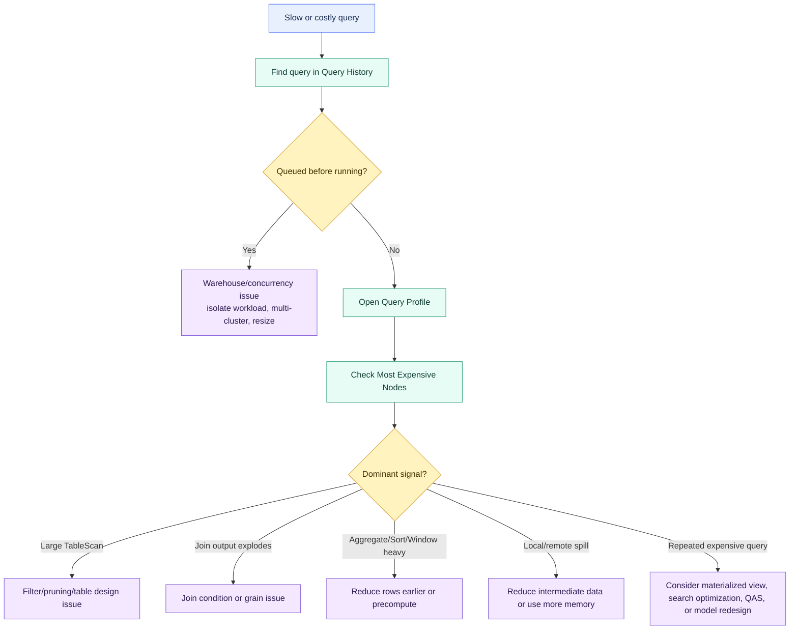

# Query Profile

> [!abstract] Consultant lens
> **What it is:** Query Profile is the visual execution plan for a completed query.
> **Why it matters:** It turns "this query is slow" into a specific bottleneck and next action.

## Executive Summary

- **What it is:** Query Profile is Snowflake's visual execution story for a query, showing operators such as scans, filters, joins, aggregates, sorts, spilling, pruning, and execution timing.
- **Why it matters:** It prevents guesswork by showing whether the issue is warehouse queueing, too much data scanned, poor pruning, exploding joins, heavy aggregation/sort work, or memory spill.
- **Mental model:** SQL shows what the user asked for; Query Profile shows what Snowflake had to do to answer it.
- **Best used when:** A query, dashboard, ELT job, or recurring query pattern is slow, costly, or unpredictable.
- **Avoid or reconsider when:** The query is not important or repeated enough to justify tuning, the profile is unavailable/redacted, or the issue is clearly outside query execution such as downstream BI rendering.

## What It Can Do

- Show the physical execution plan for a completed query in Snowsight.
- Highlight expensive operator nodes so investigation starts where the query actually spent effort.
- Show scan, pruning, row count, spilling, and network statistics for query operators.
- Help identify common problems such as full scans, weak filters, exploding joins, unnecessary aggregation, unnecessary `UNION DISTINCT`, remote spill, and warehouse queueing.
- Support programmatic inspection through `GET_QUERY_OPERATOR_STATS`.
- Connect individual slow queries to repeated query patterns through Query History and query hashes.

## What It Cannot Do

- Automatically fix the SQL or choose the best optimization for the business context.
- Prove that a bigger warehouse is the right answer without interpreting the bottleneck.
- Show complete details for every query; some profiles can be unavailable, redacted, expired, or limited by privileges.
- Replace understanding of data model grain, join logic, dashboard behavior, or workload concurrency.
- Guarantee that one slow execution represents the normal workload pattern.

## Core Concepts

| Concept | Meaning | Why it matters |
|---|---|---|
| Query History | Snowflake history view/page for finding individual and grouped queries. | Start here before opening a profile so you optimize the right query. |
| Query ID | Unique identifier for a specific query execution. | Lets you open the exact profile or inspect operators with SQL. |
| Query hash / parameterized hash | Fingerprint for similar query text, optionally ignoring literal values. | Helps find repeated patterns that cost more in total than one isolated slow query. |
| Operator node | A unit of execution such as `TableScan`, `Join`, `Aggregate`, `Sort`, or `WindowFunction`. | Each node is a possible bottleneck with different fixes. |
| Most Expensive Nodes | Profile pane listing nodes that took meaningful execution time. | Best first place to look instead of wandering through the whole graph. |
| `TableScan` | Operator that reads table data. | Large scans and weak pruning often point to filter, modeling, clustering, or search optimization work. |
| Pruning | Skipping micro-partitions that cannot match the query. | Poor pruning means Snowflake reads more data than the business question may require. |
| Join cardinality | Relationship between join input rows and output rows. | Output rows far above inputs can indicate an exploding join or wrong grain. |
| Spilling | Intermediate data does not fit comfortably in memory and is written to local or remote storage. | Remote spill is especially slow and can point to large joins, aggregates, sorts, or undersized compute. |
| Query Insights | Snowflake-generated performance observations for common query issues. | Useful hints, but still need consultant judgment before recommending a fix. |

## How It Works (Simple Flow)

1. Find the relevant query in Query History by query ID, dashboard/job context, duration, warehouse, query tag, or query hash.
2. Check whether the query was queued before execution; if so, concurrency or warehouse capacity may be the first issue.
3. Open Query Profile and start with Most Expensive Nodes and Query Insights.
4. Inspect the expensive operator type: scan, join, aggregate, sort/window, spill-heavy node, or network-heavy node.
5. Compare input/output rows, bytes scanned, partitions scanned, and spill statistics.
6. Map the signal to a specific action such as filtering earlier, fixing joins, improving pruning, resizing/isolation, or materializing repeated work.
7. Validate the change with a before/after query profile, not only with intuition.

## Visuals



## Readable Snippets

```sql
-- Find repeated expensive query patterns before tuning one isolated execution.
select
  query_parameterized_hash,
  count(*) as executions,
  sum(total_elapsed_time) / 1000 as total_seconds,
  max(bytes_scanned) as max_bytes_scanned,
  any_value(query_id) as sample_query_id
from snowflake.account_usage.query_history
where start_time >= dateadd(day, -7, current_timestamp())
  and error_code is null
  and query_parameterized_hash is not null
group by query_parameterized_hash
order by total_seconds desc
limit 20;
```

```sql
-- Programmatically inspect operator-level profile stats for one completed query.
select *
from table(get_query_operator_stats('<query_id>'));
```

```sql
-- Spot potential exploding joins by comparing join output rows to input rows.
select
  operator_id,
  operator_statistics:input_rows::number as input_rows,
  operator_statistics:output_rows::number as output_rows,
  operator_statistics:output_rows::number
    / nullif(operator_statistics:input_rows::number, 0) as output_to_input_ratio
from table(get_query_operator_stats('<query_id>'))
where operator_type = 'Join'
order by output_to_input_ratio desc;
```

```sql
-- Find queries that spilled to local or remote storage.
select
  query_id,
  user_name,
  warehouse_name,
  total_elapsed_time / 1000 as total_seconds,
  bytes_spilled_to_local_storage,
  bytes_spilled_to_remote_storage
from snowflake.account_usage.query_history
where start_time >= dateadd(day, -7, current_timestamp())
  and (
    bytes_spilled_to_local_storage > 0
    or bytes_spilled_to_remote_storage > 0
  )
order by bytes_spilled_to_remote_storage desc, bytes_spilled_to_local_storage desc
limit 20;
```

```sql
-- Read Snowflake-generated query insights for a specific query.
select
  query_id,
  insight_topic,
  insight_type_id,
  suggestions
from snowflake.account_usage.query_insights
where query_id = '<query_id>';
```

## Consultant Talking Points

- **Client question this answers:** Why is this query/dashboard/job slow, and what should we change first?
- **Trade-offs to mention:** Scaling compute can help memory or processing pressure, but it may only make a bad scan or bad join more expensive.
- **Risk or governance angle:** Query tuning should be based on repeated, important workloads; otherwise teams can spend time optimizing noise.
- **Cost/performance angle:** Query Profile helps separate waste reduction from brute-force speed: less data scanned, fewer intermediate rows, less spill, and better warehouse fit.

## Common Pitfalls

- Recommending a bigger warehouse before checking whether the query is queued, scanning too much, joining badly, or spilling.
- Optimizing one unusual query execution instead of a repeated query pattern.
- Seeing a large `TableScan` and immediately recommending clustering without validating table size, filter patterns, and business value.
- Ignoring join output rows; a small-looking query can explode into a huge intermediate result.
- Treating `DISTINCT`, `GROUP BY`, `ORDER BY`, and window functions as harmless on very large intermediate datasets.
- Confusing local and remote spill; remote spill is usually the more serious performance signal.
- Forgetting that Query Insights are hints, not final architecture recommendations.

## When to Recommend What (Decision Table)

| Profile signal | Likely diagnosis | Recommend | Watch-outs |
|---|---|---|---|
| Long queue time before execution | Warehouse concurrency or capacity pressure | Separate workloads, use multi-cluster, reduce concurrency, or resize | Do not rewrite SQL first if the query barely got to run |
| `TableScan` reads many bytes | Query reads too much data | Add selective filters, reduce scanned columns, review table/model design | Bigger warehouse may only make the large scan faster |
| High partitions scanned vs total | Poor pruning | Check predicate design; consider clustering for large stable filter-heavy tables | Clustering adds serverless maintenance cost |
| Join output far exceeds input rows | Exploding join or wrong grain | Fix join conditions, deduplicate, filter first, join at correct grain | Validate with row-count checks outside the profile too |
| Heavy aggregate or unnecessary `DISTINCT` | Expensive grouping/deduplication | Remove unnecessary dedupe, pre-aggregate, consider materialized view for repeated logic | Confirm result semantics before changing |
| Heavy sort or window function | Too many rows sorted/windowed | Filter/aggregate earlier, reduce partitions, materialize repeated steps | Window logic may be business-critical |
| Local or remote spill | Intermediate data exceeds comfortable memory | Reduce intermediate data, batch work, simplify joins/aggregates, or use larger warehouse | Remote spill is usually more severe than local spill |
| Leading wildcard search | Hard-to-prune text matching | Rewrite predicate if possible; consider Search Optimization Service for important repeated searches | Search optimization has maintenance cost |
| Repeated expensive pattern | Same cost paid many times | Consider materialized view, search optimization, result-cache-aware design, or model redesign | Optimize by total workload impact, not one execution |

## Related Topics

- [[01 Snowflake/02 Performance and Optimization/Performance and Optimization Overview]]
- [[01 Snowflake/01 Core Architecture and Concepts/01 Virtual Warehouses]]
- [[01 Snowflake/01 Core Architecture and Concepts/02 Micro-partitions and Clustering]]
- [[01 Snowflake/02 Performance and Optimization/09 Search Optimization Service]]
- [[01 Snowflake/02 Performance and Optimization/10 Query Acceleration Service]]
- [[01 Snowflake/06 Cost Management and Operations/45 Account Usage Views]]

## Related Decision Notes

- [[80 Comparisons and Decision Notes/Decision Notes/Snowflake/Decisions - Diagnosing Slow Snowflake Queries]]
- [[80 Comparisons and Decision Notes/Comparisons/Snowflake/Comparison - Bigger Warehouse vs Clustering]]
- [[80 Comparisons and Decision Notes/Comparisons/Snowflake/Comparison - Virtual Warehouse Size vs Multi-cluster]]

## Questions

- Is this query slow once, or is a repeated query pattern consuming significant total time?
- Did the query wait in a warehouse queue before execution?
- Which operator is the dominant bottleneck?
- Is the query scanning too much data, producing too many rows, or running out of memory?
- What before/after metric will prove that the change helped?

## Sources To Revisit

- [Snowflake Docs: Monitor query activity with Query History](https://docs.snowflake.com/en/user-guide/ui-snowsight-activity)
- [Snowflake Docs: Using query insights to improve performance](https://docs.snowflake.com/en/user-guide/query-insights)
- [Snowflake SQL Reference: GET_QUERY_OPERATOR_STATS](https://docs.snowflake.com/en/sql-reference/functions/get_query_operator_stats)
- [Snowflake Docs: Queries too large to fit in memory](https://docs.snowflake.com/en/user-guide/performance-query-warehouse-memory)
