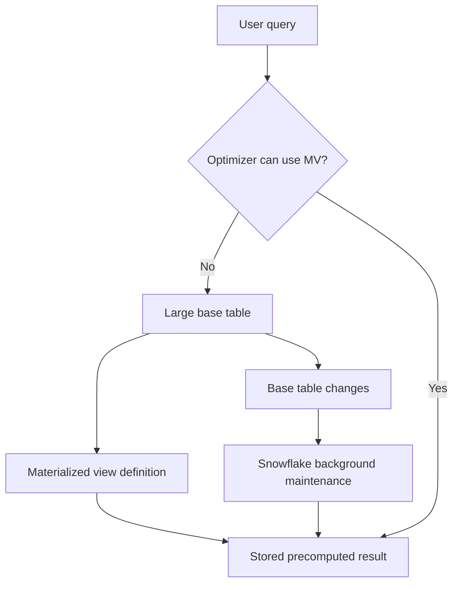

# Materialized Views

> Maintained precomputed query results. Consultant lens: Trade storage and maintenance cost for faster repeated reads.

## Executive Summary

- **What it is:** A database object that stores the precomputed result of a query and is automatically maintained by Snowflake when the base table changes.
- **Why it matters:** Materialized views can accelerate repeated expensive selections, projections, aggregations, and semi-structured-data expressions on large datasets.
- **Mental model:** A normal view stores SQL logic; a materialized view stores a prepared result that Snowflake keeps current.
- **Best used when:** The same expensive query pattern runs often, the result is much smaller than the base table, and the base table or relevant subset does not change constantly.
- **Avoid or reconsider when:** The query pattern is rare, ad hoc, join-heavy, changes frequently, or the maintenance/storage cost is unlikely to be offset by repeated query savings.

## What It Can Do

- Store a precomputed result set for faster reads.
- Automatically maintain the result after base-table inserts, updates, or deletes.
- Return current results even if maintenance is behind by combining maintained data with newer base-table data when needed.
- Let the optimizer automatically rewrite eligible queries against the base table to use the materialized view.
- Improve repeated expensive filters, projections, aggregations, and semi-structured-data processing.
- Be queried directly when that makes SQL simpler or performance behavior clearer.

## What It Cannot Do

- Remove cost; materialized views consume storage and maintenance credits.
- Support every SQL pattern in the materialized view definition.
- Query more than one base table in the materialized view definition.
- Include joins, window functions, UDFs, `HAVING`, `ORDER BY`, `LIMIT`, nested subqueries, or unsupported aggregate functions in the definition.
- Accept direct `INSERT`, `UPDATE`, `DELETE`, or `TRUNCATE` operations.
- Replace data modeling, dynamic tables, streams/tasks, or result caching in every repeated-query situation.

## Core Concepts

| Concept | Meaning | Why it matters |
|---|---|---|
| Base table | The single table the materialized view is defined on. | Snowflake tracks base-table changes to maintain the view. |
| Materialized result | Stored output of the view definition. | Query reads can be faster because expensive work is already done. |
| Automatic maintenance | Snowflake background process that refreshes/compacts the materialized view after base-table changes. | Reduces manual refresh work but consumes credits. |
| Query rewrite | Optimizer can use the materialized view even when the user queries the base table. | Users do not always need to reference the MV directly. |
| Maintenance cost | Credits consumed to keep the materialized result current. | Can outweigh query savings if the base table changes often. |
| Storage cost | Cost of storing the precomputed result. | Important when result size is close to the base table size. |
| `BEHIND_BY` | Output field from `SHOW MATERIALIZED VIEWS` showing maintenance lag. | Helps diagnose when maintenance is behind. |
| Enterprise Edition | Snowflake edition requirement for materialized views. | Must be checked before recommending the feature. |

## How It Works (Simple Flow)

1. A repeated expensive query pattern is identified through Query History and Query Profile.
2. A materialized view is defined on one base table using supported SQL.
3. Snowflake performs the initial build, similar to creating a stored result from the query.
4. User queries can reference the materialized view directly or query the base table.
5. The optimizer may rewrite eligible base-table queries to use the materialized view.
6. When the base table changes, Snowflake maintains the materialized view in the background.
7. Teams compare query improvement against storage and maintenance credits to decide whether the MV is worth keeping.

## Visuals



## Readable Snippets

```sql
-- Precompute a repeated dashboard aggregation on one large table.
create or replace materialized view analytics.mv_daily_region_revenue as
select
  order_date,
  region,
  sum(revenue) as revenue
from analytics.sales_facts
where order_date >= '2026-01-01'
group by order_date, region;
```

```sql
-- Check whether the materialized view is behind maintenance.
show materialized views like 'MV_DAILY_REGION_REVENUE';
```

```sql
-- Suspend/resume maintenance and use of a materialized view.
alter materialized view analytics.mv_daily_region_revenue suspend;
alter materialized view analytics.mv_daily_region_revenue resume;
```

```sql
-- Review materialized view maintenance credits.
select
  to_date(start_time) as date,
  database_name,
  schema_name,
  table_name,
  sum(credits_used::number) as credits_used
from snowflake.account_usage.materialized_view_refresh_history
where start_time >= dateadd(month, -1, current_timestamp())
group by 1, 2, 3, 4
order by credits_used desc;
```

## Consultant Talking Points

- **Client question this answers:** How can we speed up repeated expensive dashboard/reporting queries without recalculating the same work every time?
- **Trade-offs to mention:** Query reads may get faster, but Snowflake now pays storage and maintenance cost to keep the prepared result current.
- **Risk or governance angle:** MVs are extra governed objects with ownership, privileges, monitoring, and lifecycle decisions.
- **Cost/performance angle:** Recommend only when repeated read savings are likely to exceed maintenance and storage cost.

## Common Pitfalls

- Creating materialized views for one-off ad hoc queries.
- Ignoring base-table change frequency; high-churn tables can create heavy maintenance cost.
- Assuming the optimizer will always choose the materialized view.
- Forgetting the one-base-table and no-join restrictions in the MV definition.
- Creating an MV whose result is nearly as large as the base table, reducing the storage/performance benefit.
- Measuring faster queries but forgetting to monitor `MATERIALIZED_VIEW_REFRESH_HISTORY`.
- Treating materialized views as a replacement for transformation pipelines.

## When to Recommend What (Decision Table)

| Situation | Recommend | Why | Watch-outs |
|---|---|---|---|
| Repeated expensive aggregation on one large table | Materialized view | Precomputes work that many queries reuse | Confirm supported SQL and maintenance cost |
| Dashboard repeatedly filters a large table to a small stable subset | Materialized view | Avoids rescanning irrelevant base-table history | Base table changes can still drive maintenance |
| Same exact query repeats and data has not changed | Result cache first | No extra object or maintenance cost | Cache eligibility and duration are limited |
| Multi-table transformation pipeline | Dynamic table | More flexible for joins and multi-step derived data | Requires target lag and warehouse planning |
| Poor pruning on large table with stable filters | Clustering or MV depending on pattern | Clustering improves base-table access; MV stores a filtered/precomputed result | Both introduce maintenance cost |
| Base table changes constantly and query is not repeated often | Avoid MV | Maintenance cost can exceed read savings | Consider SQL/model tuning first |

## Related Topics

- [[01 Snowflake/02 Performance and Optimization/Performance and Optimization Overview]]
- [[01 Snowflake/02 Performance and Optimization/06 Query Profile]]
- [[01 Snowflake/01 Core Architecture and Concepts/02 Micro-partitions and Clustering]]
- [[01 Snowflake/02 Performance and Optimization/11 Result Caching]]
- [[01 Snowflake/02 Performance and Optimization/08 Dynamic Tables]]
- [[01 Snowflake/04 Data Engineering/20 Dynamic Tables]]
- [[01 Snowflake/06 Cost Management and Operations/31 Account Usage Views]]

## Related Decision Notes

- [[80 Comparisons and Decision Notes/Comparisons/Comparison - Materialized Views vs Dynamic Tables]]
- [[80 Comparisons and Decision Notes/Decision Notes/Decisions - Diagnosing Slow Snowflake Queries]]
- [[80 Comparisons and Decision Notes/Comparisons/Comparison - Bigger Warehouse vs Clustering]]

## Questions

- Which repeated query patterns cost the most total time/credits?
- Does the MV result contain far fewer rows or columns than the base table?
- How often does the base table change compared with how often the query runs?
- What maintenance-credit threshold would make the MV no longer worthwhile?
- Is this really query acceleration, or should it be modeled as a pipeline with dynamic tables/dbt?

## Sources To Revisit

- Snowflake docs: Working with Materialized Views - https://docs.snowflake.com/en/user-guide/views-materialized
- Snowflake SQL reference: CREATE MATERIALIZED VIEW - https://docs.snowflake.com/en/sql-reference/sql/create-materialized-view
- Snowflake docs: Views, materialized views, and dynamic tables - https://docs.snowflake.com/en/user-guide/overview-view-mview-dts
- Snowflake Account Usage: MATERIALIZED_VIEW_REFRESH_HISTORY - https://docs.snowflake.com/en/sql-reference/account-usage/materialized_view_refresh_history
