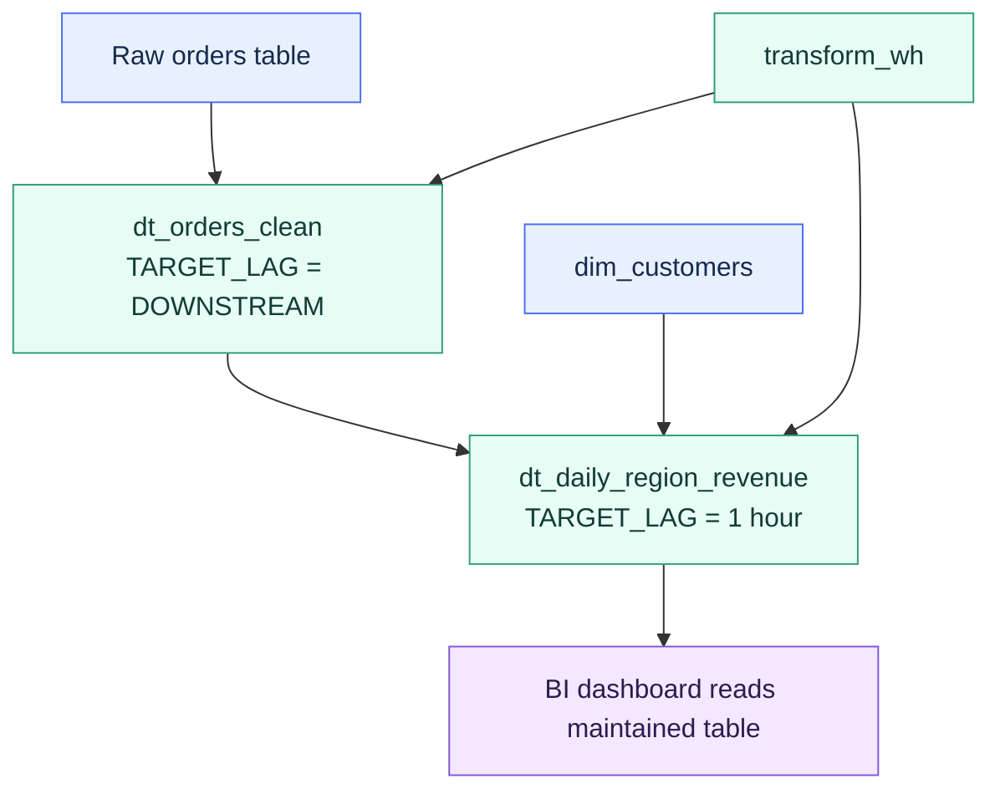

# Dynamic Tables for Performance

> [!abstract] Consultant lens
> **What it is:** Dynamic tables are declaratively maintained tables with freshness targets.
> **Why it matters:** Use them when repeated derived data should be managed as a pipeline, not merely accelerated as a single query.

## Executive Summary

- **What it is:** A Snowflake object where you define a target table with a `SELECT` query, target lag, warehouse, and refresh mode; Snowflake refreshes it automatically.
- **Why it matters:** Dynamic tables reduce custom orchestration for derived datasets and can make repeated reads fast by materializing transformation results.
- **Mental model:** Instead of writing code to load a derived table, you declare what the table should contain and how fresh it should be.
- **Best used when:** A client needs managed, refreshed transformation tables, especially multi-step pipelines with joins, cleaning, aggregations, or downstream dependencies.
- **Avoid or reconsider when:** The need is just accelerating a simple repeated one-table query, exact real-time freshness is required, or refresh cost/lag cannot be monitored.

## What It Can Do

- Materialize the result of a `SELECT` query and keep it updated.
- Build multi-step pipelines where dynamic tables depend on other dynamic tables.
- Refresh incrementally, fully, or in `AUTO` mode depending on supported query patterns and creation-time choice.
- Use `TARGET_LAG` to define how stale data is allowed to be.
- Use `TARGET_LAG = DOWNSTREAM` for intermediate tables that should refresh only when downstream consumers need fresh data.
- Run refreshes on an assigned virtual warehouse so cost/performance can be isolated and tuned.

## What It Cannot Do

- Guarantee exact freshness; target lag is a goal, not a hard schedule or SLA.
- Replace every stream/task or dbt workflow, especially when procedural logic, external orchestration, or non-Snowflake steps are needed.
- Avoid compute cost; refreshes run on a warehouse and consume credits.
- Support every possible SQL construct in incremental refresh mode.
- Avoid reinitialization risk when definitions or upstream objects change.
- Accept normal manual DML as the intended way to change its contents.

## Core Concepts

| Concept | Meaning | Why it matters |
|---|---|---|
| Dynamic table | A table whose contents are defined by a query and refreshed by Snowflake. | Lets teams declare transformation outputs instead of writing refresh jobs. |
| Target lag | Desired maximum staleness relative to the base tables. | Guides Snowflake refresh scheduling; it is not an exact interval. |
| `DOWNSTREAM` | Target-lag mode where an upstream table refreshes only when downstream tables need it. | Reduces unnecessary refreshes in pipelines. |
| Refresh mode | `INCREMENTAL`, `FULL`, or `AUTO`. | Determines whether Snowflake processes only changes or rebuilds the result. |
| Assigned warehouse | Warehouse used to run regular refreshes. | Main cost/performance control for dynamic table refreshes. |
| Initialization | Initial population of the dynamic table. | Can be expensive because it may scan source data. |
| Reinitialization | Full rebuild triggered by certain changes. | Can surprise teams with cost and latency. |
| Refresh history | Metadata showing refresh state, timing, action, errors, and statistics. | Required for operations and troubleshooting. |

## How It Works (Simple Flow)

1. A developer creates a dynamic table with a `SELECT` query, target lag, warehouse, and refresh mode.
2. Snowflake parses the query and identifies the upstream dependencies.
3. Snowflake initializes the dynamic table by materializing its initial contents.
4. When upstream data changes, Snowflake schedules refresh work to try to meet the target lag.
5. Refreshes run on the assigned warehouse and apply results atomically, so readers do not see partial refreshes.
6. In a pipeline, Snowflake refreshes upstream and downstream dynamic tables in dependency order using a consistent snapshot.
7. Teams monitor refresh history, actual lag, warehouse usage, skipped/failed refreshes, and reinitializations.

## Visuals



## Readable Snippets

```sql
-- Intermediate cleaning table refreshes only when downstream consumers need it.
create or replace dynamic table analytics.dt_orders_clean
  target_lag = downstream
  warehouse = transform_wh
  refresh_mode = incremental
as
select
  order_id,
  customer_id,
  order_date,
  trim(upper(product_name)) as product_name,
  quantity,
  unit_price,
  quantity * unit_price as line_total,
  order_status
from raw.orders
where order_status != 'returned';
```

```sql
-- Downstream aggregate has the actual freshness target.
create or replace dynamic table analytics.dt_daily_region_revenue
  target_lag = '1 hour'
  warehouse = transform_wh
  refresh_mode = incremental
as
select
  o.order_date,
  c.region,
  sum(o.line_total) as revenue
from analytics.dt_orders_clean o
join analytics.dim_customers c
  on o.customer_id = c.customer_id
group by o.order_date, c.region;
```

```sql
-- Manual refresh when needed.
alter dynamic table analytics.dt_daily_region_revenue refresh;
```

```sql
-- Monitor failed or delayed refreshes.
select
  data_timestamp,
  refresh_start_time,
  refresh_end_time,
  database_name,
  schema_name,
  name,
  state,
  refresh_action,
  state_message,
  query_id
from snowflake.account_usage.dynamic_table_refresh_history
where refresh_start_time >= dateadd(day, -7, current_timestamp())
  and state <> 'SUCCEEDED'
order by refresh_start_time desc;
```

## Consultant Talking Points

- **Client question this answers:** Can Snowflake maintain this transformed dataset for us instead of us writing and scheduling custom refresh logic?
- **Trade-offs to mention:** Dynamic tables simplify pipeline maintenance, but refresh lag, warehouse sizing, query support, and reinitialization behavior must be governed.
- **Risk or governance angle:** Treat dynamic tables like production pipeline objects with ownership, monitoring, freshness expectations, and deployment discipline.
- **Cost/performance angle:** Fast reads are paid for through storage plus warehouse refresh compute; target lag and refresh mode are major cost levers.

## Common Pitfalls

- Thinking `TARGET_LAG = '10 minutes'` means refresh every exactly 10 minutes; it means Snowflake tries to keep data no more than 10 minutes stale.
- Setting aggressive target lag on expensive transformations, causing refresh pressure and higher warehouse cost.
- Giving every intermediate table its own time-based target lag instead of using `DOWNSTREAM`.
- Assuming incremental refresh is always possible; unsupported query patterns can require full refresh or fail if explicitly incremental.
- Changing definitions casually; `CREATE OR REPLACE` or upstream changes can trigger reinitialization.
- Forgetting to size the refresh warehouse and monitor refresh history.
- Creating dynamic tables for simple one-table query acceleration where a materialized view may be a cleaner fit.

## When to Recommend What (Decision Table)

| Situation | Recommend | Why | Watch-outs |
|---|---|---|---|
| Multi-step transformation pipeline inside Snowflake | Dynamic tables | Snowflake tracks dependencies and refreshes maintained outputs | Needs target-lag, warehouse, and monitoring design |
| Intermediate transformation used only by downstream dynamic tables | `TARGET_LAG = DOWNSTREAM` | Avoids unnecessary independent refreshes | No downstream consumer means no automatic refresh |
| Repeated expensive one-table aggregation | Materialized view first | Simpler acceleration object when MV restrictions fit | MV definition cannot include joins |
| Existing procedural pipeline with complex orchestration | Streams/tasks or dbt may still fit better | Dynamic tables are declarative, not a general workflow engine | Do not force every pipeline into dynamic tables |
| Dashboard needs "near current" derived data | Dynamic table with realistic target lag | Maintained table gives fast reads with freshness goal | Actual lag can exceed target under load |
| High-volume changes and unsupported incremental logic | Reconsider or test carefully | Full refresh may be too expensive | Pilot with dedicated warehouse and refresh history monitoring |

## Related Topics

- [[01 Snowflake/02 Performance and Optimization/Performance and Optimization Overview]]
- [[01 Snowflake/02 Performance and Optimization/07 Materialized Views]]
- [[01 Snowflake/04 Data Engineering/21 Dynamic Tables]]
- [[01 Snowflake/04 Data Engineering/20 Streams and Tasks]]
- [[01 Snowflake/04 Data Engineering/25 dbt on Snowflake]]
- [[01 Snowflake/06 Cost Management and Operations/45 Account Usage Views]]

## Related Decision Notes

- [[80 Comparisons and Decision Notes/Comparisons/Snowflake/Comparison - Materialized Views vs Dynamic Tables]]
- [[80 Comparisons and Decision Notes/Decision Notes/Snowflake/Decisions - Diagnosing Slow Snowflake Queries]]

## Questions

- Is this really query acceleration, or is it a managed transformation pipeline?
- What freshness target does the business actually need?
- Which warehouse should own refresh compute, and how will its cost be tracked?
- Can the query refresh incrementally, or will it require full refreshes?
- Which upstream changes could trigger expensive reinitialization?

## Sources To Revisit

- [Snowflake Docs: Dynamic tables overview](https://docs.snowflake.com/en/user-guide/dynamic-tables/overview)
- [Snowflake Docs: Target lag and scheduling](https://docs.snowflake.com/en/user-guide/dynamic-tables/target-lag)
- [Snowflake Docs: Dynamic table refresh modes](https://docs.snowflake.com/en/user-guide/dynamic-tables/refresh-modes)
- [Snowflake Docs: Choose and size warehouses for dynamic tables](https://docs.snowflake.com/en/user-guide/dynamic-tables/warehouse-selection)
- [Snowflake Account Usage: DYNAMIC_TABLE_REFRESH_HISTORY](https://docs.snowflake.com/en/sql-reference/account-usage/dynamic_table_refresh_history)
