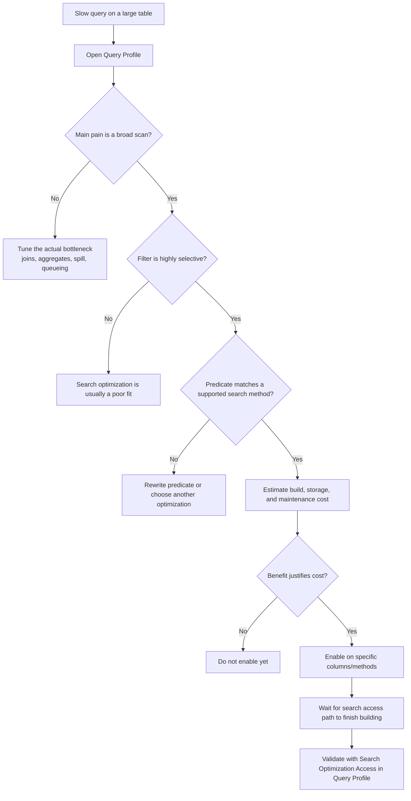

# Search Optimization Service

> A Snowflake performance feature for selective lookup and search predicates. Consultant lens: Use it when users need fast access to a small set of rows in a very large table.

## Executive Summary

- **What it is:** Search Optimization Service creates and maintains a hidden search access path for a table so Snowflake can locate matching micro-partitions faster for supported selective predicates.
- **Why it matters:** It can speed up queries that search for specific IDs, text patterns, semi-structured attributes, IPs, or geospatial values when normal pruning is not selective enough.
- **Mental model:** Micro-partition metadata is the normal map; search optimization is an extra "where might this exact value be?" map.
- **Best used when:** A large table is queried with highly selective predicates on high-cardinality columns, especially when queries run for seconds or longer and are important enough to justify extra cost.
- **Avoid or reconsider when:** The query reads broad slices of the table, the filter has low cardinality, the table changes heavily, or the real bottleneck is joins, aggregation, sorting, spilling, or warehouse queueing.

## What It Can Do

- Improve selective point lookups such as `where order_id = 'O-123'` or `where customer_id in (...)`.
- Improve text, substring, regular expression, and IP searches when configured with the right search method.
- Improve lookups against supported semi-structured paths such as `payload:user.uuid`.
- Improve selected geospatial predicates on `GEOGRAPHY` columns.
- Help selected join queries when the large probe-side table has search optimization on the join column and the build side has few distinct lookup values.
- Work transparently when the optimizer decides the search access path is beneficial.
- Show usage in Query Profile through a `Search Optimization Access` node.

## What It Cannot Do

- Guarantee that every eligible-looking query will use search optimization; the optimizer still decides.
- Make broad scans, low-selectivity filters, or whole-table analytics fast by itself.
- Replace clustering, materialized views, dynamic tables, result caching, query acceleration, or better SQL design.
- Avoid cost; it adds storage, initial build compute, and ongoing maintenance compute.
- Help if the query predicate does not match the configured search method or transforms the table column in an unsupported way.
- Improve Time Travel queries, because search optimization works on active data.
- Be added to every table type or every data type.

## Core Concepts

| Concept | Meaning | Why it matters |
|---|---|---|
| Search access path | Persistent Snowflake-maintained structure that tracks which column values may exist in which micro-partitions. | Lets Snowflake skip more micro-partitions for supported searches. |
| Selective predicate | A filter that returns a small number of rows or a small slice of a large table. | Search optimization is valuable when the search is narrow. |
| High cardinality | Column has many distinct values, often IDs, UUIDs, emails, serial numbers, or transaction references. | Low-cardinality filters usually match too much data to benefit. |
| Search method | Configuration such as `EQUALITY`, `SUBSTRING`, `FULL_TEXT`, or `GEO`. | The method must match the query predicate pattern. |
| Background maintenance | Snowflake builds and updates the search access path as table data changes. | Benefits are not immediate, and ongoing DML can create maintenance cost. |
| `SEARCH_OPTIMIZATION_PROGRESS` | `SHOW TABLES` field showing how much of the table has been optimized. | Wait for completion before judging performance. |
| `Search Optimization Access` | Query Profile node shown when the feature is used. | Confirms whether the query actually benefited from the access path. |
| Enterprise Edition | Snowflake edition requirement for the feature. | Must be checked before recommending it to a client. |

## How It Works (Simple Flow)

1. A slow or costly query is identified in Query History and inspected in Query Profile.
2. The profile shows a large table scan where the business question is actually selective.
3. The candidate column and predicate pattern are checked: equality, `IN`, substring, full-text, semi-structured, join, or geospatial.
4. The team estimates search optimization cost for the table and specific columns.
5. Search optimization is enabled only for the useful search methods and targets.
6. Snowflake builds the search access path in the background.
7. After build completion, the query is rerun and Query Profile is checked for `Search Optimization Access`.
8. The team compares latency and scanned partitions/bytes against storage, build, and maintenance cost.

## Visuals



## Readable Snippets

```sql
-- Estimate cost before enabling search optimization.
select system$estimate_search_optimization_costs(
  'ANALYTICS.PUBLIC.ORDERS',
  'EQUALITY(order_id, customer_id)'
) as search_optimization_estimate;
```

```sql
-- Enable equality and IN lookup support for specific high-cardinality columns.
alter table analytics.public.orders
  add search optimization on equality(order_id, customer_id);
```

```sql
-- Enable substring search for repeated text searches.
alter table observability.public.app_logs
  add search optimization on substring(message);
```

```sql
-- Enable lookup support for a nested semi-structured value.
alter table analytics.public.events
  add search optimization on equality(payload:user.uuid);
```

```sql
-- Enable selected geospatial search support.
alter table geo.public.store_locations
  add search optimization on geo(location_point);
```

```sql
-- Check configuration and build progress.
describe search optimization on analytics.public.orders;

show tables like 'ORDERS' in schema analytics.public;
```

```sql
-- Quick cardinality check for a candidate column.
select approx_count_distinct(order_id) as approx_order_ids
from analytics.public.orders;
```

## Consultant Talking Points

- **Client question this answers:** Can we make highly selective searches on a huge Snowflake table fast without redesigning the whole model?
- **Trade-offs to mention:** Search optimization can reduce scans for specific access patterns, but it adds a maintained access path that costs storage and serverless compute.
- **Risk or governance angle:** Enable it intentionally on known high-value columns, document why it exists, and monitor whether usage justifies ongoing maintenance.
- **Cost/performance angle:** The business case is strongest when a repeated, important query scans too much data to return a small answer.

## Common Pitfalls

- Enabling search optimization on every column of a large table instead of starting with a few proven access patterns.
- Using it for low-cardinality filters such as `status = 'ACTIVE'`, where too much of the table still matches.
- Measuring immediately after enabling it before the search access path is fully built.
- Forgetting that heavy `INSERT`, `UPDATE`, `DELETE`, and `MERGE` activity can increase maintenance cost.
- Assuming it will fix aggregation, sorting, spilling, exploding joins, or warehouse queueing.
- Configuring the wrong method, such as `EQUALITY` when the workload uses substring search.
- Wrapping the table column in unsupported casts or transformations so the access path is not selected.
- Ignoring Query Profile when the optimizer decides search optimization is not beneficial.

## When to Recommend What (Decision Table)

| Situation | Recommend | Why | Watch-outs |
|---|---|---|---|
| Large table, frequent point lookup on `order_id`, `customer_id`, UUID, email, or serial number | Search Optimization Service on specific columns | Adds a targeted access path for selective lookup predicates | Estimate cost and validate usage in Query Profile |
| Large table filtered by date range, region, or another common range/filter pattern | Clustering first | Physical organization can improve normal pruning for broad repeated filters | Clustering has maintenance cost and needs stable patterns |
| Repeated dashboard aggregation on one large table | Materialized view | Precomputes repeated result work | MV SQL restrictions and maintenance cost |
| Multi-step transformation pipeline with freshness target | Dynamic table | Maintains transformed tables over time | Refresh lag, warehouse cost, and reinitialization risk |
| Query uses broad scans and serverless acceleration is eligible | Query Acceleration Service | Can help parts of scan-heavy queries without a search-specific access path | Eligibility and cost must be monitored |
| Same query repeats with unchanged data | Result cache | Fastest and cheapest if cache conditions are met | Cache is not a durable design strategy |
| Low-cardinality filter such as `status = 'ACTIVE'` | Usually avoid search optimization | Too many rows still match, so pruning benefit is limited | Consider modeling, partition-friendly filters, or summary tables |
| High-churn table with many DML changes | Be cautious or pilot narrowly | Maintenance cost can rise with changed data volume | Batch DML where practical and monitor cost |

## Related Topics

- [[01 Snowflake/02 Performance and Optimization/Performance and Optimization Overview]]
- [[01 Snowflake/02 Performance and Optimization/06 Query Profile]]
- [[01 Snowflake/01 Core Architecture and Concepts/02 Micro-partitions and Clustering]]
- [[01 Snowflake/02 Performance and Optimization/07 Materialized Views]]
- [[01 Snowflake/02 Performance and Optimization/08 Dynamic Tables]]
- [[01 Snowflake/02 Performance and Optimization/10 Query Acceleration Service]]
- [[01 Snowflake/02 Performance and Optimization/11 Result Caching]]
- [[01 Snowflake/06 Cost Management and Operations/45 Account Usage Views]]

## Related Decision Notes

- [[80 Comparisons and Decision Notes/Comparisons/Comparison - Search Optimization Service vs Clustering]]
- [[80 Comparisons and Decision Notes/Decision Notes/Decisions - Diagnosing Slow Snowflake Queries]]
- [[80 Comparisons and Decision Notes/Comparisons/Comparison - Bigger Warehouse vs Clustering]]

## Questions

- Is the query trying to find a small number of rows, or does it genuinely need a broad slice of the table?
- Which exact predicate pattern should be optimized: equality, `IN`, substring, full-text, semi-structured, join, or geospatial?
- Does the candidate column have high cardinality and enough repeated business value?
- Has the cost been estimated before enabling the feature?
- After enabling, does Query Profile show `Search Optimization Access`, and did partitions/bytes scanned improve?

## Sources To Revisit

- Snowflake docs: Search optimization service - https://docs.snowflake.com/en/user-guide/search-optimization-service
- Snowflake docs: Identifying queries that can benefit from search optimization - https://docs.snowflake.com/en/user-guide/search-optimization/queries-that-benefit
- Snowflake docs: Enabling and disabling search optimization - https://docs.snowflake.com/en/user-guide/search-optimization/enabling
- Snowflake docs: Monitoring search optimization using Snowsight - https://docs.snowflake.com/en/user-guide/search-optimization/monitoring-search-optimization
- Snowflake docs: Search optimization cost estimation and management - https://docs.snowflake.com/en/user-guide/search-optimization/cost-estimation
- Snowflake SQL reference: SYSTEM$ESTIMATE_SEARCH_OPTIMIZATION_COSTS - https://docs.snowflake.com/en/sql-reference/functions/system_estimate_search_optimization_costs
