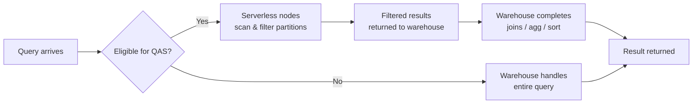

# Query Acceleration Service

> A serverless burst-compute feature that offloads scan-heavy portions of eligible queries to temporary serverless nodes. Consultant lens: keeps warehouses small while handling unpredictable ad-hoc outlier queries.

## Executive Summary

- **What it is:** A serverless feature that spins up temporary compute to accelerate the scan/filter portion of eligible queries.
- **Why it matters:** Avoids over-provisioning warehouses for the occasional large scan query in mixed or ad-hoc workloads.
- **Mental model:** "Serverless burst workers" — your warehouse orchestrates the query, QAS nodes handle chunks of the table scan in parallel, then disappear.
- **Best used when:** Unpredictable ad-hoc analytics workloads with occasional large filtered scans on big tables.
- **Avoid or reconsider when:** Predictable ETL, queries bottlenecked on joins/sorts (not scans), or small tables where scanning is trivial.

## What It Can Do

- Offload large table scan + filter work to serverless compute nodes.
- Accelerate queries with selective equality filters, `IN`, `LIKE`, and `GROUP BY` combined with filters.
- Scale elastically — spins up only when needed, no idle cost.
- Work alongside existing warehouse compute (warehouse handles joins, aggregation, sorting).

## What It Cannot Do

- Accelerate queries bottlenecked on joins, sorting, or complex computation (not scan-bound).
- Help DML operations (INSERT, COPY, MERGE).
- Accelerate queries on small tables where scanning is already trivial.
- Replace proper clustering or partition pruning — it scans what wasn't pruned, just faster.

## Core Concepts

| Concept | Meaning | Why it matters |
|---|---|---|
| Scale Factor | Multiplier (1–8) controlling max serverless compute relative to warehouse size | Higher = more burst capacity but higher cost ceiling |
| Eligible Query | A query with selective filters on a large scan portion | Only scan-bound queries benefit; QAS ignores the rest |
| Serverless Credits | Billing model — pay only for actual burst compute used | No idle cost, but can surprise if many queries qualify |
| `SYSTEM$ESTIMATE_QUERY_ACCELERATION` | Function to evaluate if a past query would benefit from QAS | Key governance tool — test before enabling broadly |

## How It Works (Simple Flow)

1. A query arrives at the warehouse.
2. Snowflake's optimizer identifies whether the scan/filter portion is eligible for acceleration.
3. If eligible and QAS is enabled, serverless compute nodes are spun up.
4. Serverless nodes scan micro-partitions in parallel and apply filters.
5. Filtered results are returned to the warehouse.
6. The warehouse completes the rest (joins, aggregations, sorting).
7. Serverless resources are released — no lingering cost.

## Visuals



## Readable Snippets

```sql
-- Enable QAS on a warehouse with scale factor 4
ALTER WAREHOUSE analyst_wh
  SET ENABLE_QUERY_ACCELERATION = TRUE
      QUERY_ACCELERATION_MAX_SCALE_FACTOR = 4;

-- Check if a past query would have benefited
SELECT SYSTEM$ESTIMATE_QUERY_ACCELERATION('01abc123-0000-0001-0000-00000000abcd');

-- Disable QAS
ALTER WAREHOUSE analyst_wh
  SET ENABLE_QUERY_ACCELERATION = FALSE;
```

## Consultant Talking Points

- **Client question this answers:** "Our analysts occasionally run huge ad-hoc queries that slow everything down — should we upsize the warehouse?"
- **Trade-offs to mention:** QAS is elastic and temporary vs. upsizing which is permanent and wasteful for the 95% of queries that don't need it. But QAS only helps scan-bound queries.
- **Risk or governance angle:** Without monitoring, costs can accumulate if many queries qualify. Use `SYSTEM$ESTIMATE_QUERY_ACCELERATION` and conservative scale factors to start.
- **Cost/performance angle:** Serverless credits (consumption-only, no idle). Scale factor × warehouse size × eligible query volume = your cost ceiling. Start low, measure, adjust.

## Common Pitfalls

- **Setting scale factor too high on large warehouses** — scale factor 4 on XL is 4× XL of burst compute; cost ceiling is much higher than scale factor 4 on XS.
- **Expecting QAS to fix join-heavy or sort-heavy queries** — it only accelerates the scan/filter phase; if your bottleneck is downstream, QAS does nothing.
- **Enabling without estimating first** — always run `SYSTEM$ESTIMATE_QUERY_ACCELERATION` on representative queries before enabling broadly.
- **Confusing QAS with clustering** — clustering reduces which partitions are scanned (pruning); QAS scans unpruned partitions faster. They're complementary, not alternatives.

## When to Recommend What (Decision Table)

| Situation | Recommend | Why | Watch-outs |
|---|---|---|---|
| Ad-hoc analyst exploration on large tables | Enable QAS, scale factor 2–4 | Elastic burst for unpredictable outliers | Monitor serverless credit usage |
| Mixed workload with occasional slow scan queries | Enable QAS, conservative scale factor | Keeps warehouse small, handles spikes | Ensure slow queries are actually scan-bound |
| Predictable ETL/ELT pipelines | Skip QAS | Queries are tuned; not ad-hoc or scan-bound | Upsizing or clustering is more appropriate |
| BI dashboards with known patterns | Prefer result caching + clustering | Repetitive queries benefit more from caching | QAS adds cost without clear benefit |
| Cost-sensitive client | Estimate first, low scale factor | Prove value before committing budget | Review ACCOUNT_USAGE for QAS credit spend |

## Related Topics

- [[01 Snowflake/02 Performance and Optimization/Performance and Optimization Overview]]
- [[01 Snowflake/02 Performance and Optimization/06 Query Profile]]
- [[01 Snowflake/01 Core Architecture and Concepts/01 Virtual Warehouses]]
- [[01 Snowflake/06 Cost Management and Operations/31 Credit Consumption Model]]
- [[01 Snowflake/02 Performance and Optimization/02 Micro-partitions and Clustering]]
- [[01 Snowflake/02 Performance and Optimization/11 Result Caching]]

## Related Decision Notes

- [[80 Comparisons and Decision Notes/Comparisons/Comparison - QAS vs Warehouse Upsizing]]

## Questions

- How does QAS interact with query queuing on a busy warehouse?
- Can QAS be enabled per-query or only per-warehouse?

## Sources To Revisit

- [Snowflake Docs — Query Acceleration Service](https://docs.snowflake.com/en/user-guide/query-acceleration-service)
- [Snowflake Docs — SYSTEM$ESTIMATE_QUERY_ACCELERATION](https://docs.snowflake.com/en/sql-reference/functions/system_estimate_query_acceleration)


