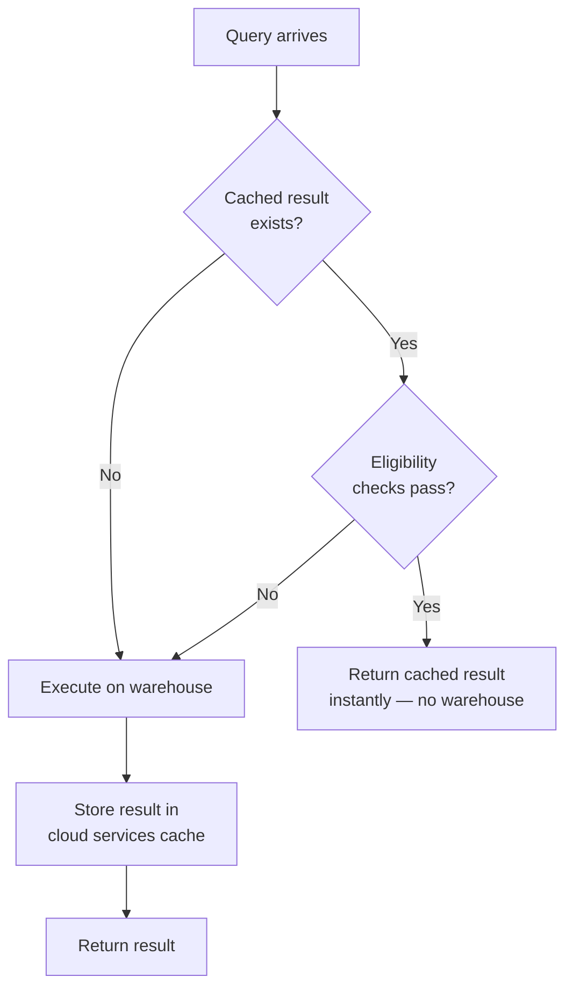

# Result Caching

> Reuse of persisted query results when eligibility rules are met. Consultant lens: free performance for repetitive queries on stable data — zero warehouse credits consumed.

## Executive Summary

- **What it is:** Snowflake stores full query result sets in the cloud services layer and returns them instantly when the same query is re-run and eligibility conditions are met.
- **Why it matters:** Eliminates warehouse compute cost for repeated identical queries on unchanged data — the single biggest "free" cost saver for dashboard-heavy workloads.
- **Mental model:** Snowflake keeps the answer sheet from a previous exam. Same question + nothing changed = instant free answer, no warehouse needed.
- **Best used when:** BI dashboards hitting batch-loaded tables, repetitive reporting queries, stable reference data.
- **Avoid or reconsider when:** Real-time/streaming pipelines (constant invalidation), queries with non-deterministic functions, or when you need fresh computation every time.

## What It Can Do

- Return cached results instantly with zero warehouse credits consumed.
- Serve cached results across users sharing the same role.
- Persist results for up to 24 hours.
- Respect security automatically — different roles = different cache keys.
- Work transparently (on by default, no setup required).

## What It Cannot Do

- Cache results when underlying data has changed (any DML invalidates).
- Cache queries with non-deterministic functions (`CURRENT_TIMESTAMP()`, `RANDOM()`, `UUID_STRING()`).
- Share cached results across different roles (even if data access is identical).
- Guarantee cache hits — it's best-effort based on eligibility rules.
- Help queries where the text differs even slightly (whitespace, comments, case all matter).

## Core Concepts

| Concept | Meaning | Why it matters |
|---|---|---|
| Result Cache | Full query result stored in cloud services layer | Returned without warehouse — zero compute cost |
| Local Disk Cache | Raw micro-partition data cached on warehouse SSD | Faster reads but warehouse must be running |
| Cache Key | Query text + role + other context | Even trivial text differences = cache miss |
| 24-hour TTL | Results expire after 24 hours regardless | Sets upper bound on cache benefit |
| Invalidation | Any DML or reclustering on referenced tables | Most common reason cached results can't be reused |
| `USE_CACHED_RESULT` | Session parameter (TRUE by default) | Can be set to FALSE for testing or forcing fresh execution |

## How It Works (Simple Flow)

1. A query executes on a warehouse; results are computed and returned.
2. Snowflake stores the full result set in the cloud services layer (metadata/result cache).
3. The same query arrives again (same text, same role).
4. Snowflake checks eligibility: data unchanged? No non-deterministic functions? TTL valid? Privileges intact?
5. If all conditions met → result returned instantly from cache. No warehouse started. No credits spent.
6. If any condition fails → query executes normally on the warehouse.
7. After 24 hours, the cached result expires regardless.

## Visuals



## Readable Snippets

```sql
-- Check if result cache is enabled (default: TRUE)
SHOW PARAMETERS LIKE 'USE_CACHED_RESULT' IN SESSION;

-- Disable result cache for testing (force fresh execution)
ALTER SESSION SET USE_CACHED_RESULT = FALSE;

-- Re-enable result cache
ALTER SESSION SET USE_CACHED_RESULT = TRUE;

-- In Query Profile: a cached result shows as
-- "QUERY RESULT REUSE" with near-zero execution time
```

## Consultant Talking Points

- **Client question this answers:** "Our dashboards run the same queries hundreds of times a day — can we reduce cost?"
- **Trade-offs to mention:** Result caching is free and automatic, but only works when data is stable and queries are identical. High-frequency DML workloads get almost no benefit.
- **Risk or governance angle:** Cache is role-isolated by design — different roles never share results, even for identical queries. This is security-safe but means two roles querying the same data both pay compute on first run.
- **Cost/performance angle:** For batch-loaded BI workloads, result cache can eliminate 90%+ of compute cost on read queries. It's often the biggest "hidden" cost saver clients already have without realizing it.

## Common Pitfalls

- **Assuming streaming workloads benefit** — constant DML invalidates the cache every few seconds; effectively useless for real-time pipelines.
- **Blaming Snowflake when cache misses occur due to whitespace** — BI tools that dynamically generate SQL with variable formatting (extra spaces, comment timestamps) will miss cache every time. Standardize query generation.
- **Forgetting reclustering invalidates cache** — even if data is logically the same, physical reorganization (automatic clustering) resets the cache for that table.
- **Expecting cross-role sharing** — two roles with identical data access still get separate cache entries. This is by design (security), not a bug.
- **Not realizing 24-hour TTL exists** — weekend dashboards that load Monday morning won't benefit from Friday's cache.

## When to Recommend What (Decision Table)

| Situation | Recommend | Why | Watch-outs |
|---|---|---|---|
| BI dashboards on daily batch-loaded data | Rely on result cache (default) | 99% of opens are free cache hits | Ensure BI tool generates consistent SQL text |
| Real-time streaming data | Don't rely on result cache | Constant invalidation; near-zero hit rate | Use clustering, QAS, or materialized views instead |
| Testing/debugging query performance | `SET USE_CACHED_RESULT = FALSE` | Forces fresh execution to see true performance | Remember to re-enable after testing |
| Multi-role environment, same queries | Expect duplicate first-run costs | Each role gets its own cache entry | Consider shared roles for read-only analytics if appropriate |
| Queries with `CURRENT_TIMESTAMP()` | Cache won't help | Non-deterministic function = always cache miss | Replace with a bind variable or parameter if possible |

## Related Topics

- [[01 Snowflake/02 Performance and Optimization/Performance and Optimization Overview]]
- [[01 Snowflake/02 Performance and Optimization/06 Query Profile]]
- [[01 Snowflake/02 Performance and Optimization/07 Materialized Views]]
- [[01 Snowflake/02 Performance and Optimization/10 Query Acceleration Service]]
- [[01 Snowflake/06 Cost Management and Operations/44 Credit Consumption Model]]
- [[01 Snowflake/01 Core Architecture and Concepts/01 Virtual Warehouses]]

## Related Decision Notes

- [[80 Comparisons and Decision Notes/Comparisons/Comparison - QAS vs Warehouse Upsizing]]

## Questions

- Does Snowflake extend the 24-hour TTL if the same query keeps being re-run?
- How large can a cached result set be before Snowflake stops caching it?
- Does result cache work for queries using CTEs or views, or only direct table queries?

## Sources To Revisit

- [Snowflake Docs — Understanding Query Caching](https://docs.snowflake.com/en/user-guide/querying-persisted-results)
- [Snowflake Docs — USE_CACHED_RESULT Parameter](https://docs.snowflake.com/en/sql-reference/parameters#use-cached-result)


