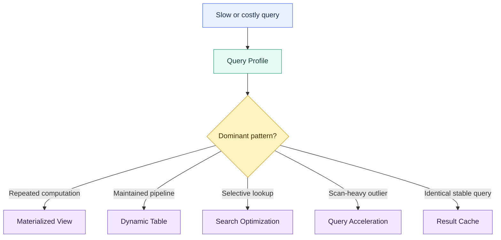

# Performance and Optimization Overview

> [!abstract] Chapter outcome
> Diagnose the real bottleneck first, then choose the narrowest optimization that improves the workload without creating unjustified maintenance or serverless cost.

## Topics

- [[01 Snowflake/02 Performance and Optimization/06 Query Profile|06 - Query Profile]]
- [[01 Snowflake/02 Performance and Optimization/07 Materialized Views|07 - Materialized Views]]
- [[01 Snowflake/02 Performance and Optimization/08 Dynamic Tables|08 - Dynamic Tables]]
- [[01 Snowflake/02 Performance and Optimization/09 Search Optimization Service|09 - Search Optimization Service]]
- [[01 Snowflake/02 Performance and Optimization/10 Query Acceleration Service|10 - Query Acceleration Service]]
- [[01 Snowflake/02 Performance and Optimization/11 Result Caching|11 - Result Caching]]

## Chapter Map

## Topic Summaries

| Topic | What it unlocks |
|---|---|
| [[01 Snowflake/02 Performance and Optimization/06 Query Profile\|Query Profile]] | Turn a vague performance complaint into evidence: queueing, scans, joins, spill, sorts, or repeated work. Start here. |
| [[01 Snowflake/02 Performance and Optimization/07 Materialized Views\|Materialized Views]] | Trade background maintenance and storage for faster repeated reads of a supported query pattern. |
| [[01 Snowflake/02 Performance and Optimization/08 Dynamic Tables\|Dynamic Tables]] | Manage derived data as a declarative pipeline with freshness targets, not merely as a single-query accelerator. |
| [[01 Snowflake/02 Performance and Optimization/09 Search Optimization Service\|Search Optimization Service]] | Accelerate highly selective lookups on very large tables when ordinary pruning is insufficient. |
| [[01 Snowflake/02 Performance and Optimization/10 Query Acceleration Service\|Query Acceleration Service]] | Add temporary serverless scan capacity for unpredictable eligible outliers without permanently upsizing the warehouse. |
| [[01 Snowflake/02 Performance and Optimization/11 Result Caching\|Result Caching]] | Reuse eligible identical results on unchanged data with no warehouse compute. Treat it as a benefit, not a tuning strategy. |

## How To Use This Area

Begin with [[01 Snowflake/02 Performance and Optimization/06 Query Profile|Query Profile]]. Use evidence from the query plan and history to select a focused optimization; do not start by enabling a service or resizing compute.

## Related Areas

- [[00 Home/Snowflake Learning Map|Snowflake Learning Map]]
- [[01 Snowflake/01 Core Architecture and Concepts/Core Architecture and Concepts Overview|Core Architecture and Concepts]]
- [[01 Snowflake/04 Data Engineering/Data Engineering Overview|Data Engineering]]
- [[01 Snowflake/06 Cost Management and Operations/Cost Management and Operations Overview|Cost Management and Operations]]
