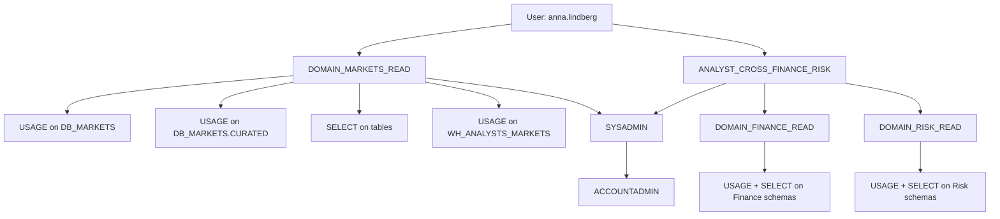

# RBAC Roles and Privileges

> Hierarchical role-based access control where privileges are granted to roles, roles are granted to users (or other roles), and users operate under one active role at a time. Consultant lens: the foundation of every regulated Snowflake deployment — banks, healthcare, and enterprise live and die by this.

## Executive Summary

- **What it is:** Snowflake's access control model where privileges attach to roles, roles attach to users, and roles form an inheritable hierarchy.
- **Why it matters:** Every regulated organization requires demonstrable least-privilege access. RBAC is the foundation; Row Access Policies and Masking Policies layer on top for fine-grained control.
- **Mental model:** Roles are hats people wear. A user can have multiple hats but wears one at a time. Each hat grants specific permissions. Senior hats inherit everything from the hats below them.
- **Best used when:** Always — it's not optional. The question is how well you design the hierarchy.
- **Avoid or reconsider when:** Never avoid RBAC itself; but avoid over-flattening (too many direct grants) or over-nesting (too deep a hierarchy to audit).

## What It Can Do

- Enforce principle of least privilege at every layer (account, database, schema, object, warehouse).
- Provide inheritable hierarchy — parent roles accumulate child role privileges.
- Support multiple roles per user (primary + secondary roles or composite roles).
- Integrate with external identity providers via SCIM for automated provisioning.
- Separate duties (engineers ≠ analysts ≠ admins) through parallel role branches.
- Control warehouse access — users without USAGE on a warehouse literally cannot run queries on it.

## What It Cannot Do

- Filter rows within a table — need Row Access Policies for "show only your region's data."
- Mask individual columns — need Column-level Masking Policies for "hide last 4 digits of SSN."
- Provide dynamic/attribute-based rules — RBAC is static grants, not conditional logic.
- Grant "partial SELECT" — it's all-or-nothing at the object level (all columns or no columns without masking).
- Automatically revoke access when someone leaves — need SCIM or manual admin action.

## Core Concepts

| Concept                 | Meaning                                                                       | Why it matters                                                            |
| ----------------------- | ----------------------------------------------------------------------------- | ------------------------------------------------------------------------- |
| Role                    | A named collection of privileges that can be granted to users or other roles  | The fundamental unit of access — never grant privileges directly to users |
| Privilege               | A specific permission (SELECT, USAGE, CREATE, etc.) on an object or container | Granular control at every level                                           |
| Hierarchy / Inheritance | Parent roles inherit all privileges of child roles granted to them            | Enables roll-up management; SYSADMIN inherits all custom roles            |
| Active Role             | The single role a user operates under at any moment                           | Determines what they can see/do in that session                           |
| Secondary Roles         | Additional roles activated alongside the primary role                         | Provides union of privileges but weakens audit attribution                |
| Composite Role          | A purpose-built role that inherits from multiple other roles                  | Clean alternative to secondary roles for cross-domain access              |
| SCIM                    | Protocol for automated user/role provisioning from an identity provider       | Eliminates manual Snowflake admin work for joiners/movers/leavers         |
| Ownership               | The role that owns an object controls it (can drop, alter, grant)             | Critical for pipeline objects — choose owning role carefully              |

## System-Defined Role Hierarchy

```
ORGADMIN              ← manages the Snowflake organization (multi-account)
    │
ACCOUNTADMIN          ← top-level account admin (break-glass only)
    ├── SECURITYADMIN  ← manages roles, grants, users
    │       └── USERADMIN  ← can create/manage users and roles
    └── SYSADMIN      ← owns all databases, schemas, objects
            └── (all custom roles should roll up here)

PUBLIC                ← every user has this implicitly (grant nothing sensitive here)
```

**Key rule:** Custom roles grant up to SYSADMIN so that SYSADMIN can inherit and manage all objects. If you attach custom roles directly to ACCOUNTADMIN and skip SYSADMIN, then SYSADMIN can't manage those objects — forcing you to use ACCOUNTADMIN for routine work, defeating the break-glass principle.

## Privilege Layers (All Required for Access)

| Layer | Required grant | Example |
|---|---|---|
| Database | `USAGE` | `GRANT USAGE ON DATABASE db_markets TO ROLE domain_markets_read;` |
| Schema | `USAGE` | `GRANT USAGE ON SCHEMA db_markets.curated TO ROLE domain_markets_read;` |
| Object | `SELECT` / `INSERT` / etc. | `GRANT SELECT ON ALL TABLES IN SCHEMA db_markets.curated TO ROLE domain_markets_read;` |
| Warehouse | `USAGE` | `GRANT USAGE ON WAREHOUSE wh_analysts TO ROLE domain_markets_read;` |

**Missing any layer = access denied.** The most common miss: database USAGE + object SELECT granted, but schema USAGE forgotten.

## How It Works (Simple Flow)

1. A Snowflake admin (SECURITYADMIN) creates custom roles matching business functions.
2. Privileges on objects/containers/warehouses are granted to those roles.
3. Custom roles are granted to each other to form a hierarchy (child → parent up to SYSADMIN).
4. Users are assigned one or more roles (ideally via SCIM from an identity provider).
5. At session start, the user's default role activates. They can switch with `USE ROLE`.
6. Every query runs under the active role — Snowflake checks privileges against that role's grants.
7. If access is denied at any layer (database, schema, object, warehouse), the query fails.

## Enterprise Integration: Entra ID + SCIM (Bank Example)

In a bank using Microsoft products, the standard pattern is:

**Entra ID groups → SCIM provisioning → Snowflake roles**

```
Entra ID Group                    →  Snowflake Role
─────────────────────────────────────────────────────
GRP-SF-DOMAIN-MARKETS-READ        →  DOMAIN_MARKETS_READ
GRP-SF-DOMAIN-RISK-FULL           →  DOMAIN_RISK_FULL
GRP-SF-DATA-ENGINEER-PROD         →  DATA_ENGINEER_PROD
GRP-SF-ANALYST-SENIOR             →  ANALYST_SENIOR
```

### SCIM Lifecycle Flow

```
Entra ID                              Snowflake
────────                              ─────────
1. HR onboards user
2. IT adds to Entra group
                                      
3. SCIM push triggers (~40 min or on-demand)
   ─── POST /scim/v2/Users ──────►   CREATE USER (SSO-linked)
   ─── PATCH (group membership) ──►   GRANT ROLE TO USER
                                      
4. User moves department
   IT changes Entra group membership
                                      
5. SCIM push triggers
   ─── PATCH ─────────────────────►   REVOKE old role
   ─── PATCH ─────────────────────►   GRANT new role
                                      
6. User leaves the bank
   IT disables in Entra ID
                                      
7. SCIM push triggers
   ─── PATCH (active=false) ──────►   ALTER USER SET DISABLED = TRUE
                                      (user NOT deleted — audit history preserved)
```

### SCIM Setup (One-Time)

```sql
USE ROLE SECURITYADMIN;
CREATE SECURITY INTEGRATION entra_scim_integration
  TYPE = SCIM
  SCIM_CLIENT = 'azure'
  RUN_AS_ROLE = 'SECURITYADMIN';

-- Generate token for Entra ID provisioning app
SELECT SYSTEM$GENERATE_SCIM_ACCESS_TOKEN('entra_scim_integration');
```

**Key facts:**
- SCIM is push-only (Entra ID pushes to Snowflake's endpoint; Snowflake does not pull).
- SCIM disables users on termination — never deletes (audit history must be preserved).
- SCIM manages user lifecycle and role grants — not object-level privileges (those are pre-configured on the roles).

## Real-World Bank Example: "Nordic Bank AG"

### Assumptions

- Business lines: Markets (trading), Retail Banking, Risk, Finance
- Regulatory: SOX, MiFID II, GDPR
- Separation of duties enforced
- Environments: DEV, TEST, PROD
- Schema layers: RAW → STAGING → CURATED → PRESENTATION

### Role Hierarchy

```
ACCOUNTADMIN (break-glass, 2-3 people, MFA enforced)
├── SECURITYADMIN (IAM team)
│   └── USERADMIN
├── SYSADMIN (owns all objects)
│   ├── INFRA_ADMIN (warehouses, resource monitors, network policies)
│   ├── DATA_ENGINEER_PROD (RAW + STAGING r/w across domains)
│   │   └── DATA_ENGINEER_DEV (dev environment only)
│   ├── DOMAIN_MARKETS_FULL (CURATED + PRESENTATION r/w — Markets only)
│   │   └── DOMAIN_MARKETS_READ (CURATED + PRESENTATION select — Markets only)
│   ├── DOMAIN_RISK_FULL
│   │   └── DOMAIN_RISK_READ
│   ├── DOMAIN_RETAIL_FULL
│   │   └── DOMAIN_RETAIL_READ
│   ├── DOMAIN_FINANCE_FULL
│   │   └── DOMAIN_FINANCE_READ
│   ├── ANALYST_CROSS_FINANCE_RISK (composite — inherits both domain read roles)
│   ├── ANALYST_SENIOR (inherits multiple domain read roles)
│   │   └── ANALYST_JUNIOR (single domain read)
│   └── BI_SERVICE_ACCOUNT (PRESENTATION select only)
└── PUBLIC (nothing granted)
```

### Schema-Layer Access Pattern

Engineers and analysts access **different layers** — they're parallel paths, not hierarchical:

| Schema | DATA_ENGINEER_PROD | DOMAIN_MARKETS_READ | BI_SERVICE_ACCOUNT |
|---|---|---|---|
| RAW | Read/Write | No access | No access |
| STAGING | Read/Write | No access | No access |
| CURATED | Write (creates tables) | SELECT | No access |
| PRESENTATION | Write (creates views) | SELECT | SELECT |

### Warehouse Separation

| Warehouse | Granted to | Purpose |
|---|---|---|
| `WH_ETL_PROD` | `DATA_ENGINEER_PROD` | Pipeline compute isolated from analysts |
| `WH_ANALYSTS_MARKETS` | `DOMAIN_MARKETS_READ`, `ANALYST_SENIOR` | Domain-specific analyst compute |
| `WH_BI_PROD` | `BI_SERVICE_ACCOUNT` | Stable dashboard compute |
| `WH_RISK_HEAVY` | `DOMAIN_RISK_FULL` | Large risk model compute |

A Markets analyst literally cannot use the ETL warehouse — no USAGE privilege means no access, regardless of anything else.

## Multi-Role Access: Secondary Roles vs Composite Roles

When a user needs access across multiple domains (e.g., regulatory reporting needs Finance + Risk):

| Approach | How it works | Audit clarity | Bank preference |
|---|---|---|---|
| **Switch roles** (`USE ROLE`) | One role active at a time; must switch to query different domain | Clean — single role in audit trail | Strictest environments |
| **Secondary roles** (`USE SECONDARY ROLES ALL`) | Union of all granted roles active simultaneously | Fuzzy — audit shows "ALL", not which role provided access | Rarely preferred in regulated banks |
| **Composite role** (recommended) | Purpose-built role inheriting from multiple domain roles | Clean — named role with documented justification | Preferred — explicit, auditable, approved |

### Secondary Roles Audit Problem

```
QUERY_HISTORY record:
  role_name = 'DOMAIN_RISK_READ'        ← primary role
  secondary_role_name = 'ALL'           ← secondary enabled
  query_text = 'SELECT * FROM DB_FINANCE.CURATED.GL_ACCOUNTS'
  
  -- Which role granted Finance access? Must cross-reference grants to determine.
```

Banks prefer composite roles because regulators ask: "Show me exactly which role granted access to this data." A composite role provides a one-word answer.

## Visuals



## Readable Snippets

```sql
-- Create a domain read role
USE ROLE SECURITYADMIN;
CREATE ROLE DOMAIN_MARKETS_READ;
GRANT ROLE DOMAIN_MARKETS_READ TO ROLE SYSADMIN;  -- roll up to SYSADMIN

-- Grant layered access (all three layers required)
GRANT USAGE ON DATABASE DB_MARKETS TO ROLE DOMAIN_MARKETS_READ;
GRANT USAGE ON SCHEMA DB_MARKETS.CURATED TO ROLE DOMAIN_MARKETS_READ;
GRANT SELECT ON ALL TABLES IN SCHEMA DB_MARKETS.CURATED TO ROLE DOMAIN_MARKETS_READ;
GRANT SELECT ON FUTURE TABLES IN SCHEMA DB_MARKETS.CURATED TO ROLE DOMAIN_MARKETS_READ;

-- Grant warehouse access
GRANT USAGE ON WAREHOUSE WH_ANALYSTS_MARKETS TO ROLE DOMAIN_MARKETS_READ;

-- Create a composite role for cross-domain access
CREATE ROLE ANALYST_CROSS_FINANCE_RISK;
GRANT ROLE DOMAIN_FINANCE_READ TO ROLE ANALYST_CROSS_FINANCE_RISK;
GRANT ROLE DOMAIN_RISK_READ TO ROLE ANALYST_CROSS_FINANCE_RISK;
GRANT ROLE ANALYST_CROSS_FINANCE_RISK TO ROLE SYSADMIN;

-- Assign role to user (or let SCIM handle this)
GRANT ROLE DOMAIN_MARKETS_READ TO USER anna_lindberg;

-- Switch active role in session
USE ROLE DOMAIN_MARKETS_READ;

-- Enable secondary roles (union of all granted roles)
USE SECONDARY ROLES ALL;

-- Disable secondary roles (back to primary only)
USE SECONDARY ROLES NONE;
```

## Consultant Talking Points

- **Client question this answers:** "How do we control who can see what in Snowflake, and how do we manage it at scale across hundreds of users?"
- **Trade-offs to mention:** RBAC gives object-level control but not row/column-level. Layer Row Access Policies and Masking Policies for fine-grained needs. Over-complex hierarchies become unauditable; keep it as flat as practical.
- **Risk or governance angle:** ACCOUNTADMIN must be break-glass only (MFA, 2-3 people max). Custom roles roll up to SYSADMIN. Use SCIM for automated provisioning — manual grants create stale access and audit gaps. Secondary roles weaken audit attribution; prefer composite roles in regulated environments.
- **Cost/performance angle:** Warehouse isolation by role prevents cross-workload interference and makes cost attribution per team trivial (each team's warehouse = their cost).

## Common Pitfalls

- **Granting ACCOUNTADMIN to daily users** — defeats break-glass principle; creates audit noise; impossible to prove least privilege to regulators.
- **Forgetting schema USAGE** — database USAGE + SELECT on tables is not enough; schema USAGE is the most commonly missed layer.
- **Custom roles not rolling up to SYSADMIN** — creates "orphan" roles that only ACCOUNTADMIN can manage, forcing routine ACCOUNTADMIN usage.
- **Using PUBLIC for anything sensitive** — every user inherits PUBLIC implicitly; granting anything meaningful to PUBLIC is a blanket grant to the entire account.
- **Relying on secondary roles in regulated environments** — weakens audit attribution; prefer composite roles with documented justification.
- **Not using FUTURE GRANTS** — new tables created in a schema won't inherit access unless `GRANT ... ON FUTURE TABLES` is configured; leads to "it worked yesterday but not today" complaints.
- **SCIM disabled users still owning objects** — disabled users can't log in, but their owned objects remain; transfer ownership to a functional role before archiving.

## When to Recommend What (Decision Table)

| Situation | Recommend | Why | Watch-outs |
|---|---|---|---|
| Regulated enterprise (bank, healthcare) | Strict hierarchy + SCIM + composite roles | Auditable, automated, compliant | Don't over-nest; keep hierarchy readable |
| Multi-domain analyst needs cross-access | Composite role (not secondary roles) | Clean audit, single role to manage | Name it meaningfully; document why it exists |
| Startup / small team | Simple hierarchy, fewer roles | Don't over-engineer; 5-10 roles is fine | Plan for growth — refactoring roles later is painful |
| Warehouse cost attribution per team | Separate warehouses + role-based USAGE | Each team's cost is isolated and measurable | More warehouses = more suspend/resume overhead |
| Service accounts (dbt, Tableau, Fivetran) | Dedicated functional roles per service | Never share human roles with automation | Use separate warehouse per service for cost clarity |
| Temporary elevated access | Time-limited grant + alert (or composite "break-glass" role) | Avoid permanent over-provisioning | Automate revocation; don't trust humans to remember |

## Governance Principles for Regulated Banks

1. **Least privilege** — grant only what's needed for the job function.
2. **Separation of duties** — engineers ≠ analysts ≠ admins; enforced by parallel role branches.
3. **No direct user grants** — always through roles (auditable, transferable, SCIM-compatible).
4. **ACCOUNTADMIN is break-glass** — not daily use; MFA required; audit every activation.
5. **Custom roles → SYSADMIN** — clean inheritance; SYSADMIN can manage all objects.
6. **Service accounts get dedicated roles** — no sharing with human users.
7. **Automate provisioning** — SCIM from Entra ID / Okta; eliminate manual grant workflows.
8. **Monitor with ACCESS_HISTORY** — detect unexpected cross-domain access patterns.

## Related Topics

- [[01 Snowflake/03 Security and Governance/Security and Governance Overview]]
- [[01 Snowflake/03 Security and Governance/13 Row Access Policies]]
- [[01 Snowflake/03 Security and Governance/14 Column-level Masking Policies]]
- [[01 Snowflake/03 Security and Governance/18 Object Tagging]]
- [[01 Snowflake/01 Core Architecture and Concepts/04 Data Sharing and Marketplace]]
- [[01 Snowflake/01 Core Architecture and Concepts/01 Virtual Warehouses]]
- [[01 Snowflake/06 Cost Management and Operations/45 Account Usage Views]]

## Related Decision Notes

- [[80 Comparisons and Decision Notes/Comparisons/Comparison - Secondary Roles vs Composite Roles]]
- (Future: Decisions - Choosing an Access Control Layer)

## Questions

- How does `GRANT OWNERSHIP` work and when is transferring ownership necessary?
- Can you grant a role to an Entra ID group directly or must it always go through SCIM user mapping?
- How do FUTURE GRANTS interact with dbt models that create new tables on every run?
- What does ACCESS_HISTORY show for secondary roles — can you determine which secondary role provided access?

## Sources To Revisit

- [Snowflake Docs — Access Control Overview](https://docs.snowflake.com/en/user-guide/security-access-control-overview)
- [Snowflake Docs — System-Defined Roles](https://docs.snowflake.com/en/user-guide/security-access-control-considerations)
- [Snowflake Docs — SCIM with Azure AD](https://docs.snowflake.com/en/user-guide/admin-security-fed-auth-configure-scim-azure)
- [Snowflake Docs — Secondary Roles](https://docs.snowflake.com/en/user-guide/security-access-control-secondary-roles)


