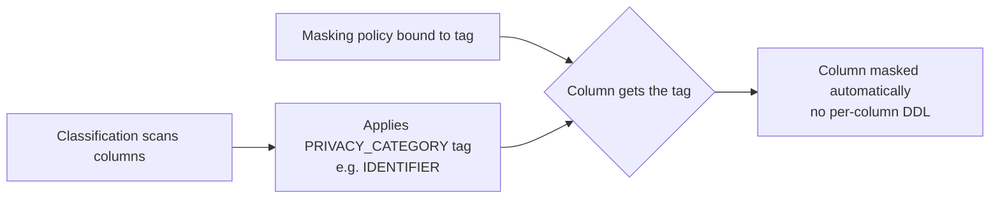

# Data Classification

> Automated detection and labeling of sensitive data (PII, financial identifiers) by writing system tags onto columns. Consultant lens: the discovery layer that feeds tag-based masking, access policies, and compliance reporting — it finds where sensitive data lives so other controls can protect it.

## Executive Summary

- **What it is:** A built-in capability that samples column data and metadata, infers what each column holds, and applies two system tags — `SEMANTIC_CATEGORY` (what the data is) and `PRIVACY_CATEGORY` (how sensitive it is).
- **Why it matters:** Turns "find all our PII" from a manual audit into a repeatable, queryable process, and feeds tag-based masking so protection scales as new data lands.
- **Mental model:** A sensitivity scanner that produces an inventory, not a control. It labels columns; masking and access policies do the actual protecting.
- **Best used when:** Large or fast-changing estates where you must locate PII/PCI for compliance (GDPR, HIPAA, CCPA, PCI-DSS) and apply protection systematically.
- **Avoid or reconsider when:** You already know exactly where sensitive columns are on a small, stable schema — manual tagging may be simpler and cheaper than recurring classification scans.

## What It Can Do

- Detect standard semantic categories (name, email, phone, national IDs, IP address, etc.) by sampling data and reading column names.
- Apply two system tags per column: `SEMANTIC_CATEGORY` and `PRIVACY_CATEGORY`.
- Return recommendations with confidence so a human can review before applying (manual flow).
- Auto-classify and auto-apply tags on a schedule via a `CLASSIFICATION_PROFILE` object.
- Feed tag-based masking — a policy attached to a tag automatically protects any column that gets that tag.
- Support custom classifiers for domain-specific identifiers the built-in categories miss.
- Surface results through `ACCOUNT_USAGE` / `INFORMATION_SCHEMA` tag references for audit and reporting.

## What It Cannot Do

- Protect data — classification only labels; masking/access policies enforce.
- Guarantee accuracy — it is probabilistic and samples data, so it can miss custom identifiers and produce false positives.
- Read every row — detection relies on representative sample data and column naming.
- Classify unstructured blobs meaningfully — it targets structured/semi-structured columns.
- Replace human review for high-stakes data — recommendations still need sign-off.

## Core Concepts

| Concept | Meaning | Why it matters |
|---|---|---|
| `SEMANTIC_CATEGORY` | What the data *is* conceptually (`NAME`, `EMAIL`, `US_SSN`, `IP_ADDRESS`) | Drives human-readable inventory and which masking pattern fits |
| `PRIVACY_CATEGORY` | How sensitive it *is* legally (`IDENTIFIER`, `QUASI_IDENTIFIER`, `SENSITIVE`, `INSENSITIVE`) | The axis you usually attach masking policies to |
| Identifier | Directly identifies a person (SSN, email) | Highest-risk; mask or tightly restrict |
| Quasi-identifier | Identifies in combination (zip, birth date, gender) | Re-identification risk — easy to under-protect |
| System tags | Special Snowflake-managed tags written by classification | Reuse the Object Tagging framework (topic 18) as the integration point |
| Classification profile | Reusable object that schedules and optionally auto-applies classification | Enables "classify new data automatically" at scale |
| Confidence / review | Recommendations carry a confidence; manual flow lets you accept/override | Probabilistic output needs governance before trusting it |

## How It Works (Simple Flow)

1. You target a table, schema, or database for classification (manually or via a profile).
2. Snowflake samples the column data and reads column names/metadata.
3. It infers a `SEMANTIC_CATEGORY` and `PRIVACY_CATEGORY` per column, each with a confidence.
4. Recommendations are returned (manual flow) or auto-applied (profile flow with `auto_tag`).
5. The chosen tags are written onto the columns as system tags.
6. Any masking policy bound to those tags now protects the newly tagged columns automatically.
7. You query the tag reference views to report on where sensitive data lives and verify coverage.

## How It Correlates With Column-level Masking

Classification and masking are designed to work as a pair: **classification finds and labels, masking protects.** The connective tissue is **tag-based masking** — you attach a masking policy to a *tag* once, and every column that receives that tag (now or in the future) is masked automatically. This is the "governance that scales" pattern consultants should be able to pitch.



- **Without classification:** you manually find each sensitive column and run `ALTER TABLE ... SET MASKING POLICY` on each one — error-prone and doesn't keep up with new tables.
- **With classification + tag-based masking:** you bind the policy to `PRIVACY_CATEGORY = 'IDENTIFIER'` once. Classification tags qualifying columns, and they inherit protection — including tables created next month.
- **Division of labor:** classification answers *where is the sensitive data?*; masking (topic 14) answers *who sees the real value?*. Neither replaces the other.

See [[01 Snowflake/03 Security and Governance/14 Column-level Masking Policies]] for masking patterns and the `USING`/return-type mechanics. The tagging framework itself is covered in [[01 Snowflake/03 Security and Governance/18 Object Tagging]].

## Visuals

See the Mermaid flow above for the classification → tag-based masking relationship. No additional high-value external visual identified for this topic yet.

## Readable Snippets

### Manual flow: recommend then apply

```sql
-- 1. Get classification recommendations (returns JSON, applies nothing)
SELECT EXTRACT_SEMANTIC_CATEGORIES('my_db.my_schema.customers');

-- 2. Auto-apply the recommended system tags to the table's columns
CALL ASSOCIATE_SEMANTIC_CATEGORY_TAGS(
  'my_db.my_schema.customers',
  EXTRACT_SEMANTIC_CATEGORIES('my_db.my_schema.customers')
);
```

### Auto-classification with a classification profile

```sql
-- Reusable profile: classify objects and auto-apply tags, re-validate every 30 days
CREATE SNOWFLAKE.DATA_PRIVACY.CLASSIFICATION_PROFILE
  my_schema.pii_profile(
    {'minimum_object_age_for_classification_days': 0,
     'maximum_classification_validity_days': 30,
     'auto_tag': true});

-- Point the profile at a schema so new/changed tables are classified automatically
CALL my_schema.pii_profile!SET_CLASSIFICATION_PROFILE_TARGET('my_db.my_schema');
```

### Tag-based masking: the payoff

```sql
-- Bind a masking policy to the system PRIVACY_CATEGORY tag once
ALTER TAG snowflake.core.privacy_category
  SET MASKING POLICY security.identifier_mask;

-- Any column classification tags as IDENTIFIER is now masked automatically
```

### Find where sensitive data lives (audit/reporting)

```sql
SELECT object_database, object_schema, object_name, column_name, tag_value
FROM snowflake.account_usage.tag_references
WHERE tag_name = 'PRIVACY_CATEGORY'
ORDER BY object_schema, object_name;
```

## Consultant Talking Points

- **Client question this answers:** "We have PII scattered across hundreds of tables — how do we find it all and protect it without manually auditing every column?"
- **Trade-offs to mention:** Manual classification gives control and zero recurring cost but doesn't scale or keep up with new data. Auto-classification profiles scale and self-maintain but consume compute on a schedule and apply probabilistic tags without per-run human review.
- **Risk or governance angle:** Classification is probabilistic — false positives over-mask (breaking analytics) and false negatives leave PII exposed. Treat output as a strong starting point with human sign-off for high-stakes data, and audit the tag reference views regularly.
- **Cost/performance angle:** Classification runs scans that consume credits; auto-classification across a large, churning estate is a recurring cost. Scope profiles to schemas that actually hold sensitive data rather than the whole account.

## Common Pitfalls

- **Treating tagging as protection** — classification changes no access by itself. If you stop after tagging and never wire up masking/policies, you've built an inventory, not a control.
- **Trusting it blindly** — sampling + probabilistic inference means custom/industry-specific identifiers get missed and generic columns get false positives. Review before relying on it for compliance evidence.
- **Unbounded auto-classification cost** — pointing a profile at the whole account scans everything on a schedule; credits add up. Scope to sensitive schemas.
- **Quasi-identifier blind spot** — teams protect obvious identifiers (SSN, email) but ignore quasi-identifiers (zip + birth date + gender) that enable re-identification.
- **Over-masking breaks analytics** — auto-applying masking to every classified column can null out fields analysts legitimately need; coordinate classification with the masking strategy (topic 14).

## When to Recommend What (Decision Table)

| Situation | Recommend | Why | Watch-outs |
|---|---|---|---|
| Small, stable schema, sensitive columns already known | Manual tagging (skip classification) | Simpler, no recurring scan cost | Doesn't catch drift if new columns appear |
| One-time discovery audit on existing data | Manual classification (`EXTRACT_SEMANTIC_CATEGORIES`) | Control + human review before applying tags | Snapshot in time — re-run as data changes |
| Large, fast-changing estate needing ongoing coverage | Auto-classification profile (`auto_tag`) | Self-maintaining, catches new tables | Recurring credit cost; scope to sensitive schemas |
| Domain-specific identifiers built-ins miss | Custom classifiers | Captures proprietary codes/formats | More setup; still needs validation |
| Want protection to scale with discovery | Classification + tag-based masking | Bind policy to tag once; new columns inherit protection | Validate masking pattern won't break key analytics |

## Related Topics

- [[01 Snowflake/03 Security and Governance/Security and Governance Overview]]
- [[01 Snowflake/03 Security and Governance/14 Column-level Masking Policies]]
- [[01 Snowflake/03 Security and Governance/18 Object Tagging]]
- [[01 Snowflake/03 Security and Governance/13 Row Access Policies]]

## Related Decision Notes

- [[80 Comparisons and Decision Notes/Comparisons/Snowflake/Comparison - Manual vs Auto Classification]]

## Questions

- How do custom classifiers compare to the built-in categories in accuracy and setup effort?
- Do classification system tags propagate through CLONE and to downstream views automatically?
- What is the credit cost profile of auto-classification on a large, high-churn estate?

## Sources To Revisit

- [Snowflake Docs: Sensitive data classification](https://docs.snowflake.com/en/user-guide/classify-intro)
- [Snowflake Docs: Auto data classification](https://docs.snowflake.com/en/user-guide/classify-auto)
- [Snowflake Docs: Tag-based masking policies](https://docs.snowflake.com/en/user-guide/tag-based-masking-policies)

