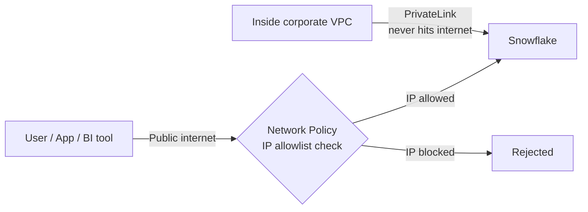

---
status: active
platform: Snowflake
area: Security and Governance
topic_number: 16
tags:
  - snowflake
  - sf-security-governance
  - learning
---

# Network Policies and Private Connectivity

> Two complementary network-layer controls: network policies (IP allowlisting/blocklisting) and private connectivity (PrivateLink-style tunnels). Consultant lens: the "where can you connect from?" layer that, combined with RBAC and encryption, delivers the defense-in-depth regulated clients (banks, healthcare, gov) require.

## Executive Summary

- **What it is:** Network policies filter inbound connections by source IP; private connectivity routes traffic over the cloud provider's private backbone so it never touches the public internet.
- **Why it matters:** Meets network-segmentation and "no public exposure" controls auditors and regulators look for (SOC 2, PCI-DSS, HIPAA, banking).
- **Mental model:** Network policy = a bouncer with a guest list (traffic still arrives over the internet, but is filtered). Private connectivity = a private hallway (traffic bypasses the internet entirely). Complementary layers, not alternatives.
- **Best used when:** Any regulated or security-conscious client; use both together to block the public internet and only allow a private path.
- **Avoid or reconsider when:** Never skip network policies (they're free); reconsider private connectivity only when the Business Critical edition cost isn't justified by an actual compliance requirement.

## What It Can Do

- Restrict connections to an allowlist of CIDR ranges (and block specific ranges) via network policies.
- Apply network controls at account level, user level, or to integrations.
- Use reusable `NETWORK RULE` objects instead of inline IP lists (the modern pattern).
- Route inbound client traffic privately via AWS PrivateLink / Azure Private Link / GCP Private Service Connect.
- Route outbound Snowflake-to-your-service traffic privately via external access integrations.
- Provide a private account URL so the public URL can be blocked entirely.

## What It Cannot Do

- Authenticate users — network controls restrict *where* you connect from, not *who* you are. A valid IP with stolen credentials still gets in. Pair with RBAC + MFA/SSO.
- Make IP allowlisting "private" — even with an allowlist, filtered traffic still rides the public internet. Only private connectivity removes internet exposure.
- Cover everything automatically with private link — replication, some integrations, and outbound calls need separate configuration.
- Stack account + user policies — a user-level policy *replaces* the account policy for that user; it must be complete on its own.

## Core Concepts

| Concept | Meaning | Why it matters |
|---|---|---|
| Network policy | Object holding `ALLOWED_IP_LIST` / `BLOCKED_IP_LIST` (or network rules) | The IP firewall; blocked is evaluated first and wins |
| Network rule | Reusable `NETWORK RULE` object referenced by policies | Modern, composable alternative to inline IP lists |
| Account vs user scope | Account policy = baseline for all; user policy overrides for that user | Lets a service account use a narrower/different range than humans |
| Private connectivity | PrivateLink-style tunnel over the cloud provider's private backbone | Removes public-internet exposure entirely |
| Inbound vs outbound | Inbound = clients reach Snowflake privately; outbound = Snowflake reaches your services privately | People configure inbound and wrongly assume outbound is covered too |
| Private account URL | Dedicated URL used with private connectivity | Must use it (and block the public URL) or the public door stays open |

## How It Works (Simple Flow)

1. Create a network policy (preferably from reusable network rules) listing allowed/blocked CIDR ranges.
2. Attach it at account level (baseline) and/or override on specific users (e.g., service accounts).
3. On connect, Snowflake checks blocked list first, then allowed list, and rejects disallowed source IPs.
4. Separately, work with the cloud team to set up private connectivity (VPC endpoint, DNS, private account URL).
5. Point clients at the private account URL so traffic flows over the provider's backbone, not the internet.
6. Apply a network policy that blocks public IPs so the public URL is effectively closed.
7. Result: identity (RBAC) + network (policy) + transport (private link) defense in depth.

## Visuals



## Readable Snippets

```sql
-- Reusable network rule (preferred over inline IP lists)
CREATE NETWORK RULE corp_ips
  MODE = INGRESS
  TYPE = IPV4
  VALUE_LIST = ('203.0.113.0/24', '198.51.100.10');

-- Build a policy referencing the rule
CREATE NETWORK POLICY corp_only
  ALLOWED_NETWORK_RULE_LIST = ('corp_ips');

-- Apply account-wide...
ALTER ACCOUNT SET NETWORK_POLICY = corp_only;

-- ...or override for a single (e.g. service) user
ALTER USER svc_loader SET NETWORK_POLICY = corp_only;
```

## Consultant Talking Points

- **Client question this answers:** "Can we guarantee our data warehouse is only reachable from our corporate network, never the open internet?" → Yes: network policy + private connectivity.
- **Trade-offs to mention:** IP allowlists are free but brittle (break when offices change ISPs, users go remote, cloud egress IPs rotate). Private connectivity is robust but requires Business Critical edition and joint setup with the cloud team.
- **Risk or governance angle:** Maps directly to network-segmentation and no-public-exposure controls auditors want (SOC 2, PCI-DSS, HIPAA, banking regulators). Network controls are not authentication — always layer with RBAC + MFA/SSO.
- **Cost/performance angle:** Network policies are free on all editions. Private connectivity needs Business Critical — a meaningful price step. Budget-conscious clients should start with network policies and escalate only if compliance demands zero public-internet exposure.

## Common Pitfalls

- **Self-lockout** — enabling an `ALLOWED_IP_LIST` without your own/break-glass range. Snowflake blocks activation that would lock out your current session, but automation/API calls can still cause lockouts. Always include an admin range and test first.
- **Treating allowlist as "private"** — filtered traffic still rides the public internet; only private connectivity removes exposure.
- **Assuming account + user policies stack** — the user policy *replaces* the account policy for that user, so it must be self-contained.
- **Assuming PrivateLink covers everything** — replication, integrations, and outbound calls need separate config; gaps get missed.
- **DNS/URL confusion** — after enabling private connectivity you must use the private account URL and block the public one, or the public door stays open.

## When to Recommend What (Decision Table)

| Situation | Recommend | Why | Watch-outs |
|---|---|---|---|
| Any account, baseline hardening | Network policy (free) | Strong control at no extra cost | Avoid self-lockout; keep a break-glass range |
| Service account from one fixed egress IP | User-level network policy | Narrower range than human users | User policy replaces account policy — make it complete |
| Regulated client needs zero public exposure | Private connectivity + policy blocking public IPs | Removes internet path entirely | Business Critical cost; joint cloud-team setup |
| Budget-conscious, no strict compliance mandate | Network policy only | Meaningful control without edition upgrade | Brittle to IP changes; not truly private |
| Snowflake must call your private services | Outbound private connectivity / external access integration | Keeps outbound traffic off the internet too | Separate config from inbound; easy to overlook |

## Related Topics

- [[01 Snowflake/03 Security and Governance/Security and Governance Overview]]
- [[01 Snowflake/03 Security and Governance/12 RBAC Roles and Privileges]]
- [[01 Snowflake/03 Security and Governance/17 Tri-Secret Secure and Customer-Managed Keys]]

## Related Decision Notes

- [[80 Comparisons and Decision Notes/Comparisons/Comparison - Network Policy vs Private Connectivity]]

## Questions

- What exactly does private connectivity *not* cover by default (replication, external stages, Snowpipe)?
- How do network rules differ in capability from legacy inline IP lists beyond reusability?
- How is private connectivity billed beyond the Business Critical edition requirement?

## Sources To Revisit

- Snowflake Docs: Network policies and network rules
- Snowflake Docs: AWS PrivateLink / Azure Private Link / GCP Private Service Connect
- Snowflake Docs: Outbound private connectivity / external access integrations


