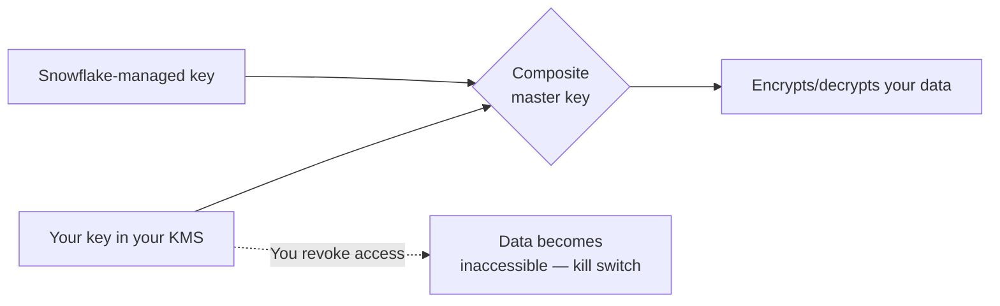

---
status: active
platform: Snowflake
area: Security and Governance
topic_number: 17
tags:
  - snowflake
  - sf-security-governance
  - learning
---

# Tri-Secret Secure and Customer-Managed Keys

> A composite-key encryption model where the customer holds one required half of the master key in their own cloud KMS. Consultant lens: not stronger encryption (still AES-256) but customer-held control and a revocation kill switch — required by the strictest financial-services, healthcare, and government clients.

## Executive Summary

- **What it is:** Snowflake combines its own key with a customer-managed key (CMK) stored in the customer's cloud KMS to form the composite master key. Neither party can decrypt the data alone.
- **Why it matters:** Gives the customer ultimate control and the ability to revoke the vendor's access ("hold your own key" / HYOK), satisfying the strictest regulatory requirements.
- **Mental model:** A safe-deposit box needing two keys — Snowflake holds one, you hold one. The data was already AES-256 encrypted; Tri-Secret changes *who controls the key*, not the cryptographic strength.
- **Best used when:** Regulated clients with a compliance mandate to own key material and provably cut vendor access — and with the operational maturity to run a KMS.
- **Avoid or reconsider when:** The driver is "stronger encryption" (it isn't), the client can't operate key custody/HA/break-glass reliably, or Business Critical edition cost isn't justified.

## What It Can Do

- Combine a Snowflake-managed key with a customer key into a composite master key.
- Let the customer revoke Snowflake's access at any time, instantly rendering data cryptographically inaccessible (kill switch).
- Support cryptographic shredding for offboarding/contract termination — residual ciphertext stays unreadable.
- Integrate with AWS KMS, Azure Key Vault, and GCP Cloud KMS.
- Satisfy HYOK-style regulatory and data-sovereignty controls.

## What It Cannot Do

- Provide stronger encryption — data is already AES-256 by default; this changes control, not strength.
- Perform row-level or per-customer erasure — revocation is account/key-scoped, not surgical (use deletes/masking for granular erasure).
- Protect against authorized misuse — a valid RBAC user still reads decrypted data; this is vendor-trust, not user access control.
- Work without operational responsibility — key lifecycle, HA, and break-glass become the customer's burden.
- Run below Business Critical edition.

## Core Concepts

| Concept | Meaning | Why it matters |
|---|---|---|
| Default encryption | All data AES-256 encrypted at rest, always, all editions | The baseline Tri-Secret builds on — strength is not the differentiator |
| Key hierarchy / envelope encryption | Root → account → table → file keys, each wrapping the next | Tri-Secret inserts the composite key at the top of this hierarchy |
| Customer-managed key (CMK) | Key the customer owns in their own cloud KMS | The half Snowflake cannot export or recreate |
| Composite master key | Derived by combining Snowflake's key with the CMK | Neither party can decrypt data alone |
| Kill switch | Revoking the CMK blocks composite-key formation | Instant, atomic, account-wide data lockout — even to Snowflake |
| HYOK | "Hold your own key" control model | The compliance pattern Tri-Secret implements |

## How It Works (Simple Flow)

1. The customer creates a key (CMK) in their own cloud KMS (AWS KMS / Azure Key Vault / GCP KMS).
2. They grant Snowflake's service principal permission to *use* (not export) that key.
3. Snowflake combines the CMK with its own key to form the composite master key.
4. That composite key sits at the top of the normal key hierarchy and protects everything below.
5. Day-to-day encryption/decryption is transparent — queries run normally.
6. If the customer revokes Snowflake's access in their KMS, the composite key can't be formed.
7. Result: data becomes cryptographically inaccessible to everyone, including Snowflake.

## Visuals



## Readable Snippets

```text
-- Tri-Secret Secure is configured during account setup with Snowflake,
-- not via day-to-day SQL. The customer-side work is in their cloud KMS:

-- 1. Create a CMK in your KMS (e.g. AWS KMS, Azure Key Vault, GCP Cloud KMS).
-- 2. Grant Snowflake's service principal "use key" (not "export") permission.
-- 3. Snowflake links the CMK to the account and forms the composite key.
-- 4. To trigger the kill switch: revoke/disable Snowflake's key permission in your KMS.
```

## Consultant Talking Points

- **Client question this answers:** "We need to *own* our encryption keys and be able to revoke our vendor's access — can Snowflake do that?" → Yes, Tri-Secret Secure.
- **Trade-offs to mention:** You gain control but take on operational responsibility. Lose or misconfigure the key and you can permanently destroy your own data — Snowflake cannot recover it.
- **Risk or governance angle:** A HYOK control satisfying the strictest FS/healthcare/gov requirements; shifts ultimate data control to the customer and is provable to auditors. Don't oversell it as stronger encryption.
- **Cost/performance angle:** Requires Business Critical edition (same gate as private connectivity — often bought together), plus your own KMS costs and key-lifecycle operational overhead.

## Common Pitfalls

- **Overselling as "stronger encryption"** — strength is identical AES-256; the value is control and revocability.
- **Self-inflicted outage** — KMS misconfiguration, a deleted/expired key, or a KMS regional outage means Snowflake can't decrypt and production is down; only the customer can restore it.
- **Assuming row-level erasure** — revocation is whole-dataset/account-scoped, not per-customer; granular erasure still needs deletes/masking.
- **Underestimating operational maturity** — without disciplined key custody, HA, and a tested break-glass runbook, Tri-Secret adds risk instead of removing it.
- **Confusing layers** — it's vendor-trust control, not user access control; RBAC/masking still govern what authorized users see.

## When to Recommend What (Decision Table)

| Situation | Recommend | Why | Watch-outs |
|---|---|---|---|
| Typical client, no key-ownership mandate | Default encryption (no action) | Already AES-256, free, zero ops | Don't upsell on "strength" |
| Regulatory mandate to hold own key (HYOK) | Tri-Secret Secure | Provable customer control + revocation | Business Critical cost; KMS ops burden |
| Need provable vendor offboarding | Tri-Secret Secure | Cryptographic shredding of residual data | Account-scoped, not row-level |
| Client wants it but has immature key ops | Defer / build ops first | Self-destruct and outage risk too high | Tested break-glass runbook required |
| Already moving to Business Critical for private connectivity | Bundle Tri-Secret | Same edition gate, unified compliance story | Confirm KMS HA before enabling |

## Related Topics

- [[01 Snowflake/03 Security and Governance/Security and Governance Overview]]
- [[01 Snowflake/03 Security and Governance/16 Network Policies and Private Connectivity]]
- [[01 Snowflake/03 Security and Governance/12 RBAC Roles and Privileges]]

## Related Decision Notes

- [[80 Comparisons and Decision Notes/Comparisons/Comparison - Default Encryption vs Tri-Secret Secure]]

## Questions

- How exactly is the composite key derived from the two key halves?
- What is the latency/availability impact if the customer KMS is slow or briefly unreachable?
- How does key rotation work on the customer side without disrupting access?

## Sources To Revisit

- [Snowflake Docs: Understanding encryption key management](https://docs.snowflake.com/en/user-guide/security-encryption-manage)
- [Snowflake Docs: Tri-Secret Secure](https://docs.snowflake.com/en/user-guide/security-encryption-tss)
- [AWS KMS](https://docs.aws.amazon.com/kms/latest/developerguide/overview.html) / [Azure Key Vault](https://learn.microsoft.com/en-us/azure/key-vault/general/overview) / [GCP Cloud KMS](https://cloud.google.com/kms/docs)


