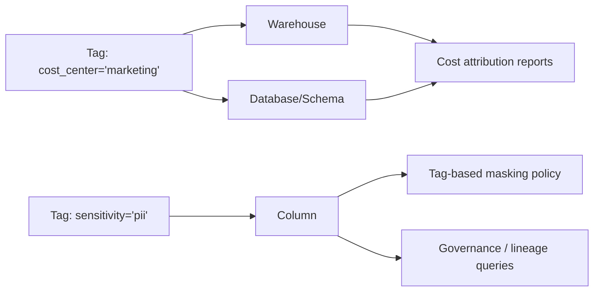

# Object Tagging

> Schema-level key-value labels attached to Snowflake objects that other features read. Consultant lens: the connective tissue of governance — tag once, then power cost attribution, tag-based masking, classification, and inventory/lineage everywhere.

## Executive Summary

- **What it is:** A tag is a schema-level object (a named label) you assign to objects with a value, e.g. `cost_center = 'marketing'` or `sensitivity = 'pii'`.
- **Why it matters:** Tags themselves do nothing, but everything else reads them — cost reports, masking policies, classification, and governance queries — so they become a shared governance vocabulary.
- **Mental model:** Sticky labels that flow down the object hierarchy via inheritance; the connective tissue that ties Security & Governance features together.
- **Best used when:** You need cost attribution/chargeback, systematic sensitive-data tracking, or a queryable inventory across a large account.
- **Avoid or reconsider when:** There's no governance discipline (naming/allowed-value standards) — uncontrolled tag sprawl makes reports meaningless.

## What It Can Do

- Attach key-value metadata to many object types (warehouses, databases, schemas, tables, views, columns, roles, users).
- Inherit down the object hierarchy automatically (database → schema → table → column), with lower-level overrides.
- Enforce a fixed whitelist of values via `ALLOWED_VALUES` for consistency.
- Drive tag-based masking — bind a masking policy to a tag so every tagged column is protected.
- Hold the system tags that Data Classification writes (`SEMANTIC_CATEGORY`, `PRIVACY_CATEGORY`).
- Power cost attribution by joining tag metadata against usage views.
- Provide a queryable inventory via `ACCOUNT_USAGE.TAG_REFERENCES`.

## What It Cannot Do

- Enforce anything by itself — a tag is metadata; protection only happens when a policy is bound to it.
- Prevent value sprawl without `ALLOWED_VALUES` — inconsistent strings silently break reporting.
- Provide real-time reporting — `ACCOUNT_USAGE` tag references update with latency (up to ~2 hours).
- Be assigned without limit — there's a cap on distinct tags per object, so a deliberate taxonomy is needed.
- Always be available on lower editions — tag-based features generally require Enterprise+.

## Core Concepts

| Concept | Meaning | Why it matters |
|---|---|---|
| Tag (the key) | A named, schema-level label object governed by RBAC | The reusable vocabulary term |
| Tag value | The string stamped on a specific object | What a report or policy actually reads |
| Allowed values | Optional whitelist enforced at assignment | Prevents `Marketing`/`marketing`/`mktg` chaos |
| Inheritance | Tags flow down the object hierarchy automatically | Govern at the top; don't label thousands of objects by hand |
| Override | Nearest assignment wins at a lower level | Lets you specialize a subtree |
| `TAG_REFERENCES` views | Account-wide and object-specific tag lookups | Turns the account into a queryable inventory |

## How It Works (Simple Flow)

1. Create a tag object (optionally with allowed values for consistency).
2. Assign the tag + value to objects (`ALTER ... SET TAG`), often high in the hierarchy.
3. Lower objects inherit the tag automatically; override where needed.
4. Other features read the tags: masking policies bind to them, cost queries join on them, governance queries filter on them.
5. Audit via `ACCOUNT_USAGE.TAG_REFERENCES` (account-wide) or `INFORMATION_SCHEMA.TAG_REFERENCES` (object-specific).

## Visuals



## Readable Snippets

```sql
-- Create a governed tag with enforced allowed values
CREATE TAG governance.cost_center
  ALLOWED_VALUES 'marketing', 'finance', 'engineering';

-- Assign at a high level — children inherit it
ALTER WAREHOUSE etl_wh SET TAG governance.cost_center = 'engineering';
ALTER DATABASE  sales_db SET TAG governance.cost_center = 'marketing';

-- Tag a sensitive column (feeds tag-based masking)
ALTER TABLE customers.profiles
  MODIFY COLUMN email SET TAG governance.sensitivity = 'pii';

-- Find everything tagged a certain way (account-wide audit)
SELECT object_name, column_name, tag_name, tag_value
FROM snowflake.account_usage.tag_references
WHERE tag_name = 'COST_CENTER' AND tag_value = 'marketing';
```

## Consultant Talking Points

- **Client question this answers:** "How do we attribute Snowflake spend to teams, and systematically track where our sensitive data lives?" → Object tagging, joined to usage and policy machinery.
- **Trade-offs to mention:** Tags are only as good as the discipline behind them. Without `ALLOWED_VALUES` and a naming standard you get value chaos that makes reports meaningless. Governance is a process, not just a feature.
- **Risk or governance angle:** Tags + masking + classification form an integrated governance stack — tag once, enforce everywhere. Tag changes are themselves audited.
- **Cost/performance angle:** Tag-based attribution is the backbone of chargeback/showback, but `ACCOUNT_USAGE` views have latency (up to ~2 hours), so it isn't a real-time dashboard.

## Common Pitfalls

- **Treating tags as enforcement** — tagging a column `pii` does not mask it; a policy must be bound to the tag.
- **Free-text value sprawl** — inconsistent strings silently break cost and governance reporting; constrain critical tags with allowed values.
- **Expecting real-time reporting** — tag reference views lag; don't promise live cost dashboards from them.
- **Ignoring object limits** — there's a cap on distinct tags per object; design a deliberate taxonomy instead of tagging everything.
- **Edition assumptions** — tag-based features generally need Enterprise+; confirm for lower-tier clients.

## When to Recommend What (Decision Table)

| Situation | Recommend | Why | Watch-outs |
|---|---|---|---|
| Team/project cost attribution needed | Tag warehouses + databases with `cost_center` | Foundation of chargeback/showback | Enforce allowed values; account for reporting lag |
| Systematic sensitive-data protection | Sensitivity tags + tag-based masking | Tag once, mask everywhere | Tag alone protects nothing — bind a policy |
| Large account needs an inventory | Tag taxonomy + `TAG_REFERENCES` queries | Queryable governance inventory | Requires upfront taxonomy design |
| Auto-discover then tag PII | Data Classification (system tags) | Automates tagging into this framework | Probabilistic — review before trusting |
| Inconsistent labels already in use | Introduce `ALLOWED_VALUES` standard | Stops value sprawl | Migrating existing free-text tags is manual |

## Related Topics

- [[01 Snowflake/03 Security and Governance/Security and Governance Overview]]
- [[01 Snowflake/03 Security and Governance/15 Data Classification]]
- [[01 Snowflake/03 Security and Governance/14 Column-level Masking Policies]]
- [[01 Snowflake/06 Cost Management and Operations/31 Credit Consumption Model]]

## Questions

- What is the exact cap on distinct tags per object, and how should that shape a taxonomy?
- How does tag inheritance behave with cloned objects and replicated databases?
- What is the typical latency of `ACCOUNT_USAGE.TAG_REFERENCES` in practice?

## Sources To Revisit

- [Snowflake Docs: Object tagging](https://docs.snowflake.com/en/user-guide/object-tagging)
- [Snowflake Docs: Tag-based masking policies](https://docs.snowflake.com/en/user-guide/tag-based-masking-policies)
- [Snowflake Docs: ACCOUNT_USAGE TAG_REFERENCES view](https://docs.snowflake.com/en/sql-reference/account-usage/tag_references)


