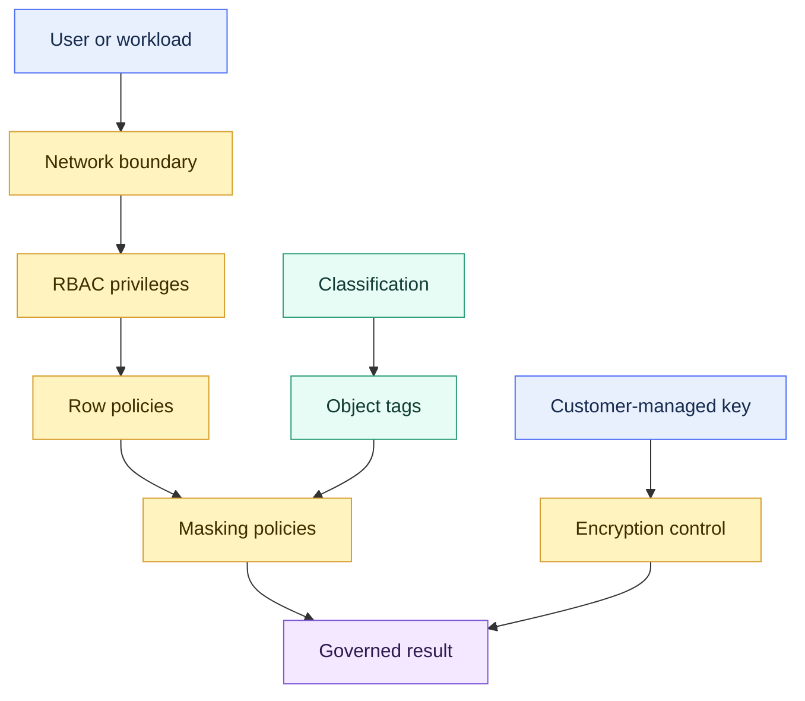

---
status: hub
platform: Snowflake
area: Security and Governance
tags:
  - snowflake
  - sf-security-governance
  - map
---

# Security and Governance Overview

> [!abstract] Chapter outcome
> Explain Snowflake's layered control model — identity and privileges, row and column enforcement, discovery and metadata, network boundaries, and customer-held encryption control.

## Topics

- [[01 Snowflake/03 Security and Governance/12 RBAC Roles and Privileges|12 - RBAC Roles and Privileges]]
- [[01 Snowflake/03 Security and Governance/13 Row Access Policies|13 - Row Access Policies]]
- [[01 Snowflake/03 Security and Governance/14 Column-level Masking Policies|14 - Column-level Masking Policies]]
- [[01 Snowflake/03 Security and Governance/15 Data Classification|15 - Data Classification]]
- [[01 Snowflake/03 Security and Governance/16 Network Policies and Private Connectivity|16 - Network Policies and Private Connectivity]]
- [[01 Snowflake/03 Security and Governance/17 Tri-Secret Secure and Customer-Managed Keys|17 - Tri-Secret Secure and Customer-Managed Keys]]
- [[01 Snowflake/03 Security and Governance/18 Object Tagging|18 - Object Tagging]]

## Chapter Map

## Topic Summaries

| Topic | What it unlocks |
|---|---|
| [[01 Snowflake/03 Security and Governance/12 RBAC Roles and Privileges\|RBAC Roles and Privileges]] | Build auditable least privilege through role hierarchies and separation of duties. This is the foundation. |
| [[01 Snowflake/03 Security and Governance/13 Row Access Policies\|Row Access Policies]] | Enforce regional, departmental, or tenant segregation from shared tables at query time. |
| [[01 Snowflake/03 Security and Governance/14 Column-level Masking Policies\|Column-level Masking Policies]] | Show real, partial, hashed, or null values from the same column according to role or context. |
| [[01 Snowflake/03 Security and Governance/15 Data Classification\|Data Classification]] | Discover and label sensitive columns so protection and compliance reporting can scale. Classification finds data; policies protect it. |
| [[01 Snowflake/03 Security and Governance/16 Network Policies and Private Connectivity\|Network Policies and Private Connectivity]] | Control where connections originate and whether traffic uses public or private network paths. |
| [[01 Snowflake/03 Security and Governance/17 Tri-Secret Secure and Customer-Managed Keys\|Tri-Secret Secure and Customer-Managed Keys]] | Give qualified clients customer-held key control and a revocation kill switch. It changes control, not encryption strength. |
| [[01 Snowflake/03 Security and Governance/18 Object Tagging\|Object Tagging]] | Create a shared governance vocabulary for masking, classification, cost attribution, and inventory. |

## How To Use This Area

Read the chapter as layered defense. Start with RBAC, add row and column policies for fine-grained access, use classification and tags to scale governance, then add network and key controls where risk or regulation requires them.

## Related Areas

- [[00 Home/Snowflake Learning Map|Snowflake Learning Map]]
- [[01 Snowflake/01 Core Architecture and Concepts/Core Architecture and Concepts Overview|Core Architecture and Concepts]]
- [[01 Snowflake/04 Data Engineering/Data Engineering Overview|Data Engineering]]
- [[01 Snowflake/08 Enterprise Snowflake in Production/Enterprise Snowflake in Production Overview|Enterprise Snowflake in Production]]
