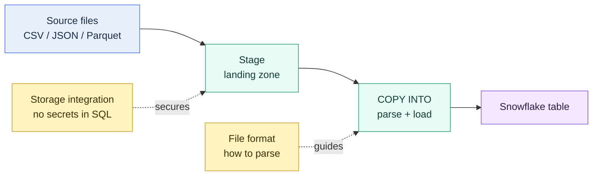

# Stages and Data Loading

> [!abstract] Consultant lens
> **What it is:** Internal and external stages, storage integrations, file formats, and the `COPY INTO` model.
>
> **Why it matters:** These are the foundations under Snowpipe and External Tables for getting data into and out of Snowflake.

## Executive Summary

- **What it is:** The staging and bulk load/unload layer — **stages** (where files live), **file formats** (how to parse them), and **`COPY INTO`** (the engine that loads them into tables).
- **Why it matters:** Every ingestion path — Snowpipe, External Tables, dbt seeds — sits on top of these three primitives. Learn this and the rest of data engineering clicks into place.
- **Mental model:** Loading is a two-step pipeline — **stage the files**, then **`COPY INTO`** parses and loads them. You don't `INSERT` millions of rows; you bulk-load staged files.
- **Best used when:** Batch/bulk loading of files (CSV, JSON, Parquet, Avro, ORC, XML) into Snowflake tables, and unloading tables back out to files.
- **Avoid or reconsider when:** You need continuous event-driven loads (use Snowpipe) or want to query files in place without loading (use External Tables / Iceberg).

## What It Can Do

- Land files in an **internal** stage (Snowflake-managed) or **external** stage (your own S3 / Azure Blob / GCS).
- Parse all common formats — CSV, JSON, Parquet, Avro, ORC, XML — including semi-structured data into a `VARIANT` column.
- Bulk load with `COPY INTO <table>` and unload with `COPY INTO <stage>`.
- Skip already-loaded files automatically (load metadata) to prevent duplicates.
- Transform during load — `COPY INTO ... FROM (SELECT ... FROM @stage)` to reshape, cast, or enrich rows (e.g. add `METADATA$FILENAME`).
- Authenticate to external buckets securely via a **storage integration** (no secrets in SQL).

## What It Cannot Do

- Not real-time on its own — `COPY INTO` is manual/scheduled batch; continuous ingestion needs Snowpipe.
- Cannot magically parallelize a single huge file — load throughput scales with **file count**, not file size.
- Cannot query files without loading — that's External Tables, not stages.
- A **table stage** cannot have its own named file format attached (use a named internal stage for that).

## Core Concepts

| Concept | Meaning | Why it matters |
|---|---|---|
| Internal stage | Snowflake-managed storage landing zone | Quick loads, dev, files pushed via `PUT` |
| External stage | Pointer to your S3 / Azure / GCS bucket | Production default; keeps a single source of truth in the client's lake |
| User / Table / Named stage | The three internal stage flavors (`@~`, `@%tbl`, `@my_stage`) | Named stage is the reusable, production-grade choice |
| Storage integration | Account-level trust (e.g. AWS IAM role) for bucket access | **No credentials stored in SQL** — the audit-friendly pattern |
| File format | Reusable object describing how to parse files | Consistent, governable parsing across many loads |
| `COPY INTO` | The load/unload engine | Bulk parse + load; runs on a virtual warehouse |
| Load metadata | Per-table record of loaded files (~64 days) | Idempotency — re-running skips already-loaded files |

## How It Works (Simple Flow)

1. **Files arrive** in cloud storage (or are pushed to an internal stage via `PUT`).
2. A **stage** points at that location; an **external** stage reaches the bucket through a **storage integration** so no keys live in SQL.
3. A **file format** defines how to parse the files (delimiters, JSON structure, compression).
4. **`COPY INTO <table>`** runs on a virtual warehouse, reads the staged files, parses them, and loads rows.
5. Snowflake records each loaded file in **load metadata**; re-runs **skip** already-loaded files (override with `FORCE = TRUE`).
6. `ON_ERROR` decides failure behavior — `ABORT_STATEMENT` (default for manual COPY), `SKIP_FILE`, or `CONTINUE`.
7. To export, run `COPY INTO <stage> FROM <table>` to unload data back to files.

## Visuals



Stages + file formats + `COPY INTO` are also the foundation for Snowpipe (event-driven loads) and External Tables (query in place).

## Readable Snippets

```sql
-- Secure access to an external bucket (no keys in SQL)
CREATE STORAGE INTEGRATION s3_int
  TYPE = EXTERNAL_STAGE
  STORAGE_PROVIDER = 'S3'
  ENABLED = TRUE
  STORAGE_AWS_ROLE_ARN = 'arn:aws:iam::123456789:role/snowflake-role'
  STORAGE_ALLOWED_LOCATIONS = ('s3://my-bucket/data/');

-- Reusable parse rules
CREATE FILE FORMAT my_csv_format
  TYPE = CSV
  FIELD_DELIMITER = ','
  SKIP_HEADER = 1
  FIELD_OPTIONALLY_ENCLOSED_BY = '"'
  NULL_IF = ('', 'NULL');

-- External stage built on the integration
CREATE STAGE my_ext_stage
  URL = 's3://my-bucket/data/'
  STORAGE_INTEGRATION = s3_int
  FILE_FORMAT = my_csv_format;

-- Bulk load
COPY INTO my_table
  FROM @my_ext_stage
  FILE_FORMAT = (FORMAT_NAME = my_csv_format)
  ON_ERROR = 'CONTINUE'      -- explicit: load good rows, reject bad ones
  PATTERN = '.*sales.*[.]csv';

-- Inspect before/after
LIST @my_ext_stage;                         -- what files are staged
SELECT * FROM SNOWFLAKE.ACCOUNT_USAGE.COPY_HISTORY
WHERE TABLE_NAME = 'MY_TABLE' ORDER BY LAST_LOAD_TIME DESC;
```

## Consultant Talking Points

- **Client question this answers:** "How do we get our files into Snowflake reliably and securely?"
- **Trade-offs to mention:** Internal vs external stage — external (the client's own bucket) is the production default; keeps a single source of truth and avoids lock-in. Internal is fine for dev or when there's no existing lake.
- **Risk or governance angle:** Always use a **storage integration** over inline cloud credentials — it stores **no secrets in SQL** (an IAM role trust), which is what passes an audit. Inline keys are a governance red flag.
- **Cost/performance angle:** `COPY` burns warehouse credits and scales with file count. Right-size files to ~**100–250 MB compressed**; tiny files waste compute on overhead, huge files kill parallelism.

## Common Pitfalls

- **Inline cloud credentials in stage definitions** — audit failure; use a storage integration instead.
- **Too many tiny files** — poor parallelism, slow loads, high per-file overhead.
- **One enormous file** — can't parallelize; throughput scales with file count, not size.
- **Forgetting load metadata** — re-running `COPY` silently skips already-loaded files (expected); people then either think the load is broken or use `FORCE = TRUE` and create duplicates.
- **No explicit `ON_ERROR` strategy** — for manual COPY the default `ABORT_STATEMENT` lets one bad row abort a whole batch; decide deliberately between abort / skip-file / continue.

## When to Recommend What (Decision Table)

| Situation | Recommend | Why | Watch-outs |
|---|---|---|---|
| Scheduled/one-off bulk file loads | `COPY INTO` on a named stage | Simple, parallel, idempotent | Size files ~100–250 MB compressed |
| Files already in client's S3/Azure/GCS | External stage + storage integration | Single source of truth, secure auth | Manage allowed locations tightly |
| Dev / scratch / no existing lake | Internal named stage + `PUT` | No bucket setup needed | Snowflake-managed storage cost |
| Continuous, event-driven arrival | Snowpipe (see ch. 22) | Near-real-time, auto-ingest | Different `ON_ERROR` default (`SKIP_FILE`) |
| Query files without loading | External Tables / Iceberg | Avoid copying transient/huge data | Slower, fewer native features |

## Related Topics

- [[01 Snowflake/04 Data Engineering/Data Engineering Overview]]
- [[01 Snowflake/04 Data Engineering/22 Snowpipe]]
- [[01 Snowflake/04 Data Engineering/24 External Tables and Iceberg]]
- [[01 Snowflake/03 Security and Governance/16 Network Policies and Private Connectivity]]

## Questions

- When does a transforming `COPY INTO (SELECT ... FROM @stage)` become preferable to loading raw then transforming downstream (ELT)?
- Best practice for organizing storage integrations and allowed locations across many teams/buckets?

## Sources To Revisit

- [Snowflake Docs: Data Loading Overview](https://docs.snowflake.com/en/user-guide/data-load-overview)
- [Snowflake Docs: COPY INTO &lt;table&gt;](https://docs.snowflake.com/en/sql-reference/sql/copy-into-table)
- [Snowflake Docs: Storage Integrations (CREATE STORAGE INTEGRATION)](https://docs.snowflake.com/en/sql-reference/sql/create-storage-integration)
- [Snowflake Docs: Overview of Stages](https://docs.snowflake.com/en/user-guide/data-load-overview#overview-of-stages)
- [Snowflake Docs: File Formats (CREATE FILE FORMAT)](https://docs.snowflake.com/en/sql-reference/sql/create-file-format)
