# Streams and Tasks

> Change tracking (CDC) and scheduled SQL execution inside Snowflake. Consultant lens: build incremental pipelines without an external orchestrator like Airflow or ADF.

## Executive Summary

- **What it is:** Two separate primitives usually used together. A **Stream** is a bookmark (offset) over a table that exposes what changed since you last consumed it. A **Task** runs SQL, a stored procedure, or multiple statements on a schedule or when triggered.
- **Why it matters:** Lets you build incremental ELT pipelines entirely inside Snowflake — no external scheduler — by having a Task wake up, check a Stream, and process only the new changes.
- **Mental model:** Snowpipe gets data *in*; Streams + Tasks move it *forward*. The Stream is the "what changed," the Task is the "do something about it on a cadence."
- **Best used when:** Incremental processing of changed rows, procedural/multi-step logic, calling stored procs or Snowpark, and lightweight in-database orchestration (task DAGs).
- **Avoid or reconsider when:** A declarative "keep this query's output fresh" transformation fits better (use Dynamic Tables), or you need full cross-system orchestration with rich backfill/branching (use Airflow / dbt Cloud / ADF).

## What It Can Do

- Track inserts/updates/deletes on a table as a consumable delta (CDC) via Streams.
- Run SQL, stored procedures, Snowpark, or multiple statements on a cron/interval schedule via Tasks.
- Trigger work only when there is data, using `WHEN SYSTEM$STREAM_HAS_DATA(...)` — no empty, credit-burning runs.
- Chain Tasks into a DAG (`AFTER`) for in-database orchestration with dependencies and ordering.
- Run serverless (Snowflake-managed compute) or on a user-assigned warehouse.
- Process change data transactionally so a failed Task reprocesses next run (at-least-once semantics).

## What It Cannot Do

- Pull data out of a stage — Streams/Tasks only operate on data already in a Snowflake table (ingestion is Snowpipe / `COPY INTO`).
- Replace a full orchestrator — DAGs have one root, size limits, and no rich branching, backfill, or cross-system coordination.
- Keep change history forever — a Stream's readable window is bounded by the table's Time Travel retention (it can go stale).
- Show a literal `UPDATE` action — updates appear as a paired DELETE + INSERT flagged `METADATA$ISUPDATE = TRUE`.
- Safely feed two consumers from one Stream — whichever commits first advances the offset and the other loses those changes.

## Core Concepts

| Concept | Meaning | Why it matters |
|---|---|---|
| Stream | An offset + 3 metadata columns layered over a table's existing micro-partition versions (not a data copy) | Cheap change tracking with no duplicated storage |
| Offset | Pointer to the last-consumed point in time | Advances only on **committed DML** that reads the stream — not on a plain `SELECT` |
| `METADATA$ACTION` | `INSERT` or `DELETE` | How you branch logic in a MERGE |
| `METADATA$ISUPDATE` | `TRUE` when the row is part of an UPDATE (shown as DELETE + INSERT) | There is no literal UPDATE action to key off |
| Stream types | Standard / Append-only / Insert-only (external tables) | Append-only skips update/delete tracking — cheaper for insert-only feeds |
| Task | Scheduled execution unit (SQL, proc, Snowpark, multi-statement) | The engine that consumes streams on a cadence |
| Task DAG | Tasks chained with `AFTER`, one scheduled root + children | In-database orchestration without an external tool |
| Serverless vs warehouse | Snowflake-managed compute vs a warehouse you assign | Serverless often cheaper for frequent small jobs |

## How It Works (Simple Flow)

1. Create a **Stream** on a source table; it records an offset and begins tracking changes.
2. Rows change in the source table (often loaded by Snowpipe or `COPY INTO`).
3. A **Task** runs on a schedule, gated by `WHEN SYSTEM$STREAM_HAS_DATA(...)` so it only acts when there is a delta.
4. The Task reads the Stream inside a DML statement (typically a `MERGE`) and transforms the changes into a target table.
5. When that DML **commits**, the Stream's offset advances — the next run sees only newer changes.
6. If the Task fails, the DML rolls back, the offset does not move, and the changes are reprocessed next run (at-least-once).
7. Optionally chain child Tasks with `AFTER` to form a DAG; resume children first, then the root.

## How Streams Work Under the Hood (Table Versioning)

A stream does not store changed rows. It stores an **offset** — a pointer to one **table version** — and computes the delta on demand by diffing that version against "now."

- Snowflake tables are **immutable micro-partitions**. DML never edits files in place: it writes new micro-partitions and retires old ones.
- Every committed DML produces a new **table version** — a metadata snapshot of *which micro-partition files are live* at that moment. Old files are retired but physically retained.
- **"Comparing table versions"** = a metadata-level diff of two such file lists: partitions added since the offset are inserts, partitions retired are deletes, an update is both (`METADATA$ISUPDATE`). No full-table row scan — this is why streams are cheap.
- A stream's offset is just a saved version marker; consuming it (committed DML) moves the offset to the current version.
- This is the **same versioned-partition history that powers Time Travel and zero-copy Clone**. See [[01 Snowflake/01 Core Architecture and Concepts/02 Micro-partitions and Clustering]] and [[01 Snowflake/01 Core Architecture and Concepts/03 Time Travel and Fail-safe]].

Why this explains staleness: to diff your offset version against now, the **micro-partition files that made up the offset version must still exist**. They are only retained for `DATA_RETENTION_TIME_IN_DAYS`. If the offset falls outside that window, the baseline version can no longer be reconstructed and the stream goes **STALE** — even though the current table's rows are all fine. You lose the *bookmark*, not the *book*.
## Visuals

Where Streams and Tasks sit in a pipeline. Ingestion (Snowpipe / `COPY INTO`) gets data *into* a table; the Stream tracks the change; the Task moves it *forward* on a cadence.

```mermaid
flowchart LR
    PS[External pub/sub or files] --> STG[(Stage)]
    STG -->|Snowpipe / COPY INTO ingestion| LND[(Landing table)]
    LND -->|Stream tracks delta| STR{{Stream offset}}
    STR -->|WHEN STREAM_HAS_DATA| TSK[Task on schedule]
    TSK -->|MERGE commits, offset advances| CUR[(Curated table)]

    classDef ingest fill:#e3f2fd,stroke:#1565c0,color:#0d47a1;
    classDef st fill:#e8f5e9,stroke:#2e7d32,color:#1b5e20;
    class PS,STG,LND ingest;
    class STR,TSK,CUR st;
```



## Readable Snippets

### Canonical pattern: Stream + gated Task + MERGE

```sql
-- Stream tracks changes on the landing table
CREATE OR REPLACE STREAM raw.orders_stream ON TABLE raw.orders;

-- Task processes the delta only when there's data to process
CREATE OR REPLACE TASK curated.merge_orders
    WAREHOUSE = etl_wh
    SCHEDULE = '5 MINUTE'
    WHEN SYSTEM$STREAM_HAS_DATA('raw.orders_stream')
AS
    MERGE INTO curated.orders t
    USING raw.orders_stream s
       ON t.order_id = s.order_id
    WHEN MATCHED AND s.METADATA$ACTION = 'DELETE' THEN DELETE
    WHEN MATCHED THEN UPDATE SET t.amount = s.amount, t.status = s.status
    WHEN NOT MATCHED AND s.METADATA$ACTION = 'INSERT' THEN
        INSERT (order_id, amount, status) VALUES (s.order_id, s.amount, s.status);

-- Tasks are created SUSPENDED -- you must resume them
ALTER TASK curated.merge_orders RESUME;
```

### Append-only stream for an insert-only feed

```sql
-- A pub/sub firehose only inserts -- skip tracking updates/deletes
CREATE OR REPLACE STREAM raw.events_stream ON TABLE raw.events
    APPEND_ONLY = TRUE;
```

## Consultant Talking Points

- **Client question this answers:** "Can we build incremental ELT inside Snowflake without buying or running a separate orchestrator?" — yes, for moderate complexity.
- **Trade-offs to mention:** It is orchestration-*lite*. Great for in-database dependencies; not a substitute for Airflow/dbt Cloud when you need cross-system coordination, rich retries, or backfill.
- **Risk or governance angle:** Streams can go stale and silently break a pipeline; Tasks start suspended and must be resumed. Monitor `TASK_HISTORY` and stream staleness, and alert on failures.
- **Cost/performance angle:** Gate Tasks with `SYSTEM$STREAM_HAS_DATA` to avoid empty runs; prefer serverless Tasks for frequent small jobs; use append-only streams for insert-only feeds.

## Common Pitfalls

- **Stream staleness** — a stream's offset points at a past **table version**; that version's micro-partitions are only kept for `DATA_RETENTION_TIME_IN_DAYS`. If the stream is unconsumed longer than that (usually a paused Task or broken downstream), the baseline version ages out and the stream goes **STALE** and unrecoverable. The base rows are fine — what's lost is the change-history needed to know which rows were unprocessed. Snowflake auto-extends retention to protect unconsumed streams, but only up to `MAX_DATA_EXTENSION_TIME_IN_DAYS` (default 14, max 90) — don't treat it as infinite. Monitor staleness, not just lag.
- **Assuming SELECT advances the offset** — it does not. The offset only advances on **committed DML** that reads the Stream. Consume inside the transaction that commits.
- **Two consumers, one Stream** — whichever Task commits first steals the changes; the other gets a gap. Use a separate Stream per consumer.
- **Forgetting to RESUME** — Tasks are created suspended; for a DAG, resume children before the root, or nothing runs.
- **Empty runs wasting credits** — skipping the `WHEN` clause means the Task fires (and may spin a warehouse) even with no changes.
- **Treating it as full orchestration** — single root, DAG size limits, no rich branching/backfill.
- **Non-idempotent targets make recovery hard** — if a stream goes stale you must reconcile the raw table into the target; a keyed, idempotent target turns that into a one-line re-MERGE instead of a forensic exercise.

## Recovering From a Stale Stream

A stale stream cannot be resumed — the offset is gone. Recovery means reconciling the source table into the target without missing or double-counting rows, then recreating the stream.

1. **Confirm and stop the bleeding.** Check `SHOW STREAMS` / `DESCRIBE STREAM` for `STALE = true`, then `ALTER TASK ... SUSPEND` so nothing runs on the broken stream.
2. **Reconcile the target** (pick by target design):
   - *Keyed target (best):* idempotent full `MERGE` of the source into the target — already-processed rows no-op, missed rows insert. Self-heals the gap.
   - *Huge source:* bounded backfill using a watermark (`MAX(load_ts)` in the target) plus a small **safety overlap** — overlap is safe with an idempotent MERGE; a gap is not.
   - *Append-only, no key:* dedup on a row hash used as the merge key, or `DELETE` + reload a bounded `ingest_ts` window.
3. **Recreate the stream** with `CREATE OR REPLACE STREAM ...` (new offset = now). Do this *after* the backfill captures up to "now" so nothing slips between recovery and resume.
4. **Resume and verify** — `ALTER TASK ... RESUME`, then reconcile counts (`COUNT(*)` and `COUNT(DISTINCT key)`) to prove no loss or duplication.
5. **Prevent recurrence** — raise `DATA_RETENTION_TIME_IN_DAYS` to cover worst-case outages, alert on stream staleness + `TASK_HISTORY` failures (the failure mode is silent), and keep targets keyed/idempotent.

Mental model: a stale stream means you lost your *bookmark*, not your *book*. Re-derive the bookmark by reconciling the source into the target with an idempotent MERGE, recreate the stream, then resume.

## When to Recommend What (Decision Table)

| Situation | Recommend | Why | Watch-outs |
|---|---|---|---|
| Declarative "keep this query's output fresh" | Dynamic Tables | Less code, managed refresh and dependencies | Less control over custom logic/side effects |
| Procedural / multi-step logic, stored procs, Snowpark | Streams + Tasks | Full control over imperative processing | You own correctness, resumes, staleness |
| Insert-only high-volume feed | Append-only Stream + gated Task | No compute spent tracking updates/deletes | Won't capture updates/deletes if they ever occur |
| Frequent small change-processing jobs | Serverless Task | Avoids paying for an idle warehouse | Less control over sizing than a dedicated WH |
| Cross-system orchestration, backfill, complex retries | External orchestrator (Airflow/dbt Cloud/ADF) | Streams/Tasks are orchestration-lite | Adds an external dependency to operate |

## Streams + Tasks vs Dynamic Tables (Quick Frame)

| Dimension | Streams + Tasks | Dynamic Tables |
|---|---|---|
| Style | Imperative — you write the MERGE and manage state | Declarative — you write a SELECT, Snowflake refreshes |
| Control | Full (procedural logic, side effects, ordering) | Less, but far less code |
| Orchestration | You build the DAG and resumes | Automatic via `TARGET_LAG` |
| Maintenance | Higher (correctness, staleness, resumes are yours) | Lower (managed) |
| Best for | Custom/multi-step change processing | Straightforward incremental SQL transforms |

Rule of thumb: reach for **Dynamic Tables first** for declarative incremental SQL; fall back to **Streams + Tasks** when you need procedural logic, external calls, or fine-grained control.

## Related Topics

- [[01 Snowflake/04 Data Engineering/Data Engineering Overview]]
- [[01 Snowflake/04 Data Engineering/21 Dynamic Tables]]
- [[01 Snowflake/04 Data Engineering/22 Snowpipe]]
- [[01 Snowflake/04 Data Engineering/26 Stored Procedures]]
- [[01 Snowflake/07 Ecosystem and Integration/50 Notification Integrations and Alerts]]

## Questions

- What is the exact retention behaviour when Snowflake "extends" Time Travel to protect an unconsumed stream, and how long can you actually rely on it?
- For a task DAG, what are the current limits on tree size / number of child tasks?
- When is a serverless task genuinely cheaper than a small dedicated warehouse, and where is the cost crossover?
- How do multi-statement tasks handle partial failure mid-sequence (transaction boundaries)?

## Sources To Revisit

- [Snowflake Docs: Introduction to Streams](https://docs.snowflake.com/en/user-guide/streams-intro)
- [Snowflake Docs: Introduction to Tasks](https://docs.snowflake.com/en/user-guide/tasks-intro)
- [Snowflake Docs: SYSTEM$STREAM_HAS_DATA](https://docs.snowflake.com/en/sql-reference/functions/system_stream_has_data)
- [Snowflake Docs: Dynamic Tables](https://docs.snowflake.com/en/user-guide/dynamic-tables-about)


