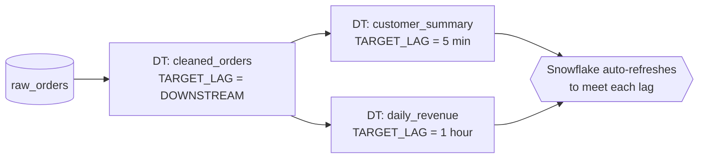

# Dynamic Tables

> Declarative transformation objects where you define the target query and Snowflake keeps the result fresh. Consultant lens: the declarative ELT pipeline builder that sits between Materialized Views (too limited) and Streams + Tasks (powerful but hand-built).

## Executive Summary

- **What it is:** A table whose contents are defined by a `SELECT`, which Snowflake **automatically refreshes** to stay within a freshness target you set.
- **Why it matters:** You declare the *result* you want, not the *how* — no streams, tasks, schedules, or merge logic to hand-code. Snowflake also infers the refresh **DAG** when tables are chained.
- **Mental model:** Declarative. Streams + Tasks = you write the *how*; Dynamic Tables = you write the *what* and Snowflake manages timing.
- **Best used when:** Declarative SQL transforms (filters, projections, joins, aggregations) on small-to-moderate data, chained multi-layer models, and cases that reliably qualify for **incremental refresh**.
- **Avoid or reconsider when:** You need procedural logic (use Tasks), your SQL forces **full refresh** (e.g. window-function dedup), or the base table is so large a full refresh would be ruinous.

## What It Can Do

- Maintain a query result automatically to meet a freshness target (`TARGET_LAG`).
- **Join multiple tables** and do aggregations declaratively (unlike Materialized Views).
- Refresh **incrementally** — recompute only rows affected by source changes — when the query qualifies.
- **Chain** on top of other Dynamic Tables; Snowflake builds and orders the refresh DAG automatically.
- Use `TARGET_LAG = DOWNSTREAM` so intermediate tables refresh lazily, only when a downstream consumer needs fresh data.
- Run on a user warehouse or serverless compute.

## What It Cannot Do

- **No procedural logic** — no stored procs, branching, or multi-step imperative flow (that's Tasks).
- **No arbitrary side effects** — it produces a table from one query, nothing else.
- **Cannot always refresh incrementally** — window functions, some non-deterministic functions, and complex constructs force a **full refresh**.
- Not free — refreshes consume credits; a tight `TARGET_LAG` on a big table gets expensive.

## Core Concepts

| Concept | Meaning | Why it matters |
|---|---|---|
| Declarative definition | You write the target `SELECT`, not the orchestration | Far less code than Streams + Tasks |
| `TARGET_LAG` | How stale the data is allowed to be (e.g. `'5 minutes'`) | The freshness **and cost** dial; you manage outcome, not schedule |
| `TARGET_LAG = DOWNSTREAM` | Refresh only when a dependent needs fresh data | Avoids paying to refresh data nobody reads yet |
| Incremental refresh | Recompute only changed rows | Cheap and fast; the desired path |
| Full refresh | Recompute the entire result | Expensive; the failure mode to avoid at scale |
| Refresh DAG | Auto-inferred dependency graph across chained DTs | Snowflake orders refreshes for you |

## How It Works

1. You `CREATE DYNAMIC TABLE` with a `SELECT`, a `TARGET_LAG`, and a warehouse (or serverless).
2. Snowflake tracks changes on the source tables (managed change-tracking you never see).
3. To meet `TARGET_LAG`, Snowflake schedules refreshes itself — you don't set a cron.
4. Each refresh is **incremental** when the query qualifies; otherwise it falls back to a **full refresh**.
5. If the DT depends on other DTs, Snowflake infers the **DAG** and refreshes in dependency order.
6. `DOWNSTREAM` lag lets intermediate layers stay lazy until a consumer forces freshness.

## Visuals



## Readable Snippets

```sql
-- Declarative pipeline: the whole thing is one object
CREATE DYNAMIC TABLE customer_summary
  TARGET_LAG = '5 minutes'
  WAREHOUSE  = transform_wh
  AS
    SELECT customer_id,
           COUNT(*)    AS orders,
           SUM(amount) AS lifetime_value
    FROM orders
    GROUP BY customer_id;

-- Lazy intermediate layer: only refresh when a downstream DT needs it
CREATE DYNAMIC TABLE cleaned_orders
  TARGET_LAG = DOWNSTREAM
  WAREHOUSE  = transform_wh
  AS SELECT * FROM raw_orders WHERE is_valid;

-- Inspect refresh behaviour (is it going incremental or full?)
SHOW DYNAMIC TABLES;
SELECT * FROM TABLE(INFORMATION_SCHEMA.DYNAMIC_TABLE_REFRESH_HISTORY());
```

## Consultant Talking Points

- **Client question this answers:** "How do we build maintained, always-fresh transformation layers without orchestrating streams, tasks, and merges ourselves?"
- **Trade-offs to mention:** Declarative simplicity and self-managing DAG vs. less control over physical layout and refresh. Default to Dynamic Tables for straightforward declarative transforms; reach for Streams + Tasks when you need procedural logic or fine control.
- **Risk or governance angle:** Fewer objects than a stream + task + merge stack — fewer failure points, easier to reason about. But watch for silent **full refreshes** that change cost behaviour overnight.
- **Cost/performance angle:** `TARGET_LAG` is the cost dial — looser lag = fewer refreshes = lower cost. Use `DOWNSTREAM` on intermediate tables. A full-refresh fallback on a huge base table is the budget killer.
- **vs dbt:** dbt is *build-time* (generates SQL, runs on an orchestrated schedule); Dynamic Tables are *runtime* (Snowflake maintains freshness natively). They can complement — dbt can even manage Dynamic Tables.

## Common Pitfalls

- **Too-tight `TARGET_LAG`** → constant refreshes and runaway cost; set lag to real business need, not "as fresh as possible."
- **Accidental full refresh** → a window function or non-deterministic construct silently forces full recompute every refresh; watch the refresh history.
- **Window-function dedup at scale** → `QUALIFY ROW_NUMBER()` is elegant but tends to disqualify incremental refresh — dangerous on billions of rows (prefer Streams + Tasks + `MERGE` there).
- **Treating them as procedural** → trying to cram multi-step / stored-proc logic in; that's a Tasks job.
- **Forgetting compute** → unless serverless, they need a warehouse and consume credits even when idle-checking.

## When to Recommend What (Decision Table)

| Situation | Recommend | Why | Watch-outs |
|---|---|---|---|
| Declarative transform, small/moderate data | **Dynamic Table** | Least code, self-managing DAG | Confirm incremental refresh qualifies |
| Chained multi-layer models | **Dynamic Table** + `DOWNSTREAM` | Auto DAG, lazy intermediates | Lag propagates from the consumer |
| Speed up one heavy single-table query | Materialized View | Auto-maintained, simplest | Single table only, very limited SQL |
| Window-function dedup on huge tables | **Streams + Tasks** + `MERGE` | Avoids full-refresh cliff; process-once | Dedup source before MERGE |
| Append-only events + dimension join | **Streams + Tasks** | As-of enrichment; no retro rewrites | DT may propagate dim changes |
| Procedural / multi-step / stored procs | **Tasks** | Full imperative control | More objects to maintain |

## Related Topics

- [[01 Snowflake/04 Data Engineering/Data Engineering Overview]]
- [[01 Snowflake/04 Data Engineering/20 Streams and Tasks]]
- [[01 Snowflake/02 Performance and Optimization/07 Materialized Views]]
- [[01 Snowflake/04 Data Engineering/25 dbt on Snowflake]]

## Related Decision Notes

- [[80 Comparisons and Decision Notes/Comparisons/Snowflake/Comparison - Streams and Tasks vs Dynamic Tables]]
- [[80 Comparisons and Decision Notes/Comparisons/Snowflake/Comparison - Materialized Views vs Dynamic Tables]]

## Questions

- Which window functions (if any) currently qualify for incremental refresh — and how do you verify per query?
- Where is the practical break-even point in table size where a periodic full refresh stops being affordable?

## Sources To Revisit

- [Snowflake Docs: Dynamic Tables overview](https://docs.snowflake.com/en/user-guide/dynamic-tables-about)
- [Snowflake Docs: CREATE DYNAMIC TABLE](https://docs.snowflake.com/en/sql-reference/sql/create-dynamic-table)
- [Snowflake Docs: Dynamic Tables refresh (incremental vs full, supported queries)](https://docs.snowflake.com/en/user-guide/dynamic-tables-refresh)
- [Snowflake Docs: Understanding Dynamic Tables cost](https://docs.snowflake.com/en/user-guide/dynamic-tables-cost)


