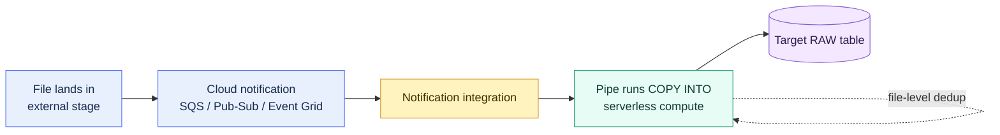

# Snowpipe

> [!abstract] Consultant lens
> **What it is:** Event-driven, file-based ingestion: `COPY INTO` wrapped in a persistent pipe that runs when files land.
>
> **Why it matters:** Snowpipe is the standard way to load files into Snowflake within seconds of arrival, without scheduling.

## Executive Summary

- **What it is:** A **pipe** object that runs a `COPY INTO` automatically when new files arrive in a stage — continuous, file-based micro-batch ingestion.
- **Why it matters:** Turns the manual `COPY INTO` of chapter 19 into a hands-off, near-real-time loader for files already landing in cloud storage.
- **Mental model:** Snowpipe = event-driven `COPY INTO`. Same engine as bulk loading, just triggered by file-arrival notifications instead of you.
- **Best used when:** Files arrive continuously in S3/Azure/GCS and you want them loaded within seconds to ~a minute, without managing a warehouse or schedule.
- **Avoid or reconsider when:** You need sub-second row-level streaming (use **Snowpipe Streaming**, ch. 23) or you only load occasional bulk batches (plain `COPY INTO` is simpler).

## What It Can Do

- Auto-load files via cloud **event notifications** (`auto_ingest=true`) or a **REST API** trigger.
- Run on **serverless** Snowflake-managed compute — no warehouse to size or run.
- Apply **transforming `COPY`** — `COPY INTO ... FROM (SELECT ... FROM @stage)` to reshape/cast/enrich during load (e.g. add `METADATA$FILENAME`).
- Provide **file-level** idempotency — won't reload a file it already loaded (pipe load history ~14 days).
- Auto-scale with file volume; no concurrency tuning.

## What It Cannot Do

- **Not row-level / sub-second** — the unit of ingestion is a **file**; true streaming is Snowpipe Streaming (ch. 23).
- **No row-level dedup** — two different files with the same record both load; deduplicate downstream (Streams + Tasks + `MERGE`).
- **No procedural logic** — it's a `COPY`, not a pipeline; orchestration/transform beyond the COPY belongs in Tasks/Dynamic Tables.
- **Cannot run on your warehouse** — serverless only (billed separately).

## Core Concepts

| Concept | Meaning | Why it matters |
|---|---|---|
| Pipe | Object wrapping a `COPY INTO` statement | The persistent, reusable unit of auto-ingestion |
| `auto_ingest=true` | Cloud notifications trigger the pipe | The production default for bucket-based loads |
| Notification integration | Routes S3/SQS, GCS/Pub-Sub, Azure/Event Grid events to Snowflake | Required for auto-ingest |
| Serverless compute | Snowflake-managed compute for the load | No warehouse; billed as Snowpipe credits |
| Pipe load metadata | Tracks loaded files (~14 days) | File-level dedup; not row-level |
| `ON_ERROR` default = `SKIP_FILE` | A bad record skips the **whole file** | Silent-data-loss risk — make it explicit |

## How It Works (Simple Flow)

1. A file lands in an **external stage** (S3 / Azure / GCS).
2. The cloud provider emits an **event notification** (S3→SNS/SQS, GCS→Pub/Sub, Azure→Event Grid).
3. A **notification integration** routes that event to Snowflake.
4. The **pipe** runs its `COPY INTO` against the new file on **serverless** compute.
5. Rows land in the target table within seconds to ~a minute.
6. Snowflake records the file in **pipe load history** so it isn't reloaded.
7. You monitor health with `SYSTEM$PIPE_STATUS` and `COPY_HISTORY`.

## Visuals



## Readable Snippets

```sql
-- Auto-ingest pipe: COPY INTO that fires on file arrival
CREATE OR REPLACE PIPE raw.gcs_events_pipe
  AUTO_INGEST = TRUE
  INTEGRATION = 'GCS_NOTIFICATION_INT'
AS
  COPY INTO raw_events (payload, file_name, file_row, load_time)
  FROM (
    SELECT
      $1,
      METADATA$FILENAME,
      METADATA$FILE_ROW_NUMBER,
      CURRENT_TIMESTAMP()
    FROM @gcs_events_stage
  )
  FILE_FORMAT = (TYPE = 'JSON')
  ON_ERROR = 'CONTINUE';   -- explicit: don't silently skip whole files

-- Health & history
SELECT SYSTEM$PIPE_STATUS('raw.gcs_events_pipe');     -- pendingFileCount, executionState
SELECT * FROM TABLE(INFORMATION_SCHEMA.COPY_HISTORY(
  TABLE_NAME => 'RAW_EVENTS',
  START_TIME => DATEADD('day', -1, CURRENT_TIMESTAMP())));

-- If files were missed / for backfill
ALTER PIPE raw.gcs_events_pipe REFRESH;
```

## Consultant Talking Points

- **Client question this answers:** "Files keep landing in our bucket — how do we get them into Snowflake automatically and quickly?"
- **Trade-offs to mention:** Snowpipe vs manual `COPY` = continuous/event-driven vs scheduled/bulk (same engine). Snowpipe vs Snowpipe Streaming = files + seconds vs rows + sub-second.
- **Risk or governance angle:** Default `ON_ERROR = SKIP_FILE` silently drops a whole file on one bad record — make it explicit and monitor `SYSTEM$PIPE_STATUS`. Use a storage + notification integration (no secrets in SQL).
- **Cost/performance angle:** Serverless (no warehouse to manage), billed as Snowpipe credits. Per-file overhead means **tiny files are expensive** — aim for reasonably sized files; very high-frequency tiny payloads favor Snowpipe Streaming.

## Common Pitfalls

- **Relying on the silent `SKIP_FILE` default** → undetected data loss; set `ON_ERROR` deliberately and alert on pipe errors.
- **Too many tiny files** → per-file overhead inflates cost and latency (the small-files problem from ch. 19).
- **Expecting row-level dedup** → Snowpipe dedups *files*, not rows; duplicate records across files still load. Dedup downstream.
- **No monitoring** → a stalled pipe (bad notification wiring, permissions) silently stops loading; watch `pendingFileCount`.
- **Forgetting backfill** → files that arrived while notifications were broken need `ALTER PIPE ... REFRESH`.

## When to Recommend What (Decision Table)

| Situation | Recommend | Why | Watch-outs |
|---|---|---|---|
| Files arrive continuously in a bucket | **Snowpipe (auto-ingest)** | Hands-off, near-real-time, serverless | `ON_ERROR` default, file sizing |
| Occasional bulk loads | Manual `COPY INTO` (ch. 19) | Simpler, full control | You manage scheduling |
| Sub-second row streaming / Kafka | **Snowpipe Streaming** (ch. 23) | No files, lower latency, cheaper at high frequency | Needs SDK/connector |
| Can't wire cloud notifications | Snowpipe **REST API** trigger | App controls file list | More client-side code |
| Row-level dedup needed | Snowpipe **+ Streams + Tasks** | Pipe lands raw; MERGE dedups | Dedup is a downstream step |

## Related Topics

- [[01 Snowflake/04 Data Engineering/Data Engineering Overview]]
- [[01 Snowflake/04 Data Engineering/19 Stages and Data Loading]]
- [[01 Snowflake/04 Data Engineering/23 Snowpipe Streaming]]
- [[01 Snowflake/04 Data Engineering/20 Streams and Tasks]]

## Related Decision Notes

- [[80 Comparisons and Decision Notes/Decision Notes/Snowflake/Decisions - Choosing a Snowflake Ingestion Method]]

## Questions

- When does the per-file cost of Snowpipe justify moving to Snowpipe Streaming?
- Best practice for sizing/batching upstream files to balance latency vs per-file overhead?

## Sources To Revisit

- [Snowflake Docs: Introduction to Snowpipe](https://docs.snowflake.com/en/user-guide/data-load-snowpipe-intro)
- [Snowflake Docs: Automating Snowpipe (auto-ingest)](https://docs.snowflake.com/en/user-guide/data-load-snowpipe-auto)
- [Snowflake Docs: CREATE PIPE](https://docs.snowflake.com/en/sql-reference/sql/create-pipe)
- [Snowflake Docs: SYSTEM$PIPE_STATUS](https://docs.snowflake.com/en/sql-reference/functions/system_pipe_status)
