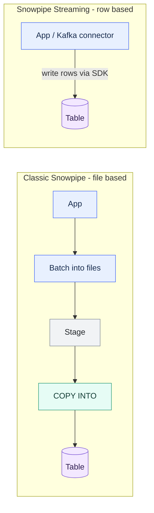

# Snowpipe Streaming

> [!abstract] Consultant lens
> **What it is:** Row-based, low-latency ingestion through a write API—no files, stage, or `COPY`.
>
> **Why it matters:** It supports event streams and Kafka when classic Snowpipe's per-file model is too slow or costly.

## Executive Summary

- **What it is:** A direct write API (SDK / connectors) that ingests **rows** into Snowflake in seconds or less, bypassing files and `COPY INTO`.
- **Why it matters:** Removes the "a file" latency floor of classic Snowpipe for genuine streaming workloads (Kafka, IoT, clickstream).
- **Mental model:** Classic Snowpipe's smallest unit is a **file**; Snowpipe Streaming's smallest unit is a **row**. That one difference drives latency, cost, and setup.
- **Best used when:** Sub-second latency is needed, high-frequency small payloads make per-file cost hurt, or the source is already row-oriented streaming (Kafka).
- **Avoid or reconsider when:** Data already arrives as files in a bucket and seconds-to-a-minute latency is fine (classic Snowpipe is simpler and declarative).

## What It Can Do

- Ingest **rows directly** via the Snowpipe Streaming SDK (Java client) or a connector — no staging.
- Make rows **queryable in seconds or sub-second**.
- Provide **exactly-once, ordered** ingestion **per channel** via offset tokens.
- Power the **Snowflake Kafka Connector** in streaming mode (topics → tables, low latency).
- Avoid the small-files problem and per-file cost of classic Snowpipe.

## What It Cannot Do

- **Not declarative** — it's a client application / connector (code), not a drop-in `PIPE` object.
- **Not for file-based batch** — if data already lands as files, classic Snowpipe is the right, simpler tool.
- **Not a transformation layer** — it lands raw rows; dedup/transform still happens downstream (Streams + Tasks / Dynamic Tables).
- **Ordering is per channel only** — global ordering across channels is not guaranteed.

## Core Concepts

| Concept | Meaning | Why it matters |
|---|---|---|
| Channel | A logical streaming connection from one client to one table | Unit of parallelism and ordering; rows ordered *within* a channel |
| Offset token | Per-channel marker of the last committed row | Enables exactly-once and clean resume after failure |
| SDK / client | Java client (or connector) that writes rows | This is **code**, unlike a declarative pipe |
| Rows, not files | Rows committed directly | No stage, no file format, no `COPY` |
| Kafka Connector (streaming mode) | Managed path from Kafka topics to tables | The most common real-world usage |

## How It Works (Simple Flow)

1. A client app or connector uses the **SDK** to open a **channel** to a target table.
2. It pushes **rows** directly into the channel — no file, no stage.
3. Snowflake buffers and commits the rows, making them queryable in seconds or less.
4. Each channel tracks an **offset token** — the bookmark of what's durably committed.
5. On failure/restart, the client reads the last committed offset and resumes.
6. Result: **exactly-once, ordered** ingestion per channel.

## Visuals



## Readable Snippets

```text
-- Snowpipe Streaming is driven by a client SDK / connector, not SQL.
-- Conceptual shape of the Java client:
--   client  -> open channel to DB.SCHEMA.TABLE
--   channel -> insertRows(rows, offsetToken)
--   channel -> getLatestCommittedOffsetToken()  // resume point
-- Or, far more common, configure the Snowflake Kafka Connector in
-- "snowflake.ingestion.method = SNOWPIPE_STREAMING" mode.
```

## Consultant Talking Points

- **Client question this answers:** "We have a high-frequency event stream (Kafka/IoT) — how do we get it into Snowflake in real time without drowning in tiny files?"
- **Trade-offs to mention:** Rows + sub-second + code/connector vs classic Snowpipe's files + seconds + declarative pipe. Choose streaming when "a file" is the wrong unit.
- **Risk or governance angle:** It's an application to operate (client/connector lifecycle, offsets, monitoring) — more moving parts than a declarative pipe. Ordering guarantees are per channel.
- **Cost/performance angle:** Billed on **client ingestion throughput** with **no per-file fee**, so for thousands of small rows/sec it's typically *cheaper and faster* than classic Snowpipe — cost and latency point the same way.

## Common Pitfalls

- **Using it when files already arrive in a bucket** — adds an SDK/connector for no benefit; classic Snowpipe is simpler.
- **Expecting global ordering** — ordering and exactly-once are guaranteed **per channel**, not across channels.
- **Treating it as a transform layer** — it only lands raw rows; dedup/cleanup is still downstream (Streams + Tasks + `MERGE`).
- **Underestimating operational ownership** — a client/connector app must be deployed, monitored, and recovered (offset handling), unlike a fire-and-forget pipe.

## When to Recommend What (Decision Table)

| Situation | Recommend | Why | Watch-outs |
|---|---|---|---|
| Sub-second latency required | **Snowpipe Streaming** | No file batching delay | Operate a client/connector |
| High-frequency tiny payloads | **Snowpipe Streaming** | No per-file overhead | Throughput-based billing |
| Source is already Kafka | **Kafka Connector (streaming mode)** | Near drop-in topic → table | Connector config/ops |
| Files already land in a bucket | Classic **Snowpipe** (ch. 22) | Declarative, simpler | Per-file cost, `SKIP_FILE` default |
| Occasional bulk file loads | Manual `COPY INTO` (ch. 19) | Simplest, full control | You schedule it |

## Related Topics

- [[01 Snowflake/04 Data Engineering/Data Engineering Overview]]
- [[01 Snowflake/04 Data Engineering/22 Snowpipe]]
- [[01 Snowflake/04 Data Engineering/20 Streams and Tasks]]
- [[03 Fivetran/Fivetran Learning Map]]

## Related Decision Notes

- [[80 Comparisons and Decision Notes/Decision Notes/Snowflake/Decisions - Choosing a Snowflake Ingestion Method]]

## Questions

- What throughput / latency thresholds make the per-file cost of classic Snowpipe clearly worse than streaming?
- How many channels / what partitioning is appropriate for a given Kafka topic layout?

## Sources To Revisit

- [Snowflake Docs: Snowpipe Streaming overview](https://docs.snowflake.com/en/user-guide/data-load-snowpipe-streaming-overview)
- [Snowflake Docs: Snowpipe Streaming best practices](https://docs.snowflake.com/en/user-guide/data-load-snowpipe-streaming-recommendation)
- [Snowflake Docs: Kafka Connector with Snowpipe Streaming](https://docs.snowflake.com/en/user-guide/kafka-connector-overview)
