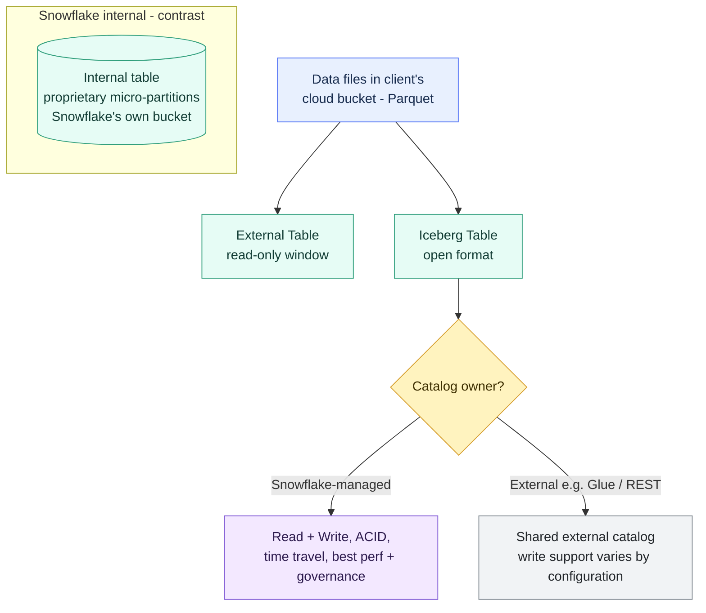

# External Tables and Iceberg

> [!abstract] Consultant lens
> **What it is:** Two ways to query or manage data in cloud object storage instead of Snowflake-managed storage.
>
> **Why it matters:** They answer "can we avoid copying our whole data lake into Snowflake?" Iceberg is the modern open-format direction.

## Executive Summary

- **What it is:** Table types that let Snowflake read (external tables) or read **and write** (Iceberg tables) data sitting in your own cloud bucket (S3 / Azure / GCS), rather than in Snowflake's proprietary internal storage.
- **Why it matters:** Lets clients keep one copy of data in their own lake — avoiding duplication, reducing lock-in, and letting other engines (Spark, Trino, Databricks) share the same tables.
- **Mental model:** Internal = a locked vault Snowflake controls. External table = a read-only window onto your bucket. Iceberg = your bucket, in an open format, that Snowflake can treat almost like a native table.
- **Best used when:** The lake must stay the source of truth, data is shared across engines, or duplication/lock-in is a real client concern.
- **Avoid or reconsider when:** Snowflake is the hub and you want best performance, full governance, and simplicity — then just load into internal tables.

## What It Can Do

- **External tables:** query files (Parquet, JSON, CSV, etc.) **in place** without loading them; `AUTO_REFRESH` keeps the file list current via cloud notifications; build **materialized views** over them to claw back performance.
- **Iceberg tables:** full **read/write** with ACID transactions (INSERT/UPDATE/DELETE/MERGE), **schema evolution**, and **time travel** via Iceberg snapshots — data stays in the client's bucket in open Apache Iceberg format.
- **Iceberg, Snowflake-managed catalog:** near-internal performance and full Snowflake governance (RBAC, masking, tagging) while files stay external.
- **Iceberg, external catalog (e.g. AWS Glue / Iceberg REST):** Snowflake reads tables owned by an external catalog; supported REST catalog configurations can also accept Snowflake writes.
- Both keep storage in the **customer's** bucket, so there's a single physical copy of the data.

## What It Cannot Do

- **External tables are read-only** — no INSERT/UPDATE/DELETE, no ACID, no time travel.
- External tables have **slower query performance** than internal (no micro-partition pruning unless you add partitioning + materialized views).
- **External-catalog write support is configuration-dependent** — supported Iceberg REST catalog configurations can be writable from Snowflake, while other externally managed patterns remain read-only or provide more limited platform support.
- Neither gives you the full simplicity of internal tables; both add setup (external volume, catalog, notifications) and moving parts.
- Iceberg is **not** a magic "no lock-in, no cost" button — you still pay Snowflake compute, and misused catalogs cause governance gaps.

## Core Concepts

| Concept | Meaning | Why it matters |
|---|---|---|
| Internal storage | Snowflake's own buckets, proprietary micro-partition format | Default; fastest and most governed, but a closed copy |
| External table | Read-only table over files in your bucket | Query the lake in place; no duplication, no writes |
| Iceberg table | Open-format (Apache Iceberg) table in your bucket | Read/write, ACID, time travel, multi-engine |
| Catalog | The metadata layer: which files, schema, snapshots, transactions | Turns loose Parquet files into a real table; **whoever owns it can write** |
| Snowflake-managed catalog | `CATALOG='SNOWFLAKE'` — Snowflake owns metadata | Best performance + governance + write access |
| External catalog | Glue / Iceberg REST owns metadata; Snowflake connects through a catalog integration | Fits when another platform owns the catalog; supported REST configurations can allow Snowflake writes |
| External volume | Named object pointing at the bucket + credentials | Where Iceberg data physically lives |

## How It Works (Simple Flow)

1. Data files (usually **Parquet**) already sit in the client's cloud bucket, or are written there by Snowflake/another engine.
2. You define an **external volume** so Snowflake knows the bucket and how to authenticate (integration, not inline secrets).
3. **External table:** point a table at a stage/location; `AUTO_REFRESH` uses cloud notifications to keep the file list current. Queries scan files at read time.
4. **Iceberg table:** choose a **catalog** — Snowflake-managed for full platform support, or external when another platform owns the catalog; verify whether the chosen external configuration supports Snowflake writes.
5. The **catalog** tracks which files make up the current table, the schema, and each snapshot, giving ACID + time travel.
6. Snowflake compute runs queries against the external files; performance depends on format, partitioning, and (for external tables) any materialized views layered on top.
7. Governance (RBAC, masking, tags) applies best when Snowflake owns the metadata (internal or Snowflake-managed Iceberg).

## Visuals



## Readable Snippets

```sql
-- External table: read files in place (read-only)
CREATE EXTERNAL TABLE ext_sales
  LOCATION = @my_stage
  AUTO_REFRESH = TRUE
  FILE_FORMAT = (TYPE = PARQUET);

-- External volume: where Iceberg data lives
CREATE EXTERNAL VOLUME my_vol
  STORAGE_LOCATIONS = (
    (NAME = 'gcs', STORAGE_PROVIDER = 'GCS',
     STORAGE_BASE_URL = 'gcs://my-bucket/iceberg/')
  );

-- Iceberg, Snowflake-managed catalog: writable, near-internal performance
CREATE ICEBERG TABLE sales
  CATALOG = 'SNOWFLAKE'
  EXTERNAL_VOLUME = 'my_vol'
  BASE_LOCATION = 'sales/';

-- Iceberg connected to an external catalog (Glue example).
-- Verify write support for the exact catalog integration and table configuration.
CREATE ICEBERG TABLE sales_ext
  CATALOG = 'my_glue_catalog_int'
  EXTERNAL_VOLUME = 'my_vol'
  CATALOG_TABLE_NAME = 'sales';
```

## Consultant Talking Points

- **Client question this answers:** "We have a big data lake in S3/GCS — can Snowflake use it without us copying everything in twice?"
- **Trade-offs to mention:** External tables = cheap, read-only, occasional queries. Iceberg = open format + ACID + write, near-internal speed, more setup. Internal = fastest and simplest but a closed, duplicated copy.
- **Risk or governance angle:** Governance and lifecycle ownership are simplest when Snowflake owns the catalog. With an external catalog, confirm which engine owns maintenance, retention, write coordination, and access-policy enforcement.
- **Cost/performance angle:** External tables can be slow and scan-heavy; layer partitioning + materialized views. Iceberg avoids a second storage copy but you still pay Snowflake compute. Small-files problems from ch. 19 still apply.

## Common Pitfalls

- **Assuming "on GCP" means tables live in the client's bucket** — normal internal tables live in *Snowflake's* proprietary buckets; only external/Iceberg use the client's bucket.
- **Using external tables for a workload that needs writes or freshness** — they're read-only; reach for Iceberg or internal.
- **Assuming all external-catalog configurations behave alike** — write support, lifecycle management, and platform features vary; validate the exact REST catalog, credentials, table version, and integration pattern.
- **Ignoring performance tuning on external tables** — no pruning by default; unpartitioned lakes scan everything and cost more.
- **Treating Iceberg as "free / zero lock-in"** — you still pay compute, and a poorly governed external catalog creates security blind spots.
- **Too many tiny files** — inflates scan cost and metadata overhead, same as bulk loading.

## When to Recommend What (Decision Table)

| Situation | Recommend | Why | Watch-outs |
|---|---|---|---|
| Lake is source of truth, multi-engine, avoid duplication | **Iceberg (Snowflake-managed)** | Open format, ACID, near-internal perf, writable | Setup: external volume + catalog |
| Another engine (Spark/Trino) already owns the tables | **Iceberg (external catalog)** | Snowflake participates in shared open tables | Confirm write support, ownership, and governance for the exact configuration |
| Cheap, occasional reads of dumped files, no writes | **External tables** | Simplest way to query the lake in place | Slow; add partitioning/materialized views |
| Snowflake is the hub, want best perf + governance | **Internal tables** | Fastest, fully governed, simplest | A second, closed copy of the data |
| Worried about vendor lock-in | **Iceberg (open format)** | Data readable by other engines if they leave | Still pay SF compute; governance nuance |

## Related Topics

- [[01 Snowflake/04 Data Engineering/Data Engineering Overview]]
- [[01 Snowflake/04 Data Engineering/19 Stages and Data Loading]]
- [[01 Snowflake/01 Core Architecture and Concepts/02 Micro-partitions and Clustering]]
- [[01 Snowflake/02 Performance and Optimization/07 Materialized Views]]

## Related Decision Notes

- [[80 Comparisons and Decision Notes/Comparisons/Snowflake/Comparison - External Tables vs Iceberg Tables]]

## Questions

- When does the setup overhead of Iceberg beat just loading into internal tables?
- Which governance and lifecycle responsibilities remain outside Snowflake when an external catalog owns the table?
- What partitioning strategy makes external tables performant enough to avoid materialized views?

## Sources To Revisit

- [Snowflake Docs: Introduction to external tables](https://docs.snowflake.com/en/user-guide/tables-external-intro)
- [Snowflake Docs: Apache Iceberg tables](https://docs.snowflake.com/en/user-guide/tables-iceberg)
- [Snowflake Docs: External volumes for Iceberg](https://docs.snowflake.com/en/user-guide/tables-iceberg-configure-external-volume)
- [Snowflake Docs: Write support for externally managed Iceberg tables](https://docs.snowflake.com/en/user-guide/tables-iceberg-externally-managed-writes)
- [Apache Iceberg: Table spec & catalogs](https://iceberg.apache.org/spec/)
