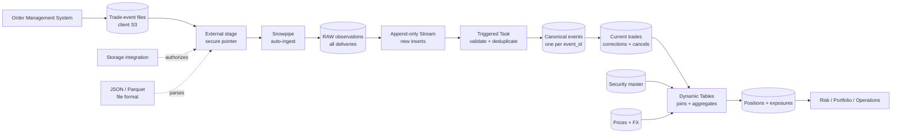
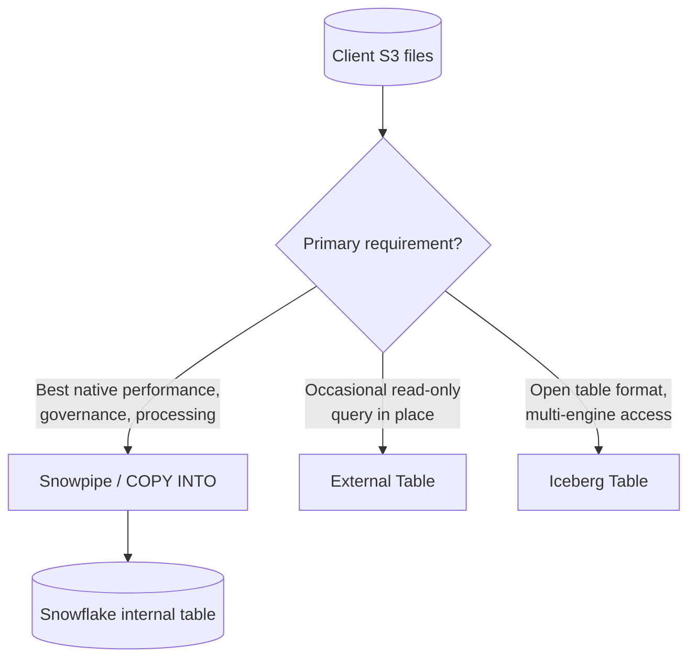

# Bonus Chapter: Data from A-Z

> An end-to-end investment trade pipeline that connects stages, Snowpipe, Streams and Tasks, Dynamic Tables, Snowpipe Streaming, External Tables, and Iceberg. Consultant lens: preserve every source event, construct reliable current trade state, and publish governed positions and exposures.

## Executive Summary

- **What it is:** A reference pipeline that follows trade events from files in a client-owned S3 bucket to governed positions and market exposures in Snowflake.
- **Why it matters:** Clients experience a pipeline as one operating system, not as isolated Snowflake features. A consultant must understand each boundary, ownership decision, and failure mode.
- **Mental model:** **Land -> ingest -> preserve -> detect -> reconcile -> curate -> consume.** Raw is the evidence, canonical events remove delivery duplication, current state applies business semantics, and curated tables answer investment questions.
- **Best used when:** Files arrive continuously from an Order Management System (OMS), intraday freshness matters, corrections and duplicate deliveries occur, and audit lineage must survive downstream processing.
- **Avoid or reconsider when:** The source is already a row stream (consider Snowpipe Streaming), the lake must remain the shared physical source of truth (consider Iceberg), or occasional read-only access does not justify copying files into Snowflake (consider External Tables).

## What It Can Do

- Securely ingest trade-event files from client-owned S3 without credentials in SQL.
- Preserve source payloads and file-level lineage for replay, reconciliation, and investigation.
- Absorb duplicate delivery of the same source event without double-counting positions.
- Apply explicit correction and cancellation logic to create current trade state.
- Maintain positions and exposures by joining trades to security-master, price, and FX data.
- Separate operational evidence from business state and consumer-facing analytics.
- Provide clear monitoring boundaries from S3 arrival to dashboard freshness.

## What It Cannot Do

- Make an unreliable source reliable without stable event identifiers, versions, or agreed business rules.
- Decide whether a repeated record is a duplicate, correction, or valid snapshot observation without understanding the source feed contract.
- Replace reconciliation with custodians, accounting platforms, or other books of record.
- Turn Snowflake Time Travel into a durable regulatory history model; required point-in-time history must be modeled deliberately.
- Avoid a physical copy when Snowpipe loads staged files into a normal Snowflake table.
- Guarantee that a Dynamic Table always meets its target lag; target lag is a freshness objective.

## Core Concepts

| Concept | Meaning | Why it matters |
|---|---|---|
| External stage | A Snowflake object pointing to files in the client's S3 bucket | The files remain in client-owned storage; the stage is a secure pointer, not another file store |
| Internal stage | Snowflake-managed storage for staged files | Useful when no external landing zone exists; staged files are normally temporary after a verified load |
| `$1` | The first parsed field in a staged record; for JSON this is normally the whole object as `VARIANT` | Lets `COPY INTO` preserve the source document or extract individual properties |
| File metadata | `METADATA$FILENAME` and `METADATA$FILE_ROW_NUMBER` | Locates a raw observation in its source file for lineage and reconciliation |
| Raw observation | One record exactly as delivered, plus ingestion metadata | Preserves source truth, including duplicate and malformed behavior |
| Canonical event | One accepted representation of a unique source event | Prevents repeated delivery from producing repeated financial effects |
| Current trade state | Latest valid interpretation of an execution after corrections and cancellations | The state used to calculate positions; it is not the full event history |
| Stream | An offset over table changes, not a second table of copied rows | Exposes newly inserted raw observations and advances on committed consuming DML |
| Task | Procedural processing triggered by new Stream data or a schedule | Fits validation, quarantine, deduplication, and explicit `MERGE` logic |
| Dynamic Table | A materialized query result maintained toward a target lag | Fits declarative position and exposure transformations |
| Idempotency | Reprocessing the same event has the same financial result as processing it once | Makes the pipeline robust to source retries and repeated files |

## How It Works (Simple Flow)

1. **Land:** The OMS writes JSON or Parquet trade-event files to a controlled S3 prefix.
2. **Ingest:** An external stage, storage integration, and file format let Snowpipe load new files into `RAW.TRADE_EVENTS`.
3. **Preserve:** Raw retains every delivery with `loaded_at`, source filename, and source row number. Five delivered copies remain five raw observations.
4. **Detect:** An append-only Stream exposes newly inserted raw observations without rescanning the whole raw table.
5. **Canonicalize:** A triggered Task collapses duplicates within the incoming batch, then merges by `event_id` so duplicates arriving days later are also absorbed.
6. **Reconcile business state:** A second logical step applies event version, correction, and cancellation rules to maintain one current row per execution.
7. **Curate:** Dynamic Tables join current trades with security-master, price, and FX data to maintain positions and exposures.
8. **Consume and control:** Risk, portfolio, and operations users query governed outputs while monitoring and reconciliation check every upstream boundary.

## Visuals



### The intentional-copy decision



Loading through Snowpipe creates an intentional second physical representation: source files remain in S3 while parsed rows live in Snowflake-managed table storage. The copy buys native performance, governance, stable processing, and independence from later file changes. Avoiding duplication is a design option, not an absolute rule.

## Readable Snippets

### 1. Stage and preserve raw lineage

```sql
CREATE FILE FORMAT raw.trade_json_format
  TYPE = JSON;

CREATE STAGE raw.trade_stage
  URL = 's3://investment-data/trades/'
  STORAGE_INTEGRATION = investment_s3_int
  FILE_FORMAT = raw.trade_json_format;

CREATE TABLE raw.trade_events (
    payload           VARIANT,
    source_file       VARCHAR,
    source_row_number NUMBER,
    loaded_at         TIMESTAMP_LTZ
);

CREATE PIPE raw.trade_events_pipe
  AUTO_INGEST = TRUE
AS
COPY INTO raw.trade_events
FROM (
    SELECT
        $1,
        METADATA$FILENAME,
        METADATA$FILE_ROW_NUMBER,
        CURRENT_TIMESTAMP()
    FROM @raw.trade_stage
);
```

For JSON, `$1` is normally the complete parsed object. The filename and row number describe where the observation came from; they do not determine which business version wins.

### 2. Expose new raw observations

```sql
CREATE STREAM raw.trade_events_stream
  ON TABLE raw.trade_events
  APPEND_ONLY = TRUE;
```

Snowpipe prevents accidental reload of the same file through file-load metadata. It does **not** detect the same business event in different files. Both rows enter raw and are exposed by the Stream.

### 3. Collapse same-batch duplicates before the merge

```sql
SELECT
    payload:event_id::VARCHAR     AS event_id,
    payload:execution_id::VARCHAR AS execution_id,
    payload:event_type::VARCHAR   AS event_type,
    payload:event_version::NUMBER AS event_version,
    payload,
    HASH(payload)                  AS payload_hash,
    source_file,
    source_row_number,
    loaded_at,
    COUNT(*) OVER (
        PARTITION BY payload:event_id::VARCHAR
    ) AS batch_occurrences
FROM raw.trade_events_stream
QUALIFY ROW_NUMBER() OVER (
    PARTITION BY payload:event_id::VARCHAR
    ORDER BY loaded_at, source_file, source_row_number
) = 1;
```

The batch must contain at most one source row per merge key. Cross-batch duplicates are then absorbed against the persistent canonical target.

### 4. Make repeated delivery idempotent

```sql
MERGE INTO staging.canonical_trade_events target
USING incoming_events source
  ON target.event_id = source.event_id

WHEN MATCHED
  AND target.payload_hash = source.payload_hash
THEN UPDATE SET
    last_seen_at     = source.loaded_at,
    last_source_file = source.source_file,
    occurrence_count = target.occurrence_count
                     + source.batch_occurrences

WHEN NOT MATCHED THEN INSERT (
    event_id,
    execution_id,
    event_type,
    event_version,
    payload,
    payload_hash,
    first_loaded_at,
    last_seen_at,
    first_source_file,
    first_source_row,
    occurrence_count
)
VALUES (
    source.event_id,
    source.execution_id,
    source.event_type,
    source.event_version,
    source.payload,
    source.payload_hash,
    source.loaded_at,
    source.loaded_at,
    source.source_file,
    source.source_row_number,
    source.batch_occurrences
);
```

Use these rules:

```text
Same event_id + same payload hash       = delivery duplicate
Same execution_id + new event/version  = correction or cancellation
Same event_id + different payload hash = data-integrity incident; quarantine and alert
```

The raw layer keeps every arrival. The canonical layer keeps the first valid representation stable, while `last_seen_at` and `occurrence_count` expose the source-system problem. Repeated delivery must not create another trade or change positions.

### 5. Maintain a declarative exposure result

```sql
CREATE DYNAMIC TABLE curated.market_exposure
  TARGET_LAG = '10 minutes'
  WAREHOUSE = investment_transform_wh
  REFRESH_MODE = INCREMENTAL
AS
SELECT
    t.portfolio_id,
    s.asset_class,
    s.issuer,
    SUM(t.signed_quantity * p.market_price * fx.rate) AS market_value
FROM staging.current_trades t
JOIN reference.security_master s
  ON t.instrument_id = s.instrument_id
JOIN market.latest_prices p
  ON t.instrument_id = p.instrument_id
JOIN reference.fx_rates fx
  ON p.currency = fx.source_currency
WHERE t.trade_status = 'ACTIVE'
GROUP BY 1, 2, 3;
```

## Consultant Talking Points

- **Client question this answers:** "Our OMS sends trade files throughout the day. How do we produce auditable positions quickly without double-counting repeated events?"
- **Trade-offs to mention:** Keeping both S3 files and a Snowflake raw table is intentional duplication. It costs storage but improves replay, native processing, governance, and operational independence. External Tables or Iceberg are alternatives when one physical lake copy matters more.
- **Risk or governance angle:** Preserve immutable source evidence; separate `event_id` from `execution_id`; quarantine conflicting reuse of an event ID; apply portfolio/legal-entity access; reconcile file counts, accepted events, current trades, and positions.
- **Cost/performance angle:** Avoid tiny files, gate Tasks with `SYSTEM$STREAM_HAS_DATA`, use the longest acceptable Dynamic Table target lag, and monitor whether refreshes remain incremental.

### Streams and Tasks vs Dynamic Tables

| Requirement | Recommend | Why |
|---|---|---|
| Corrections, cancellations, explicit `MERGE` | Streams and Tasks | Procedural business-state control |
| Duplicate delivery across files and days | Streams and Tasks + persistent canonical target | Same-batch ranking alone cannot catch later duplicates |
| Quarantine conflicting payloads or call procedures | Streams and Tasks | Conditional logic and side effects |
| Maintain positions through joins and aggregates | Dynamic Tables | Declarative query with managed dependencies |
| Maintain exposure toward a freshness goal | Dynamic Tables | `TARGET_LAG` expresses consumer need |

Shortcut: **execute these actions** -> Streams and Tasks. **Maintain this query result** -> Dynamic Tables.

## Common Pitfalls

- **Treating the stage as storage copied into Snowflake:** An external stage points to client-owned S3. The physical Snowflake copy appears only after `COPY INTO` loads a normal table.
- **Calling `$1` the first table column:** It is the first parsed field from the staged record; for JSON it is normally the entire object as `VARIANT`.
- **Expecting Snowpipe to deduplicate business rows:** Snowpipe tracks loaded files, not repeated events across different files.
- **Deduplicating only inside one Stream batch:** A duplicate can arrive days later. Merge into a persistent canonical table using a stable `event_id` or carefully defined fingerprint.
- **Using `execution_id` as the event key:** One execution can legitimately have NEW, CORRECTION, and CANCEL events. `event_id` identifies the message; `execution_id` identifies the trade execution.
- **Letting `loaded_at` decide business truth:** It measures arrival time, not trade chronology. Prefer source version/sequence and event time; use load time only as an operational tie-breaker.
- **Silently accepting the same event ID with a changed payload:** This is a data-integrity incident, not a correction. Quarantine and alert.
- **Overwriting raw observations:** This destroys evidence of what arrived and makes reconciliation harder.
- **Treating daily snapshots as duplicate event feeds:** Repetition in a snapshot feed can be a valid point-in-time observation. Establish the feed contract before writing deduplication rules.
- **Assuming target lag is guaranteed:** Monitor actual Dynamic Table lag, refresh failures, stale prices, and stale FX rates.
- **Using Time Travel as the regulated history model:** Model event history and as-of requirements explicitly.

## When to Recommend What (Decision Table)

| Situation | Recommend | Why | Watch-outs |
|---|---|---|---|
| Continuous files from an OMS | External stage + Snowpipe + internal raw table | Native processing, lineage, and near-real-time file ingestion | Creates an intentional second representation |
| Occasional end-of-day or custodian bulk file | Scheduled/manual `COPY INTO` | Simpler and easier to control | You operate scheduling and recovery |
| Kafka or row-oriented trade stream | Snowpipe Streaming | Avoids file batching and supports low-latency row ingestion | Operate client/channels and idempotent downstream logic |
| Same event can be delivered repeatedly | Raw observations + canonical event ledger | Preserves evidence while preventing repeated financial effects | Requires a stable event key or fingerprint |
| Same execution can be corrected/cancelled | Versioned events + current-state `MERGE` | Separates history from current business state | Define source ordering and late-arrival rules |
| Declarative positions/exposures | Dynamic Tables | Managed dependency graph and freshness goal | Monitor refresh mode, cost, and actual lag |
| Occasional read-only analysis of archived files | External Tables | Avoids loading another copy | Slower and read-only |
| Lake is shared by Snowflake, Spark, and other engines | Iceberg | Open table format and shared physical data | Catalog ownership, governance, maintenance, and write support vary by configuration |
| Snowflake is the analytical hub | Internal tables | Best native simplicity, performance, and governance | Additional physical copy and lifecycle policy |

## Operational Diagnosis Path

When a file exists in S3 but no raw row appears, inspect the path in order:

```text
S3 -> Stage -> Notification -> Pipe -> Load history -> Raw table
```

1. Confirm the object exists under the expected prefix and completed upload.
2. Run `LIST @raw.trade_stage` to verify stage visibility and permissions.
3. Check cloud event filters, notification delivery, and notification integration.
4. Inspect `SYSTEM$PIPE_STATUS` for the last message and pending files.
5. Check `COPY_HISTORY` and validation/error output for parsing or load failures.
6. Query raw by `source_file`; it may have loaded but not matched the analyst's filter.
7. Check whether the filename was already recorded as loaded.

Find the first boundary where expected evidence disappears.

## Related Topics

- [[01 Snowflake/04 Data Engineering/Data Engineering Overview]]
- [[01 Snowflake/04 Data Engineering/19 Stages and Data Loading]]
- [[01 Snowflake/04 Data Engineering/20 Streams and Tasks]]
- [[01 Snowflake/04 Data Engineering/21 Dynamic Tables]]
- [[01 Snowflake/04 Data Engineering/22 Snowpipe]]
- [[01 Snowflake/04 Data Engineering/23 Snowpipe Streaming]]
- [[01 Snowflake/04 Data Engineering/24 External Tables and Iceberg]]
- [[01 Snowflake/03 Security and Governance/12 RBAC Roles and Privileges]]
- [[01 Snowflake/03 Security and Governance/13 Row Access Policies]]

## Related Decision Notes

- [[80 Comparisons and Decision Notes/Decision Notes/Decisions - Choosing a Snowflake Ingestion Method]]
- [[80 Comparisons and Decision Notes/Comparisons/Comparison - Streams and Tasks vs Dynamic Tables]]
- [[80 Comparisons and Decision Notes/Comparisons/Comparison - External Tables vs Iceberg Tables]]

## Questions

- Which system is authoritative for each trade lifecycle stage: OMS, execution venue, custodian, or accounting book of record?
- Does the source deliver immutable events, changing snapshots, or both?
- Which identifier is unique per delivered event, and which identifies the underlying execution?
- What is the required retention period for raw observations and modeled event history?
- Which reconciliations must stop publication rather than merely raise an alert?

## Sources To Revisit

- [Snowflake Docs: Data Loading Overview](https://docs.snowflake.com/en/user-guide/data-load-overview)
- [Snowflake Docs: Query Metadata for Staged Files](https://docs.snowflake.com/en/user-guide/querying-metadata)
- [Snowflake Docs: Automate Snowpipe with Cloud Messaging](https://docs.snowflake.com/en/user-guide/data-load-snowpipe-auto)
- [Snowflake Docs: Introduction to Streams](https://docs.snowflake.com/en/user-guide/streams-intro)
- [Snowflake Docs: Introduction to Tasks](https://docs.snowflake.com/en/user-guide/tasks-intro)
- [Snowflake Docs: Dynamic Tables](https://docs.snowflake.com/en/user-guide/dynamic-tables/overview)
- [Snowflake Docs: Decision Guide for Dynamic Tables](https://docs.snowflake.com/en/user-guide/dynamic-tables/decision-guide)
- [Snowflake Docs: Snowpipe Streaming](https://docs.snowflake.com/en/user-guide/snowpipe-streaming/data-load-snowpipe-streaming-overview)
- [Snowflake Docs: Introduction to External Tables](https://docs.snowflake.com/en/user-guide/tables-external-intro)
- [Snowflake Docs: Apache Iceberg Tables](https://docs.snowflake.com/en/user-guide/tables-iceberg)
