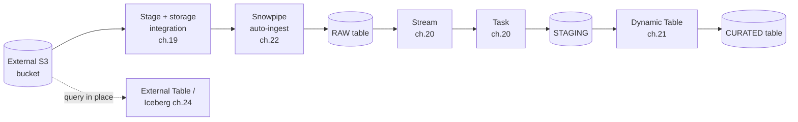

# Bonus Chapter: Data from A-Z

> A single end-to-end imaginary pipeline that ties chapters 19-24 together: raw files in an external S3 bucket all the way to a curated, query-ready table. Consultant lens: how the individual primitives combine into one coherent ingestion-to-curation architecture.

> [!note] Outline only
> This is a scaffold. We will fill it in properly **after finishing chapters 22 (Snowpipe), 23 (Snowpipe Streaming), and 24 (External Tables and Iceberg)**, so the walkthrough can use those techniques accurately.

## Goal of This Chapter

- Take one imaginary dataset on a journey: **External S3 bucket → landed → loaded → transformed → curated table**.
- Use the real technologies from chapters 19-24 at each hop, so the pieces stop feeling separate.
- Produce a mental "reference pipeline" a consultant can sketch on a whiteboard.

## The Scenario (to be defined)

- Imaginary business + dataset (e.g. IoT/installation events as JSON landing in S3).
- Source: files arriving continuously in an **external S3 bucket**.
- Target: a clean, curated, analytics-ready table (plus a raw layer for lineage).
- Layering: `RAW` -> `STAGING` -> `CURATED` (medallion-style).

## Pipeline Walkthrough (Stages to Fill In)

1. **Land — External stage + storage integration** *(ch. 19)*
   - Secure bucket access with a storage integration (no secrets in SQL).
   - Define stage + file format for the incoming JSON.
2. **Ingest — Snowpipe auto-ingest** *(ch. 22)*
   - Event-driven loads via notification integration into a `RAW` table.
   - `ON_ERROR` decision, metadata columns for lineage, monitoring with `SYSTEM$PIPE_STATUS`.
   - Note the low-latency row-based alternative: **Snowpipe Streaming** *(ch. 23)*.
3. **Detect change — Streams** *(ch. 20)*
   - Stream over the `RAW` table to capture only new rows.
4. **Transform on a cadence — Tasks** *(ch. 20)*
   - Task consumes the stream, cleans/casts/dedupes into `STAGING`.
   - `WHEN SYSTEM$STREAM_HAS_DATA(...)` to avoid empty runs.
5. **Curate — Dynamic Tables (alternative path)** *(ch. 21)*
   - Show the declarative alternative to Streams+Tasks for the final curated layer.
   - Contrast imperative (Streams+Tasks) vs declarative (Dynamic Tables).
6. **Query-in-place option — External Tables / Iceberg** *(ch. 24)*
   - When to skip loading and query files in place instead.
   - Where Iceberg fits for open-format, multi-engine access.
7. **Wrap-up — the full picture**
   - End-to-end diagram, cost/performance notes, governance touchpoints.

## Visuals



## Readable Snippets

```sql
-- To be filled in after chapters 22, 23 and 24.
-- Each pipeline hop will get a short, readable snippet here.
```

## Consultant Talking Points

- **Client question this answers:** "What does a full Snowflake ingestion-to-curation pipeline actually look like end to end?"
- **Trade-offs to mention:** To be filled (Streams+Tasks vs Dynamic Tables; load vs query-in-place).
- **Risk or governance angle:** To be filled (lineage, secure bucket access, error handling).
- **Cost/performance angle:** To be filled (file sizing, serverless vs warehouse, refresh cadence).

## Common Pitfalls

- To be filled once the walkthrough is complete (per-hop pitfalls pulled from chapters 19-24).

## Related Topics

- [[01 Snowflake/04 Data Engineering/Data Engineering Overview]]
- [[01 Snowflake/04 Data Engineering/19 Stages and Data Loading]]
- [[01 Snowflake/04 Data Engineering/20 Streams and Tasks]]
- [[01 Snowflake/04 Data Engineering/21 Dynamic Tables]]
- [[01 Snowflake/04 Data Engineering/22 Snowpipe]]
- [[01 Snowflake/04 Data Engineering/23 Snowpipe Streaming]]
- [[01 Snowflake/04 Data Engineering/24 External Tables and Iceberg]]

## Questions

- Which curated-layer approach should be the "default" recommendation: Streams+Tasks or Dynamic Tables?
- Where is the natural boundary between "load it" and "query it in place"?

## Sources To Revisit

- To be added alongside the chapters 19-23 source links.
