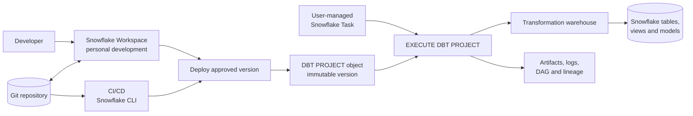
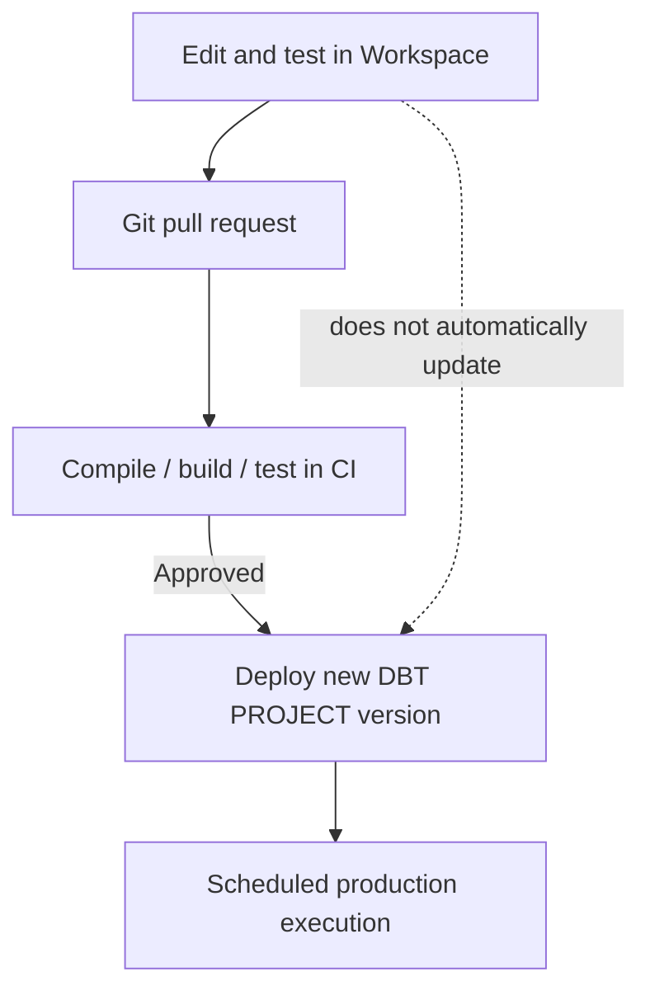

# dbt on Snowflake

> Running a standard dbt project as a native, versioned Snowflake object. Consultant lens: decide whether Snowflake should own the dbt control plane, then design deployment, scheduling, access, monitoring, and recovery deliberately.

## Executive Summary

- **What it is:** dbt Projects on Snowflake is Snowflake's native environment for developing, deploying, executing, scheduling, and monitoring standard dbt projects. It became generally available in November 2025.
- **Why it matters:** A Snowflake-centric client can operate dbt without a separate dbt-platform control plane. SQL still executes on Snowflake warehouses, while project code, runtime versions, Tasks, logs, lineage, and RBAC fit the Snowflake operating model.
- **Mental model:** **Workspace -> Git -> immutable `DBT PROJECT` version -> `EXECUTE DBT PROJECT` -> Snowflake Task -> warehouse-built models.** A Workspace is for development; the deployed project object is the production artifact.
- **Best used when:** Snowflake is the strategic analytical platform, the client prefers Snowflake-native security and operations, and standard dbt project capabilities meet the requirement.
- **Avoid or reconsider when:** The client needs a multi-platform dbt control plane, broader dbt-platform capabilities, unsupported commands or packages, concurrent executions of the same project object, or a runtime version Snowflake does not yet support.

## What It Can Do

- Develop and run a dbt project in a Git-connected Snowflake Workspace.
- Deploy project files as a versioned, schema-level `DBT PROJECT` object.
- Pin a supported dbt Core or Fusion runtime version for reproducibility.
- Execute supported commands such as `build`, `run`, `test`, `compile`, `seed`, and `snapshot` through SQL or Snowflake CLI.
- Schedule production runs with user-managed Snowflake Tasks.
- Monitor executions through Snowsight, Query History, Task History, dbt artifacts, logs, traces, and the Snowflake Event Table.
- Apply Snowflake RBAC to project deployment, execution, warehouses, source objects, and target schemas.
- Integrate deployment into Git-based CI/CD with Snowflake CLI.

## What It Cannot Do

- Replace ingestion tools such as Snowpipe, Snowpipe Streaming, or Fivetran; dbt normally transforms data already available in Snowflake.
- Automatically redeploy a production project when someone edits a Workspace; a new project-object version must be deployed.
- Run as a serverless Snowflake Task; a Task that executes a dbt project must use a user-managed warehouse.
- Run multiple `EXECUTE DBT PROJECT` calls concurrently against the same project object. dbt threads inside one execution are supported.
- Use arbitrary dbt versions, commands, flags, packages, or environment-variable patterns outside Snowflake's supported set.
- Reproduce every dbt-platform capability, especially its broader multi-platform control plane, hosted CI, Catalog, orchestration, and Semantic Layer offerings.
- Make poor SQL inexpensive or supply missing business rules. Snowflake still charges for the SQL dbt runs.

## Core Concepts

| Concept | Meaning | Why it matters |
|---|---|---|
| dbt project | Standard project files such as `dbt_project.yml`, models, tests, macros, and `profiles.yml` | The transformation code remains familiar and Git-friendly |
| Workspace | Personal, Git-connected development environment in Snowsight | Useful for editing and testing; it is not the shared production deployment |
| `DBT PROJECT` | Schema-level Snowflake object containing versioned project files | Gives production a governed and reproducible deployment artifact |
| Project-object version | Immutable snapshot of deployed project files | Workspace edits do not silently change production |
| dbt runtime version | Supported dbt Core or Fusion engine version used to execute the project | Separate from the project-object version; pin it to make runs reproducible |
| `profiles.yml` | Defines target role, warehouse, database, schema, and threads | Determines where and with which Snowflake privileges dbt materializes objects |
| `EXECUTE DBT PROJECT` | SQL command that invokes a supported dbt command on a Workspace or deployed project | Lets SQL clients, Tasks, Snowflake CLI, and external orchestrators start runs |
| Snowflake Task | Native scheduler or task-graph node that runs `EXECUTE DBT PROJECT` | Provides Snowflake-native orchestration and run history |
| dbt artifacts | Outputs such as `manifest.json` and `run_results.json` | Power DAG display, debugging, lineage, and operational evidence |

## How It Works (Simple Flow)

1. **Prepare Snowflake:** Create a transformation warehouse, project schema, target schemas, execution role, and least-privilege access to approved sources.
2. **Develop:** Create a Snowflake Workspace in a developer's personal database and connect it to the Git repository containing the dbt project.
3. **Configure:** Add a Snowflake-compatible `profiles.yml` with explicit development and production targets. Run `dbt deps` before deployment so required packages are present.
4. **Validate:** Compile, build, and test in an isolated development schema rather than writing into production.
5. **Deploy:** Copy approved files from a Workspace, Snowflake Git repository stage, internal stage, or CI runner into a schema-level `DBT PROJECT`. Each deployment adds an immutable project version.
6. **Execute:** Run `EXECUTE DBT PROJECT ... ARGS = 'build --target prod'` manually to verify the deployed version and privileges.
7. **Schedule:** Create a user-managed Snowflake Task in the same database and schema as the project object. Use one `dbt build` Task or a controlled Task graph.
8. **Operate:** Monitor the dbt execution, Task run, underlying Snowflake queries, data freshness, tests, and consumer SLA as separate but connected signals.

## Visuals



### Development is not deployment



## Snowflake-Native Setup

### 1. Prepare execution objects and roles

The exact grants depend on the project. This abbreviated example shows the separation to aim for:

```sql
CREATE WAREHOUSE IF NOT EXISTS dbt_transform_wh
  WAREHOUSE_SIZE = 'SMALL'
  AUTO_SUSPEND = 60
  AUTO_RESUME = TRUE;

CREATE DATABASE IF NOT EXISTS investment_analytics;
CREATE SCHEMA IF NOT EXISTS investment_analytics.dbt_projects;
CREATE SCHEMA IF NOT EXISTS investment_analytics.dbt_prod;

CREATE ROLE IF NOT EXISTS dbt_prod_role;

GRANT USAGE ON WAREHOUSE dbt_transform_wh
  TO ROLE dbt_prod_role;

GRANT USAGE ON DATABASE investment_analytics
  TO ROLE dbt_prod_role;

GRANT USAGE, CREATE TABLE, CREATE VIEW
  ON SCHEMA investment_analytics.dbt_prod
  TO ROLE dbt_prod_role;

GRANT USAGE ON DATABASE investment_data
  TO ROLE dbt_prod_role;

GRANT USAGE ON SCHEMA investment_data.canonical
  TO ROLE dbt_prod_role;

GRANT SELECT ON ALL TABLES IN SCHEMA investment_data.canonical
  TO ROLE dbt_prod_role;
```

Production normally separates responsibilities further:

- A deployment role can create or alter the `DBT PROJECT` object.
- A Task-owner role can create and own scheduled Tasks.
- The role in `profiles.yml` can read approved sources and create dbt-owned target objects.
- Human developers build in isolated schemas with development roles.

### 2. Configure a native Snowflake profile

Each project folder needs a `profiles.yml`. For native execution, the important values are the role, warehouse, database, schema, and thread count:

```yaml
investment_project:
  target: dev
  outputs:
    dev:
      type: snowflake
      role: DBT_DEV_ROLE
      warehouse: DBT_TRANSFORM_WH
      database: INVESTMENT_ANALYTICS
      schema: DBT_SONDRE
      threads: 4

    prod:
      type: snowflake
      role: DBT_PROD_ROLE
      warehouse: DBT_TRANSFORM_WH
      database: INVESTMENT_ANALYTICS
      schema: DBT_PROD
      threads: 8
```

Snowflake runs the project in the current account and execution context, so native projects do not need an external account password embedded in this file. Never commit secrets to Git.

### 3. Develop in a Workspace and Git

A Snowflake Workspace is a browser-based IDE that can scaffold or open a dbt project, connect to Git, execute dbt commands, and display its DAG. Workspaces live in personal databases and cannot be the shared production artifact.

The durable workflow is:

```text
Personal Workspace -> Git branch -> pull request -> CI -> deploy project version
```

Run `dbt deps` in the Workspace or CI environment before deployment. Deploying the resolved `dbt_packages` directory creates a more self-contained artifact; packages fetched remotely during development or deployment can require an external access integration.

### 4. Pin and deploy the project object

First inspect what the account currently supports:

```sql
SELECT SYSTEM$SUPPORTED_DBT_VERSIONS();
```

Then deploy from a Snowflake Git repository stage, using a currently supported version:

```sql
CREATE DBT PROJECT investment_analytics.dbt_projects.trade_analytics
  FROM '@investment_analytics.integrations.dbt_git_stage/branches/main'
  DBT_VERSION = '1.10.15'
  DEFAULT_TARGET = 'prod'
  COMMENT = 'Builds governed investment trade and position models';
```

The version number above is illustrative and will age; check `SYSTEM$SUPPORTED_DBT_VERSIONS()` before adopting or upgrading it.

CI/CD can instead deploy local project files through Snowflake CLI:

```bash
snow dbt deploy trade_analytics \
  --source ./investment_dbt \
  --force
```

Use a new immutable version for normal releases. Avoid `CREATE OR REPLACE` as a casual update mechanism because replacing the object resets its version history.

### 5. Verify the deployed version manually

```sql
EXECUTE DBT PROJECT investment_analytics.dbt_projects.trade_analytics
  ARGS = 'build --target prod --select int_current_trades+';
```

The `+` selects the named model and its downstream dependencies. This is ordinary dbt selection syntax; detailed model selection belongs in the later dbt curriculum.

## Scheduling Jobs and Pipelines

### Pattern A: one scheduled `dbt build`

For many projects, one `build` Task is the clearest starting point because dbt runs selected resources and their tests in dependency order:

```sql
CREATE OR ALTER TASK investment_analytics.dbt_projects.build_trade_pipeline
  WAREHOUSE = dbt_transform_wh
  SCHEDULE = '15 MINUTES'
AS
  EXECUTE DBT PROJECT investment_analytics.dbt_projects.trade_analytics
    ARGS = 'build --target prod --select tag:intraday';

ALTER TASK investment_analytics.dbt_projects.build_trade_pipeline RESUME;
```

Use an interval for a simple cadence or a CRON expression when business time zones and cut-offs matter. Schedule against the actual SLA; a five-minute Task is wasteful if positions are only required hourly.

### Pattern B: a Snowflake Task graph

Separate Tasks can make operational stages visible when the client wants different actions, owners, or alerts:

```sql
CREATE OR ALTER TASK investment_analytics.dbt_projects.run_trade_models
  WAREHOUSE = dbt_transform_wh
  SCHEDULE = '15 MINUTES'
AS
  EXECUTE DBT PROJECT investment_analytics.dbt_projects.trade_analytics
    ARGS = 'run --target prod --select tag:intraday';

CREATE OR ALTER TASK investment_analytics.dbt_projects.test_trade_models
  WAREHOUSE = dbt_transform_wh
  AFTER investment_analytics.dbt_projects.run_trade_models
AS
  EXECUTE DBT PROJECT investment_analytics.dbt_projects.trade_analytics
    ARGS = 'test --target prod --select tag:intraday';

ALTER TASK investment_analytics.dbt_projects.test_trade_models RESUME;
ALTER TASK investment_analytics.dbt_projects.run_trade_models RESUME;
```

Resume child Tasks before the root. Remember that a separate `run` publishes models before the following `test` finishes; use `dbt build` or a deliberate publish/promote design when failed tests must prevent downstream publication.

### Snowflake-specific Task rules

- The Task that invokes `EXECUTE DBT PROJECT` must be created in the same database and schema as the project object.
- It must specify a user-managed warehouse; serverless Tasks are not supported for this command.
- The Task runs with the Task-owner role's privileges and is not associated with a human user.
- The role selected in the production `profiles.yml` must also have the necessary warehouse, source, and target privileges.
- Do not schedule overlapping executions against the same project object. If genuine concurrent entry points are required, use separate project objects and carefully separate their targets.
- Internal dbt threads can run models concurrently within one execution; size the warehouse and thread count together.

### Schedule versus trigger

Prefer a schedule when the business requirement is stated as a freshness SLA, such as "positions every 15 minutes." A Task graph is useful when dbt must run after another Snowflake Task finishes.

Be cautious about gating a dbt Task with `SYSTEM$STREAM_HAS_DATA`. Checking a Stream does not itself consume it. If the dbt project reads the base table rather than consuming that Stream in committed DML, the Stream can remain non-empty and repeatedly trigger work.

## Monitoring and Operations

Monitor the pipeline at four levels:

| Level | Evidence | Typical failure |
|---|---|---|
| Deployment | Project-object version, runtime version, Git commit | Wrong or missing version deployed |
| Orchestration | Task state, Task History, Task graph | Suspended Task, schedule failure, privilege failure |
| dbt execution | Run output, artifacts, logs, DAG, test results | Compile error, missing package, failed model or test |
| Snowflake workload | Query History, warehouse usage, target tables, freshness | Expensive SQL, queueing, stale or incomplete data |

Snowflake exposes execution details in Snowsight under dbt Projects and Query History. It can also send OpenTelemetry-compatible logs and traces to an Event Table and expose project execution history and logs programmatically.

For an incident, diagnose in this order:

```text
Correct deployed version
  -> Task ran
  -> EXECUTE DBT PROJECT started
  -> dbt command compiled
  -> Snowflake queries succeeded
  -> tests passed
  -> consumer table is fresh
```

A successful Task only proves that the command completed successfully. It does not by itself prove that the source was fresh, reconciliation passed, or a risk dashboard met its SLA.

## Native Snowflake Versus dbt Platform

The dbt platform, historically called dbt Cloud, is an external dbt-managed control plane that connects to Snowflake. Snowflake still executes its SQL and stores its models. dbt Projects on Snowflake moves project deployment, execution, scheduling, and much of the monitoring into Snowflake.

| Consideration | dbt Projects on Snowflake | dbt platform connected to Snowflake |
|---|---|---|
| Control plane | Snowflake | dbt Labs SaaS |
| SQL execution and model storage | Snowflake | Snowflake |
| Development | Snowflake Workspaces or local IDE | dbt Studio/IDE and local dbt tooling |
| Scheduling | Snowflake Tasks | dbt jobs/orchestrator |
| Monitoring | Snowsight, Query History, Task History, Event Tables | dbt run history, Catalog, metadata, and alerts |
| CI/CD | Git plus Snowflake CLI or other CI | Git plus dbt-native CI capabilities |
| Runtime choice | Versions supported by Snowflake | dbt-supported release tracks |
| Platform scope | Snowflake-centric | Broader multi-platform control plane |
| Commercial model | Standard Snowflake compute; no separate per-user dbt-project fee stated | dbt-platform subscription plus Snowflake compute |
| Main constraint | Native command, package, environment, and concurrency limits | External SaaS boundary, licensing, and another platform to govern |

### Recommendation

Recommend **dbt Projects on Snowflake** when:

- Snowflake is the client's strategic analytical platform.
- The client wants fewer external services and a Snowflake-native operating model.
- Snowflake RBAC, Tasks, Query History, Event Tables, and Snowsight are the preferred control surfaces.
- Standard dbt project capabilities and Snowflake's supported runtime versions cover the requirement.
- The Snowflake platform team will own production transformation operations.

Recommend the **dbt platform connected to Snowflake** when:

- dbt is a strategic enterprise analytics-engineering platform in its own right.
- The client operates multiple data platforms.
- dbt-specific hosted CI, Catalog, Semantic Layer, orchestration, or collaboration features are important.
- The analytics-engineering team wants dbt Labs to operate more of the control plane.
- Snowflake-native limitations materially conflict with the project's package, environment, runtime, or concurrency needs.

Recommend **self-operated dbt Core or Fusion** when the client has a capable platform team and deliberately wants to own containers, upgrades, secrets, scheduling, logs, artifacts, and support.

Whichever option is chosen, keep Git as the code source of truth and choose one production scheduler. Running the same project from dbt-platform jobs and Snowflake Tasks creates duplicate executions and unclear incident ownership.

## Security and Governance

### RBAC boundaries

Separate these powers where the client's control model requires it:

| Responsibility | Typical privilege boundary |
|---|---|
| Develop and test | Personal Workspace plus isolated development schema |
| Approve code | Git pull-request controls |
| Deploy a project version | `CREATE DBT PROJECT` or ownership on the project object |
| Schedule production | Task creation and Task ownership in the project schema |
| Execute manually | `USAGE` on the project object plus underlying access |
| Materialize models | Role declared in the production `profiles.yml` |
| Read sensitive sources | Explicit `SELECT` grants, masking policies, and row access policies |

Avoid using `ACCOUNTADMIN` for normal dbt development or production execution. A dedicated production role should read only approved source domains and write only dbt-owned target schemas.

### Execution identity

- Interactive SQL or Workspace execution is restricted by both the calling user and the role configured in `profiles.yml`.
- Scheduled execution uses the Task owner's privileges; Task runs are not associated with the human who created the schedule.
- Test the deployed project using the same production role, target, and warehouse that the Task will use. A successful developer run does not prove the scheduled identity is authorized.

### Code, secrets, and supply chain

- Keep project code in Git and protect the production branch.
- Do not put passwords, private keys, tokens, or other secrets in `profiles.yml` or project variables committed to Git.
- Pin the dbt runtime and package versions; review upgrades deliberately.
- Run package resolution in controlled development or CI and review third-party packages.
- Treat project artifacts and logs as potentially sensitive metadata because they can expose object names, compiled SQL, and error context.

### Data governance

dbt-created tables and views remain Snowflake objects, so Snowflake governance continues to apply:

- RBAC and managed access schemas
- Masking and row access policies
- Object tags and classification
- Access history and query history
- Horizon lineage
- Retention and lifecycle policies

dbt documentation complements these controls; it does not replace them.

## Consultant Talking Points

- **Client question this answers:** "Can we operate tested, Git-controlled dbt transformations entirely within our Snowflake platform instead of adding a separate dbt control plane?"
- **Trade-offs to mention:** Native operation reduces platform sprawl and keeps scheduling and monitoring near the data, but the dbt platform offers a broader specialized experience and fewer Snowflake-specific runtime constraints.
- **Risk or governance angle:** Separate development, deployment, scheduling, and materialization privileges; pin immutable versions; use one production scheduler; preserve artifacts and execution history.
- **Cost/performance angle:** The feature has no separate per-user license fee stated by Snowflake, but every model and test uses warehouse compute. Tune schedules, dbt threads, warehouse size, auto-suspend, selection, and model design together.

## Common Pitfalls

- **Treating a Workspace as production:** Workspaces are personal development environments. Deploy an approved `DBT PROJECT` version.
- **Expecting edits to auto-deploy:** Workspace changes do not update the project object until a new version is explicitly deployed.
- **Confusing two kinds of version:** Project-object version tracks code deployments; `DBT_VERSION` selects the execution engine.
- **Using `CREATE OR REPLACE` for every release:** It resets the project object's version history. Add a new version for normal releases.
- **Leaving the runtime unpinned:** A changed default runtime can alter compilation or execution behavior.
- **Forgetting `dbt deps`:** The deployment can fail or lack required packages.
- **Putting the Task in another schema:** A Task executing the project must share its database and schema.
- **Attempting a serverless Task:** `EXECUTE DBT PROJECT` requires a user-managed warehouse.
- **Forgetting to resume Tasks:** New Tasks begin suspended; in a graph, enable children before the root.
- **Mismatching Task-owner and profile privileges:** Both the scheduled execution context and the role in `profiles.yml` must be designed and tested.
- **Overlapping executions:** The same project object does not support concurrent `EXECUTE DBT PROJECT` calls.
- **Publishing before validation:** A separate `run` followed by `test` can expose models before tests finish. Use `build` or a promote/publish pattern when this matters.
- **Assuming a green dbt run proves fresh data:** Monitor source freshness, reconciliations, and consumer SLA separately.
- **Scheduling too frequently:** More frequent runs increase warehouse starts, test queries, contention, and cost.
- **Using two control planes:** Do not schedule the same production project from both dbt platform and Snowflake Tasks.
- **Treating native dbt as ingestion:** Snowpipe or another ingestion service still owns delivery into Snowflake.

## When to Recommend What (Decision Table)

| Situation | Recommend | Why | Watch-outs |
|---|---|---|---|
| Snowflake-only client with strong platform team | dbt Projects on Snowflake | Native RBAC, Tasks, monitoring, and fewer external services | Confirm supported runtime, packages, commands, and concurrency |
| Multi-platform analytics organization | dbt platform | One dbt-oriented control plane across warehouses | Subscription, external metadata boundary, and integration governance |
| Small capable engineering team wanting maximum control | Self-operated dbt Core/Fusion | Flexible runtime and orchestration choices | Team owns upgrades, secrets, availability, logs, and support |
| Simple Snowflake transformation with freshness target | Dynamic Table, optionally defined by dbt | Snowflake maintains the query result declaratively | It is not a full project deployment or CI framework |
| Procedural quarantine or event-state transition | Streams and Tasks, possibly followed by dbt | Explicit DML and side effects are easier to control | More custom SQL and operations |
| Native project every 15 minutes | One Task running `dbt build` | Simple dependency-aware pipeline and test flow | Select only necessary models and prevent overlap |
| Different post-run actions or owners | Snowflake Task graph | Explicit stages and operational visibility | `run` may publish before a later `test` fails |
| External enterprise orchestrator already standard | Orchestrator calling `EXECUTE DBT PROJECT` | Retains enterprise dependency management while using native project object | Define one owner for retries, alerts, and schedules |

## Related Topics

- [[01 Snowflake/04 Data Engineering/Data Engineering Overview]]
- [[02 dbt/dbt Learning Map]]
- [[01 Snowflake/04 Data Engineering/20 Streams and Tasks]]
- [[01 Snowflake/04 Data Engineering/21 Dynamic Tables]]
- [[01 Snowflake/04 Data Engineering/24.5 Bonus chapter Data from A-Z]]
- [[01 Snowflake/03 Security and Governance/12 RBAC Roles and Privileges]]
- [[01 Snowflake/06 Cost Management and Operations/46 Warehouse Scheduling and Auto-suspend]]

## Related Decision Notes

- [[80 Comparisons and Decision Notes/Comparisons/Cross-Tool/Comparison - dbt Projects on Snowflake vs dbt Platform]]
- [[80 Comparisons and Decision Notes/Comparisons/Snowflake/Comparison - Streams and Tasks vs Dynamic Tables]]
- [[80 Comparisons and Decision Notes/Decision Notes/Snowflake/Decisions - Choosing a Warehouse Strategy by Workload Type]]

## Questions

- Is Snowflake the client's only strategic analytical platform, or must the dbt control plane span several platforms?
- Who owns production transformations: the Snowflake platform team or analytics engineering?
- Which Git event deploys a new project-object version, and who can approve it?
- What target, role, warehouse, and model selection should the production Task use?
- Should failed tests stop downstream construction, block consumer publication, or only alert?
- What schedule satisfies the business SLA without causing overlapping runs or unnecessary warehouse starts?
- Which dbt artifacts, Task history, logs, reconciliation results, and freshness signals must be retained for audit?

## Sources To Revisit

- [Snowflake Docs: dbt Projects on Snowflake](https://docs.snowflake.com/en/user-guide/data-engineering/dbt-projects-on-snowflake)
- [Snowflake Docs: Understand dbt Project Objects](https://docs.snowflake.com/en/user-guide/data-engineering/dbt-projects-on-snowflake-understanding-dbt-project-objects)
- [Snowflake Docs: Workspaces for dbt Projects](https://docs.snowflake.com/en/user-guide/data-engineering/dbt-projects-on-snowflake-using-workspaces)
- [Snowflake Docs: Deploy dbt Project Objects](https://docs.snowflake.com/en/user-guide/data-engineering/dbt-projects-on-snowflake-deploy)
- [Snowflake Docs: Schedule dbt Project Executions](https://docs.snowflake.com/en/user-guide/data-engineering/dbt-projects-on-snowflake-schedule-project-execution)
- [Snowflake Docs: Access Control for dbt Projects](https://docs.snowflake.com/en/user-guide/data-engineering/dbt-projects-on-snowflake-access-control)
- [Snowflake Docs: Monitor dbt Projects](https://docs.snowflake.com/en/user-guide/data-engineering/dbt-projects-on-snowflake-monitoring-observability)
- [Snowflake Docs: Requirements and Limitations](https://docs.snowflake.com/en/user-guide/data-engineering/dbt-projects-on-snowflake-limitations)
- [Snowflake Docs: Supported dbt Versions](https://docs.snowflake.com/en/user-guide/data-engineering/dbt-projects-on-snowflake-dbt-core-versions)
- [Snowflake Docs: Understanding dbt Project Costs](https://docs.snowflake.com/en/user-guide/data-engineering/dbt-projects-on-snowflake-cost)
- [Snowflake Docs: `EXECUTE DBT PROJECT`](https://docs.snowflake.com/en/sql-reference/sql/execute-dbt-project)
- [dbt Docs: Connect Snowflake to the dbt Platform](https://docs.getdbt.com/docs/platform/connect-data-platform/connect-snowflake)
