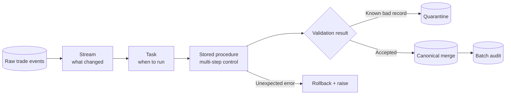
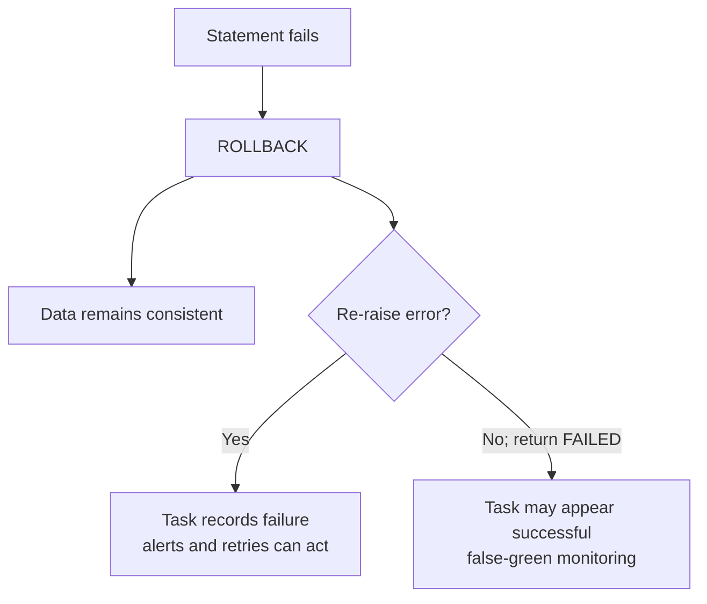

# Stored Procedures

> Reusable procedural code executed inside Snowflake. Consultant lens: use procedures at operational control points—multi-step DML, validation, quarantine, transactional publication, and controlled privilege delegation—not as a hiding place for ordinary transformations.

## Executive Summary

- **What it is:** A stored procedure is a named Snowflake schema object that accepts parameters and coordinates procedural logic such as multiple SQL statements, conditions, loops, exception handling, transactions, and dynamic operations.
- **Why it matters:** Some workflows cannot be expressed cleanly as one declarative query. Procedures package a controlled operation that can be called by a user, Task, application, another procedure, or external orchestrator.
- **Mental model:** **A Stream exposes what changed; a Task decides when work runs; a stored procedure defines the multi-step work; SQL performs the set-based operations; a transaction defines what commits together.**
- **Best used when:** Several ordered or conditional database actions must be coordinated, a batch needs validation/quarantine/audit, a privileged capability must be safely delegated, or administrative automation is required.
- **Avoid or reconsider when:** One set-based SQL statement is enough, the goal is to maintain a declarative query result, dbt should own a transformation DAG, a UDF better represents a reusable expression, or the workflow spans systems and needs a full orchestrator.

## What It Can Do

- Execute several DML or administrative statements in a defined sequence.
- Accept typed parameters and return a scalar, structured `VARIANT`, or supported tabular result.
- Use variables, `IF`/`CASE`, loops, cursors, result sets, and exception handlers.
- Group related DML in an explicit transaction.
- Build and execute dynamic SQL for controlled metadata-driven operations.
- Run as caller, owner, or restricted caller, depending on the required security model.
- Be scheduled or triggered by a Snowflake Task.
- Use Snowflake Scripting, JavaScript, Python, Java, or Scala as the handler language.
- Emit logs and traces that can be captured in a Snowflake Event Table.

## What It Cannot Do

- Become atomic merely because several statements are inside one procedure; explicit transaction design is required.
- Make row-by-row loops efficient for large analytical datasets; set-based SQL remains the default.
- Replace dbt's transformation DAG, environments, documentation, testing, and CI/CD discipline.
- Replace Dynamic Tables when the requirement is simply to maintain a query result toward a freshness target.
- Replace a cross-system orchestrator for long workflows, rich backfills, human approvals, or many external dependencies.
- Safely execute arbitrary user-provided dynamic SQL without validation and parameter binding.
- Guarantee idempotency; retry behavior must be designed.
- Provide Time Travel for its own source code. Procedure definitions belong in Git.

## Core Concepts

| Concept | Meaning | Why it matters |
|---|---|---|
| Procedure | Named schema object invoked with `CALL` | Packages a reusable operation and its interface |
| Handler language | SQL/Snowflake Scripting, JavaScript, Python, Java, or Scala | Choose SQL first for SQL-heavy workflows; use another language only for a concrete need |
| Parameter | Typed input to the procedure | Defines the supported operation rather than relying on session guesswork |
| Return value | Status, count, object, or supported table returned to the caller | Useful for evidence, but the procedure is usually called for its side effects |
| Side effect | Change to data, objects, privileges, audit state, or external interaction | The main distinction from a query expression or UDF |
| Transaction | Explicit boundary around DML that must succeed or fail together | Procedures are not automatically atomic |
| Exception handler | Logic that handles or propagates an execution failure | `ROLLBACK` protects data; `RAISE` makes the caller see failure |
| Caller’s rights | Procedure uses the caller’s privileges and session context | Appropriate when callers already have the required access |
| Owner’s rights | Procedure runs mainly with the owner role’s privileges; this is the default | Delegates one controlled capability without broadly granting table privileges |
| Restricted caller’s rights | Procedure uses only an explicitly allowed subset of the caller’s privileges | Preserves caller context while reducing privilege exposure |
| Idempotency | Repeating the call produces the same intended business result | Essential for retries, reruns, and uncertain completion |

## How It Works (Simple Flow)

1. **Define the contract:** Choose the procedure name, typed parameters, return type, handler language, and caller/owner security model.
2. **Validate inputs:** Reject invalid dates, batch identifiers, object names, or unsupported states before changing data.
3. **Begin the atomic unit:** Start an explicit transaction when related DML must commit together.
4. **Execute set-based work:** Use `INSERT`, `MERGE`, `UPDATE`, or `DELETE`; reserve loops for small metadata/object lists.
5. **Handle expected business outcomes:** Quarantine known bad records or mark a batch rejected according to an explicit policy.
6. **Handle unexpected failures:** Roll back and re-raise so Tasks and operators see a genuine failure.
7. **Return evidence:** On success, return a concise result such as status, business date, batch ID, and affected-row count.
8. **Operate it:** Call manually, through a Task, or from an orchestrator; monitor Task History, Query History, logs, audit state, and consumer freshness.

## Visuals



### Transaction control versus operational truth



## Choosing a Handler Language

| Language | Best fit | Watch-outs |
|---|---|---|
| Snowflake Scripting (`LANGUAGE SQL`) | SQL-heavy DML, validation, transactions, and administration | Keep logic modular; do not reproduce a full application in SQL |
| Python/Snowpark | More complex algorithms, Python libraries, or Snowpark processing | Pin runtime/packages and push large data operations into Snowflake rather than collecting rows |
| JavaScript | Existing JavaScript procedures and controlled dynamic SQL | Many errors surface at runtime; bind parameters and keep code maintainable |
| Java or Scala | Existing JVM libraries and organizational expertise | Packaging, dependencies, and runtime governance add complexity |

Default to Snowflake Scripting when the procedure mostly coordinates SQL.

## Readable Snippets

### 1. Simple caller’s-rights procedure

```sql
CREATE OR REPLACE PROCEDURE operations.count_active_trades(
    p_portfolio_id VARCHAR
)
RETURNS NUMBER
LANGUAGE SQL
EXECUTE AS CALLER
AS
$$
DECLARE
    active_trade_count NUMBER;
BEGIN
    SELECT COUNT(*)
      INTO :active_trade_count
      FROM curated.current_trades
     WHERE portfolio_id = :p_portfolio_id
       AND trade_status = 'ACTIVE';

    RETURN active_trade_count;
END;
$$;

CALL operations.count_active_trades('PORTFOLIO-001');
```

The caller must already be allowed to read the underlying table. A reusable query or UDF may be simpler if no procedural action is required; this example mainly shows the interface and variable syntax.

### 2. Transactional position publication

```sql
CREATE OR REPLACE PROCEDURE operations.publish_positions(
    p_position_date DATE
)
RETURNS VARIANT
LANGUAGE SQL
EXECUTE AS OWNER
AS
$$
DECLARE
    inserted_rows NUMBER;
BEGIN
    BEGIN TRANSACTION;

    DELETE FROM curated.positions
     WHERE position_date = :p_position_date;

    INSERT INTO curated.positions (
        position_date,
        portfolio_id,
        instrument_id,
        net_quantity
    )
    SELECT
        :p_position_date,
        portfolio_id,
        instrument_id,
        SUM(signed_quantity)
    FROM staging.current_trades
    WHERE trade_date <= :p_position_date
      AND trade_status = 'ACTIVE'
    GROUP BY portfolio_id, instrument_id;

    inserted_rows := SQLROWCOUNT;

    INSERT INTO operations.position_run_audit (
        position_date,
        completed_at,
        inserted_rows,
        status
    )
    VALUES (
        :p_position_date,
        CURRENT_TIMESTAMP(),
        :inserted_rows,
        'SUCCEEDED'
    );

    COMMIT;

    RETURN OBJECT_CONSTRUCT(
        'status', 'SUCCEEDED',
        'position_date', p_position_date,
        'inserted_rows', inserted_rows
    );

EXCEPTION
    WHEN OTHER THEN
        ROLLBACK;
        RAISE;
END;
$$;

CALL operations.publish_positions('2026-07-05'::DATE);
```

The bounded delete-and-rebuild pattern makes a repeated call for the same date idempotent. In production, validation should establish that prices, FX, security master, and trade reconciliation are ready before publication.

### 3. Schedule the operation

```sql
CREATE OR REPLACE TASK operations.publish_positions_task
  WAREHOUSE = investment_transform_wh
  SCHEDULE = 'USING CRON 0 6 * * * Europe/Budapest'
AS
  CALL operations.publish_positions(CURRENT_DATE());

ALTER TASK operations.publish_positions_task RESUME;
```

Or gate a change-processing procedure with a Stream:

```sql
CREATE OR REPLACE TASK operations.process_trade_events_task
  WAREHOUSE = investment_transform_wh
  SCHEDULE = '1 MINUTE'
  WHEN SYSTEM$STREAM_HAS_DATA('raw.trade_events_stream')
AS
  CALL operations.process_trade_batch();
```

The procedure’s committed DML must actually consume the Stream. A failed transaction leaves the offset unadvanced so the same delta can be retried.

### 4. Delegate a narrow capability

```sql
GRANT USAGE
  ON PROCEDURE operations.publish_positions(DATE)
  TO ROLE portfolio_operations_role;
```

With an owner’s-rights procedure, the operations role can call the approved operation without receiving unrestricted `INSERT`, `UPDATE`, or `DELETE` on all underlying tables. The owner role should itself be narrowly privileged.

## Transactions and Error Semantics

A procedure is not one automatic transaction. If statement three fails, statements one and two are not necessarily rolled back unless the transaction is explicit.

Use this pair deliberately:

```text
ROLLBACK = protect data correctness
RAISE    = protect operational correctness
```

Additional rules:

- Keep a transaction fully within one procedure/call scope; do not expect ordinary nested transactions.
- DDL statements can implicitly commit. Do not mix object creation with DML and assume one rollback protects everything.
- Keep transactions short enough to avoid unnecessary contention.
- Decide whether known business-invalid data should be quarantined and committed, or whether it rejects the entire batch.
- Do not catch an unexpected error and merely return `'FAILED'`; a Task can record the `CALL` as successful.
- If the caller requires retry behavior, make each side effect idempotent and prevent unsafe overlapping calls.

## Security and Governance

### Caller, owner, or restricted caller

| Requirement | Recommend | Why |
|---|---|---|
| Caller already has required object access | Caller’s rights | Preserves the caller’s role and session context |
| Delegate one controlled administrative or publishing action | Owner’s rights | Caller receives `USAGE` on the operation, not broad table privileges |
| Use caller context but only an approved privilege subset | Restricted caller’s rights | Caller grants constrain what the procedure can exercise |

Owner’s rights is the default, so choose deliberately rather than accepting it unnoticed.

### Least-privilege controls

- Let a dedicated application/operations role own the procedure, not `ACCOUNTADMIN`.
- Grant `USAGE` only to roles that should invoke the operation.
- Fully qualify production object names, especially in owner’s-rights code.
- Use references when an owner’s-rights procedure must operate on a caller-selected object under caller authorization.
- Bind values and validate dynamic identifiers; never concatenate untrusted input into SQL.
- Treat handler packages and staged code as supply-chain dependencies that require versioning and review.
- Keep secrets out of inline code; use Snowflake secrets and external access integrations for approved external access.
- Avoid logging full trade payloads, credentials, or sensitive portfolio data.

### Source control and deployment

- Store the authoritative `CREATE PROCEDURE` definition in Git; Time Travel does not version procedure code.
- Promote through development, test, and production rather than editing production directly.
- Document parameters, return shape, security mode, prerequisites, side effects, transaction boundary, retry semantics, and possible errors.
- Remember that overloaded procedures are identified by name plus argument types; grants and drops must reference the signature.
- Handle grants deliberately during `CREATE OR REPLACE`, using supported grant-copying/deployment patterns where appropriate.

## Observability and Recovery

A production procedure should leave enough evidence to answer:

- Which business date, batch ID, or run ID was processed?
- Which procedure version and role executed it?
- Which statements and Snowflake query IDs ran?
- How many rows were accepted, quarantined, merged, or published?
- Was the transaction committed or rolled back?
- Did the Stream offset advance?
- Is a retry safe?

Use Task History, Query History, Event Table logs/traces, explicit audit tables, affected-row counts, and consumer freshness/reconciliation checks together. A successful `CALL` proves only that the procedure returned without an unhandled error; it does not prove that the source was fresh or the business result reconciled.

## Consultant Talking Points

- **Client question this answers:** “We need to validate a trade batch, quarantine conflicts, update several tables, and make retries safe. Can Snowflake coordinate that operation internally?”
- **Trade-offs to mention:** Procedures provide fine control and side effects but require more testing, transaction design, observability, and deployment discipline than declarative models.
- **Risk or governance angle:** Owner’s rights can provide elegant least-privilege delegation or become a privilege-escalation path. The owner role, dynamic SQL, packages, and callable interface all require review.
- **Cost/performance angle:** The SQL still consumes warehouse compute. Prefer set-based statements, avoid row loops, prevent overlapping runs, and size the calling Task/warehouse for the actual workload.

## Common Pitfalls

- **Assuming automatic atomicity:** Related statements can partially commit unless enclosed in a deliberate transaction.
- **Rolling back without re-raising:** Data may be safe while the Task appears green and normal alerts/retries do not activate.
- **Returning `'FAILED'` for unexpected errors:** A returned value is not the same as a failed `CALL`.
- **Mixing DDL into an expected DML rollback:** DDL can implicitly commit and break the assumed boundary.
- **Accepting owner’s rights by accident:** It is the default and may delegate more power than intended.
- **Using a highly privileged owner:** The procedure becomes a narrow-looking entrance to broad privileges.
- **Concatenating dynamic SQL:** Untrusted values or identifiers can create SQL injection or accidental object access.
- **Looping through millions of trades:** Use one set-based `INSERT`, `MERGE`, or aggregate instead.
- **Designing non-idempotent side effects:** Task retries or operator reruns then double-count data or repeat notifications.
- **Allowing overlapping calls:** Two runs can process the same batch or compete over the same publication date.
- **Hiding the transformation estate in one procedure:** This sacrifices dbt/Dynamic Table modularity, lineage, and testability.
- **Treating a procedure as orchestration:** It coordinates database work; it does not replace a full cross-system workflow engine.
- **Logging sensitive context:** Errors and traces can expose SQL, object names, or payload data.
- **Keeping the only definition in Snowflake:** There is no procedure-code Time Travel; use Git and controlled releases.

## When to Recommend What (Decision Table)

| Situation | Recommend | Why | Watch-outs |
|---|---|---|---|
| One set-based transformation | Plain SQL | Smallest and clearest solution | Do not introduce procedural scaffolding |
| Reusable value inside a query | SQL expression or UDF | Composes naturally with `SELECT` | Avoid side effects |
| One SQL statement on a schedule | Task running SQL directly | No procedure needed | Keep the statement idempotent |
| Several conditional DML actions | Stored procedure | Explicit order, branching, transactions, and side effects | More code and operational ownership |
| Controlled privileged operation | Owner’s-rights procedure | Delegates one approved capability | Narrow owner role and validate all inputs |
| Declarative result with freshness target | Dynamic Table | Snowflake maintains the query result | Less procedural control |
| Tested analytical transformation DAG | dbt | Models, tests, docs, environments, CI/CD, lineage | Not intended for every side effect |
| Changed rows trigger multi-step processing | Stream + Task + procedure | Separates change detection, scheduling, and procedural action | Stream consumption, retries, and idempotency |
| Complex Python/Snowpark algorithm | Python stored procedure | In-Snowflake Python and Snowpark capabilities | Runtime, package, memory, and observability constraints |
| Cross-system workflow | External orchestrator | Rich dependencies, retries, backfills, and external coordination | Additional platform to operate |

## Related Topics

- [[01 Snowflake/04 Data Engineering/Data Engineering Overview]]
- [[01 Snowflake/04 Data Engineering/20 Streams and Tasks]]
- [[01 Snowflake/04 Data Engineering/21 Dynamic Tables]]
- [[01 Snowflake/04 Data Engineering/25 dbt on Snowflake]]
- [[01 Snowflake/04 Data Engineering/24.5 Bonus chapter Data from A-Z]]
- [[01 Snowflake/03 Security and Governance/12 RBAC Roles and Privileges]]
- [[01 Snowflake/05 Advanced Analytics and AI/32 Snowpark]]
- [[01 Snowflake/07 Ecosystem and Integration/50 Notification Integrations and Alerts]]

## Related Decision Notes

- [[80 Comparisons and Decision Notes/Comparisons/Comparison - Stored Procedures vs Declarative Transformations]]
- [[80 Comparisons and Decision Notes/Comparisons/Comparison - Streams and Tasks vs Dynamic Tables]]

## Questions

- Which statements must commit together, and which business-invalid outcomes should be committed to quarantine rather than fail the call?
- Should the procedure execute as caller, owner, or restricted caller, and why?
- What stable key or run identifier makes a retry safe?
- How will an operator distinguish a technical failure, rejected batch, warning, and successful publication?
- Does the procedure truly need loops or dynamic SQL, or can set-based SQL express the work more safely?
- Which audit evidence and procedure version must be retained for regulatory investigation?

## Sources To Revisit

- [Snowflake Docs: Stored Procedures Overview](https://docs.snowflake.com/en/developer-guide/stored-procedure/stored-procedures-overview)
- [Snowflake Docs: Working with Stored Procedures](https://docs.snowflake.com/en/developer-guide/stored-procedure/stored-procedures-usage)
- [Snowflake Docs: Snowflake Scripting Stored Procedures](https://docs.snowflake.com/en/developer-guide/stored-procedure/stored-procedures-snowflake-scripting)
- [Snowflake Docs: Caller’s Rights and Owner’s Rights](https://docs.snowflake.com/en/developer-guide/stored-procedure/stored-procedures-rights)
- [Snowflake Docs: Restricted Caller’s Rights](https://docs.snowflake.com/en/developer-guide/restricted-callers-rights)
- [Snowflake Docs: Transactions](https://docs.snowflake.com/en/sql-reference/transactions)
- [Snowflake Docs: Exception Handling](https://docs.snowflake.com/en/developer-guide/snowflake-scripting/exceptions)
- [Snowflake Docs: `CREATE PROCEDURE`](https://docs.snowflake.com/en/sql-reference/sql/create-procedure)
- [Snowflake Docs: Logging, Tracing, and Metrics](https://docs.snowflake.com/en/developer-guide/logging-tracing/logging-tracing-overview)
