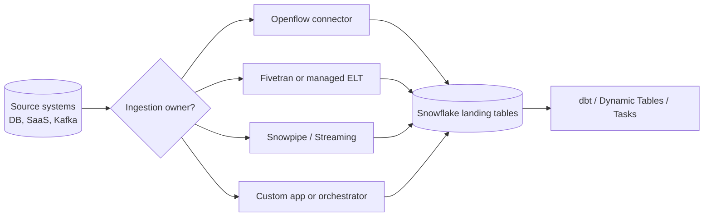

# Openflow and Source Connectors

> Managed and extensible source-to-Snowflake integration patterns. Consultant lens: decide when Snowflake-native connectors, Fivetran, Kafka, Snowpipe, or custom ingestion should own data movement.

## Executive Summary

- **What it is:** Snowflake Openflow is Snowflake's managed integration and connector layer for moving data between systems, including CDC-style database replication and flow-based processing patterns.
- **Why it matters:** In a bank, source integration is often the hard part: operational databases, Kafka, SaaS tools, network controls, secrets, latency, and ownership boundaries.
- **Mental model:** Openflow is the Snowflake-native data movement plane; Snowpipe and Snowpipe Streaming are ingestion primitives; Fivetran and custom code are competing or complementary options.
- **Best used when:** A supported connector matches the source, the client wants Snowflake-native operation, and governance/networking can support the Openflow runtime pattern.
- **Avoid or reconsider when:** Fivetran already covers the source well, an enterprise integration platform owns the domain, the source needs unsupported custom logic, or the operational team is not ready to run connector runtimes.

## What It Can Do

- Replicate from supported sources into Snowflake using managed connector patterns.
- Support CDC-style ingestion for databases such as SQL Server, PostgreSQL, MySQL, and Oracle where supported.
- Use Snowflake governance objects, secrets, integrations, roles, and operational metadata around data movement.
- Provide a Snowflake-native alternative or comparison point to Fivetran, Kafka Connect, Airflow, ADF, and custom ingestion services.

## What It Cannot Do

- Replace every enterprise integration platform or every custom source connector.
- Remove the need to understand source transaction semantics, deletes, schema changes, resyncs, and backfill.
- Guarantee that every connector has identical maturity, latency, or operational behavior.
- Decide ownership between platform teams, source-system teams, data engineering, and vendor tooling.

## Core Concepts

| Concept | Meaning | Why it matters |
|---|---|---|
| Openflow | Snowflake integration service for connector and flow-based data movement | Gives Snowflake a first-class ingestion/control-plane story |
| Connector | Packaged integration for a source or destination | Reduces custom code but adds connector-specific configuration |
| CDC | Change data capture from source systems | Common pattern for operational databases and near-real-time reporting |
| Snapshot | Initial full load before incremental replication | Needs sizing, cutoff, validation, and retry planning |
| Journal/current tables | Connector-managed representations of change and current state | Important for audit, troubleshooting, and downstream modeling |
| Runtime ownership | Who operates, upgrades, monitors, and secures the connector | Often the real client decision, not just the feature choice |

## How It Works (Simple Flow)

1. Identify the source system, latency requirement, change semantics, and ownership boundary.
2. Choose whether the source is best served by Openflow, Fivetran, Kafka, Snowpipe, Snowpipe Streaming, or custom code.
3. Configure source access, Snowflake target objects, roles, secrets, network access, and connector runtime settings.
4. Run an initial snapshot or baseline load when required.
5. Apply incremental changes into Snowflake-owned tables.
6. Monitor connector health, lag, errors, schema drift, and replay/backfill behavior.
7. Model the raw/current data downstream with dbt, Dynamic Tables, Streams and Tasks, or ordinary SQL.

## Visuals



## Readable Snippets

```sql
-- Openflow connectors are configured through Snowflake/Openflow workflows
-- rather than a normal CREATE PIPE-style SQL object.
-- The SQL you should recognize downstream is usually the landing/current table
-- plus monitoring, validation, and transformation logic.
```

## Consultant Talking Points

- **Client question this answers:** "Should we use Snowflake's connector stack, Fivetran, Kafka, or custom code for this source?"
- **Trade-offs to mention:** Snowflake-native operation and governance versus connector maturity, source coverage, portability, and existing enterprise tooling.
- **Risk or governance angle:** Source credentials, network paths, CDC privileges, sensitive raw data, deletes, and schema changes need approval before production replication.
- **Cost/performance angle:** Compare connector/runtime cost, Snowflake ingestion cost, downstream warehouse cost, latency targets, and failure recovery effort.

## Common Pitfalls

- Treating connector setup as the whole pipeline; downstream validation, modeling, and monitoring still matter.
- Ignoring source deletes, updates, and transaction ordering until reconciliation fails.
- Choosing a connector only because it is native, without checking maturity for the exact source and region.
- Underestimating initial snapshot size, source load, and cutover planning.
- Forgetting that Fivetran comparison belongs in the architecture decision, not after implementation.

## When to Recommend What (Decision Table)

| Situation | Recommend | Why | Watch-outs |
|---|---|---|---|
| Supported operational DB with Snowflake-native preference | Openflow connector | Keeps integration close to Snowflake | Validate connector maturity, CDC behavior, and operations |
| Broad SaaS ELT coverage and mature connector catalog needed | Fivetran | Strong managed ELT fit | Vendor cost, schema behavior, and governance ownership |
| Event stream already exists in Kafka | Kafka connector / Snowpipe Streaming | Matches source shape | Operate offsets, channels, and downstream idempotency |
| Files land in cloud storage | Snowpipe or COPY INTO | Simple and proven file ingestion | File sizing, notifications, and load history |
| Source needs heavy custom logic | Custom ingestion app | Full control | More code, monitoring, and support responsibility |

## Related Topics

- [[01 Snowflake/04 Data Engineering/Data Engineering Overview]]
- [[01 Snowflake/04 Data Engineering/22 Snowpipe]]
- [[01 Snowflake/04 Data Engineering/23 Snowpipe Streaming]]
- [[01 Snowflake/04 Data Engineering/28 Pipeline Observability, Latency, and Recovery]]
- [[01 Snowflake/08 Enterprise Snowflake in Production/44 Platform Extensions and Operational Workloads]]

## Related Decision Notes

- [[80 Comparisons and Decision Notes/Decision Notes/Decisions - Choosing a Snowflake Ingestion Method]]

## Questions

- When should Openflow beat Fivetran in a financial-services client?
- Which connectors are mature enough for production in the client's region and cloud?
- Who owns connector upgrades, failures, backfills, and schema drift?

## Sources To Revisit

- [Snowflake Docs: About Openflow](https://docs.snowflake.com/en/user-guide/data-integration/openflow/about)
- [Snowflake Docs: Openflow connectors](https://docs.snowflake.com/en/user-guide/data-integration/openflow/connectors/about-openflow-connectors)
- [Snowflake Docs: Openflow Connector for SQL Server CDC](https://docs.snowflake.com/en/user-guide/data-integration/openflow/connectors/sql-server-cdc/about)

