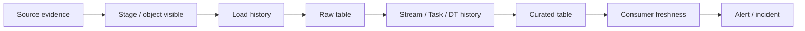

# Pipeline Observability, Latency, and Recovery

> The operational layer around Snowflake pipelines. Consultant lens: make ingestion and transformation explainable when a dashboard is stale, a file is missing, or a regulator asks what happened.

## Executive Summary

- **What it is:** The monitoring, freshness, alerting, and recovery patterns used to operate Snowflake data pipelines in production.
- **Why it matters:** A pipeline is not production-ready because it runs once; it is production-ready when failures, lag, duplicates, and backfills can be diagnosed and recovered.
- **Mental model:** Every pipeline needs evidence at each boundary: source arrival, ingestion, raw landing, change processing, transformation, publication, and consumption.
- **Best used when:** Data feeds support critical reporting, risk, finance, regulatory, customer, or operational workflows.
- **Avoid or reconsider when:** The dataset is exploratory and no consumer relies on freshness or completeness yet.

## What It Can Do

- Measure load health with copy, pipe, task, stream, and dynamic table metadata.
- Track latency with row timestamps and freshness checks.
- Detect where evidence disappears in a pipeline path.
- Support backfill and replay decisions after failures.
- Provide audit-friendly operating evidence for critical data products.

## What It Cannot Do

- Prove business correctness by itself; reconciliation rules and source contracts are still needed.
- Recover from non-idempotent downstream logic without manual repair.
- Replace application monitoring for systems outside Snowflake.
- Guarantee that target lag or schedules are always met.

## Core Concepts

| Concept | Meaning | Why it matters |
|---|---|---|
| Freshness | How current the output is relative to source events | Consumer-facing SLA |
| Latency | Time spent moving through pipeline steps | Helps find bottlenecks |
| Row timestamp | Snowflake-managed timestamp for measuring pipeline flow | Useful with dynamic tables and freshness measurement |
| Boundary evidence | Metadata proving a step happened | Lets you debug S3 to stage to pipe to table |
| Idempotent recovery | Rerunning produces the same final result | Makes backfill safer |
| Replay/backfill | Reprocessing history after failure or logic change | Needs raw retention and careful cutoffs |

## How It Works (Simple Flow)

1. Define expected source arrival, ingestion latency, transformation lag, and consumer freshness.
2. Add observable checkpoints at each boundary: file/object, stage visibility, load history, stream/task history, target row counts, and published freshness.
3. Use row timestamps or explicit source/load timestamps to measure elapsed time through the pipeline.
4. Alert on missing arrivals, failed tasks, stale streams, delayed dynamic table refreshes, and freshness breaches.
5. Recover with idempotent merges, bounded replay windows, or full rebuilds depending on target design.
6. Record incident evidence and update thresholds or retention to prevent repeat failures.

## Visuals



## Readable Snippets

```sql
-- Dynamic table refresh evidence
SELECT *
FROM TABLE(INFORMATION_SCHEMA.DYNAMIC_TABLE_REFRESH_HISTORY())
ORDER BY DATA_TIMESTAMP DESC;

-- Task execution evidence
SELECT *
FROM TABLE(INFORMATION_SCHEMA.TASK_HISTORY())
ORDER BY SCHEDULED_TIME DESC;

-- File load evidence
SELECT *
FROM SNOWFLAKE.ACCOUNT_USAGE.COPY_HISTORY
ORDER BY LAST_LOAD_TIME DESC;
```

## Consultant Talking Points

- **Client question this answers:** "The dashboard is stale. Where did the data stop moving?"
- **Trade-offs to mention:** More observability costs some design effort but reduces incident time and operational risk.
- **Risk or governance angle:** Critical data products need evidence, ownership, alert routing, retention, and escalation paths.
- **Cost/performance angle:** Avoid alerting by constantly recomputing everything; use metadata, row timestamps, and targeted checks.

## Common Pitfalls

- Monitoring only the final dashboard and not the pipeline boundaries.
- Alerting on task failure but not stale streams or delayed dynamic table refresh.
- Forgetting that a successful load can still contain duplicate or semantically wrong business events.
- Designing targets that cannot be safely replayed.
- Setting freshness expectations without a source-arrival contract.

## When to Recommend What (Decision Table)

| Situation | Recommend | Why | Watch-outs |
|---|---|---|---|
| Critical reporting feed | Boundary checks plus freshness alerts | Finds failures quickly | Needs ownership and escalation |
| Dynamic Table pipeline | Refresh history and row timestamps | Measures actual lag | Target lag is not a guarantee |
| Stream and Task pipeline | Task history plus stream staleness checks | Detects silent offset risk | Recovery depends on retention |
| File ingestion | Stage visibility, pipe status, copy history | Narrows source-to-load failures | Load history is not business reconciliation |
| Recovery after missed changes | Idempotent backfill or rebuild | Avoids double counting | Requires stable keys and raw retention |

## Related Topics

- [[01 Snowflake/04 Data Engineering/Data Engineering Overview]]
- [[01 Snowflake/04 Data Engineering/20 Streams and Tasks]]
- [[01 Snowflake/04 Data Engineering/21 Dynamic Tables]]
- [[01 Snowflake/04 Data Engineering/22 Snowpipe]]
- [[01 Snowflake/06 Cost Management and Operations/45 Account Usage Views]]

## Related Decision Notes

- [[80 Comparisons and Decision Notes/Decision Notes/Decisions - Choosing a Snowflake Notification Pattern]]

## Questions

- Which freshness SLA matters: source arrival, raw landing, curated publication, or dashboard render?
- What is the agreed recovery method for each critical table?
- Which pipeline incidents must stop publication rather than merely warn?

## Sources To Revisit

- [Snowflake Docs: Row timestamps](https://docs.snowflake.com/en/user-guide/data-engineering/row-timestamps)
- [Snowflake Docs: Dynamic Tables refresh history](https://docs.snowflake.com/en/user-guide/dynamic-tables-refresh)
- [Snowflake Docs: COPY_HISTORY](https://docs.snowflake.com/en/sql-reference/account-usage/copy_history)
- [Snowflake Docs: TASK_HISTORY](https://docs.snowflake.com/en/sql-reference/functions/task_history)

