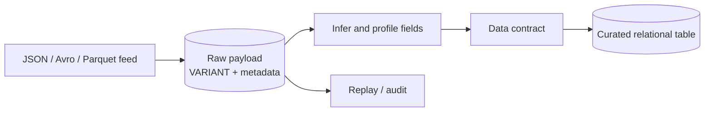

# Semi-structured Data, Schema Drift, and Data Contracts

> JSON, Avro, Parquet, XML, and evolving payloads in Snowflake. Consultant lens: preserve source truth while preventing silent schema changes from breaking downstream finance and risk logic.

## Executive Summary

- **What it is:** Snowflake patterns for loading, storing, querying, and governing semi-structured data, especially through `VARIANT`, file formats, schema inference, and schema evolution.
- **Why it matters:** Many investment-bank feeds are nested or evolving: trade events, reference data, APIs, market data, and vendor extracts.
- **Mental model:** Raw semi-structured payloads preserve evidence; curated relational columns create stable contracts for consumers.
- **Best used when:** Source schemas evolve, payloads are nested, or raw event evidence must survive downstream interpretation.
- **Avoid or reconsider when:** The data is already stable and relational; flattening early may be simpler and safer.

## What It Can Do

- Store nested JSON/XML/Avro/Parquet-like structures in `VARIANT`.
- Query nested paths directly in SQL.
- Preserve raw payloads for replay and audit.
- Infer file schemas and support schema evolution for selected loading patterns.
- Separate raw evidence from curated, contract-based tables.

## What It Cannot Do

- Make an unstable source contract safe by itself.
- Guarantee that every new field is meaningful, governed, or documented.
- Prevent downstream logic from breaking if teams query raw paths directly.
- Replace source-system ownership of breaking changes.

## Core Concepts

| Concept | Meaning | Why it matters |
|---|---|---|
| `VARIANT` | Snowflake data type for semi-structured values | Good for raw nested payloads |
| Path access | SQL expressions that read nested fields | Fast for exploration, risky as a consumer contract |
| Schema drift | Source shape changes over time | Common in APIs and event feeds |
| Schema evolution | Snowflake/table behavior that adapts to new incoming columns | Useful but must be governed |
| Data contract | Agreement about fields, types, meaning, and change process | Prevents accidental consumer breakage |
| Curated projection | Stable relational columns derived from raw payload | Safer interface for BI, dbt, and reporting |

## How It Works (Simple Flow)

1. Land source files or events with file metadata and load timestamps.
2. Preserve the original payload in raw storage, often as `VARIANT`.
3. Profile and infer expected fields, types, null behavior, and optional attributes.
4. Build curated projections with explicit casts and validation rules.
5. Detect schema drift and decide whether it is compatible, breaking, or irrelevant.
6. Version the consumer contract and communicate changes before downstream use.

## Visuals



## Readable Snippets

```sql
SELECT
    payload:trade_id::VARCHAR AS trade_id,
    payload:instrument.id::VARCHAR AS instrument_id,
    payload:quantity::NUMBER AS quantity,
    source_file,
    loaded_at
FROM raw.trade_events;
```

## Consultant Talking Points

- **Client question this answers:** "Should we load this JSON feed as raw VARIANT or flatten it immediately?"
- **Trade-offs to mention:** Raw `VARIANT` preserves evidence and flexibility; curated columns provide stable contracts and performance.
- **Risk or governance angle:** Consumers should not build critical reporting directly on undocumented raw JSON paths.
- **Cost/performance angle:** Repeated deep parsing can hurt readability and performance; materialize important fields into curated tables.

## Common Pitfalls

- Treating raw JSON structure as a governed contract.
- Flattening everything before understanding business meaning.
- Letting schema evolution silently add fields without ownership or review.
- Forgetting source file and row metadata, making replay difficult.
- Using load time as business event time.

## When to Recommend What (Decision Table)

| Situation | Recommend | Why | Watch-outs |
|---|---|---|---|
| Evolving event feed | Raw `VARIANT` plus curated projection | Preserves evidence and creates stable output | Needs drift detection |
| Stable vendor file | Flatten during load or early transform | Simpler consumer model | Revisit if vendor changes schema |
| Many optional nested fields | Keep raw plus selected fields | Avoids brittle wide tables | Consumers need documentation |
| Regulatory reporting | Curated contract table | Explicit types and definitions | Raw payload still retained for audit |
| Exploratory analysis | Query raw paths directly | Fast learning | Do not treat as production interface |

## Related Topics

- [[01 Snowflake/04 Data Engineering/Data Engineering Overview]]
- [[01 Snowflake/04 Data Engineering/19 Stages and Data Loading]]
- [[01 Snowflake/04 Data Engineering/24.5 Bonus chapter Data from A-Z]]
- [[01 Snowflake/04 Data Engineering/28 Pipeline Observability, Latency, and Recovery]]

## Related Decision Notes

- [[80 Comparisons and Decision Notes/Decision Notes/Decisions - Choosing a Snowflake Ingestion Method]]

## Questions

- Which raw fields are evidence, and which curated fields are the consumer contract?
- What source changes are compatible versus breaking?
- Who approves schema evolution for regulated outputs?

## Sources To Revisit

- [Snowflake Docs: Semi-structured data introduction](https://docs.snowflake.com/en/user-guide/semistructured-intro)
- [Snowflake Docs: Considerations for semi-structured data stored in VARIANT](https://docs.snowflake.com/en/user-guide/semistructured-considerations)
- [Snowflake Docs: Automatic table schema evolution](https://docs.snowflake.com/en/user-guide/data-load-schema-evolution)
- [Snowflake Docs: INFER_SCHEMA](https://docs.snowflake.com/en/sql-reference/functions/infer_schema)

