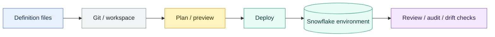

# DCM Projects and Snowflake Object Deployment

> [!abstract] Consultant lens
> **What it is:** Declarative Snowflake object management.
>
> **Why it matters:** Consultants need to place DCM Projects correctly beside dbt, Terraform, Snowflake CLI, and manual SQL migrations.

## Executive Summary

- **What it is:** DCM Projects are Snowflake's Database Change Management Projects for managing Snowflake objects as code with definition files and a plan/deploy workflow.
- **Why it matters:** Banks care deeply about repeatable dev/test/prod changes, reviewable deployments, and fewer manual production edits.
- **Mental model:** DCM is closer to Snowflake-native desired-state deployment; dbt owns analytical transformations; Terraform owns broader infrastructure state.
- **Best used when:** A team wants Snowflake objects defined in version-controlled files and deployed across environments with preview/plan discipline.
- **Avoid or reconsider when:** The object is better owned by dbt, Terraform, a migration framework, or an existing enterprise deployment process.

## What It Can Do

- Define Snowflake objects in files stored in Git or a workspace.
- Support repeatable deployments across environments.
- Help manage pipeline-related objects and tests where supported.
- Provide a Snowflake-native plan/deploy mental model.

## What It Cannot Do

- Replace dbt as the main transformation modeling framework.
- Replace Terraform for broad cloud and account-level infrastructure ownership.
- Remove the need for release discipline, reviews, environment promotion, and rollback design.
- Support every object and every lifecycle pattern equally.

## Core Concepts

| Concept | Meaning | Why it matters |
|---|---|---|
| DCM Project | Snowflake project for database change management | Organizes object definitions and deployments |
| Manifest | File describing included definitions and environment configuration | Makes deployment repeatable |
| Definition files | Files describing desired Snowflake objects | Enables code review and version control |
| Plan/deploy | Preview change impact before applying | Reduces manual production surprises |
| Environment | Dev, test, stage, prod configuration | Needed for bank-grade promotion |

## How It Works (Simple Flow)

1. Define Snowflake objects in project files.
2. Store the project in Git or a controlled workspace.
3. Configure environment-specific variables and targets.
4. Preview or plan the changes before applying them.
5. Deploy to the selected environment.
6. Monitor drift, ownership boundaries, and unsupported object patterns.

## Visuals



## Readable Snippets

```text
DCM project files define Snowflake objects.
dbt project files define transformation models.
Terraform files define infrastructure state.
The consultant question is which tool should own which object lifecycle.
```

## Consultant Talking Points

- **Client question this answers:** "How should we deploy Snowflake objects consistently across dev, test, and prod?"
- **Trade-offs to mention:** Snowflake-native desired state versus Terraform portability, dbt transformation lineage, and migration-style explicit change scripts.
- **Risk or governance angle:** Tool ownership boundaries must be clear or two systems will fight over the same object.
- **Cost/performance angle:** Deployment tooling is not usually a credit driver, but bad deployment discipline creates expensive incidents.

## Common Pitfalls

- Letting Terraform, dbt, DCM, and manual SQL all manage the same object.
- Treating deployment as a developer convenience instead of a governance boundary.
- Forgetting secrets, roles, policies, grants, and environment-specific configuration.
- Applying desired state without understanding destructive changes or drift.

## When to Recommend What (Decision Table)

| Situation | Recommend | Why | Watch-outs |
|---|---|---|---|
| Analytical model DAG | dbt | Transformations, tests, docs, lineage | Not ideal for every Snowflake object |
| Snowflake object deployment as code | DCM Projects | Snowflake-native plan/deploy flow | Confirm object support and ownership |
| Account/IaC baseline | Terraform | Desired-state infrastructure | Avoid high-churn SQL models |
| Project packaging/deploy commands | Snowflake CLI | Developer workflow and deployment utility | CLI executes; it is not always state owner |
| Highly ordered migrations | SQL migration tool | Explicit step-by-step changes | More manual lifecycle design |

## Related Topics

- [[01 Snowflake/04 Data Engineering/Data Engineering Overview]]
- [[01 Snowflake/04 Data Engineering/25 dbt on Snowflake]]
- [[01 Snowflake/07 Ecosystem and Integration/48 Snowflake CLI and Terraform Provider]]
- [[01 Snowflake/07 Ecosystem and Integration/49 Git Integration]]

## Related Decision Notes

- [[80 Comparisons and Decision Notes/Decision Notes/Cross-Tool/Decisions - Choosing a Snowflake DevOps and Deployment Pattern]]

## Questions

- Which tool owns each Snowflake object category?
- Where should grants, tags, policies, dynamic tables, and tasks live?
- How does the client promote changes through environments?

## Sources To Revisit

- [Snowflake Docs: DCM Projects overview](https://docs.snowflake.com/en/user-guide/dcm-projects/dcm-projects-overview)
- [Snowflake Docs: DCM Projects for data pipelines](https://docs.snowflake.com/en/user-guide/dcm-projects/dcm-projects-pipelines)
- [Snowflake Docs: DCM Projects files and templates](https://docs.snowflake.com/en/user-guide/dcm-projects/dcm-projects-files)
