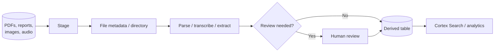

# Unstructured File Pipelines and Document Processing

> Governed file pipelines for PDFs, images, audio, video, and document extraction. Consultant lens: connect data engineering controls to AI-powered document workflows.

## Executive Summary

- **What it is:** Snowflake patterns for storing, indexing, accessing, parsing, and processing unstructured files such as contracts, PDFs, reports, images, audio, and video.
- **Why it matters:** Many bank workflows start as files, not clean tables: client documents, regulatory filings, research reports, KYC artifacts, trade confirmations, and scanned forms.
- **Mental model:** Files live in stages; metadata and directory tables make them discoverable; scoped URLs and Cortex/Snowpark functions turn them into governed data products.
- **Best used when:** Document/file processing should stay close to governed Snowflake data and downstream analytics.
- **Avoid or reconsider when:** The client already has a specialized document platform or the workflow requires capabilities outside Snowflake's current file and AI surface.

## What It Can Do

- Store or reference files in internal/external stages.
- Use file metadata and directory-table style patterns to track files.
- Parse or extract text, layout, images, entities, and tables through Cortex document functions where supported.
- Feed Cortex Search, RAG, classification, extraction, or downstream review workflows.
- Keep source files and derived outputs under Snowflake governance.

## What It Cannot Do

- Make low-quality scans, bad OCR, or ambiguous documents perfectly reliable.
- Replace document-management systems for all retention, workflow, and legal-hold requirements.
- Remove the need for human review on high-impact extractions.
- Guarantee every document function is available in every region without cross-region considerations.

## Core Concepts

| Concept | Meaning | Why it matters |
|---|---|---|
| Stage | Storage location for files | Entry point for unstructured data |
| Directory table | Metadata about staged files | Lets pipelines discover and track files |
| Scoped URL | Controlled file access URL | Safer than broad direct storage access |
| Document parsing | Convert documents to text/layout/images | Foundation for search and extraction |
| Document extraction | Pull structured fields from documents | Turns files into reviewable data |
| Human review | Manual validation of uncertain/high-impact outputs | Required for bank-grade trust |

## How It Works (Simple Flow)

1. Land or reference files in a governed stage.
2. Track file metadata, ownership, classification, and processing status.
3. Parse files into text, layout, images, or transcript outputs where supported.
4. Extract structured fields or generate embeddings/search indexes.
5. Validate quality with confidence signals, review queues, or sampling.
6. Publish approved derived tables while preserving the original file as evidence.

## Visuals



## Readable Snippets

```sql
-- Representative pattern only:
-- 1. Store file reference and metadata.
-- 2. Parse or extract with Cortex document functions.
-- 3. Persist reviewed derived fields rather than recomputing in dashboards.
```

## Consultant Talking Points

- **Client question this answers:** "Can we process contracts, KYC files, or reports inside Snowflake instead of exporting them to another AI stack?"
- **Trade-offs to mention:** Snowflake governance and data proximity versus specialist document-platform features and model quality constraints.
- **Risk or governance angle:** Documents often contain PII, MNPI, legal terms, or regulated content; access, regional inference, and review thresholds matter.
- **Cost/performance angle:** Document parsing and extraction can be expensive at scale; process incrementally and persist outputs.

## Common Pitfalls

- Treating AI-extracted fields as source-of-record facts.
- Reprocessing the same large documents repeatedly.
- Forgetting file retention, legal hold, classification, and access policies.
- Ignoring regional availability and cross-region inference rules.
- Building search over unreviewed or poorly classified documents.

## When to Recommend What (Decision Table)

| Situation | Recommend | Why | Watch-outs |
|---|---|---|---|
| Text-heavy documents need search | Parse plus Cortex Search | Enables RAG and semantic retrieval | Chunking and access filters matter |
| Known fields need extraction | AI_EXTRACT-style pipeline | Produces structured output | Validate with review thresholds |
| Images or scanned documents matter | Layout/OCR-aware parsing | Captures more context | Quality varies by file |
| High-impact decisions | Human-reviewed extraction | Reduces AI error risk | Slower and more expensive |
| Enterprise records workflow | Specialist document platform plus Snowflake integration | Better lifecycle features | More integration work |

## Related Topics

- [[01 Snowflake/04 Data Engineering/Data Engineering Overview]]
- [[01 Snowflake/05 Advanced Analytics and AI/42 Document and Multimodal AI]]
- [[01 Snowflake/05 Advanced Analytics and AI/37 Cortex Search and RAG]]
- [[01 Snowflake/05 Advanced Analytics and AI/39 AI Governance, Guardrails, Observability, and Cost]]
- [[01 Snowflake/08 Enterprise Snowflake in Production/57 Platform Extensions and Operational Workloads]]

## Related Decision Notes

- [[80 Comparisons and Decision Notes/Decision Notes/Decisions - Choosing a Snowflake AI and ML Pattern]]

## Questions

- Which documents can legally be processed by Snowflake Cortex in the approved region?
- What fields require human review before publication?
- How should file-level access map to derived text chunks and embeddings?

## Sources To Revisit

- [Snowflake Docs: Cortex AI Functions for documents](https://docs.snowflake.com/en/user-guide/snowflake-cortex/ai-documents)
- [Snowflake Docs: AI_PARSE_DOCUMENT](https://docs.snowflake.com/en/user-guide/snowflake-cortex/parse-document)
- [Snowflake Docs: AI_EXTRACT](https://docs.snowflake.com/en/user-guide/snowflake-cortex/document-extraction)

