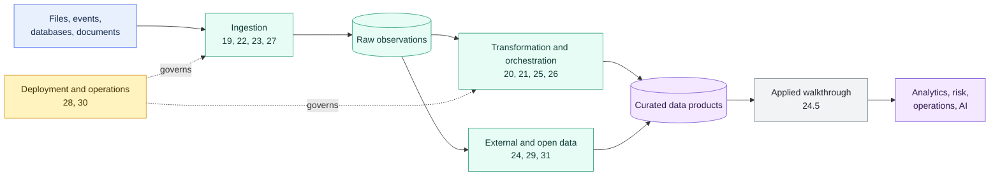

# Data Engineering Overview

> [!abstract] Chapter outcome
> Build a consultant-level view of how data enters Snowflake, moves through reliable transformations, remains observable, and reaches governed consumers.
>
> By the end, you should be able to select an ingestion and orchestration pattern, explain its operational trade-offs, and identify where deployment, recovery, and data contracts belong.

## Topics

- [[01 Snowflake/04 Data Engineering/19 Stages and Data Loading|19 - Stages and Data Loading]]
- [[01 Snowflake/04 Data Engineering/20 Streams and Tasks|20 - Streams and Tasks]]
- [[01 Snowflake/04 Data Engineering/21 Dynamic Tables|21 - Dynamic Tables]]
- [[01 Snowflake/04 Data Engineering/22 Snowpipe|22 - Snowpipe]]
- [[01 Snowflake/04 Data Engineering/23 Snowpipe Streaming|23 - Snowpipe Streaming]]
- [[01 Snowflake/04 Data Engineering/24 External Tables and Iceberg|24 - External Tables and Iceberg]]
- [[01 Snowflake/04 Data Engineering/24.5 Bonus chapter Data from A-Z|24.5 - Bonus: Investment Data from A-Z]]
- [[01 Snowflake/04 Data Engineering/25 dbt on Snowflake|25 - dbt on Snowflake]]
- [[01 Snowflake/04 Data Engineering/26 Stored Procedures|26 - Stored Procedures]]
- [[01 Snowflake/04 Data Engineering/27 Openflow and Source Connectors|27 - Openflow and Source Connectors]]
- [[01 Snowflake/04 Data Engineering/28 Pipeline Observability, Latency, and Recovery|28 - Pipeline Observability, Latency, and Recovery]]
- [[01 Snowflake/04 Data Engineering/29 Semi-structured Data, Schema Drift, and Data Contracts|29 - Semi-structured Data, Schema Drift, and Data Contracts]]
- [[01 Snowflake/04 Data Engineering/30 DCM Projects and Snowflake Object Deployment|30 - DCM Projects and Snowflake Object Deployment]]
- [[01 Snowflake/04 Data Engineering/31 Unstructured File Pipelines and Document Processing|31 - Unstructured File Pipelines and Document Processing]]

## Chapter Map

Read the map from left to right: land source evidence, choose the right transformation model, wrap it in deployment and operational controls, then publish governed products.

## Topic Summaries

| Topic | What it unlocks |
|---|---|
| [[01 Snowflake/04 Data Engineering/19 Stages and Data Loading\|19 - Stages and Data Loading]] | The file, stage, format, and `COPY INTO` foundations behind bulk ingestion. |
| [[01 Snowflake/04 Data Engineering/20 Streams and Tasks\|20 - Streams and Tasks]] | Explicit CDC and scheduled or triggered in-database orchestration. |
| [[01 Snowflake/04 Data Engineering/21 Dynamic Tables\|21 - Dynamic Tables]] | Declarative transformations that Snowflake refreshes to a freshness target. |
| [[01 Snowflake/04 Data Engineering/22 Snowpipe\|22 - Snowpipe]] | Event-driven, file-based ingestion without a user-managed warehouse schedule. |
| [[01 Snowflake/04 Data Engineering/23 Snowpipe Streaming\|23 - Snowpipe Streaming]] | Low-latency row ingestion for Kafka, event streams, and application writes. |
| [[01 Snowflake/04 Data Engineering/24 External Tables and Iceberg\|24 - External Tables and Iceberg]] | Query-in-place and open-table choices when data should remain in object storage. |
| [[01 Snowflake/04 Data Engineering/24.5 Bonus chapter Data from A-Z\|24.5 - Investment Data from A-Z]] | An applied path from source trade events to governed positions and exposures. |
| [[01 Snowflake/04 Data Engineering/25 dbt on Snowflake\|25 - dbt on Snowflake]] | Native dbt deployment, scheduling, access, monitoring, and recovery choices. |
| [[01 Snowflake/04 Data Engineering/26 Stored Procedures\|26 - Stored Procedures]] | Procedural control for multi-step, transactional, or privilege-sensitive operations. |
| [[01 Snowflake/04 Data Engineering/27 Openflow and Source Connectors\|27 - Openflow and Source Connectors]] | A framework for deciding who should own source-to-Snowflake movement. |
| [[01 Snowflake/04 Data Engineering/28 Pipeline Observability, Latency, and Recovery\|28 - Pipeline Observability, Latency, and Recovery]] | Evidence and recovery paths when freshness or processing fails. |
| [[01 Snowflake/04 Data Engineering/29 Semi-structured Data, Schema Drift, and Data Contracts\|29 - Semi-structured Data, Schema Drift, and Data Contracts]] | Source-truth preservation without allowing schema drift to break downstream logic. |
| [[01 Snowflake/04 Data Engineering/30 DCM Projects and Snowflake Object Deployment\|30 - DCM Projects and Snowflake Object Deployment]] | Declarative object deployment alongside dbt, Terraform, CLI, and SQL migrations. |
| [[01 Snowflake/04 Data Engineering/31 Unstructured File Pipelines and Document Processing\|31 - Unstructured File Pipelines and Document Processing]] | Governed processing for documents, images, audio, and other file-based data. |

## Consultant Synthesis

Start with the workload's unit of arrival and latency requirement:

1. **Files in batches:** stages plus `COPY INTO`.
2. **Files arriving continuously:** Snowpipe.
3. **Rows arriving continuously:** Snowpipe Streaming or a managed connector.
4. **Declarative SQL freshness:** Dynamic Tables or dbt.
5. **Explicit CDC or procedural control:** Streams, Tasks, and—only where needed—Stored Procedures.
6. **Data must remain open or external:** External Tables or Iceberg, with performance and governance trade-offs stated explicitly.

Whatever pattern you choose, design observability, recovery, schema control, and deployment ownership with the pipeline rather than after it.

## How To Use This Area

Begin with topics 19–24 for the core ingestion and transformation primitives. Use topic 24.5 to connect them in one applied pipeline, then continue with topics 25–31 for deployment, operations, evolving payloads, connectors, and document workflows.

## Related Areas

- [[00 Home/Snowflake Learning Map|Snowflake Learning Map]]
- [[01 Snowflake/02 Performance and Optimization/Performance and Optimization Overview|Performance and Optimization]]
- [[01 Snowflake/03 Security and Governance/Security and Governance Overview|Security and Governance]]
- [[01 Snowflake/06 Cost Management and Operations/Cost Management and Operations Overview|Cost Management and Operations]]
