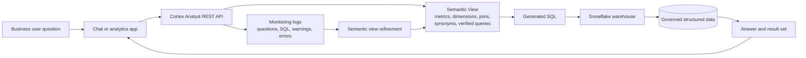

# Cortex Analyst

> Natural-language-to-SQL over governed Semantic Views. Consultant lens: self-service analytics succeeds only when business semantics, metrics, joins, permissions, and evaluation are explicitly modeled.

## Executive Summary

- **What it is:** Cortex Analyst is a managed Snowflake AI capability and REST API that translates business questions into SQL over structured Snowflake data.
- **Why it matters:** It lets business users ask governed analytical questions in natural language without every user needing to write SQL.
- **Mental model:** **Cortex Analyst is not an LLM pointed at every table. It is a text-to-SQL layer constrained by a semantic contract.**
- **Best used when:** The domain is focused, source data is trusted, business metrics are defined, the semantic layer has an owner, and generated SQL can be reviewed, evaluated, and monitored.
- **Avoid or reconsider when:** Metric definitions are disputed, source data is untrusted, the user expects arbitrary questions across the whole warehouse, no one owns the semantic layer, or a certified recurring dashboard is the better product.

## What It Can Do

- Answer natural-language questions over structured Snowflake data.
- Use Semantic Views to understand business-friendly metrics, dimensions, entities, joins, synonyms, and example queries.
- Generate SQL that can be run against governed Snowflake data.
- Return text explanations, SQL, and suggestions when a question is ambiguous or underspecified.
- Support multi-turn chat patterns when the application sends the relevant conversation history with each request.
- Work through the Cortex Analyst REST API in custom applications such as Streamlit apps, portals, Slack bots, or internal analytics assistants.
- Route a question across one or more semantic sources when configured to do so.
- Respect Snowflake security controls such as RBAC, masking policies, and row access policies when SQL is executed with the user or application role.
- Log prompts, generated SQL, warnings, errors, and request metadata for monitoring and improvement.
- Use verified queries and evaluations to improve trust in generated SQL.

## What It Cannot Do

- Fix unclear KPI definitions, weak data modeling, or poor data quality.
- Infer all business meaning safely from raw table and column names.
- Answer questions outside the modeled semantic domain.
- Answer broad strategy questions that are not resolvable with SQL.
- Guarantee that generated SQL captured the user's intended meaning.
- Replace certified dashboards for recurring board, finance, or regulatory reporting.
- Remember previous result sets on its own; applications must pass conversation history, and Cortex Analyst does not automatically inspect prior query results.
- Avoid cost; messages processed by Cortex Analyst and generated SQL run against Snowflake resources.
- Remove the need for data ownership, evaluation, access design, and monitoring.

## Core Concepts

| Concept | Meaning | Why it matters |
|---|---|---|
| Cortex Analyst | Managed natural-language-to-SQL capability for structured data | Turns business questions into SQL, but only inside a modeled semantic boundary |
| Semantic View | Native Snowflake schema-level object that stores business semantics over physical data | Recommended modern contract between business language and Snowflake tables |
| Semantic model YAML | Older stage-based YAML model format for Cortex Analyst | Still useful to recognize, but new implementations should prefer native Semantic Views |
| Logical table | Business entity such as customers, orders, accounts, claims, or transactions | Gives Cortex Analyst business-shaped objects instead of raw physical schemas |
| Dimension | Attribute used to group, filter, or describe results | Examples: region, customer segment, order status, product category |
| Time dimension | Date or timestamp attribute used for time analysis | Enables questions like "last quarter" or "monthly revenue" |
| Fact | Row-level numerical or measurable value | Raw ingredient for metrics, such as order amount or discount amount |
| Metric | Governed aggregate calculation | Defines KPIs such as net revenue, order count, average order value, or churn rate |
| Relationship | Join path between logical tables | Prevents the model from guessing joins incorrectly |
| Synonym | Alternative business term for a table, dimension, fact, or metric | Helps map "sales," "net revenue," and "turnover" to the right governed metric |
| Verified query | Reviewed natural-language question paired with expected SQL | Teaches common patterns and supports evaluation |
| Generated SQL | SQL produced by Cortex Analyst for the user's question | Should be visible to analysts and monitored like any other generated code |
| Suggestion | Follow-up prompt or clarification returned by Cortex Analyst | Helps guide users toward answerable, well-scoped questions |
| Conversation history | Prior chat messages sent again by the application | Enables follow-ups, but increases cost and does not equal persistent memory |
| Evaluation | Test set of questions with expected SQL or reviewed answers | Required to measure quality before broad rollout |
| Monitoring logs | Records of requests, generated SQL, errors, warnings, and metadata | Lets teams debug failures, track adoption, and refine the semantic layer |

## How It Works (Simple Flow)

1. **Choose a focused domain:** Start with a manageable business area such as revenue analytics, customer support, claims, or subscriptions.
2. **Model business concepts:** Create a Semantic View with logical tables, dimensions, time dimensions, facts, metrics, and relationships.
3. **Add language help:** Add descriptions, synonyms, custom instructions, and verified queries that reflect how users actually ask questions.
4. **Ask through an app or API:** A chat UI or workflow sends the user question and target Semantic View to the Cortex Analyst REST API.
5. **Generate SQL:** Cortex Analyst uses the semantic contract to interpret the question and produce SQL, a clarification, or a suggestion.
6. **Execute under governance:** The SQL runs in Snowflake using the chosen role, warehouse, and applicable access controls.
7. **Return and review results:** The application shows the answer, SQL, and result set where appropriate.
8. **Improve the semantic layer:** Analysts inspect logs and failed questions, add verified queries, tighten definitions, and re-evaluate.

## Visuals



The important loop is not just **question to answer**. It is **question to SQL to monitoring to semantic-model improvement**.

## Readable Snippets

### What a Semantic View YAML can look like

```yaml
name: sales_revenue_semantic_view
description: "Business layer for asking revenue questions by customer, region, and order date."

tables:
  - name: customers
    description: "One row per customer."
    base_table:
      database: ANALYTICS
      schema: MART
      table: DIM_CUSTOMER
    primary_key:
      columns:
        - CUSTOMER_ID
    dimensions:
      - name: customer_name
        synonyms: ["client", "account name"]
        description: "Display name of the customer."
        expr: CUSTOMER_NAME
        data_type: VARCHAR

      - name: customer_region
        synonyms: ["region", "market"]
        description: "Sales region assigned to the customer."
        expr: REGION
        data_type: VARCHAR
        is_enum: true

  - name: orders
    description: "One row per customer order."
    base_table:
      database: ANALYTICS
      schema: MART
      table: FACT_ORDERS
    primary_key:
      columns:
        - ORDER_ID

    time_dimensions:
      - name: order_date
        synonyms: ["purchase date", "sales date"]
        description: "Date the order was placed."
        expr: ORDER_DATE
        data_type: DATE

    dimensions:
      - name: order_status
        synonyms: ["status", "order state"]
        description: "Current status of the order."
        expr: STATUS
        data_type: VARCHAR
        is_enum: true

    facts:
      - name: gross_revenue_amount
        description: "Order amount before discounts."
        expr: GROSS_AMOUNT
        data_type: NUMBER

      - name: net_revenue_amount
        description: "Order amount after discounts."
        expr: GROSS_AMOUNT - DISCOUNT_AMOUNT
        data_type: NUMBER

    metrics:
      - name: total_net_revenue
        synonyms: ["revenue", "net sales", "sales"]
        description: "Total revenue after discounts."
        expr: SUM(GROSS_AMOUNT - DISCOUNT_AMOUNT)

      - name: average_order_value
        synonyms: ["AOV", "avg order value"]
        description: "Average net revenue per order."
        expr: AVG(GROSS_AMOUNT - DISCOUNT_AMOUNT)

      - name: order_count
        synonyms: ["number of orders", "orders"]
        description: "Count of orders."
        expr: COUNT(ORDER_ID)

relationships:
  - name: orders_to_customers
    left_table: orders
    right_table: customers
    relationship_columns:
      - left_column: CUSTOMER_ID
        right_column: CUSTOMER_ID
    relationship_type: many_to_one

module_custom_instructions:
  sql_generation: |
    If the user says "revenue", use total_net_revenue unless they explicitly ask for gross revenue.

verified_queries:
  - name: net_revenue_by_region
    question: "What was net revenue by region?"
    sql: |
      SELECT
        customer_region,
        AGG(total_net_revenue) AS total_net_revenue
      FROM sales_revenue_semantic_view
      GROUP BY customer_region
      ORDER BY total_net_revenue DESC;
    use_as_onboarding_question: true
```

The YAML is the business contract. It tells Cortex Analyst what "customer," "region," "revenue," and "order date" mean before any user asks a question.

### Calling Cortex Analyst with a Semantic View

```json
{
  "messages": [
    {
      "role": "user",
      "content": [
        {
          "type": "text",
          "text": "What was net revenue by customer region last quarter?"
        }
      ]
    }
  ],
  "semantic_view": "ANALYTICS.MART.SALES_REVENUE_SEMANTIC_VIEW"
}
```

In a real app, the response can include generated SQL, explanatory text, or suggestions. The app decides whether to show the SQL, execute it, ask for clarification, or route it for review.

### Querying a Semantic View directly

```sql
SELECT *
FROM SEMANTIC_VIEW(
    sales_revenue_semantic_view
    DIMENSIONS customers.customer_region
    METRICS orders.total_net_revenue
)
ORDER BY total_net_revenue DESC;
```

This is useful because Semantic Views are not only for chat. They can also provide governed metrics to SQL users and BI-style workflows.

### Monitoring Cortex Analyst requests

```sql
SELECT *
FROM TABLE(
    SNOWFLAKE.LOCAL.CORTEX_ANALYST_REQUESTS(
        'SEMANTIC_VIEW',
        'ANALYTICS.MART.SALES_REVENUE_SEMANTIC_VIEW'
    )
);
```

Use monitoring to inspect generated SQL, warnings, errors, and patterns in failed user questions.

## Consultant Talking Points

- **Client question this answers:** "Can business users ask governed metric questions without waiting for an analyst to write SQL each time?"
- **Trade-offs to mention:** Cortex Analyst can speed up ad hoc analysis, but it requires semantic modeling, metric ownership, UI or workflow design, evaluation, and support. It is not a magic chatbot over the warehouse.
- **Risk or governance angle:** Generated SQL still runs under Snowflake controls, but prompts, logs, semantic exposure, row access, masking, and role design need deliberate governance. Access commonly depends on Cortex-related database roles plus privileges on the semantic objects and data path.
- **Cost/performance angle:** Costs can include Cortex Analyst message processing and warehouse execution of generated SQL. Broad questions can produce expensive queries, so teams should monitor query profiles, use sensible warehouses, define guardrails, and budget for experimentation.

## Common Pitfalls

- **Pointing it at raw schemas:** Table and column names rarely carry enough business meaning for reliable natural-language analytics.
- **Starting with the whole enterprise:** A focused first domain beats a sprawling "ask anything about anything" launch.
- **No metric owner:** If Finance, Sales, and Product disagree on "revenue," Cortex Analyst will only make the disagreement faster.
- **Skipping verified queries:** Without reviewed examples, teams have a weak feedback loop for what "good SQL" means.
- **Treating answers as certified reporting:** Ad hoc generated SQL is useful, but recurring official KPIs still need governed dashboards, review, and release discipline.
- **Hiding generated SQL from analysts:** If no one can inspect the SQL, errors become harder to diagnose and trust is harder to build.
- **Forgetting conversation limits:** Follow-up questions require conversation history, and Cortex Analyst does not automatically know the result rows from a previous query.
- **Ignoring prompt and log sensitivity:** User questions, generated SQL, and errors can reveal sensitive business context.
- **Underestimating execution cost:** The natural-language part may feel lightweight, but generated SQL can still scan large data volumes.
- **Duplicating semantic layers:** If dbt metrics, BI metrics, and Snowflake Semantic Views define KPIs differently, users will lose trust.
- **No evaluation set:** A polished demo with five questions says little about production accuracy across real phrasing, edge cases, and ambiguous requests.
- **Overusing custom instructions:** Instructions can help, but they should not compensate for missing metrics, relationships, or governed definitions.

## When to Recommend What (Decision Table)

| Situation | Recommend | Why | Watch-outs |
|---|---|---|---|
| Business users need ad hoc answers over governed structured metrics | Cortex Analyst | Natural language can generate SQL against a modeled semantic layer | Requires strong Semantic Views, evaluation, and monitoring |
| Leaders need certified recurring KPIs | BI dashboard backed by governed metrics | Stable, reviewed, and easier to certify | Less flexible for open-ended questions |
| Analysts need reusable metric definitions across tools | Semantic Views plus BI or SQL access | Creates a governed business vocabulary | Ownership and compatibility across tools must be managed |
| Source data is messy or KPI definitions are disputed | Data modeling and metric governance first | Cortex Analyst amplifies semantics that already exist | Do not automate ambiguity |
| Users need summaries, classification, extraction, or sentiment over text | Cortex AI Functions | Better fit for unstructured or semi-structured content | Outputs are probabilistic and need evaluation |
| Users need search over documents or passages | Cortex Search | Retrieves relevant unstructured context | Search is not the same as governed metric calculation |
| Workflow needs multiple tools, retrieval, and actions | Cortex Agent or custom application layer | Coordinates analyst, search, functions, and business logic | More design and governance surface area |
| Data transformations or feature engineering are complex | dbt, Snowpark, Dynamic Tables, or pipelines first | Prepare reliable modeled data before conversational access | Do not push transformation logic into prompts |
| Query risk or spend must be tightly controlled | Guarded app workflow with budgets and query review | Keeps generated SQL from becoming an uncontrolled cost surface | Requires product design, monitoring, and role separation |

## Related Topics

- [[01 Snowflake/05 Advanced Analytics and AI/Advanced Analytics and AI Overview]]
- [[01 Snowflake/05 Advanced Analytics and AI/27 Cortex AI Functions]]
- [[01 Snowflake/05 Advanced Analytics and AI/30 Snowflake Notebooks]]
- [[01 Snowflake/04 Data Engineering/25 dbt on Snowflake]]
- [[01 Snowflake/03 Security and Governance/12 RBAC Roles and Privileges]]
- [[01 Snowflake/03 Security and Governance/13 Row Access Policies]]
- [[01 Snowflake/03 Security and Governance/14 Column-level Masking Policies]]
- [[01 Snowflake/06 Cost Management and Operations/34 Budgets]]

## Related Decision Notes

- [[80 Comparisons and Decision Notes/Decision Notes/Decisions - Choosing a Row-Level Data Isolation Strategy]]
- [[80 Comparisons and Decision Notes/Comparisons/Comparison - Resource Monitors vs Budgets]]

## Questions

- Which first domain is narrow enough for a reliable launch?
- Who owns the metric definitions and approves changes?
- Which dimensions, facts, metrics, and relationships must be modeled before user rollout?
- What are the top 20 real user questions, and what SQL should answer them?
- Which users and roles can access the Semantic View and the generated answers?
- Should business users see generated SQL, or should only analysts see it?
- How will failed questions, low-confidence answers, and expensive generated queries be reviewed?
- What prompts, logs, result sets, or generated SQL might contain sensitive information?
- How should Snowflake Semantic Views align with dbt, BI semantic layers, and existing KPI catalogs?

## Sources To Revisit

- [Snowflake Docs: Cortex Analyst](https://docs.snowflake.com/en/user-guide/snowflake-cortex/cortex-analyst)
- [Snowflake Docs: Cortex Analyst REST API](https://docs.snowflake.com/en/user-guide/snowflake-cortex/cortex-analyst/rest-api)
- [Snowflake Docs: Overview of Semantic Views](https://docs.snowflake.com/en/user-guide/views-semantic/overview)
- [Snowflake Docs: YAML specification for Semantic Views](https://docs.snowflake.com/en/user-guide/views-semantic/semantic-view-yaml-spec)
- [Snowflake Docs: Using SQL to create and manage Semantic Views](https://docs.snowflake.com/en/user-guide/views-semantic/sql)
- [Snowflake Docs: Querying Semantic Views](https://docs.snowflake.com/en/user-guide/views-semantic/querying)
- [Snowflake Docs: Cortex Analyst evaluations](https://docs.snowflake.com/en/user-guide/snowflake-cortex/cortex-analyst-evaluations)
- [Snowflake Docs: Cortex Analyst administrator monitoring](https://docs.snowflake.com/en/user-guide/snowflake-cortex/cortex-analyst/admin-observability)
