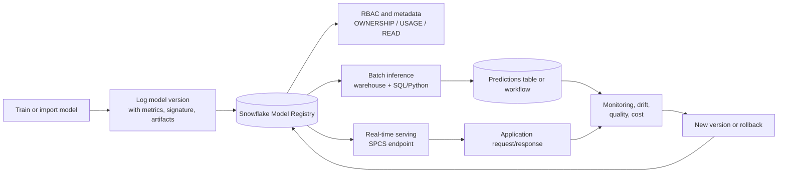

# ML Model Registry

> Governed model lifecycle management inside Snowflake. Consultant lens: turns trained ML artifacts into versioned, permissioned, callable production assets near governed data.

## Executive Summary

- **What it is:** Snowflake Model Registry is a Snowflake ML capability for storing, versioning, governing, and invoking machine learning models as Snowflake objects.
- **Why it matters:** It bridges the gap between "a model was trained" and "a model can be safely used, monitored, and rolled forward or back in production."
- **Mental model:** **A model registry is a governed package registry for ML models, but the package can be called from Snowflake SQL, Python, or serving endpoints.**
- **Best used when:** A team has custom or externally trained ML models that need versioning, metadata, access control, inference, lifecycle management, and observability close to Snowflake data.
- **Avoid or reconsider when:** The need is only a built-in Cortex function, a simple deterministic rule, an unvalidated experiment, a model that cannot be packaged safely, or a mature external MLOps platform already owns the full lifecycle.

## What It Can Do

- Store ML models as first-class schema-level Snowflake objects.
- Manage model names, versions, comments, tags, metrics, metadata, and artifacts.
- Register models trained in Snowflake or trained externally and brought into Snowflake.
- Support common Python model families such as Snowpark ML models, scikit-learn, XGBoost, LightGBM, Prophet, CatBoost, PyTorch, TensorFlow, Keras, MLflow PyFunc, Sentence Transformer, and Hugging Face pipelines.
- Support custom model types through Snowflake ML custom model packaging patterns.
- Define model signatures so Snowflake understands input and output schemas for model methods.
- Invoke model methods, such as `predict` or `transform`, from Python or SQL.
- Run batch inference on Snowflake virtual warehouses.
- Deploy model versions to Snowpark Container Services for real-time inference endpoints when low latency, larger models, GPUs, or custom runtimes are needed.
- Control access through Snowflake RBAC using model privileges such as `OWNERSHIP`, `USAGE`, and `READ`.
- Manage lifecycle using default versions, aliases, tags, or separate schemas for development and production.
- Support model observability, drift monitoring, inference logging, and explainability workflows.

## What It Cannot Do

- Train a high-quality model by itself.
- Prove that a model is accurate, fair, explainable, or safe for a business process.
- Fix bad features, biased training data, data leakage, or weak evaluation design.
- Replace model approval, validation, release management, or monitoring discipline.
- Automatically make every Python dependency, custom runtime, or large model easy to package.
- Remove warehouse, Snowpark Container Services, compute-pool, endpoint, or operational costs.
- Guarantee real-time serving is needed or worth the complexity.
- Make training-time features and inference-time features consistent unless the team designs that workflow.
- Automatically manage all Snowflake model-like objects through the same API; for example, some Snowflake ML Functions and some Cortex fine-tuned models have separate behavior from the Model Registry API.

## Core Concepts

| Concept | Meaning | Why it matters |
|---|---|---|
| Model Registry | Snowflake-managed registry within a database and schema | Central place to store, discover, version, and invoke ML models |
| Model object | First-class Snowflake object representing a named model | Enables RBAC, metadata, SQL access, information schema visibility, and lifecycle control |
| Model version | A specific registered version of a model | Allows comparison, promotion, rollback, and stable production release patterns |
| Model artifact | The serialized model files, code, and dependencies needed to run the model | Production inference depends on reproducible artifacts, not only notebook code |
| Model signature | Input and output schema for a model method | Lets Snowflake map Python model inputs and outputs to SQL and DataFrame columns |
| Method | Callable operation exposed by the model, such as `predict`, `transform`, or `predict_proba` | Defines what consumers can actually run |
| Metrics | Stored model quality values such as AUC, RMSE, F1, precision, or recall | Helps compare versions and support release decisions |
| Metadata | Comments, tags, descriptions, and other operational information | Makes model ownership, purpose, and governance easier to inspect |
| Default version | Version used when code calls a model without specifying a version | Lets consumers use stable code while owners manage the chosen production version |
| Alias | Stable name pointing to a version, such as `PROD`, `CANDIDATE`, or `LAST` | Allows rollout without changing consuming SQL or Python code |
| Warehouse inference | Running model methods through Snowflake virtual warehouses | Good fit for batch scoring over tables and SQL-centric workflows |
| SPCS inference | Running model serving on Snowpark Container Services | Better fit for real-time endpoints, larger models, GPUs, or custom runtime requirements |
| `USAGE` privilege | Permission to use a model for warehouse inference without seeing internals | Good for consumers who need predictions but not artifacts |
| `READ` privilege | Permission that can expose model metadata/artifacts and supports SPCS inference patterns | Use more carefully because it can reveal more than simple inference access |
| Observability | Monitoring model performance, drift, logs, and inference behavior | Production models decay without monitoring and retraining signals |
| Explainability | Techniques such as feature contribution analysis for model predictions | Important for debugging, trust, regulated use cases, and human review |

## How It Works (Simple Flow)

1. **Train or obtain a model:** A data scientist trains a model in Snowflake, a notebook, or an external ML environment.
2. **Prepare the runtime contract:** Define dependencies, target runtime, model methods, sample input data, and/or explicit signatures.
3. **Log the model:** Use the Snowflake ML Python API to register a model name and version with metrics, metadata, and artifacts.
4. **Govern access:** Grant `USAGE` or `READ` to the right roles and separate owner, deployer, and consumer responsibilities.
5. **Promote a version:** Use a default version, alias, tags, or separate schema pattern to identify the approved version.
6. **Run inference:** Call the model from Python, SQL, batch jobs, dynamic tables, or a real-time service.
7. **Monitor production behavior:** Track inference volume, errors, latency, drift, quality, and cost.
8. **Iterate safely:** Register a new version, compare metrics, test it, promote it, and roll back if needed.

## Visuals



The registry is not only a storage shelf. It is the control point between model development, governed access, inference, and operational feedback.

## Readable Snippets

### Register a trained Python model

```python
from snowflake.ml.registry import Registry

registry = Registry(
    session=session,
    database_name="ML",
    schema_name="REGISTRY"
)

model_version = registry.log_model(
    clf,
    model_name="CHURN_CLASSIFIER",
    version_name="v1",
    sample_input_data=train_features,
    metrics={
        "auc": 0.87,
        "f1": 0.74
    },
    comment="Predicts customer churn risk from account activity features."
)
```

The `sample_input_data` helps Snowflake infer the model signature. For production, prefer explicit and meaningful input/output names when inference consumers need a stable contract.

### Retrieve a model version and run inference in Python

```python
registry = Registry(
    session=session,
    database_name="ML",
    schema_name="REGISTRY"
)

model = registry.get_model("CHURN_CLASSIFIER")
v1 = model.version("v1")

predictions = v1.run(
    input_features,
    function_name="predict"
)

predictions.show()
```

This pattern is useful in Snowpark or notebook workflows where predictions remain close to Snowflake data.

### Call a registered model from SQL

```sql
SELECT
    customer_id,
    MODEL(CHURN_CLASSIFIER, v1)!predict(
        tenure_months,
        monthly_spend,
        support_ticket_count
    ) AS churn_prediction
FROM customers_to_score;
```

The exact method and arguments depend on the model signature. Before exposing a model broadly, inspect the model methods and signature so SQL consumers call it correctly.

### Use a dynamic table for incremental inference

```sql
CREATE OR REPLACE DYNAMIC TABLE customers_with_churn_predictions
    WAREHOUSE = ml_wh
    TARGET_LAG = '1 hour'
    REFRESH_MODE = INCREMENTAL
AS
SELECT
    c.customer_id,
    c.tenure_months,
    c.monthly_spend,
    c.support_ticket_count,
    MODEL(CHURN_CLASSIFIER, PROD)!predict(
        c.tenure_months,
        c.monthly_spend,
        c.support_ticket_count
    ) AS churn_prediction
FROM customers_to_score c;
```

This is a recognizable pattern for continuously scoring new or changed rows. Confirm that the model function is compatible with dynamic table requirements before using this design.

### Grant model access

```sql
GRANT USAGE ON MODEL CHURN_CLASSIFIER TO ROLE ANALYST_ROLE;

-- Use READ only when the role needs broader model metadata/artifact access
-- or serving patterns that require it.
GRANT READ ON MODEL CHURN_CLASSIFIER TO ROLE ML_PLATFORM_ROLE;
```

Use `USAGE` for prediction consumers when possible. Reserve broader access for roles that operate or inspect model internals.

## Consultant Talking Points

- **Client question this answers:** "How do we move a trained model from a notebook into governed production use near Snowflake data?"
- **Trade-offs to mention:** Keeping models in Snowflake simplifies data-local inference and governance, but the client accepts Snowflake-specific APIs, runtime constraints, dependency packaging decisions, and potentially SPCS operations for real-time serving.
- **Risk or governance angle:** A registered model is easier to control than a loose file, but it still needs approval gates, feature lineage, evaluation evidence, access design, explainability, monitoring, and rollback plans.
- **Cost/performance angle:** Warehouse inference is usually simpler for batch scoring. Real-time SPCS serving is useful for low-latency apps or GPU/custom runtime needs, but adds compute-pool, endpoint, autoscaling, observability, and cost-management concerns.

## Common Pitfalls

- **Confusing registration with validation:** A model can be registered and still be inaccurate, biased, stale, or unsafe.
- **Logging without a stable signature:** Poor input/output naming makes SQL inference brittle and hard for analysts to trust.
- **Hardcoding a version everywhere:** Use aliases, default versions, tags, or schema promotion patterns so production code does not require constant edits.
- **Skipping feature consistency:** Training and inference must use the same feature definitions, time windows, null handling, and encodings.
- **Granting `READ` too broadly:** Some consumers only need inference access; broader artifact visibility can create unnecessary governance exposure.
- **Using real-time serving by default:** Batch scoring is often cheaper, simpler, and more appropriate for analytics workflows.
- **Ignoring dependency packaging:** Python packages, model size, GPU needs, and target platform choices can block deployment late in the project.
- **No rollback plan:** A new model version should be promotable and reversible without rewriting every downstream consumer.
- **Monitoring only technical errors:** Production monitoring should include drift, quality, latency, volume, cost, and business impact.
- **Treating training metrics as production truth:** AUC, RMSE, or F1 from historical test data does not prove current production performance.
- **Letting model ownership drift:** Someone must own metric updates, retraining triggers, access reviews, and retirement decisions.
- **Forgetting inference data sensitivity:** Inputs and predictions can be sensitive even when the original training table was already governed.

## When to Recommend What (Decision Table)

| Situation | Recommend | Why | Watch-outs |
|---|---|---|---|
| Custom ML model needs governed lifecycle in Snowflake | Snowflake Model Registry | Provides versioning, metadata, RBAC, and callable inference near Snowflake data | Still needs validation, monitoring, and feature governance |
| Need to score large Snowflake tables on a schedule | Registry plus warehouse batch inference | Simple SQL/Python workflow close to data | Warehouse sizing, query cost, and repeated scoring |
| Need live predictions for a user-facing app | Registry plus SPCS real-time serving | Provides low-latency endpoint-style inference | Compute pools, endpoint security, autoscaling, and operational cost |
| Need GPU or custom runtime dependencies | SPCS model serving | More flexible runtime than warehouse inference | More operational complexity than warehouse-only inference |
| Need simple text classification, extraction, or summarization | Cortex AI Functions | Managed AI functions reduce custom model lifecycle work | Probabilistic outputs and token costs still require evaluation |
| Need governed natural-language analytics | Cortex Analyst | Generates SQL over a semantic model, not custom ML inference | Requires a high-quality semantic layer |
| Need deterministic business logic | SQL, dbt, rules engine, or stored procedure | Easier to audit and explain | Avoid pretending ML is needed |
| Organization already has mature MLOps outside Snowflake | Integrate or selectively use Snowflake Model Registry | Snowflake may be best for data-local inference, not necessarily the entire lifecycle | Avoid duplicating registries without clear ownership |
| Model is still exploratory | Notebook or experiment tracking first | Keeps early iteration lightweight | Do not expose exploratory versions as production assets |
| Predictions must be certified for regulated decisions | Registry plus formal model risk management | Registry supports governance but does not replace approval | Explainability, fairness, audit evidence, and human review may be required |

## Related Topics

- [[01 Snowflake/05 Advanced Analytics and AI/Advanced Analytics and AI Overview]]
- [[01 Snowflake/05 Advanced Analytics and AI/26 Snowpark]]
- [[01 Snowflake/05 Advanced Analytics and AI/27 Cortex AI Functions]]
- [[01 Snowflake/05 Advanced Analytics and AI/28 Cortex Analyst]]
- [[01 Snowflake/05 Advanced Analytics and AI/30 Snowflake Notebooks]]
- [[01 Snowflake/04 Data Engineering/21 Dynamic Tables]]
- [[01 Snowflake/03 Security and Governance/12 RBAC Roles and Privileges]]
- [[01 Snowflake/06 Cost Management and Operations/31 Credit Consumption Model]]
- [[01 Snowflake/06 Cost Management and Operations/34 Budgets]]

## Related Decision Notes

- [[80 Comparisons and Decision Notes/Decision Notes/Decisions - Choosing a Snowflake AI and ML Pattern]]
- [[80 Comparisons and Decision Notes/Comparisons/Comparison - Warehouse Inference vs SPCS Model Serving]]
- [[80 Comparisons and Decision Notes/Decision Notes/Decisions - Choosing a Warehouse Strategy by Workload Type]]

## Questions

- Who owns the model after it is registered: data science, data engineering, platform, or business risk?
- What model versions exist, and which one is approved for production?
- What signature should consumers rely on, and are input/output column names meaningful?
- Which metrics prove the model is good enough for this business use case?
- How are training features reproduced at inference time?
- Should predictions be generated in batch, real time, or both?
- Which roles need `USAGE`, and which roles genuinely need `READ` or ownership-level access?
- What logs, drift metrics, quality checks, and cost monitors will prove the model is behaving acceptably?
- How will the team roll back if a new model version performs worse?
- Are model inputs, outputs, artifacts, or inference logs sensitive enough to require extra controls?

## Sources To Revisit

- [Snowflake Docs: Model Registry overview](https://docs.snowflake.com/en/developer-guide/snowflake-ml/model-registry/overview)
- [Snowflake Docs: Managing models with the Model Registry](https://docs.snowflake.com/en/developer-guide/snowflake-ml/model-registry/model-management)
- [Snowflake Docs: Built-in model types](https://docs.snowflake.com/en/developer-guide/snowflake-ml/model-registry/built-in-models/overview)
- [Snowflake Docs: Specifying model signatures](https://docs.snowflake.com/en/developer-guide/snowflake-ml/model-registry/model-signature)
- [Snowflake Docs: Native batch inference with SQL](https://docs.snowflake.com/en/developer-guide/snowflake-ml/inference/native-batch-inference-sql)
- [Snowflake Docs: Real-time inference REST API](https://docs.snowflake.com/en/developer-guide/snowflake-ml/inference/real-time-inference-rest-api)
- [Snowflake Docs: Model explainability](https://docs.snowflake.com/en/developer-guide/snowflake-ml/model-registry/model-explainability)
- [Snowflake Docs: Auto-capture inference logs](https://docs.snowflake.com/en/developer-guide/snowflake-ml/inference/auto-capture-inference-logs)
