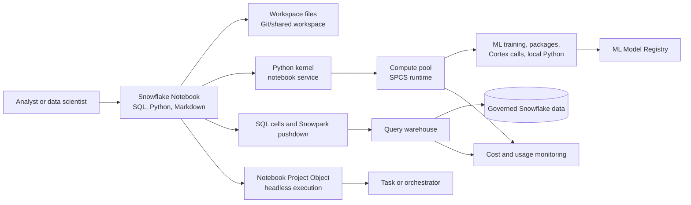

# Snowflake Notebooks

> Jupyter-style SQL and Python notebooks inside Snowflake. Consultant lens: useful for governed exploration, AI/ML prototyping, and repeatable analysis close to Snowflake data, but not a substitute for production engineering discipline.

## Executive Summary

- **What it is:** Snowflake Notebooks are interactive notebooks for SQL, Python, Markdown, Snowpark, visualization, and AI/ML workflows inside Snowflake.
- **Why it matters:** They let analysts and data scientists work close to governed Snowflake data without immediately exporting data to a separate notebook platform.
- **Mental model:** **A Snowflake Notebook is a governed workbench: part analysis document, part SQL/Python runtime, part bridge into Snowpark, Cortex, and the Model Registry.**
- **Best used when:** Teams need collaborative exploration, ML experimentation, SQL-plus-Python analysis, model development, lightweight repeatable jobs, or examples that should live near Snowflake data and permissions.
- **Avoid or reconsider when:** The work needs strict production CI/CD, complex orchestration, app-grade interfaces, heavy external dependencies, certified KPI reporting, or long-running pipelines better handled by dbt, Dynamic Tables, Snowpark jobs, Tasks, Streamlit, or an external MLOps platform.

## What It Can Do

- Run SQL, Python, and Markdown cells in one notebook experience.
- Query governed Snowflake data directly using SQL cells.
- Use Snowpark Python to push transformations back into Snowflake rather than pulling all data into local memory.
- Explore, profile, visualize, and document analytical findings.
- Prototype feature engineering, ML training, model evaluation, and model registration workflows.
- Call Cortex AI Functions from SQL or Python workflows.
- Work with files from Workspaces, stages, or approved repositories.
- Use Snowflake-managed container runtimes with CPU or GPU-backed compute pools for heavier Python/AI/ML work.
- Install additional packages through approved mechanisms such as artifact repositories, staged packages, External Access Integrations, or custom images.
- Integrate with Git or shared Workspaces for collaboration and version history.
- Run notebooks interactively or execute notebook projects headlessly for scheduled or orchestrated workflows.
- Monitor notebook-related warehouse and compute-pool usage through Snowflake usage metadata.

## What It Cannot Do

- Automatically turn exploratory notebook code into production-grade software.
- Replace data modeling, metric governance, testing, deployment review, or observability.
- Guarantee reproducibility if cells depend on hidden state, manual execution order, or untracked package versions.
- Eliminate compute cost; notebooks can consume both compute-pool credits and warehouse credits.
- Make broad external package or internet access safe without governance.
- Prevent users from pulling too much data into Python memory.
- Replace BI dashboards for certified recurring reporting.
- Replace Streamlit or an application framework for polished user-facing apps.
- Replace dbt, Dynamic Tables, Tasks, or Snowpark jobs for robust transformation pipelines.
- Remove the need to manage roles, warehouses, compute pools, secrets, files, and external access deliberately.

## Core Concepts

| Concept | Meaning | Why it matters |
|---|---|---|
| Notebook | Interactive document with executable SQL, Python, and Markdown cells | Good for exploration, explanation, prototyping, and lightweight repeatable analysis |
| Workspaces | Newer Snowflake development experience for notebooks, files, tabs, and project organization | Current forward-looking notebook experience; prefer for new work over legacy notebooks |
| Legacy Notebooks | Older Snowflake notebook experience | Existing clients may still have them, but new implementations should check the Workspaces path first |
| Notebook service | Snowflake-managed service that hosts the Python kernel for notebooks in Workspaces | Determines runtime, packages, idle timeout, and compute-pool usage |
| Compute pool | Snowpark Container Services compute used by notebook services | Drives Python/kernel cost and supports CPU/GPU container execution |
| Query warehouse | Virtual warehouse used for SQL and Snowpark pushdown queries | Separate cost and performance surface from the notebook kernel |
| Warehouse inference | Batch model inference run through SQL or Snowflake warehouse compute | Good for scoring tables and feeding predictions into analytics workflows |
| SPCS | Snowpark Container Services, Snowflake's managed container runtime | Used for notebook services, custom runtimes, GPU support, and real-time model services |
| External Access Integration | Governed outbound network access from Snowflake to approved endpoints | Needed for approved external package repositories, APIs, or private resources |
| Package management | Controlling Python dependencies in the notebook runtime | Affects reproducibility, security, and whether code runs consistently |
| Git-integrated workspace | Workspace connected to source control | Supports version history, collaboration, review, and recovery |
| Notebook Project Object | Schema-level production-oriented notebook project object | Lets notebooks be executed non-interactively as pipeline units |
| Headless execution | Running a notebook outside the editor from SQL, tasks, CLI, or orchestrators | Useful when a notebook becomes a repeatable workflow |
| Idle timeout | Time after which idle notebook services suspend | Important cost guardrail for interactive work |
| Secrets | Governed credentials exposed to notebooks through Snowflake mechanisms | Safer than hardcoding tokens or passwords in notebook cells |

## How It Works (Simple Flow)

1. **Create or open a workspace notebook:** The user works in Snowsight Workspaces or an existing notebook environment.
2. **Choose runtime and compute:** Select Python version, container runtime, compute pool, query warehouse, idle timeout, and external access settings.
3. **Run SQL and Python cells:** SQL queries use the query warehouse; Python code runs in the notebook service and often uses Snowpark for pushdown.
4. **Explore and document:** Combine queries, Python logic, charts, Markdown notes, and intermediate conclusions.
5. **Connect to AI/ML workflows:** Call Cortex functions, prepare features, train models, evaluate results, or register models in the Model Registry.
6. **Version and share:** Use Git-integrated or shared workspaces when the notebook should outlive a one-person experiment.
7. **Operationalize only when appropriate:** Convert repeatable notebooks into notebook project executions, scheduled tasks, Snowpark jobs, dbt models, Dynamic Tables, or apps depending on the production need.
8. **Monitor and govern:** Track compute-pool usage, warehouse usage, external access, package choices, secrets, and role-based data access.

## Visuals



The key architecture idea: notebooks can use **two compute surfaces**. The Python/kernel side can run on a compute pool, while SQL and Snowpark pushdown use a warehouse.

## Readable Snippets

### SQL exploration cell

```sql
SELECT
    customer_segment,
    COUNT(*) AS customers,
    AVG(monthly_spend) AS avg_monthly_spend
FROM analytics.mart.customers
GROUP BY customer_segment
ORDER BY avg_monthly_spend DESC;
```

This is the familiar analyst entry point: ask a question directly against governed Snowflake tables.

### Python cell using the active Snowflake session

```python
from snowflake.snowpark.context import get_active_session
from snowflake.snowpark.functions import avg, count

session = get_active_session()

customers = session.table("ANALYTICS.MART.CUSTOMERS")

segment_summary = (
    customers
    .group_by("CUSTOMER_SEGMENT")
    .agg(
        avg("MONTHLY_SPEND").alias("AVG_MONTHLY_SPEND"),
        count("CUSTOMER_ID").alias("CUSTOMERS")
    )
)

segment_summary.show()
```

Use Snowpark-style operations when the transformation should run in Snowflake rather than pulling large data into Python memory.

### Register a trained model from a notebook

```python
from snowflake.ml.registry import Registry

registry = Registry(
    session=session,
    database_name="ML",
    schema_name="REGISTRY"
)

registry.log_model(
    model,
    model_name="CHURN_CLASSIFIER",
    version_name="v1",
    sample_input_data=train_features,
    metrics={"auc": 0.87}
)
```

This is a common flow: explore and train in a notebook, then register the model so it becomes versioned and governed.

### Execute a notebook project headlessly

```sql
EXECUTE NOTEBOOK PROJECT ML.PROJECTS.CHURN_ANALYSIS
  MAIN_FILE = 'notebooks/churn_analysis.ipynb'
  COMPUTE_POOL = 'NOTEBOOK_POOL'
  QUERY_WAREHOUSE = 'ANALYTICS_WH'
  RUNTIME = '<runtime_version>'
  ARGUMENTS = 'target_schema=ANALYTICS';
```

Headless execution is useful for repeatable runs, CI/CD-style workflows, or task-based orchestration. Use fully qualified object names or set execution context clearly.

### Execute a notebook object directly

```sql
ALTER NOTEBOOK ML.PROJECTS.MONTHLY_ANALYSIS
  SET QUERY_WAREHOUSE = ANALYTICS_WH;

EXECUTE NOTEBOOK ML.PROJECTS.MONTHLY_ANALYSIS(
  'target_month=2026-06',
  'target_database=PROD_ANALYTICS'
);
```

This pattern is useful to recognize in existing accounts, especially where older notebook objects are already in use.

### The warehouse inference vs SPCS distinction

```text
Warehouse inference:
  SQL query -> virtual warehouse -> model scores many rows

SPCS:
  app/notebook/service -> compute pool -> containerized runtime or endpoint
```

Use **warehouse inference** when a model should score tables in batch. Use **SPCS** when the workload needs a container service, GPU, custom runtime, notebook kernel, or live endpoint.

## Consultant Talking Points

- **Client question this answers:** "Can our analysts and data scientists explore Snowflake data with SQL and Python without exporting everything to local notebooks?"
- **Trade-offs to mention:** Snowflake Notebooks improve governed proximity to data, but notebook workflows still need versioning, testing, ownership, cost controls, package governance, and a path from exploration to production.
- **Risk or governance angle:** Control roles, secrets, external access, packages, shared workspace permissions, and sensitive outputs. Notebook convenience should not bypass data access policy.
- **Cost/performance angle:** Separate compute-pool cost from query-warehouse cost. Idle notebook services, GPU pools, broad SQL queries, and pulling large data into Python can all become expensive.

## Common Pitfalls

- **Leaving notebook services running:** Idle timeout and compute-pool settings are real cost controls, not housekeeping trivia.
- **Treating notebooks as invisible production pipelines:** If a notebook feeds a business-critical process, it needs ownership, monitoring, and a support model.
- **Depending on hidden cell state:** Scheduled or headless runs must work top-to-bottom from a clean state.
- **Pulling too much data into Python memory:** Push heavy work to Snowflake with SQL or Snowpark whenever possible.
- **Installing packages casually:** External access, package policies, private repositories, and artifact repositories need security review.
- **Not using source control:** Important notebooks should live in Git-integrated or shared workflows, not only in one user's workspace.
- **Mixing exploration and production logic:** Keep exploratory sections separate from reusable, scheduled, or promoted logic.
- **Ignoring role context:** Results depend on the active role, warehouse, database, schema, and object privileges.
- **Using notebooks where an app is needed:** A polished user-facing workflow may belong in Streamlit, a Native App, or an external app.
- **Using notebooks where governed transformations are needed:** Durable data models are often better implemented in dbt, Dynamic Tables, Tasks, or Snowpark jobs.
- **No cost attribution:** Notebook workloads can use both compute pools and warehouses, so teams need monitoring by user, notebook, service, and warehouse.
- **Forgetting external access boundaries:** A notebook inside Snowflake should not become an unreviewed route to external APIs or package sources.

## When to Recommend What (Decision Table)

| Situation | Recommend | Why | Watch-outs |
|---|---|---|---|
| Analyst needs SQL plus Python exploration close to Snowflake data | Snowflake Notebooks | Fast, governed workbench with direct Snowflake access | Versioning, role context, and cost controls |
| Data scientist is prototyping ML on Snowflake data | Snowflake Notebooks plus Snowpark | Keeps feature work close to governed data | Avoid pulling too much data into Python memory |
| Model should be registered after experimentation | Snowflake Notebooks plus ML Model Registry | Smooth path from notebook training to governed model versioning | Registry does not replace validation |
| Predictions need to score many rows in Snowflake | Warehouse inference | SQL-friendly batch scoring on virtual warehouses | Query cost, model signature, and repeated scoring |
| Predictions need live app calls, GPU, or custom runtime | SPCS serving | Containerized service/API pattern | Compute-pool operations, endpoint security, and cost |
| Notebook needs approved external packages or APIs | External Access Integration or artifact repository | Gives controlled outbound access | Requires admin setup and package/security governance |
| Notebook has become a scheduled repeatable workflow | Notebook Project Object, Task, or orchestrator | Headless execution can run top-to-bottom consistently | Hidden state and dependency drift can break runs |
| Notebook is now core transformation logic | dbt, Dynamic Tables, Tasks, or Snowpark job | Better production engineering and observability | Migration effort and ownership decisions |
| Business users need a polished interface | Streamlit in Snowflake or BI tool | Better user experience than editing notebook cells | App/dashboard governance and release process |
| Executives need certified recurring metrics | BI dashboard backed by governed semantic layer | Easier to certify, monitor, and consume | Less flexible than ad hoc analysis |
| Organization already standardizes notebooks elsewhere | Integrate Snowflake with the existing notebook/MLOps platform | Avoids duplicating mature workflows | Data movement, security, and platform ownership |

## Related Topics

- [[01 Snowflake/05 Advanced Analytics and AI/Advanced Analytics and AI Overview]]
- [[01 Snowflake/05 Advanced Analytics and AI/26 Snowpark]]
- [[01 Snowflake/05 Advanced Analytics and AI/27 Cortex AI Functions]]
- [[01 Snowflake/05 Advanced Analytics and AI/28 Cortex Analyst]]
- [[01 Snowflake/05 Advanced Analytics and AI/29 ML Model Registry]]
- [[01 Snowflake/04 Data Engineering/21 Dynamic Tables]]
- [[01 Snowflake/04 Data Engineering/25 dbt on Snowflake]]
- [[01 Snowflake/03 Security and Governance/12 RBAC Roles and Privileges]]
- [[01 Snowflake/06 Cost Management and Operations/31 Credit Consumption Model]]
- [[01 Snowflake/06 Cost Management and Operations/34 Budgets]]

## Related Decision Notes

- [[80 Comparisons and Decision Notes/Decision Notes/Decisions - Choosing a Snowflake AI and ML Pattern]]
- [[80 Comparisons and Decision Notes/Comparisons/Comparison - Warehouse Inference vs SPCS Model Serving]]
- [[80 Comparisons and Decision Notes/Decision Notes/Decisions - Choosing a Warehouse Strategy by Workload Type]]

## Questions

- Is this notebook for exploration, repeatable analysis, model development, or production execution?
- Which runtime does the workload need: warehouse-style simplicity, container runtime, GPU, or custom image?
- Which query warehouse and compute pool should it use, and who pays for each?
- Does the notebook need external package repositories, APIs, or secrets?
- Can it run top-to-bottom from a clean state without manual cell order assumptions?
- Should the notebook be Git-integrated, shared, scheduled, or promoted into another production pattern?
- Which role will run the notebook interactively and which role will run it headlessly?
- What sensitive data, prompts, predictions, files, or outputs might be exposed in the notebook?
- How will usage, failures, drift, and cost be monitored?
- If the notebook becomes critical, what is the graduation path: dbt, Dynamic Tables, Snowpark, Tasks, Streamlit, or Model Registry serving?

## Sources To Revisit

- [Snowflake Docs: Snowflake Notebooks in Workspaces](https://docs.snowflake.com/en/user-guide/ui-snowsight/notebooks-in-workspaces/notebooks-in-workspaces-overview)
- [Snowflake Docs: Compute setup for Notebooks in Workspaces](https://docs.snowflake.com/en/user-guide/ui-snowsight/notebooks-in-workspaces/notebooks-in-workspaces-compute-setup)
- [Snowflake Docs: Managing packages and runtime](https://docs.snowflake.com/en/user-guide/ui-snowsight/notebooks-in-workspaces/notebooks-in-workspaces-packages-runtime)
- [Snowflake Docs: Run and schedule Notebooks in Workspaces](https://docs.snowflake.com/en/user-guide/ui-snowsight/notebooks-in-workspaces/notebooks-in-workspaces-schedule)
- [Snowflake Docs: Develop and run code in Legacy Snowflake Notebooks](https://docs.snowflake.com/en/user-guide/ui-snowsight/notebooks-develop-run)
- [Snowflake Docs: Set up Snowflake Notebooks](https://docs.snowflake.com/en/user-guide/ui-snowsight/notebooks-setup)
- [Snowflake Docs: Notebook usage and cost monitoring](https://docs.snowflake.com/en/user-guide/ui-snowsight/notebooks-usage)
- [Snowflake Docs: EXECUTE NOTEBOOK](https://docs.snowflake.com/en/sql-reference/sql/execute-notebook)
- [Snowflake Docs: EXECUTE NOTEBOOK PROJECT](https://docs.snowflake.com/en/sql-reference/sql/execute-notebook-project)
