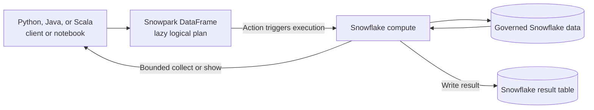

# Snowpark

> DataFrame APIs for expressing data processing in Python, Java, or Scala while Snowflake executes the heavy data work. Consultant lens: move compute to governed data instead of extracting large datasets to application memory.

## Executive Summary

- **What it is:** Snowpark is a family of client libraries for querying and processing Snowflake data through DataFrame APIs in Python, Java, and Scala.
- **Why it matters:** Developers can use familiar programming-language constructs while keeping large filters, joins, aggregations, and feature engineering inside Snowflake.
- **Mental model:** **Snowpark is a DataFrame-shaped query builder for Snowflake—application code builds a lazy plan; an action sends work to Snowflake for execution.**
- **Best used when:** Data already lives mainly in Snowflake, processing should remain close to governed data, and the team has a concrete reason to use Python, Java, or Scala rather than ordinary SQL.
- **Avoid or reconsider when:** Transformations are straightforward and declarative, most results must return to an external application, required libraries cannot run appropriately in Snowflake, or the workflow primarily spans other platforms.

## What It Can Do

- Express filters, projections, joins, aggregations, window functions, and other relational transformations through DataFrames.
- Read Snowflake tables and supported files in stages, then write results to Snowflake tables or stages.
- Push supported data operations to Snowflake warehouses instead of processing large datasets in local memory.
- Support large-scale preprocessing and feature engineering over governed Snowflake data.
- Mix DataFrame operations with SQL when SQL is the clearer expression.
- Create and invoke UDFs and stored procedures for custom server-side code.
- Run from external applications, development environments, Snowflake Notebooks, and supported server-side handlers.

## What It Cannot Do

- Make every arbitrary Python, Java, or Scala library execute as distributed Snowflake operations.
- Guarantee that data remains in Snowflake when methods such as `collect()` or conversions to local data structures are used.
- Make inefficient logic inexpensive; warehouse size, query shape, repeated actions, and materialization still affect cost.
- Replace dbt's model DAG, testing, documentation, environments, and CI/CD discipline.
- Replace a cross-system orchestrator for workflows with many external dependencies, approvals, or complex recovery paths.
- Provide the complete ML lifecycle by itself; Snowflake ML, Feature Store, Model Registry, Notebooks, and compute runtimes are related but distinct capabilities.
- Turn ordinary procedural Python into automatically optimized SQL; only operations Snowpark can translate or execute through supported server-side mechanisms gain the in-platform benefit.

## Core Concepts

| Concept | Meaning | Why it matters |
|---|---|---|
| Session | Authenticated connection and execution context for Snowpark | Determines role, warehouse, database, schema, and other session settings |
| DataFrame | A lazily evaluated description of a relational dataset and its transformations | Building a DataFrame usually does not retrieve or process its rows yet |
| Transformation | Operation such as `select`, `filter`, `join`, or `group_by` that returns another DataFrame | Transformations compose a logical plan and are normally lazy |
| Action | Operation such as `show`, `collect`, `count`, or saving a result | Triggers one or more queries and therefore consumes compute |
| Pushdown | Snowpark translates supported operations into work executed by Snowflake | Keeps large-scale processing close to the data |
| Client/driver code | Python, Java, or Scala code constructing and coordinating the DataFrame plan | This code may run outside Snowflake even though data processing runs inside it |
| UDF | Function applied within a query, with custom handler code executing server-side | Extends expressions but introduces runtime, package, security, and sharing considerations |
| Stored procedure | Callable server-side program that can coordinate multiple operations | Useful for procedural control and side effects, not merely reusable expressions |
| Data movement boundary | Point where results leave Snowflake through `collect`, local conversion, or a client consumer | Central to scalability, privacy, egress, and memory risk |

## How It Works (Simple Flow)

1. **Create a session:** Connect with a role, warehouse, database, and schema appropriate for the workload.
2. **Reference data:** Create a DataFrame from a Snowflake table, a SQL query, staged files, or another supported source.
3. **Compose transformations:** Chain filters, joins, aggregations, windows, and column expressions; Snowpark builds a lazy logical plan.
4. **Trigger an action:** Call an action such as `show`, `collect`, `count`, or `save_as_table`.
5. **Execute in Snowflake:** Snowpark submits the required query or queries, and Snowflake compute performs supported large-scale operations.
6. **Keep or return the result:** Write large results to Snowflake; return only bounded results to the client when local processing is genuinely needed.
7. **Operate and optimize:** Review Query History and Query Profile, control warehouse usage, and version application, procedure, UDF, runtime, and package dependencies.

## Visuals



The important boundary is the final arrow back to the application: Snowpark pushes compute into Snowflake only while the operations remain translatable or run through a supported server-side mechanism.

## Readable Snippets

### Build a lazy transformation

```python
from snowflake.snowpark.functions import col

customers = session.table("ANALYTICS.CUSTOMERS")

valuable_customers = (
    customers
    .filter(col("LIFETIME_VALUE") > 10_000)
    .select("CUSTOMER_ID", "COUNTRY", "LIFETIME_VALUE")
)
```

At this point, Snowpark has normally built a plan rather than retrieved all customer rows. An action triggers execution:

```python
valuable_customers.show()  # Executes and returns a small display result.
```

The relational intent is similar to:

```sql
SELECT customer_id, country, lifetime_value
FROM analytics.customers
WHERE lifetime_value > 10000;
```

### Keep a large result in Snowflake

```python
customer_features.write.save_as_table(
    "FEATURES.CUSTOMER_FEATURES",
    mode="overwrite"
)
```

Avoid collecting an unbounded result into the driver:

```python
# Risky when the DataFrame is large: rows move into client memory.
rows = customer_features.collect()
```

## Consultant Talking Points

- **Client question this answers:** “Our data scientists prefer Python, but customer data is large and governed in Snowflake. Can they transform it without downloading it first?”
- **Trade-offs to mention:** Snowpark offers familiar programmatic APIs and in-platform processing, but creates Snowflake-specific code and may be less transparent to a SQL-oriented analytics team.
- **Risk or governance angle:** Keeping processing near governed data can reduce extraction risk, but roles, UDF/procedure execution rights, stages, packages, imported code, and logs still require controls.
- **Cost/performance angle:** Every action may trigger warehouse work. Minimize repeated actions, keep large intermediates in Snowflake, inspect query plans, and size compute for the workload rather than assuming Python syntax changes the economics.

## Common Pitfalls

- **Treating Snowpark like local pandas:** A Snowpark DataFrame represents Snowflake work; local DataFrame assumptions can produce surprising execution or movement.
- **Calling `collect()` on large results:** This moves rows into client memory and can create latency, memory, privacy, and egress problems.
- **Triggering many accidental actions:** Repeated `show`, `count`, and `collect` calls can execute similar queries multiple times and increase cost.
- **Assuming all Python is pushed down:** Ordinary loops and unsupported libraries do not automatically become scalable Snowflake operations.
- **Using UDFs where native expressions work:** Custom handlers can be slower and add package, security, replication, and observability complexity.
- **Rewriting clear SQL into DataFrames without a reason:** More code and vendor coupling may deliver no client value.
- **Hiding an entire transformation estate in one program:** Large Snowpark monoliths weaken modularity, ownership, lineage, testing, and review.
- **Ignoring warehouse and query design:** Snowpark still produces Snowflake workloads that need pruning, sensible joins, appropriate warehouses, and Query Profile analysis.
- **Confusing Snowpark with the whole ML platform:** Feature engineering, training compute, feature management, model governance, and serving have separate Snowflake capabilities and decisions.
- **Leaving dependencies unpinned:** Runtime and package drift can make UDFs, procedures, notebooks, and deployments difficult to reproduce.

## When to Recommend What (Decision Table)

| Situation | Recommend | Why | Watch-outs |
|---|---|---|---|
| Straightforward relational transformation | SQL | Clearest and smallest expression of the work | Apply testing and deployment discipline |
| Tested analytical transformation DAG | dbt | Strong models, lineage, tests, documentation, environments, and CI/CD | Python-heavy algorithms may require another mechanism |
| Python-friendly processing over large Snowflake data | Snowpark Python | Familiar DataFrame API with Snowflake execution | Avoid large collections and inspect generated queries |
| JVM-oriented application working mainly with Snowflake data | Snowpark Java or Scala | Programmatic API aligned with the application team's language | Confirm API coverage and operational ownership |
| Custom value used inside queries | Native SQL function first, then UDF if needed | Native expressions are usually simpler; UDFs extend unsupported logic | UDF runtime, packages, security, sharing, and performance |
| Multi-step database operation with branching or side effects | Stored procedure, optionally using Snowpark | Packages a controlled procedural operation | Transactions, rights model, idempotency, and observability |
| Interactive SQL and Python exploration in Snowflake | Snowflake Notebook with Snowpark | Keeps analysis close to data in a managed interface | Prototype code still needs production engineering |
| ML feature engineering over Snowflake data | Snowpark/Snowflake ML feature capabilities | Reduces raw-data movement and supports scalable transformations | Separate feature, training, registry, and serving decisions |
| Declarative transformation already well expressed in dbt | Keep it in dbt | Avoids an unnecessary second implementation style | Use Snowpark only for a concrete gap |
| Processing mainly spans non-Snowflake systems or depends on Spark ecosystems | External platform such as Spark | Better fit for multi-platform processing and existing libraries | Additional infrastructure, movement, and governance |

## Related Topics

- [[01 Snowflake/05 Advanced Analytics and AI/Advanced Analytics and AI Overview]]
- [[01 Snowflake/04 Data Engineering/26 Stored Procedures]]
- [[01 Snowflake/04 Data Engineering/25 dbt on Snowflake]]
- [[01 Snowflake/05 Advanced Analytics and AI/35 ML Model Registry]]
- [[01 Snowflake/05 Advanced Analytics and AI/36 Snowflake Notebooks]]

## Related Decision Notes

- [[80 Comparisons and Decision Notes/Comparisons/Comparison - Stored Procedures vs Declarative Transformations]]
- [[80 Comparisons and Decision Notes/Decision Notes/Decisions - Choosing a Snowflake AI and ML Pattern]]

## Questions

- Where will the Snowpark driver code run, and where will each expensive operation execute?
- Which operations remain inside Snowflake, and where might data cross into client memory?
- Is Python, Java, or Scala solving a real requirement that SQL or dbt cannot express as clearly?
- How large is the result returned by every `collect`, conversion, or application response?
- Should custom logic be a native expression, UDF, stored procedure, or external service?
- How will the team test, deploy, monitor, and pin runtime and package dependencies?
- Which Snowflake ML capability owns training, model registration, and serving after feature engineering?

## Sources To Revisit

- [Snowflake Docs: Snowpark API](https://docs.snowflake.com/en/developer-guide/snowpark/index)
- [Snowflake Docs: Snowpark Python DataFrame](https://docs.snowflake.com/en/developer-guide/snowpark/reference/python/latest/snowpark/dataframe)
- [Snowflake Docs: Creating Python UDFs for DataFrames](https://docs.snowflake.com/en/developer-guide/snowpark/python/creating-udfs)
- [Snowflake Docs: Creating Python Stored Procedures for DataFrames](https://docs.snowflake.com/en/developer-guide/snowpark/python/creating-sprocs)
- [Snowflake Docs: Python Stored Procedure Limitations](https://docs.snowflake.com/en/developer-guide/stored-procedure/python/procedure-python-limitations)
- [Snowflake Docs: Snowflake ML Overview](https://docs.snowflake.com/en/developer-guide/snowflake-ml/overview)
