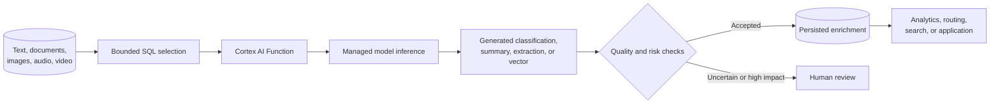

# Cortex AI Functions

> Managed AI inference exposed through SQL and Python functions. Consultant lens: enrich unstructured data close to governed Snowflake data, while treating every output as probabilistic, every large invocation as a cost event, and every sensitive input as a governance decision.

## Executive Summary

- **What it is:** Cortex AI Functions are managed functions for applying language and multimodal models to text, documents, images, audio, and video stored or referenced in Snowflake.
- **Why it matters:** Teams can classify, summarize, extract, translate, redact, transcribe, embed, and generate content without first building a separate model-serving integration.
- **Mental model:** **An AI function behaves like an expensive, probabilistic SQL transformation: input value → managed model inference → generated output column.**
- **Best used when:** The source data is already governed in Snowflake, a supported function matches the task, outputs can be evaluated and monitored, and keeping inference near the data reduces integration effort or movement.
- **Avoid or reconsider when:** The requirement is deterministic, the decision is too consequential for unreviewed AI, the needed model/runtime is unsupported, strict residency rules conflict with available inference locations, or scale and token cost are unjustified.

## What It Can Do

- Generate or reason over text and supported media with `AI_COMPLETE`.
- Classify text, images, or documents into client-defined categories with `AI_CLASSIFY`.
- Detect overall and aspect-level sentiment with `AI_SENTIMENT`.
- Extract entities, lists, and tabular information from text or files with `AI_EXTRACT`.
- Translate text, redact sensitive information, parse documents, and transcribe audio or video.
- Create embeddings and compare semantic similarity for search, matching, and retrieval use cases.
- Aggregate themes or summaries across many rows with `AI_AGG` and `AI_SUMMARIZE_AGG`.
- Return structured output for supported tasks so downstream SQL can consume a stable JSON or SQL-compatible shape.
- Enrich operational or analytical tables so AI-derived attributes can feed routing, dashboards, search, and human review.

## What It Cannot Do

- Guarantee factual correctness, consistency, completeness, or identical output on repeated calls.
- Turn generated values into authoritative business facts merely because they appear in a Snowflake table.
- Make a structured response truthful; a valid JSON shape can still contain incorrect values.
- Replace deterministic SQL rules when the required result is exact, auditable, and already expressible in code.
- Eliminate prompt injection, harmful content, bias, or domain-specific interpretation risk.
- Make consequential automated decisions safe without validation, controls, and usually human oversight.
- Guarantee every function and model is available in every region; availability and lifecycle status vary.
- Eliminate model-inference cost, warehouse cost, throttling, or latency.
- Replace Cortex Analyst, which answers natural-language analytical questions by generating SQL against a semantic model.

## Core Concepts

| Concept | Meaning | Why it matters |
|---|---|---|
| AI inference | A managed model produces an output from text or media input | Outputs are probabilistic rather than ordinary deterministic SQL results |
| Purpose-built function | Managed function for one task, such as classification, extraction, sentiment, or translation | Usually clearer and more predictable than implementing the same task with a free-form prompt |
| `AI_COMPLETE` | General function for generation, reasoning, and flexible prompts | Useful when no narrower function fits, but requires more prompt and output design |
| Row-level inference | A function is evaluated separately for input rows | A million rows can mean roughly a million inference operations and repeated prompt tokens |
| Aggregate AI | A function reasons across a text column or collection of rows | Supports questions such as “What complaints dominate this month?” rather than labeling each record |
| Structured output | Model output constrained to a requested schema or type shape | Reduces parsing work but does not prove semantic correctness |
| Embedding | Numeric vector representing semantic meaning | Supports similarity search and retrieval; it is not a human-readable answer |
| Token | Unit used to measure model input and output | Prompt length, labels, examples, and generated output all influence cost |
| Cross-region inference | Inference payload may be processed transiently outside the account's home region | Expands model availability but creates residency, latency, and approval considerations |
| Model access control | Account and role controls restrict functions or allowed models | Prevents uncontrolled experimentation, spend, and use of unapproved models |
| Evaluation set | Representative inputs with reviewed expected outcomes | Required to measure whether a probabilistic solution is good enough for the business purpose |

## How It Works (Simple Flow)

1. **Choose the task:** Prefer a purpose-built function such as classification or extraction; use `AI_COMPLETE` for genuinely flexible generation.
2. **Define the input boundary:** Select only the text, rows, or staged media needed for the task and confirm that its sensitivity is permitted.
3. **Design the contract:** Define categories, extraction fields, instructions, structured output, error handling, and review thresholds.
4. **Run a bounded evaluation:** Test representative records, including ambiguous, multilingual, adversarial, and low-quality examples.
5. **Invoke managed inference:** Snowflake sends the selected input to an available managed model within the configured regional boundary.
6. **Validate and persist:** Check errors and quality, route uncertain or high-impact cases to human review, and store approved derived results rather than recomputing them repeatedly.
7. **Operate and govern:** Monitor tokens, pages, credits, users, models, query IDs, quality drift, latency, and model lifecycle changes.

## Visuals



The generated enrichment is a derived interpretation. The original source remains the authoritative evidence.

## Readable Snippets

### Classify and enrich individual support tickets

```sql
SELECT
    ticket_id,
    AI_CLASSIFY(
        message,
        ['billing', 'technical', 'cancellation']
    ) AS category,
    AI_SENTIMENT(message) AS sentiment
FROM support_tickets
WHERE created_at >= DATEADD('day', -1, CURRENT_TIMESTAMP());
```

The functions run for each selected row. Start with a bounded sample before applying this pattern to historical tables.

### Aggregate themes across many rows

```sql
SELECT AI_AGG(
    message,
    'Identify the most common customer complaints and supporting themes'
) AS monthly_complaint_themes
FROM support_tickets
WHERE created_at >= DATEADD('month', -1, CURRENT_DATE());
```

This answers a question across the collection rather than generating one category per ticket.

### Extract structured fields with review scores

```sql
SELECT AI_EXTRACT(
    text => contract_text,
    responseFormat => {
        'renewal_date': 'What is the contract renewal date?',
        'notice_period': 'What is the cancellation notice period?'
    },
    scores => TRUE
) AS extracted_terms
FROM staged_contract_text
WHERE document_id = 'CONTRACT-001';
```

Scores can support review thresholds, but they are not a guarantee that an extracted value is correct.

### Inspect AI usage

```sql
SELECT
    function_name,
    model_name,
    SUM(credits) AS credits_used,
    COUNT(DISTINCT query_id) AS query_count
FROM snowflake.account_usage.cortex_ai_functions_usage_history
WHERE start_time >= DATEADD('day', -30, CURRENT_TIMESTAMP())
GROUP BY function_name, model_name
ORDER BY credits_used DESC;
```

Use query tags and persisted output metadata when costs must be attributed to a project, product, or environment.

## Consultant Talking Points

- **Client question this answers:** “Can we categorize and summarize hundreds of thousands of support tickets without exporting them to a separate AI service?”
- **Trade-offs to mention:** Cortex reduces integration and model-serving work, but clients accept Snowflake-specific functions, managed model choices, regional availability, probabilistic quality, and token-based economics.
- **Risk or governance angle:** Approve input classifications, regional routing, functions, models, prompts, retained outputs, review thresholds, and users before production use. AI-derived fields should be visibly distinguished from source facts.
- **Cost/performance angle:** Each selected row may invoke inference. Filter early, test small batches, shorten repeated instructions, avoid dashboard-time recomputation, persist results, process only new or changed content, and monitor AI credits separately from warehouse credits.

## Common Pitfalls

- **Running against the entire table first:** A harmless-looking `SELECT` can initiate millions of billable inferences.
- **Using `AI_COMPLETE` for every task:** A purpose-built classifier or extractor usually provides a clearer contract and less prompt engineering.
- **Treating output as authoritative:** Generated categories, summaries, and extracted values remain fallible derived data.
- **Trusting valid JSON as proof of accuracy:** Structured output guarantees shape, not truth.
- **Skipping a representative evaluation set:** A polished ten-row demo says little about production accuracy across languages, edge cases, and poor source data.
- **Recomputing outputs in dashboards:** Repeated inference creates unstable results, latency, and recurring cost; persist approved enrichment.
- **Ignoring repeated prompt tokens:** Category descriptions and few-shot examples may be charged for each classified row.
- **Oversizing the warehouse:** Snowflake recommends no larger than `MEDIUM` for AI Function queries because larger warehouses do not improve model inference performance.
- **Leaving broad default access in place:** Cortex-related access may be inherited through `PUBLIC`; review account privileges, database roles, per-function grants, and model allowlists.
- **Assuming “inside Snowflake” means home-region only:** Cross-region inference can transiently send prompts and responses to an allowed processing region.
- **Automating high-impact decisions without review:** Confidence thresholds, fallback logic, appeals, and human oversight should match the consequence of an error.
- **Ignoring model lifecycle changes:** Availability, behavior, and preview/GA status can change; regression-test approved workloads before changing models.

## When to Recommend What (Decision Table)

| Situation | Recommend | Why | Watch-outs |
|---|---|---|---|
| Classify or score text using known categories | `AI_CLASSIFY` or another purpose-built function | Clear task and managed output contract | Test label definitions, ambiguity, accuracy, and per-row cost |
| Flexible generation or reasoning | `AI_COMPLETE` | Supports custom prompts and structured output | Hallucination, prompt injection, model choice, and variable cost |
| Extract defined fields from documents or text | `AI_EXTRACT` | Produces structured fields and optional extraction scores | OCR quality, missing fields, thresholds, and human review |
| Summarize themes across many records | `AI_AGG` or `AI_SUMMARIZE_AGG` | Reasons across a collection rather than per row | Validate whether minority or critical themes are omitted |
| Exact, auditable classification rule | SQL, lookup table, or rules engine | Deterministic and explainable | Maintain rule ownership and exception handling |
| Natural-language question over governed metrics | Cortex Analyst | Uses a semantic model to produce analytical SQL | Semantic-model quality, permissions, and generated-query validation |
| Programmatic data pipeline around AI enrichment | Snowpark plus Cortex AI Functions | Combines DataFrame processing with managed inference | Separate orchestration, inference, and materialization concerns |
| Need unsupported models, runtime control, or provider portability | External/custom model service | Greater control over deployment and model ecosystem | Integration, movement, security, observability, and infrastructure |
| Consequential individual decision | Deterministic policy plus human review; AI only as bounded assistance | Reduces harm from probabilistic errors | Regulatory, fairness, explainability, and appeal requirements |

## Related Topics

- [[01 Snowflake/05 Advanced Analytics and AI/Advanced Analytics and AI Overview]]
- [[01 Snowflake/05 Advanced Analytics and AI/32 Snowpark]]
- [[01 Snowflake/05 Advanced Analytics and AI/34 Cortex Analyst]]
- [[01 Snowflake/03 Security and Governance/12 RBAC Roles and Privileges]]
- [[01 Snowflake/03 Security and Governance/14 Column-level Masking Policies]]
- [[01 Snowflake/06 Cost Management and Operations/47 Budgets]]

## Related Decision Notes

- [[80 Comparisons and Decision Notes/Decision Notes/Snowflake/Decisions - Choosing a Snowflake AI and ML Pattern]]
- [[80 Comparisons and Decision Notes/Comparisons/Snowflake/Comparison - Cortex Analyst vs Cortex AI Functions]]
- [[80 Comparisons and Decision Notes/Comparisons/Snowflake/Comparison - Resource Monitors vs Budgets]]

## Questions

- Is the required output probabilistic interpretation or an exact business rule?
- Which purpose-built function fits before considering a free-form `AI_COMPLETE` prompt?
- What representative labeled dataset will establish acceptable precision, recall, extraction accuracy, or review rate?
- How many rows, input tokens, output tokens, media seconds, or document pages will production process?
- Will results be materialized once or recalculated by every consumer query?
- Which sensitive fields may enter prompts, and which regional inference boundaries are approved?
- Who can use AI functions and models, and are broad `PUBLIC` grants acceptable?
- Which results require human review, and how will reviewers see the original evidence?
- How will the team detect quality drift after a model, prompt, source-language, or data-distribution change?

## Sources To Revisit

- [Snowflake Docs: Cortex AI Functions](https://docs.snowflake.com/en/user-guide/snowflake-cortex/aisql)
- [Snowflake Docs: Multimodal Cortex AI Functions](https://docs.snowflake.com/en/user-guide/snowflake-cortex/ai-images)
- [Snowflake Docs: AI_CLASSIFY](https://docs.snowflake.com/en/sql-reference/functions/ai_classify)
- [Snowflake Docs: AI_EXTRACT](https://docs.snowflake.com/en/sql-reference/functions/ai_extract)
- [Snowflake Docs: AI_AGG](https://docs.snowflake.com/en/sql-reference/functions/ai_agg)
- [Snowflake Docs: AI_COMPLETE Structured Outputs](https://docs.snowflake.com/en/user-guide/snowflake-cortex/complete-structured-outputs)
- [Snowflake Docs: Privileges and Model Access](https://docs.snowflake.com/en/user-guide/snowflake-cortex/aisql-privileges-and-access)
- [Snowflake Docs: Cross-region Inference](https://docs.snowflake.com/en/user-guide/snowflake-cortex/cross-region-inference)
- [Snowflake Docs: Managing Cortex AI Function Costs](https://docs.snowflake.com/en/user-guide/snowflake-cortex/ai-func-cost-management)
- [Snowflake Docs: Cortex AI Functions Usage History](https://docs.snowflake.com/en/sql-reference/account-usage/cortex_ai_functions_usage_history)
