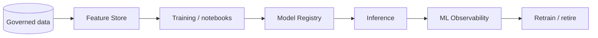

# Feature Store and ML Operations

> Snowflake's broader ML lifecycle beyond notebooks and model registration. Consultant lens: understand when a model has moved from experiment to governed production asset.

## Executive Summary

- **What it is:** Snowflake ML capabilities for feature management, model development, jobs, registry, observability, explainability, lineage, and production monitoring.
- **Why it matters:** A model stuck in a notebook is not production. Banks need lineage, monitoring, ownership, and controlled deployment.
- **Mental model:** Notebooks explore; Feature Store standardizes inputs; Registry controls versions; ML Observability watches behavior after deployment.
- **Best used when:** A team needs repeatable ML features, versioned models, monitored production inference, or model governance evidence.
- **Avoid or reconsider when:** The work is a one-off analysis or the client already has a mature external MLOps platform.

## What It Can Do

- Manage reusable ML features in Snowflake.
- Register and version trained models.
- Serve or run inference through supported Snowflake patterns.
- Monitor model behavior, drift, performance, and volume where supported.
- Support explainability and lineage for selected model workflows.

## What It Cannot Do

- Replace every specialist MLOps tool.
- Make feature definitions correct without domain ownership.
- Guarantee a model remains valid after source data or market behavior changes.
- Remove model-risk governance obligations.

## Core Concepts

| Concept | Meaning | Why it matters |
|---|---|---|
| Feature | Reusable model input derived from data | Must be consistent across train and inference |
| Feature Store | Managed feature definitions and access | Prevents duplicate, inconsistent features |
| Model Registry | Versioned model artifact management | Controls promotion and inference |
| ML Observability | Monitoring model behavior over time | Detects drift and degradation |
| Explainability | Methods to understand feature impact | Helps review and trust |
| ML lineage | Relationship between data, features, models, and outputs | Required for governance |

## How It Works (Simple Flow)

1. Define stable features from governed Snowflake data.
2. Train or evaluate models in notebooks, Snowpark, or external tools.
3. Register approved model versions.
4. Deploy for batch or real-time inference.
5. Monitor performance, drift, volume, and data changes.
6. Retire, retrain, or roll back models based on evidence.

## Visuals



## Readable Snippets

```python
# Recognize the production pattern:
# define/reuse features -> train model -> register version -> infer -> monitor drift.
```

## Consultant Talking Points

- **Client question this answers:** "How do we productionize a model that currently lives in a notebook?"
- **Trade-offs to mention:** Snowflake-native MLOps keeps data close but may not replace an enterprise ML platform in every organization.
- **Risk or governance angle:** Feature definitions, model versions, approvals, lineage, monitoring, and rollback must be visible.
- **Cost/performance angle:** Feature computation, training, batch scoring, real-time endpoints, and monitoring each have different cost surfaces.

## Common Pitfalls

- Recomputing training features differently from inference features.
- Registering a model without an owner, metric, or retirement path.
- Treating model deployment as complete without drift monitoring.
- Ignoring data pipeline changes that invalidate model assumptions.
- Skipping explainability for models used in sensitive decisions.

## When to Recommend What (Decision Table)

| Situation | Recommend | Why | Watch-outs |
|---|---|---|---|
| Reusable model inputs | Feature Store | Consistency across models | Feature ownership |
| Batch scoring in Snowflake | Model Registry plus warehouse inference | Simple data-local inference | Cost and scheduling |
| Live prediction endpoint | Registry plus SPCS serving | Low-latency/API pattern | Compute pool operations |
| Existing enterprise MLOps platform | Integrate rather than replace | Reuse controls | Data movement and governance |
| High-risk model | Formal model-risk process | Auditability | Slower release |

## Related Topics

- [[01 Snowflake/05 Advanced Analytics and AI/Advanced Analytics and AI Overview]]
- [[01 Snowflake/05 Advanced Analytics and AI/29 ML Model Registry]]
- [[01 Snowflake/05 Advanced Analytics and AI/30 Snowflake Notebooks]]
- [[01 Snowflake/05 Advanced Analytics and AI/34 ML Functions for Forecasting, Anomaly Detection, and Classification]]

## Related Decision Notes

- [[80 Comparisons and Decision Notes/Decision Notes/Decisions - Choosing a Snowflake AI and ML Pattern]]
- [[80 Comparisons and Decision Notes/Comparisons/Comparison - Warehouse Inference vs SPCS Model Serving]]

## Questions

- Are features reusable across teams or one model only?
- What evidence is needed before promoting a model version?
- Who monitors drift and decides retraining?

## Sources To Revisit

- [Snowflake Docs: Snowflake ML overview](https://docs.snowflake.com/en/developer-guide/snowflake-ml/overview)
- [Snowflake Docs: Feature Store](https://docs.snowflake.com/en/developer-guide/snowflake-ml/feature-store/overview)
- [Snowflake Docs: Model Registry](https://docs.snowflake.com/en/developer-guide/snowflake-ml/model-registry/overview)
- [Snowflake Docs: ML Observability](https://docs.snowflake.com/en/developer-guide/snowflake-ml/model-registry/model-observability)

