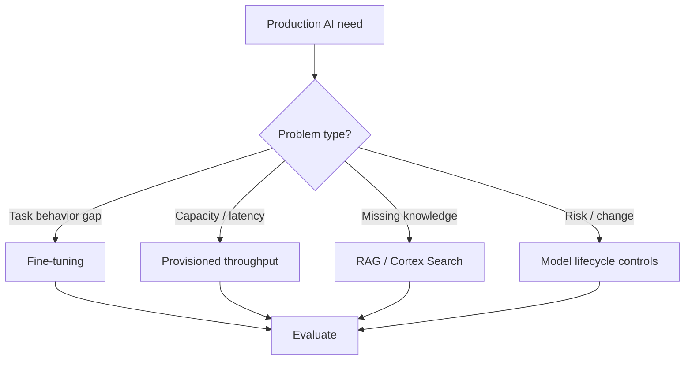

# Cortex Fine-tuning, Provisioned Throughput, and Model Lifecycle

> Advanced Cortex operations for customized and capacity-managed model use. Consultant lens: know when normal prompting/RAG is enough, and when production AI needs tuning, reserved throughput, or lifecycle governance.

## Executive Summary

- **What it is:** Snowflake Cortex features for fine-tuning supported models, reserving inference throughput, and managing model changes over time.
- **Why it matters:** Production AI is not just prompts. Some workloads need task-specific behavior, predictable throughput, regional capacity planning, and model lifecycle controls.
- **Mental model:** Prompting and RAG are the default; fine-tuning changes model behavior; provisioned throughput reserves capacity; lifecycle governance keeps production from drifting silently.
- **Best used when:** A proven workload has stable demand, measurable quality gaps, or throughput/latency requirements that standard inference cannot satisfy.
- **Avoid or reconsider when:** The use case is still exploratory, retrieval context is missing, or quality issues come from bad data and unclear instructions rather than model capability.

## What It Can Do

- Fine-tune supported Cortex models for selected tasks.
- Reserve managed inference throughput for supported models/workloads.
- Support production planning around model versions, availability, and behavior changes.
- Help stabilize workloads with recurring or business-critical AI demand.

## What It Cannot Do

- Make bad labels, vague tasks, or weak evaluation datasets good.
- Replace RAG when the issue is missing knowledge or stale context.
- Guarantee zero behavior change across all future platform/model updates.
- Remove the need for cost, quality, and risk approval.

## Core Concepts

| Concept | Meaning | Why it matters |
|---|---|---|
| Fine-tuning | Customizing a supported model on task examples | Useful for stable, repeated tasks |
| RAG | Supplying retrieved context at inference time | Better for changing knowledge |
| Provisioned throughput | Reserved capacity for managed inference | Useful for predictable production demand |
| Model lifecycle | Availability, versioning, deprecation, regression testing | Prevents surprise behavior changes |
| Evaluation set | Examples used to prove improvement | Required before tuning or migration |

## How It Works (Simple Flow)

1. Prove the use case with normal prompting, purpose-built functions, or RAG first.
2. Build a representative evaluation set with reviewed expected outputs.
3. Decide whether the gap is model behavior, missing context, throughput, or workflow design.
4. Fine-tune or reserve throughput only when the requirement justifies the cost and governance overhead.
5. Regression-test before production promotion.
6. Monitor quality, cost, latency, model availability, and lifecycle notices.

## Visuals



## Readable Snippets

```text
Decision shortcut:
  Missing facts -> improve retrieval.
  Bad format on stable examples -> consider structured output or fine-tuning.
  Too much variable latency at scale -> consider provisioned throughput.
  Changed behavior after model update -> regression-test and lifecycle control.
```

## Consultant Talking Points

- **Client question this answers:** "Do we need to fine-tune a model, or is RAG/prompting enough?"
- **Trade-offs to mention:** Fine-tuning and reserved throughput add control but also cost, evaluation burden, and lifecycle ownership.
- **Risk or governance angle:** Fine-tuned models and high-volume AI services should have owners, approvals, evaluation evidence, and rollback plans.
- **Cost/performance angle:** Reserved capacity can stabilize production load but is wasteful before demand is understood.

## Common Pitfalls

- Fine-tuning before fixing the prompt, source data, or retrieval.
- Using a tiny demo set as proof of quality.
- Reserving throughput for a workload whose demand is not measured.
- Ignoring model deprecation or availability changes.
- Treating fine-tuning as a governance shortcut.

## When to Recommend What (Decision Table)

| Situation | Recommend | Why | Watch-outs |
|---|---|---|---|
| Missing or changing knowledge | RAG / Cortex Search | Keeps facts external and current | Retrieval quality |
| Stable repeated extraction/classification issue | Fine-tuning if supported | Can improve task behavior | Needs labeled examples |
| Strict recurring throughput need | Provisioned throughput | More predictable capacity | Pay for reserved capacity |
| Model update risk | Lifecycle and regression tests | Prevents silent breakage | Requires test suite |
| Early experiment | Prompting and small evals | Low overhead | Do not over-engineer |

## Related Topics

- [[01 Snowflake/05 Advanced Analytics and AI/Advanced Analytics and AI Overview]]
- [[01 Snowflake/05 Advanced Analytics and AI/27 Cortex AI Functions]]
- [[01 Snowflake/05 Advanced Analytics and AI/31 Cortex Search and RAG]]
- [[01 Snowflake/05 Advanced Analytics and AI/33 AI Governance, Guardrails, Observability, and Cost]]
- [[01 Snowflake/05 Advanced Analytics and AI/36 Document and Multimodal AI]]

## Related Decision Notes

- [[80 Comparisons and Decision Notes/Decision Notes/Decisions - Choosing a Snowflake AI and ML Pattern]]

## Questions

- Is the quality gap caused by missing context, model behavior, data quality, or unclear instructions?
- How much stable demand justifies provisioned throughput?
- What regression tests protect production when a model changes?

## Sources To Revisit

- [Snowflake Docs: Cortex Fine-tuning](https://docs.snowflake.com/en/user-guide/snowflake-cortex/cortex-finetuning)
- [Snowflake Docs: Fine-tuning arctic-extract models](https://docs.snowflake.com/en/user-guide/snowflake-cortex/arctic-extract-finetuning)
- [Snowflake Docs: Provisioned Throughput](https://docs.snowflake.com/en/release-notes/2025/other/2025-05-05-provisioned-throughput)
- [Snowflake Docs: AI Observability](https://docs.snowflake.com/en/user-guide/snowflake-cortex/ai-observability)

