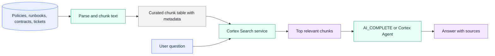

# Cortex Search and RAG

> [!abstract] Consultant lens
> **What it is:** Snowflake-native search for enterprise text and documents.
>
> **Why it matters:** Use it to ground AI answers in approved company knowledge instead of asking an LLM to guess.

## Executive Summary

- **What it is:** Cortex Search is Snowflake's managed search service for low-latency fuzzy, semantic, and hybrid retrieval over text stored or represented in Snowflake.
- **Why it matters:** Many useful AI applications need company-specific context: policies, contracts, research, tickets, reports, runbooks, product documentation, transcripts, or internal procedures.
- **Mental model:** **Cortex Search is the retrieval layer. RAG is the answering pattern: search first, answer second.**
- **Best used when:** Users need question answering, enterprise search, or assistant workflows over text/document-like content governed in Snowflake.
- **Avoid or reconsider when:** The question is a deterministic metric or aggregation over relational tables, where SQL or Cortex Analyst is usually the better fit.

## What It Can Do

- Build managed search services over Snowflake text data, including document chunks, transcripts, support tickets, runbooks, or policy text.
- Use hybrid retrieval: semantic/vector search, keyword search, and semantic reranking.
- Support RAG applications by retrieving the most relevant passages before an LLM generates an answer.
- Return metadata with results so applications can show source documents, dates, owners, or citations.
- Apply filters over attributes such as department, region, policy area, sensitivity level, or entitlement group.
- Combine with Streamlit, Cortex Agents, `AI_COMPLETE`, REST APIs, and Python applications.
- Keep the retrieval layer close to Snowflake governance, audit, and operational controls.

## What It Cannot Do

- Guarantee that a generated answer is correct just because retrieval happened.
- Replace semantic modeling, SQL, or Cortex Analyst for governed business metrics.
- Solve poor chunking, stale documents, or missing access filters automatically.
- Understand document-level permissions unless those permissions are modeled into the indexed source and query filters.
- Remove the need to evaluate retrieval quality and answer faithfulness.
- Eliminate prompt injection, hallucination, cost, or latency risks from an AI assistant.

## Core Concepts

| Concept | Meaning | Why it matters |
|---|---|---|
| Cortex Search service | Managed Snowflake object that indexes searchable text from a source query | Serves low-latency search results to apps and agents |
| RAG | Retrieval-Augmented Generation | Retrieves trusted context before generating an answer |
| Chunk | A passage or unit of text indexed for retrieval | The chunk size and boundaries drive answer quality |
| Attribute | Metadata column available for filtering or returning with results | Enables region, desk, sensitivity, date, and entitlement filters |
| Hybrid search | Combination of semantic/vector search, keyword search, and reranking | Handles both meaning-based and exact-term matching |
| Owner's rights | Service queries run according to the service owner's rights model | A user with service access may retrieve indexed rows they cannot directly read in the base table |
| Faithfulness | Whether the generated answer is supported by retrieved context | Separates "good-sounding" answers from trustworthy answers |

## How It Works (Simple Flow)

1. Ingest or parse documents, logs, tickets, policies, or transcripts into Snowflake.
2. Split long documents into useful chunks and attach metadata such as source, date, owner, country, desk, and sensitivity.
3. Create a Cortex Search service over a curated source query.
4. A user asks a natural-language question in an app, chatbot, Agent, or workflow.
5. The application queries Cortex Search and applies filters for access, region, domain, or document type.
6. The top passages are passed to an LLM, such as through `AI_COMPLETE` or a Cortex Agent.
7. The answer is generated from retrieved context, ideally with citations or source links.
8. The team evaluates retrieval relevance, answer faithfulness, latency, cost, and access-control behavior.

## Visuals



## Readable Snippets

### Create a governed search service

```sql
CREATE OR REPLACE CORTEX SEARCH SERVICE compliance_policy_search
  ON chunk_text
  PRIMARY KEY (chunk_id)
  ATTRIBUTES
    document_id,
    policy_area,
    country,
    sensitivity_level,
    entitlement_group,
    effective_date
  WAREHOUSE = cortex_search_wh
  TARGET_LAG = '1 hour'
  EMBEDDING_MODEL = 'snowflake-arctic-embed-l-v2.0'
  AS (
    SELECT
      chunk_id,
      chunk_text,
      document_id,
      policy_area,
      country,
      sensitivity_level,
      entitlement_group,
      effective_date
    FROM curated_policy_chunks
    WHERE is_current = TRUE
  );
```

### Search with metadata and entitlement filters

```sql
-- Preview/search the service with filters.
-- In a real bank application, the entitlement filter should be derived
-- from the authenticated user, not typed by the user.
SELECT PARSE_JSON(
  SNOWFLAKE.CORTEX.SEARCH_PREVIEW(
    'GOV_AI.SEARCH.COMPLIANCE_POLICY_SEARCH',
    '{
      "query": "How long must trade records be retained?",
      "columns": [
        "chunk_text",
        "document_id",
        "policy_area",
        "effective_date"
      ],
      "filter": {
        "@and": [
          {"@eq": {"country": "NO"}},
          {"@eq": {"entitlement_group": "MARKETS_COMPLIANCE"}}
        ]
      },
      "limit": 5
    }'
  )
)['results'] AS results;
```

### Recognize when RAG fits

```text
Good fit:
  "What does our policy say about retention of trading records?"
  Search policy chunks, retrieve evidence, then answer.

Poor fit:
  "What was total trading revenue by desk last month?"
  Use SQL or Cortex Analyst over governed structured data.
```

## Consultant Talking Points

- **Client question this answers:** "Can users ask questions over internal documents without exporting them to a separate vector database?"
- **Trade-offs to mention:** Snowflake-native retrieval reduces integration work, but the team still owns chunking, source curation, access modeling, evaluation, and user experience.
- **Risk or governance angle:** Cortex Search services use an owner's-rights model. Granting `USAGE` on a service can expose indexed rows that the querying user cannot directly read in the base table, so service grants and filters are security-critical.
- **Cost/performance angle:** Costs come from refresh warehouse compute, embedding new or changed text, serving compute, storage, and query traffic. Target lag, chunk volume, indexed columns, and app behavior matter.

## Typical Bank Use Cases

| Use case | What Cortex Search + RAG provides | Example question |
|---|---|---|
| Compliance policy assistant | Searches approved policy and regulatory guidance chunks | "What is the retention rule for trading records in Norway?" |
| KYC/AML procedure assistant | Retrieves due-diligence procedures, escalation rules, and typology guidance | "When should this customer case be escalated?" |
| Data engineering support assistant | Searches runbooks, pipeline docs, incident notes, and catalog descriptions | "Why is the customer exposure table delayed and what should I check first?" |
| Audit and control evidence search | Finds controls, evidence descriptions, prior findings, and remediation notes | "Which control covers access review for market data pipelines?" |
| Legal and contract search | Retrieves clauses across vendor contracts, NDAs, and service agreements | "Which vendors have data residency clauses?" |
| Research and analyst knowledge search | Searches internal research, market commentary, meeting notes, and memos | "What were the main concerns in the latest Nordic banking notes?" |

## Common Pitfalls

- Calling RAG "solved" after the first demo.
- Ignoring document permissions when chunking and indexing.
- Using chunks that are too small to be useful or too large to be precise.
- Not measuring retrieval quality separately from answer quality.
- Treating search as the right answer for structured metric questions.
- Returning retrieved chunks without citations, source dates, or document ownership.
- Allowing stale documents to remain in the index without lifecycle controls.
- Letting user-written filters decide access instead of deriving filters from authenticated identity and entitlements.

## When to Recommend What (Decision Table)

| Situation | Recommend | Why | Watch-outs |
|---|---|---|---|
| Search over policies, contracts, runbooks, tickets, transcripts, or research | Cortex Search | Native retrieval over text governed in Snowflake | Chunking, freshness, metadata, and permissions |
| Chatbot that answers from internal documents | Cortex Search + RAG | Retrieves trusted context before generation | Must evaluate faithfulness and show sources |
| Governed metric questions over structured data | SQL or Cortex Analyst | Deterministic calculation over tables/semantic model | Metric definitions and joins must be governed |
| Custom multi-tool assistant | Cortex Agents plus Cortex Search | Agent can combine document retrieval with other tools | Larger governance, prompt injection, and cost surface |
| Exact lookup by ID, date, desk, or account | SQL search/filter | Deterministic and simple | Not semantic, but often the right tool |
| Enterprise search already standardized outside Snowflake | Existing search platform, or integrate carefully | Reuse mature capability and user habits | Data duplication, permission mapping, and latency |
| AI answer drives regulated or high-impact action | Add review, citations, logging, and approval workflow | Retrieval improves grounding but is not a control framework | Human accountability and audit evidence are still needed |

## Bank Governance Checklist

- Build services on curated views/tables, not uncontrolled raw document dumps.
- Model document permissions as metadata: desk, country, business unit, confidentiality, legal entity, entitlement group, and effective dates.
- Derive access filters from the authenticated user's role or entitlement system.
- Grant `USAGE` on the Cortex Search service narrowly and review it like access to sensitive data.
- Keep restricted content out of the index unless retrieval by approved users is intentional.
- Log prompts, retrieved document IDs, answers, and user feedback where policy allows.
- Test for leakage: try users from different desks, regions, and roles.
- Require answers to cite retrieved sources or say when the evidence is insufficient.

## Related Topics

- [[01 Snowflake/05 Advanced Analytics and AI/Advanced Analytics and AI Overview]]
- [[01 Snowflake/05 Advanced Analytics and AI/33 Cortex AI Functions]]
- [[01 Snowflake/05 Advanced Analytics and AI/34 Cortex Analyst]]
- [[01 Snowflake/05 Advanced Analytics and AI/38 Cortex Agents and CoWork]]
- [[01 Snowflake/04 Data Engineering/31 Unstructured File Pipelines and Document Processing]]

## Related Decision Notes

- [[80 Comparisons and Decision Notes/Decision Notes/Snowflake/Decisions - Choosing a Snowflake AI and ML Pattern]]
- [[80 Comparisons and Decision Notes/Comparisons/Snowflake/Comparison - Cortex Analyst vs Cortex AI Functions]]

## Questions

- What is the access model for each document and chunk?
- How will retrieval relevance and answer faithfulness be evaluated?
- Should this be a search app, an agent, or a semantic-metric assistant?
- What metadata is needed to filter by jurisdiction, desk, confidentiality, source system, and document date?
- Who owns stale document cleanup and re-indexing?

## Sources To Revisit

- [Snowflake Docs: Cortex Search](https://docs.snowflake.com/en/user-guide/snowflake-cortex/cortex-search/cortex-search-overview)
- [Snowflake Docs: CREATE CORTEX SEARCH SERVICE](https://docs.snowflake.com/en/sql-reference/sql/create-cortex-search)
- [Snowflake Docs: Query a Cortex Search Service](https://docs.snowflake.com/en/user-guide/snowflake-cortex/cortex-search/query-cortex-search-service)
- [Snowflake Docs: Understanding cost for Cortex Search Services](https://docs.snowflake.com/en/user-guide/snowflake-cortex/cortex-search/cortex-search-costs)
- [Snowflake Docs: Cortex Search RAG tutorial](https://docs.snowflake.com/en/user-guide/snowflake-cortex/cortex-search/tutorials/cortex-search-tutorial-2-chat)
