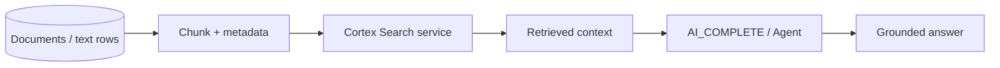

# Cortex Search and RAG

> Snowflake-native semantic and hybrid search over governed data. Consultant lens: ground AI answers in enterprise documents and text instead of asking an LLM to guess.

## Executive Summary

- **What it is:** Cortex Search is Snowflake's managed search service for low-latency fuzzy, semantic, and retrieval use cases over Snowflake data.
- **Why it matters:** Many useful AI applications need retrieval: policies, contracts, research, tickets, reports, product documentation, or internal procedures.
- **Mental model:** Cortex Search finds the relevant context; Cortex AI Functions or Agents use that context to answer.
- **Best used when:** Users need question answering or search over unstructured/semi-structured text stored or governed in Snowflake.
- **Avoid or reconsider when:** The problem is governed metrics over structured tables, where Cortex Analyst is usually the better fit.

## What It Can Do

- Build managed search indexes over Snowflake data.
- Support RAG applications by retrieving relevant chunks or passages.
- Combine with Streamlit, Cortex Agents, AI_COMPLETE, and application APIs.
- Keep retrieval close to Snowflake access controls and data governance.

## What It Cannot Do

- Guarantee that a generated answer is correct after retrieval.
- Replace semantic modeling for governed business metrics.
- Solve poor chunking, stale documents, or missing access filters automatically.
- Remove the need to evaluate retrieval quality and answer faithfulness.

## Core Concepts

| Concept | Meaning | Why it matters |
|---|---|---|
| Search service | Managed Cortex Search object | Serves low-latency retrieval |
| RAG | Retrieval-augmented generation | Grounds model answers in selected context |
| Chunk | Passage or unit indexed for retrieval | Drives relevance and citation quality |
| Embedding | Vector representation of meaning | Helps semantic matching |
| Access filter | Security-aware filtering of results | Critical for sensitive enterprise data |

## How It Works (Simple Flow)

1. Prepare a source table containing searchable text and metadata.
2. Chunk documents or records into useful retrieval units.
3. Create a Cortex Search service over the source query.
4. Query the service from an app, Agent, or SQL/API workflow.
5. Pass retrieved context to a model or user interface.
6. Evaluate relevance, answer grounding, latency, and cost.

## Visuals



## Readable Snippets

```sql
-- Representative shape only.
-- Cortex Search services are created over a source query
-- that selects searchable text plus useful metadata and filters.
```

## Consultant Talking Points

- **Client question this answers:** "Can users ask questions over internal documents without exporting them to a separate vector database?"
- **Trade-offs to mention:** Snowflake-native governance and less integration work versus specialized search platforms and retrieval-design responsibility.
- **Risk or governance angle:** Access filters must follow the underlying document permissions; retrieved context can leak sensitive information if modeled carelessly.
- **Cost/performance angle:** Index refresh, source query cost, warehouse choice, chunk volume, and app traffic all matter.

## Common Pitfalls

- Calling RAG "solved" after the first demo.
- Ignoring document permissions when chunking and indexing.
- Using chunks that are too small to be useful or too large to be precise.
- Not measuring retrieval quality separately from answer quality.
- Treating search as the right answer for structured metric questions.

## When to Recommend What (Decision Table)

| Situation | Recommend | Why | Watch-outs |
|---|---|---|---|
| Search over documents or passages | Cortex Search | Native retrieval over Snowflake data | Chunking and permissions |
| Governed metric questions | Cortex Analyst | Generates SQL over semantic model | Semantic model quality |
| Custom multi-tool assistant | Cortex Agents plus Cortex Search | Orchestrates search and actions | More governance surface |
| Exact lookup by key | SQL search/filter | Deterministic and simple | Not semantic |
| Enterprise search already standardized elsewhere | Existing search platform | Reuse mature capability | Integration and governance mapping |

## Related Topics

- [[01 Snowflake/05 Advanced Analytics and AI/Advanced Analytics and AI Overview]]
- [[01 Snowflake/05 Advanced Analytics and AI/33 Cortex AI Functions]]
- [[01 Snowflake/05 Advanced Analytics and AI/34 Cortex Analyst]]
- [[01 Snowflake/05 Advanced Analytics and AI/38 Cortex Agents and CoWork]]
- [[01 Snowflake/04 Data Engineering/31 Unstructured File Pipelines and Document Processing]]

## Related Decision Notes

- [[80 Comparisons and Decision Notes/Decision Notes/Decisions - Choosing a Snowflake AI and ML Pattern]]
- [[80 Comparisons and Decision Notes/Comparisons/Comparison - Cortex Analyst vs Cortex AI Functions]]

## Questions

- What is the access model for each document and chunk?
- How will retrieval relevance and answer faithfulness be evaluated?
- Should this be a search app, an agent, or a semantic-metric assistant?

## Sources To Revisit

- [Snowflake Docs: Cortex Search](https://docs.snowflake.com/en/user-guide/snowflake-cortex/cortex-search/cortex-search-overview)
- [Snowflake Docs: CREATE CORTEX SEARCH SERVICE](https://docs.snowflake.com/en/sql-reference/sql/create-cortex-search)
- [Snowflake Docs: Cortex Search RAG tutorial](https://docs.snowflake.com/en/user-guide/snowflake-cortex/cortex-search/tutorials/cortex-search-tutorial-2-chat)

