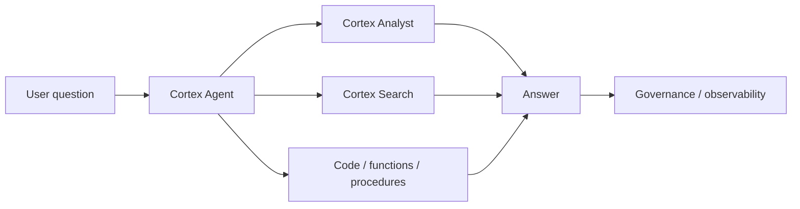

# Cortex Agents and CoWork

> Governed agentic workflows inside Snowflake. Consultant lens: know when to use an agent, when to use Cortex Analyst/Search directly, and when not to automate a decision.

## Executive Summary

- **What it is:** Cortex Agents is Snowflake's managed platform for AI agents that can reason, plan, call tools, execute code, and generate responses. Snowflake CoWork is a user-facing assistant experience built on agentic patterns.
- **Why it matters:** Snowflake AI is moving beyond single SQL functions into multi-step, tool-using workflows.
- **Mental model:** Analyst answers metric questions; Search retrieves context; Agents coordinate tools and actions; CoWork exposes this to business users.
- **Best used when:** A workflow needs multiple tools, mixed structured/unstructured data, code execution, or conversational interaction.
- **Avoid or reconsider when:** A simple SQL query, dashboard, Cortex Analyst call, or search app solves the problem with less risk.

## What It Can Do

- Coordinate tools such as Cortex Analyst, Cortex Search, functions, procedures, and code execution.
- Provide a governed environment for agentic applications in Snowflake.
- Support conversational workflows for business users through CoWork.
- Integrate agents into applications or collaboration surfaces where supported.

## What It Cannot Do

- Make agent decisions deterministic or always correct.
- Remove the need for tool permissions, review, approval, and audit logging.
- Replace clean semantic models, curated data products, or good document indexing.
- Safely automate high-impact business actions without guardrails and human oversight.

## Core Concepts

| Concept | Meaning | Why it matters |
|---|---|---|
| Agent | AI system that plans and calls tools | More powerful and riskier than a single prompt |
| Tool | Analyst, Search, function, procedure, code, or external action | Defines what the agent can do |
| Orchestration | Agent decides steps and tool sequence | Needs observability and control |
| CoWork | Snowflake user-facing conversational assistant | Business adoption surface |
| Execution context | Roles and privileges used by tools | Critical for data access and safety |

## How It Works (Simple Flow)

1. Define the business workflow and decide whether an agent is actually needed.
2. Configure the agent with approved tools, instructions, and access boundaries.
3. The user asks a natural-language question or requests an action.
4. The agent plans steps and calls tools such as Analyst or Search.
5. The agent returns an answer, chart, code result, or action proposal.
6. Logs, evaluations, and guardrails are reviewed for safety and quality.

## Visuals



## Readable Snippets

```text
Good agent candidate:
  "Find the relevant policy, compare it with this portfolio exposure,
   and draft the exception summary."

Poor agent candidate:
  "Show total revenue by month."
  Use SQL, BI, or Cortex Analyst instead.
```

## Consultant Talking Points

- **Client question this answers:** "Should we build a Snowflake AI agent for analysts and operations teams?"
- **Trade-offs to mention:** Agents create flexible workflows but expand the surface for errors, tool misuse, prompt injection, cost, and audit requirements.
- **Risk or governance angle:** Tool permissions, generated code, sensitive context, and action approval must be designed before production.
- **Cost/performance angle:** Multi-step agents can call several paid services per user question; observe usage and limit unnecessary tool calls.

## Common Pitfalls

- Using an agent where a dashboard or semantic model would be safer.
- Giving tools broad privileges because the demo needs to work.
- Ignoring prompt injection from retrieved documents.
- Not logging traces and tool calls.
- Letting generated actions execute without approval.

## When to Recommend What (Decision Table)

| Situation | Recommend | Why | Watch-outs |
|---|---|---|---|
| Single governed metric question | Cortex Analyst | Narrower and safer | Needs semantic model |
| Search over documents | Cortex Search | Retrieval-first pattern | Needs document permissions |
| Multi-tool workflow | Cortex Agents | Coordinates tools and reasoning | Requires guardrails and observability |
| Business user assistant | CoWork | Ready-made conversational surface | Adoption and access governance |
| Deterministic operational action | Workflow system or procedure | More auditable | AI can assist but not own decision |

## Related Topics

- [[01 Snowflake/05 Advanced Analytics and AI/Advanced Analytics and AI Overview]]
- [[01 Snowflake/05 Advanced Analytics and AI/34 Cortex Analyst]]
- [[01 Snowflake/05 Advanced Analytics and AI/37 Cortex Search and RAG]]
- [[01 Snowflake/05 Advanced Analytics and AI/39 AI Governance, Guardrails, Observability, and Cost]]

## Related Decision Notes

- [[80 Comparisons and Decision Notes/Decision Notes/Decisions - Choosing a Snowflake AI and ML Pattern]]

## Questions

- Which tools can the agent call, and under which role?
- What actions require human approval?
- How will traces, evaluations, and failed answers be reviewed?

## Sources To Revisit

- [Snowflake Docs: Cortex Agents](https://docs.snowflake.com/en/user-guide/snowflake-cortex/cortex-agents)
- [Snowflake Docs: Create and manage agents](https://docs.snowflake.com/en/user-guide/snowflake-cortex/cortex-agents-manage)
- [Snowflake Docs: Snowflake CoWork](https://docs.snowflake.com/en/user-guide/snowflake-cortex/snowflake-cowork)

