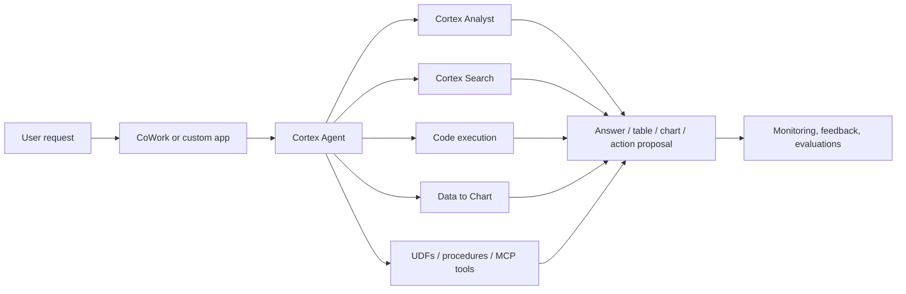

# Cortex Agents and CoWork

> Governed agentic workflows inside Snowflake. Consultant lens: use agents for multi-step orchestration across data, documents, code, and tools, not for every question that could be answered by SQL.

## Executive Summary

- **What it is:** Cortex Agents is Snowflake's managed platform for building and running AI agents inside Snowflake's governed environment. Snowflake CoWork is the ready-to-use conversational application where business users can interact with data agents.
- **Why it matters:** Snowflake AI is moving from single prompts and isolated functions toward multi-step workflows that combine structured data, unstructured context, calculations, charts, and approved business logic.
- **Mental model:** **Analyst answers metric questions. Search retrieves document context. Agents coordinate tools and steps. CoWork exposes agentic workflows to users.**
- **Best used when:** A request needs multiple tools, structured plus unstructured data, code execution, visualization, follow-up conversation, or a reusable assistant experience.
- **Avoid or reconsider when:** A simple SQL query, dashboard, Cortex Analyst call, Cortex Search app, or deterministic workflow solves the problem with less risk.

## What It Can Do

- Route a user request to tools such as Cortex Analyst, Cortex Search, code execution, Data to Chart, custom UDFs/stored procedures, agent skills, MCP connectors, or web search.
- Combine SQL-backed metric answers with retrieved document context in one workflow.
- Run Python in a secure isolated sandbox when code execution is enabled.
- Generate charts from data returned by other tools.
- Maintain conversational context through threads so applications do not need to resend all context every turn.
- Expose agents through the REST API, Snowflake CoWork, Cortex Code, and supported integrations.
- Capture traces, tool calls, user feedback, and evaluation results for monitoring and improvement.

## What It Cannot Do

- Make probabilistic AI answers deterministic or guaranteed correct.
- Replace clean semantic views, curated Cortex Search services, governed data products, or well-designed business workflows.
- Safely automate high-impact actions without permissions, approval, logging, and human accountability.
- Remove the need to test tool selection, tool execution, answer correctness, and logical consistency.
- Avoid cost just because the user asked one natural-language question; one agent run can call several paid tools.
- Bypass Snowflake permissions safely; the agent's usefulness depends on the role, privileges, and tool resources it can access.

## Core Concepts

| Concept | Meaning | Why it matters |
|---|---|---|
| Agent | Schema-level Snowflake object that bundles model, tools, orchestration settings, and instructions | Lets teams create reusable assistants instead of ad hoc prompts |
| Tool | Capability the agent can call: Analyst, Search, code execution, Data to Chart, custom tools, skills, MCP connectors, or web search | Defines what the agent is allowed to do |
| Orchestration | LLM-driven plan, use-tools, reflect loop | The agent decides steps instead of running one fixed query |
| Thread | Persisted conversation context across turns | Supports multi-turn workflows without client-side state management |
| Run | A single request to an agent, typically through the `agent:run` API | Unit to monitor for cost, latency, tool calls, and correctness |
| CoWork | Snowflake's ready-to-use conversational agent application | Gives business users a UI without a custom frontend |
| Evaluation | Testing an agent against expected behavior and metrics | Needed before trusting agents with business users |
| Observability | Logs/traces of prompts, planning, tool calls, SQL, charts, and feedback | Critical for audit, debugging, and improvement |

## How It Works (Simple Flow)

1. Define the business workflow and decide whether it truly needs an agent.
2. Create an agent object with instructions, a model choice, budgets, and allowed tools.
3. Attach resources for each tool, such as semantic views for Analyst or Cortex Search services for document retrieval.
4. A user asks a question in CoWork, a custom app, Cortex Code, or another supported surface.
5. The agent plans the work, chooses tools, runs them, and reflects on intermediate results.
6. The agent returns an answer, table, chart, source-backed summary, action proposal, or follow-up question.
7. Teams monitor runs, review traces, collect user feedback, evaluate behavior, and refine tools/instructions.

## Visuals



## Readable Snippets

```sql
CREATE OR REPLACE AGENT risk_investigation_agent
  COMMENT = 'Assistant for governed risk investigations'
  PROFILE = '{"display_name": "Risk Investigation Assistant", "color": "blue"}'
  FROM SPECIFICATION
  $$
  orchestration:
    budget:
      seconds: 60
      tokens: 16000

  instructions:
    response: "Be concise. Cite source documents and summarize SQL assumptions."
    orchestration: >
      Use Analyst for exposure, revenue, and portfolio metrics.
      Use Search for policies, runbooks, and incident notes.
      Ask a clarifying question when the user request is ambiguous.
    sample_questions:
      - question: "Why did Nordic corporate exposure increase last week?"

  tools:
    - tool_spec:
        type: "cortex_analyst_text_to_sql"
        name: "RiskAnalyst"
        description: "Answers governed risk metric questions."
    - tool_spec:
        type: "cortex_search"
        name: "PolicySearch"
        description: "Searches risk policy and operating procedure documents."
    - tool_spec:
        type: "data_to_chart"
        name: "data_to_chart"
        description: "Creates charts from returned data."

  tool_resources:
    RiskAnalyst:
      semantic_view: "RISK_GOVERNED.MART.RISK_SEMANTIC_VIEW"
    PolicySearch:
      name: "GOV_AI.SEARCH.RISK_POLICY_SEARCH"
      max_results: "5"
      filter:
        "@eq":
          country: "NO"
  $$;
```

```text
Good agent candidate:
  "Revenue dropped last month. Break it down by product and region,
   check whether any major customers churned, find related incident notes,
   and create a summary for Monday's meeting."

Poor agent candidate:
  "What was revenue last month?"
  Use SQL, BI, or Cortex Analyst instead.
```

## Consultant Talking Points

- **Client question this answers:** "Can we build an assistant that combines governed metrics, document search, calculations, and charts inside Snowflake?"
- **Trade-offs to mention:** Agents reduce custom orchestration work, but increase the need for tool design, permissions, evaluation, observability, and cost controls.
- **Risk or governance angle:** The agent is only as safe as its tools. Every enabled tool expands what the agent can attempt, so roles, grants, tool resources, and approval flows matter.
- **Cost/performance angle:** One user request can trigger orchestration tokens, Analyst calls, Search calls, warehouse compute for custom tools, code execution, chart generation, and retries.

## Typical Bank Use Cases

| Use case | Why an agent helps | Example request |
|---|---|---|
| Risk investigation assistant | Combines exposure metrics, segment breakdowns, policy context, and charts | "Why did Nordic corporate exposure increase last week, and are any limits affected?" |
| Data operations assistant | Searches runbooks, checks metadata, summarizes likely failure causes, and proposes next checks | "The customer exposure table is delayed. What should I check first?" |
| Compliance research assistant | Searches policies and compares them with governed business data | "Which policy exceptions apply to this product and jurisdiction?" |
| KYC/AML support | Combines customer facts, procedure documents, typology guidance, and escalation rules | "Does this case match an escalation pattern?" |
| Audit preparation assistant | Finds controls, evidence, access history, prior findings, and remediation notes | "Prepare the evidence summary for access review controls." |
| Management insight assistant | Turns broad questions into metric queries, charts, and written summaries | "What changed in trading revenue this month and what are the main drivers?" |

## CoWork vs Cortex Agents

| Area | Cortex Agents | Snowflake CoWork |
|---|---|---|
| What it is | Managed agent object and API/runtime | Ready-to-use conversational application |
| Main user | Builders, platform teams, data/AI engineers | Business users and analysts |
| Main job | Define tools, instructions, orchestration, monitoring, and integration | Ask questions, get insights, charts, artifacts, and follow-up answers |
| Interface | Snowsight, SQL, REST API, app integration | Snowflake UI and supported client experiences |
| Governance concern | Tool privileges, role context, traces, evaluations, budgets | User access, data governance inheritance, artifact sharing, verified answers |

## Common Pitfalls

- Using an agent where a dashboard, SQL query, or Cortex Analyst semantic model would be simpler and safer.
- Giving tools broad privileges because the demo needs to work.
- Connecting Search services without clear document entitlements and filters.
- Letting the agent execute custom procedures or UDFs that perform actions without approval boundaries.
- Ignoring prompt injection from retrieved documents or user-uploaded files.
- Treating a nice chat answer as production-ready without evaluation data.
- Not logging traces, tool calls, generated SQL, chart creation, token usage, latency, and user feedback.
- Forgetting that monitoring may contain sensitive prompts, retrieved text, and tool outputs.

## When to Recommend What (Decision Table)

| Situation | Recommend | Why | Watch-outs |
|---|---|---|---|
| Single governed metric question | SQL, BI, or Cortex Analyst | Narrower, cheaper, more deterministic | Needs semantic model if using Analyst |
| Search over documents | Cortex Search + RAG | Retrieval-first pattern | Needs document permissions, citations, and freshness |
| Multi-tool workflow across metrics, documents, code, and charts | Cortex Agents | Coordinates specialized tools and intermediate steps | Requires guardrails, monitoring, evaluation, and budget controls |
| Business users need a ready conversational workspace | CoWork | Provides a Snowflake-native UI, charts, artifacts, and governed access | Adoption, permissions, verified answers, and artifact sharing |
| Application needs embedded agent behavior | Cortex Agents REST API | Lets teams build a custom product experience | App auth, thread management, error handling, and trace review |
| Deterministic operational action | Procedure, workflow system, or runbook automation | More auditable and predictable | AI can assist with diagnosis or drafting, not own the control |
| Regulated/high-impact decision | Agent only with human review and evidence | Agent can gather and summarize support | Human accountability, audit trail, and approval gates are mandatory |

## Governance Checklist

- Define the agent's job narrowly: which business domain, users, questions, and outputs are allowed.
- Grant `SNOWFLAKE.CORTEX_AGENT_USER` or `SNOWFLAKE.CORTEX_USER` deliberately, not accidentally through broad roles.
- Grant `USAGE`, `MODIFY`, `MONITOR`, and `OWNERSHIP` on agents according to clear responsibility boundaries.
- Remember that the querying user's default role drives session permissions; make default roles and warehouses intentional.
- Verify privileges for every tool resource: semantic views, Cortex Search services, tables, warehouses, UDFs, and procedures.
- Treat custom tools and stored procedures as action surfaces that may need human approval or caller's-rights behavior.
- Review monitoring access carefully because traces can contain full prompts, tool inputs, SQL, retrieved text, and feedback.
- Build evaluation datasets for representative questions, expected tool choices, expected answers, and known failure modes.
- Track token usage, latency, failed tool calls, repeated retries, and user feedback before scaling to many users.

## Related Topics

- [[01 Snowflake/05 Advanced Analytics and AI/Advanced Analytics and AI Overview]]
- [[01 Snowflake/05 Advanced Analytics and AI/33 Cortex AI Functions]]
- [[01 Snowflake/05 Advanced Analytics and AI/34 Cortex Analyst]]
- [[01 Snowflake/05 Advanced Analytics and AI/37 Cortex Search and RAG]]
- [[01 Snowflake/05 Advanced Analytics and AI/39 AI Governance, Guardrails, Observability, and Cost]]
- [[01 Snowflake/05 Advanced Analytics and AI/42 Document and Multimodal AI]]

## Related Decision Notes

- [[80 Comparisons and Decision Notes/Decision Notes/Decisions - Choosing a Snowflake AI and ML Pattern]]

## Questions

- Is this truly a multi-step workflow, or is SQL/BI/Analyst/Search enough?
- Which tools can the agent call, and under which role?
- What data classes may appear in prompts, retrieved context, generated SQL, logs, and artifacts?
- What actions require human approval?
- How will tool selection, tool execution, answer correctness, and logical consistency be evaluated?
- Who owns monitoring, budget limits, instruction changes, and rollback?

## Sources To Revisit

- [Snowflake Docs: Cortex Agents](https://docs.snowflake.com/en/user-guide/snowflake-cortex/cortex-agents)
- [Snowflake Docs: Create and manage agents](https://docs.snowflake.com/en/user-guide/snowflake-cortex/cortex-agents-manage)
- [Snowflake Docs: Access control and authentication](https://docs.snowflake.com/en/user-guide/snowflake-cortex/cortex-agents-setup)
- [Snowflake Docs: Monitor Cortex Agent requests](https://docs.snowflake.com/en/user-guide/snowflake-cortex/cortex-agents-monitor)
- [Snowflake Docs: Cortex Agent evaluations](https://docs.snowflake.com/en/user-guide/snowflake-cortex/cortex-agents-evaluations)
- [Snowflake Docs: Snowflake CoWork](https://docs.snowflake.com/en/user-guide/snowflake-cortex/snowflake-cowork)
