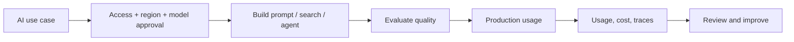

# AI Governance, Guardrails, Observability, and Cost

> Production controls for Snowflake AI. Consultant lens: in a bank, the AI feature is not ready until access, data residency, quality, logging, and spend are controlled.

## Executive Summary

- **What it is:** The governance and operating layer around Snowflake Cortex, agents, search, models, prompts, evaluations, access, usage, and spend.
- **Why it matters:** AI outputs are probabilistic and often process sensitive data. Financial-services use cases need more control than a working demo.
- **Mental model:** AI has two pipelines: the data pipeline and the trust pipeline. Both must be observable.
- **Best used when:** Any Cortex or ML workload moves from experiment to shared, recurring, or production use.
- **Avoid or reconsider when:** The workflow cannot tolerate probabilistic errors and no review/control mechanism exists.

## What It Can Do

- Control who can use AI features and models.
- Configure guardrail behavior where supported.
- Monitor AI usage, latency, cost, and traces.
- Evaluate generative AI and agent behavior using datasets and metrics.
- Support operational review of prompts, outputs, tool calls, and model changes.

## What It Cannot Do

- Make AI outputs deterministic, factual, or safe by default.
- Replace legal, compliance, model-risk, or information-security approval.
- Eliminate prompt injection, data leakage, hallucination, or bias.
- Make poor source data trustworthy.

## Core Concepts

| Concept | Meaning | Why it matters |
|---|---|---|
| Model access | Which models/functions a role can use | Prevents uncontrolled AI use |
| Guardrails | Account or feature controls for AI behavior | Adds central policy control |
| AI Observability | Tracing and evaluation of AI applications | Lets teams debug and measure quality |
| Usage history | Metadata about AI calls and spend | Supports chargeback and cost control |
| Evaluation dataset | Known examples for measuring behavior | Prevents demo-only confidence |
| Human review | Manual approval for uncertain/high-impact outputs | Required for many regulated cases |

## How It Works (Simple Flow)

1. Classify the input data and decide whether AI processing is allowed.
2. Approve functions, models, regions, roles, and allowed use cases.
3. Build evaluation datasets for expected answers, edge cases, and sensitive examples.
4. Log usage, prompts/metadata where appropriate, model choices, cost, latency, and traces.
5. Set review thresholds, guardrails, and escalation paths.
6. Re-test after model, prompt, source-data, or policy changes.

## Visuals



## Readable Snippets

```sql
SELECT
    function_name,
    model_name,
    SUM(credits) AS credits_used,
    COUNT(*) AS calls
FROM snowflake.account_usage.cortex_ai_functions_usage_history
WHERE start_time >= DATEADD('day', -30, CURRENT_TIMESTAMP())
GROUP BY function_name, model_name
ORDER BY credits_used DESC;
```

## Consultant Talking Points

- **Client question this answers:** "Can we use Snowflake AI safely with regulated or sensitive data?"
- **Trade-offs to mention:** Governance adds friction, but without it the organization gets shadow AI, uncontrolled spend, and unreviewed outputs.
- **Risk or governance angle:** Data classification, regional inference, model access, auditability, human review, and model-risk process matter.
- **Cost/performance angle:** Token/page/media usage can grow invisibly; persist approved results and monitor usage separately from warehouses.

## Common Pitfalls

- Letting `PUBLIC` or broad roles inherit AI capabilities without review.
- Assuming "inside Snowflake" always means no residency or processing concern.
- Measuring only latency and not correctness or faithfulness.
- Recomputing AI outputs in dashboards.
- Forgetting that model behavior can change over time.

## When to Recommend What (Decision Table)

| Situation | Recommend | Why | Watch-outs |
|---|---|---|---|
| Experiment with non-sensitive data | Limited sandbox access | Fast learning | Do not reuse as production pattern |
| Shared production AI workflow | Access controls, observability, evaluations | Governed operation | Needs ownership |
| High-impact decision | Human review and deterministic policy | Reduces harm | AI should assist, not decide alone |
| Cost uncertainty | Usage views and budgets | Makes spend visible | Attribute via query tags/metadata |
| Agentic workflow | Guardrails plus trace review | Multi-tool risk is higher | Tool permissions and approval gates |

## Related Topics

- [[01 Snowflake/05 Advanced Analytics and AI/Advanced Analytics and AI Overview]]
- [[01 Snowflake/05 Advanced Analytics and AI/33 Cortex AI Functions]]
- [[01 Snowflake/05 Advanced Analytics and AI/37 Cortex Search and RAG]]
- [[01 Snowflake/05 Advanced Analytics and AI/38 Cortex Agents and CoWork]]
- [[01 Snowflake/06 Cost Management and Operations/47 Budgets]]

## Related Decision Notes

- [[80 Comparisons and Decision Notes/Decision Notes/Decisions - Choosing a Snowflake AI and ML Pattern]]
- [[80 Comparisons and Decision Notes/Comparisons/Comparison - Resource Monitors vs Budgets]]

## Questions

- Which data classes may be sent to AI functions or agents?
- Which roles can use which models and functions?
- What evaluation proves this is good enough for the business risk?

## Sources To Revisit

- [Snowflake Docs: AI cost management and governance](https://docs.snowflake.com/en/user-guide/snowflake-cortex/governance-and-availability/ai-cost-management-and-governance)
- [Snowflake Docs: AI Observability](https://docs.snowflake.com/en/user-guide/snowflake-cortex/ai-observability)
- [Snowflake Docs: Cortex AI Guardrails](https://docs.snowflake.com/en/user-guide/snowflake-cortex/cortex-ai-guardrails)
- [Snowflake Docs: Managing Cortex AI Function costs](https://docs.snowflake.com/en/user-guide/snowflake-cortex/ai-func-cost-management)

