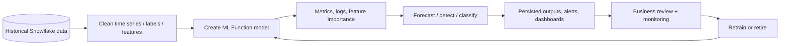

# ML Functions for Forecasting, Anomaly Detection, and Classification

> Snowflake-managed machine learning functions for common analytical predictions. Consultant lens: use them when the business problem matches a packaged ML pattern, and know when the risk requires custom ML, model governance, or human review.

## Executive Summary

- **What it is:** Snowflake ML Functions are built-in managed ML workflows for time-series forecasting, anomaly detection, classification, and related business analysis such as Top Insights.
- **Why it matters:** Many teams need prediction and anomaly signals before they need a full custom data-science platform.
- **Mental model:** **ML Functions sit between normal analytics and custom ML. Snowflake manages the model workflow; the team still owns data quality, evaluation, governance, and monitoring.**
- **Best used when:** The task is a standard prediction shape: forecast future numeric values, detect unusual time-series observations, or classify rows into known categories.
- **Avoid or reconsider when:** The problem needs custom algorithms, long free-text reasoning, strict explainability, regulated model-risk approval, complex feature engineering, or mature MLOps lifecycle controls.

## What It Can Do

- Forecast future numeric values from historical time-series data.
- Forecast multiple series at once, such as volume by country, product, desk, pipeline, or account group.
- Include additional features in forecasting or anomaly detection when those features are available and meaningful.
- Detect anomalous observations in single-series or multi-series time-series data.
- Train anomaly detection in unsupervised mode or with labeled anomaly examples.
- Train binary or multi-class classification models from labeled tabular examples.
- Return predicted classes and probabilities for classification.
- Show evaluation metrics, feature importance, and training logs where supported.
- Create schema-level managed model objects that can be called from SQL.

## What It Cannot Do

- Replace a full custom ML platform for every model type or risk class.
- Guarantee business-valid predictions without clean training data and review.
- Remove the need for train/test thinking, leakage checks, drift monitoring, and owner accountability.
- Support long free-text classification in the Classification function; string features are treated as categorical values, not paragraphs to understand.
- Update a trained model in place; ML Function model objects are immutable and must be retrained/replaced.
- Provide full model versioning and promotion discipline by itself.
- Make poor labels, unstable time series, biased source data, or misunderstood business events trustworthy.

## Core Concepts

| Concept | Meaning | Why it matters |
|---|---|---|
| Forecasting | Predict future numeric values from historical time series | Useful for volumes, cost, demand, capacity, and workload planning |
| Anomaly detection | Flag values that differ from expected time-series behavior | Useful for monitoring pipelines, spend, volumes, reconciliation, and operational metrics |
| Classification | Predict a category from labeled tabular features | Useful for routing, prioritization, segmentation, churn-like patterns, and simple supervised decisions |
| Series | Independent time series inside one model, such as desk, product, or pipeline | Avoids hiding local problems inside a stable total |
| Target column | Numeric value to forecast/detect, or label to classify | Defines what the model is trying to predict |
| Feature | Additional input column that may help prediction | Can improve models, but can also introduce leakage or instability |
| Evaluation metrics | Measures of model behavior | Needed before trusting model outputs operationally |
| Model object | Schema-level Snowflake object created by the ML Function | Can be shown, called, granted, dropped, and retrained by replacement |
| Leakage | Training uses information that would not be available at prediction time | Creates misleadingly good models that fail in real use |

## How It Works (Simple Flow)

1. Confirm the business question matches a supported ML Function.
2. Prepare clean training data with stable timestamps, keys, labels, features, and business definitions.
3. Create the ML Function model object in a schema using a selected warehouse.
4. Review training logs, evaluation metrics, feature importance, and business sanity checks.
5. Generate forecasts, anomaly flags, or classifications.
6. Persist outputs when they feed dashboards, alerts, or workflows.
7. Monitor quality, drift, cost, false positives, false negatives, and business usefulness.
8. Retrain on a deliberate cadence because trained model objects are not updated in place.

## Visuals



## Readable Snippets

### Forecast future transaction volume

```sql
CREATE OR REPLACE SNOWFLAKE.ML.FORECAST transaction_volume_forecast(
  INPUT_DATA => TABLE(daily_transaction_volume),
  TIMESTAMP_COLNAME => 'business_date',
  TARGET_COLNAME => 'transaction_count'
);

SELECT *
FROM TABLE(
  transaction_volume_forecast!FORECAST(FORECASTING_PERIODS => 14)
);

CALL transaction_volume_forecast!SHOW_EVALUATION_METRICS();
```

### Forecast multiple series

```sql
CREATE OR REPLACE SNOWFLAKE.ML.FORECAST desk_volume_forecast(
  INPUT_DATA => TABLE(daily_transaction_volume_by_desk),
  SERIES_COLNAME => 'desk',
  TIMESTAMP_COLNAME => 'business_date',
  TARGET_COLNAME => 'transaction_count'
);

CALL desk_volume_forecast!FORECAST(FORECASTING_PERIODS => 10);
```

### Detect abnormal pipeline load volume

```sql
CREATE OR REPLACE SNOWFLAKE.ML.ANOMALY_DETECTION load_volume_detector(
  INPUT_DATA => TABLE(pipeline_load_history),
  TIMESTAMP_COLNAME => 'load_hour',
  TARGET_COLNAME => 'rows_loaded',
  LABEL_COLNAME => ''
);

CALL load_volume_detector!DETECT_ANOMALIES(
  INPUT_DATA => TABLE(recent_pipeline_loads),
  TIMESTAMP_COLNAME => 'load_hour',
  TARGET_COLNAME => 'rows_loaded'
);
```

`LABEL_COLNAME => ''` is the unsupervised pattern. If known anomaly labels exist, pass the label column name instead.

### Classify operational tickets

```sql
CREATE OR REPLACE SNOWFLAKE.ML.CLASSIFICATION ticket_classifier(
  INPUT_DATA => SYSTEM$REFERENCE('VIEW', 'training_ticket_features'),
  TARGET_COLNAME => 'ticket_category'
);

CREATE OR REPLACE TABLE ticket_predictions AS
SELECT
  *,
  ticket_classifier!PREDICT(INPUT_DATA => {*}) AS prediction
FROM new_ticket_features;

SELECT
  prediction:class::string AS predicted_category,
  prediction:probability AS class_probabilities
FROM ticket_predictions;
```

Classification expects tabular features. Short categorical strings are fine; full ticket narratives, emails, or paragraphs are better handled with Cortex AI Functions, embeddings, RAG, or custom ML.

### Model management pattern

```sql
SHOW SNOWFLAKE.ML.FORECAST;
SHOW SNOWFLAKE.ML.ANOMALY_DETECTION;
SHOW SNOWFLAKE.ML.CLASSIFICATION;

DROP SNOWFLAKE.ML.FORECAST old_transaction_volume_forecast;
```

ML Function models are immutable. To update a model, train a new model or use `CREATE OR REPLACE`.

## Consultant Talking Points

- **Client question this answers:** "Can we forecast volumes, detect anomalies, or classify rows without building a custom ML stack?"
- **Trade-offs to mention:** ML Functions are faster and simpler than custom ML, but provide less algorithm/runtime/lifecycle control.
- **Risk or governance angle:** Predictions, anomaly flags, and classes are not facts. They need validation, monitoring, permissions, and review before operational or regulated use.
- **Cost/performance angle:** Training and scoring use warehouse compute, and model objects create managed storage. Persist useful outputs instead of recomputing blindly.

## Where This Fits

| Situation | Good fit? | Why |
|---|---:|---|
| Forecast daily payment volume | Yes | Standard time-series numeric prediction |
| Detect unusual pipeline row counts | Yes | Time-series anomaly detection over operational metrics |
| Classify tickets into known categories | Yes | Supervised label prediction over tabular features |
| Forecast Snowflake credit usage by team | Yes | Time-series planning, especially with series by cost center |
| Build a custom credit-risk model with formal model-risk governance | Maybe not | Likely needs custom ML, explainability, validation, registry, and approval workflow |
| Predict from long unstructured documents | Probably not | Better with Cortex AI Functions, embeddings, RAG, Document AI, or custom ML |
| Generate conversational answers | No | That belongs to Cortex AI Functions, Cortex Analyst, Search/RAG, or Agents |
| Trigger automatic regulated decisions | No by itself | Needs deterministic controls, human approval, audit trail, and governance |

## Typical Bank Data Engineering Use Cases

| Use case | ML Function pattern | Practical value |
|---|---|---|
| Abnormal ingestion volume | Anomaly detection | Detect missing, duplicated, or unexpectedly large file loads |
| Late or weak market-data feed | Forecasting plus anomaly detection | Compare expected event/file volume against actual arrival |
| Snowflake spend planning | Forecasting | Estimate next-month warehouse, serverless, or AI usage trends |
| Load-duration monitoring | Anomaly detection | Flag pipelines taking unusually long compared with historical behavior |
| Reconciliation variance | Anomaly detection | Highlight unusual breaks before they become recurring incidents |
| Incident or ticket routing | Classification | Route issues to data engineering, risk, access management, or operations |
| Alert prioritization | Classification | Separate likely noise from high-priority operational cases |

## Common Pitfalls

- Treating ML Function output as truth instead of prediction.
- Training on data with leakage from the future.
- Training on labels that reflect inconsistent human behavior.
- Ignoring missing, duplicate, or irregular time steps in forecasting/anomaly detection.
- Aggregating too broadly so local anomalies disappear inside stable totals.
- Forgetting that anomalies can be real business events, not data errors.
- Creating alert fatigue by sending every anomaly directly to operations.
- Using classification on full text when the function expects structured/categorical features.
- Deploying without monitoring drift, false positives, false negatives, and business usefulness.
- Forgetting that models are immutable and need a retraining/replacement cadence.
- Leaving obsolete model objects around and accumulating unnecessary storage cost.

## When to Recommend What (Decision Table)

| Situation | Recommend | Why | Watch-outs |
|---|---|---|---|
| Time-series volume, cost, or demand forecast | Forecasting ML Function | Fast managed pattern inside Snowflake | Needs clean history and business sanity checks |
| Pipeline, metric, spend, or reconciliation outlier detection | Anomaly Detection ML Function | Useful monitoring signal | Alert fatigue and real business events |
| Simple supervised category prediction over tabular features | Classification ML Function | Accessible built-in model | Label quality, leakage, class imbalance |
| Long text needs classification or extraction | Cortex AI Functions or custom NLP | Better for free-form language | Probabilistic output and prompt governance |
| Complex custom model | Snowpark ML plus Model Registry | More control and lifecycle discipline | More MLOps responsibility |
| Production model needs reusable features | Feature Store plus custom ML workflow | Keeps training/serving features consistent | More platform ownership |
| High-stakes regulated decision | Human-reviewed model process | Safer governance and auditability | Slower delivery and more evidence required |
| Quick exploratory analysis | ML Function in notebook or sandbox | Fast learning | Must not become production by accident |

## Related Topics

- [[01 Snowflake/05 Advanced Analytics and AI/Advanced Analytics and AI Overview]]
- [[01 Snowflake/05 Advanced Analytics and AI/35 ML Model Registry]]
- [[01 Snowflake/05 Advanced Analytics and AI/36 Snowflake Notebooks]]
- [[01 Snowflake/05 Advanced Analytics and AI/39 AI Governance, Guardrails, Observability, and Cost]]
- [[01 Snowflake/05 Advanced Analytics and AI/41 Feature Store and ML Operations]]
- [[01 Snowflake/06 Cost Management and Operations/44 Credit Consumption Model]]

## Related Decision Notes

- [[80 Comparisons and Decision Notes/Decision Notes/Snowflake/Decisions - Choosing a Snowflake AI and ML Pattern]]

## Questions

- Is the task a supported built-in ML pattern or a custom model problem?
- What is the prediction target, and is it actually available at training time without leakage?
- What evaluation metric maps to the business consequence of being wrong?
- Which false positives and false negatives are acceptable?
- What role owns retraining, monitoring, and model retirement?
- Should outputs be persisted, reviewed, or used only as advisory signals?

## Sources To Revisit

- [Snowflake Docs: ML Functions](https://docs.snowflake.com/en/guides-overview-ml-functions)
- [Snowflake Docs: Forecasting](https://docs.snowflake.com/en/user-guide/ml-functions/forecasting)
- [Snowflake Docs: Anomaly Detection](https://docs.snowflake.com/en/user-guide/ml-functions/anomaly-detection)
- [Snowflake Docs: Classification](https://docs.snowflake.com/en/user-guide/ml-functions/classification)
- [Snowflake Docs: Training with real-world time-series data](https://docs.snowflake.com/en/user-guide/ml-functions/preprocessing)
