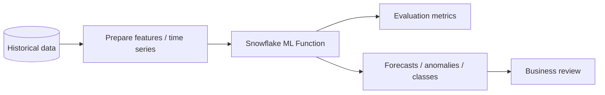

# ML Functions for Forecasting, Anomaly Detection, and Classification

> Snowflake-managed machine learning functions for common analytical predictions. Consultant lens: know the difference between quick built-in ML insight and a full custom ML lifecycle.

## Executive Summary

- **What it is:** Snowflake ML Functions provide built-in model workflows for forecasting, anomaly detection, classification, and top insights.
- **Why it matters:** Many business questions need predictive or anomaly-oriented analysis without a full data-science platform build.
- **Mental model:** ML Functions are packaged ML workflows; Model Registry and Feature Store support custom/production ML lifecycles.
- **Best used when:** The problem matches a supported pattern and the team wants fast, SQL-accessible ML.
- **Avoid or reconsider when:** The model requires custom algorithms, complex feature engineering, strict explainability, or mature MLOps controls.

## What It Can Do

- Forecast future numeric time-series values.
- Detect anomalous observations in time-series data.
- Train classification models for binary or multi-class outcomes.
- Generate top insights for business-driver analysis where supported.
- Make ML accessible from Snowflake without heavy infrastructure setup.

## What It Cannot Do

- Replace a full custom ML platform for every model type.
- Guarantee business-valid predictions without careful data preparation.
- Remove the need for train/test thinking, leakage checks, and monitoring.
- Solve poor labels, unstable time series, or biased source data.

## Core Concepts

| Concept | Meaning | Why it matters |
|---|---|---|
| Forecasting | Predict future values from history | Useful for volumes, cost, demand, and time-series metrics |
| Anomaly detection | Flag outliers in time-series data | Useful for pipeline, operations, and risk monitoring |
| Classification | Predict a category from features | Useful for churn, fraud-like patterns, routing, or segmentation |
| Training data | Historical examples used by the model | Quality determines usefulness |
| Evaluation metrics | Measures of model behavior | Needed before trusting outputs |

## How It Works (Simple Flow)

1. Confirm the business question matches a supported ML Function.
2. Prepare clean training data with stable keys, timestamps, labels, and features.
3. Train the managed model/function.
4. Review evaluation metrics and business sanity checks.
5. Generate forecasts, anomaly flags, classifications, or insights.
6. Persist and monitor outputs before operational use.

## Visuals



## Readable Snippets

```sql
-- Exact syntax depends on the chosen ML Function.
-- Recognize the pattern:
-- prepare training data -> create/train model -> call forecast/detect/classify methods.
```

## Consultant Talking Points

- **Client question this answers:** "Can we forecast volumes or detect anomalies without building a custom ML stack?"
- **Trade-offs to mention:** Faster built-in ML versus less algorithm/runtime control than custom ML.
- **Risk or governance angle:** Predictions and anomaly flags need validation, monitoring, and review before operational action.
- **Cost/performance angle:** Training, inference, and repeated scoring consume Snowflake resources; avoid recomputing blindly.

## Common Pitfalls

- Treating ML Function output as truth instead of prediction.
- Training on data with leakage from the future.
- Ignoring missing, duplicate, or irregular time steps.
- Forgetting that anomalies can be business events, not data errors.
- Deploying without monitoring drift or performance.

## When to Recommend What (Decision Table)

| Situation | Recommend | Why | Watch-outs |
|---|---|---|---|
| Time-series volume/cost forecast | Forecasting ML Function | Fast managed pattern | Needs clean history |
| Pipeline or metric outlier detection | Anomaly Detection ML Function | Useful monitoring signal | Alert fatigue |
| Simple supervised category prediction | Classification ML Function | Accessible built-in model | Labels and leakage |
| Complex custom model | Snowpark ML plus Model Registry | More control | More MLOps responsibility |
| High-stakes decision | Human-reviewed model process | Safer governance | Slower delivery |

## Related Topics

- [[01 Snowflake/05 Advanced Analytics and AI/Advanced Analytics and AI Overview]]
- [[01 Snowflake/05 Advanced Analytics and AI/35 ML Model Registry]]
- [[01 Snowflake/05 Advanced Analytics and AI/41 Feature Store and ML Operations]]
- [[01 Snowflake/05 Advanced Analytics and AI/36 Snowflake Notebooks]]

## Related Decision Notes

- [[80 Comparisons and Decision Notes/Decision Notes/Decisions - Choosing a Snowflake AI and ML Pattern]]

## Questions

- Is the task a supported built-in ML pattern or a custom model problem?
- What evaluation metric maps to the business consequence of being wrong?
- How will predictions be monitored after deployment?

## Sources To Revisit

- [Snowflake Docs: ML Functions](https://docs.snowflake.com/en/guides-overview-ml-functions)
- [Snowflake Docs: Forecasting](https://docs.snowflake.com/en/user-guide/ml-functions/forecasting)
- [Snowflake Docs: Anomaly Detection](https://docs.snowflake.com/en/user-guide/ml-functions/anomaly-detection)
- [Snowflake Docs: Classification](https://docs.snowflake.com/en/user-guide/ml-functions/classification)

