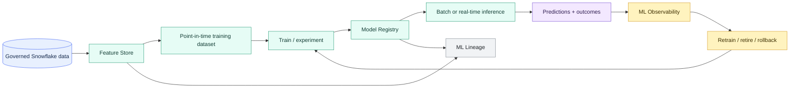

# Feature Store and ML Operations

> [!abstract] Consultant lens
> **What it is:** Snowflake's broader ML lifecycle beyond notebooks and model registration.
>
> **Why it matters:** Understand when a model has moved from experiment to governed production asset.

## Executive Summary

- **What it is:** Snowflake ML capabilities for reusable feature management, model development, experiments, jobs, registry, observability, explainability, lineage, and production monitoring.
- **Why it matters:** A model stuck in a notebook is not production. Banks need consistent inputs, versioned models, lineage, monitoring, ownership, rollback, and controlled deployment.
- **Mental model:** **Feature Store standardizes model inputs. Model Registry controls model versions. ML Jobs automate workflows. Observability watches behavior after deployment. Lineage explains where everything came from.**
- **Best used when:** A team needs repeatable ML features, versioned models, monitored production inference, low-latency feature retrieval, or model governance evidence.
- **Avoid or reconsider when:** The work is a one-off analysis, a simple packaged ML Function is enough, or the client already has a mature external MLOps platform that should remain the system of record.

## What It Can Do

- Define, manage, discover, and reuse ML features derived from governed Snowflake data.
- Keep training and inference inputs consistent to reduce training-serving skew.
- Generate point-in-time correct training datasets so historical labels do not accidentally use future feature values.
- Refresh feature views automatically through Snowflake-managed feature pipelines, or register externally managed feature pipelines such as dbt outputs.
- Serve features in batch and, where appropriate, through the Online Feature Store for low-latency inference use cases.
- Register and version trained models in the Model Registry.
- Run ML workflows through notebooks, Container Runtime, Snowflake ML Jobs, warehouses, or Snowpark Container Services.
- Monitor production model behavior, drift, performance, volume, and segment-level behavior.
- Trace ML lineage from source data to feature views, datasets, models, and deployed services.
- Support explainability workflows for selected models, such as feature impact analysis.

## What It Cannot Do

- Make feature definitions correct without domain ownership and business review.
- Replace every specialist MLOps, experiment tracking, CI/CD, approval, or model-risk platform.
- Guarantee a model remains valid after source data, customer behavior, markets, or policy changes.
- Remove model-risk governance obligations for regulated or high-impact models.
- Prevent poor labels, biased training data, leakage, or weak evaluation by itself.
- Make real-time model serving necessary; many production models are safer and cheaper as batch scoring.

## Core Concepts

| Concept | Meaning | Why it matters |
|---|---|---|
| Feature | Reusable model input derived from data | Must be consistent across training and inference |
| Feature Store | Snowflake schema used to organize feature views, entities, metadata, and access | Prevents duplicate, inconsistent feature logic |
| Entity | Business object the feature describes, such as customer, account, trade, desk, or instrument | Gives features a stable grain and ownership boundary |
| Feature view | Python or SQL transformation that produces related feature columns | Defines the actual feature logic and refresh behavior |
| Offline feature | Feature values used for training, batch scoring, and historical analysis | Main pattern for batch ML and training datasets |
| Online feature | Low-latency feature value used during real-time inference | Useful for fraud, recommendations, personalization, and live risk decisions |
| Dataset | Materialized training or inference dataset generated from features and source rows | Makes model training reproducible |
| Model Registry | Versioned model artifact management in Snowflake | Controls model promotion, inference, metadata, and permissions |
| ML Job | Programmatic ML workload submitted to Snowflake compute/container runtime | Moves repeatable ML workflows beyond manual notebooks |
| Model monitor | Observability object for a registered model version | Tracks drift, performance, volume, and segments over time |
| ML lineage | Relationship between source data, feature views, datasets, models, and deployed services | Required for governance, debugging, and audit |

## How It Works (Simple Flow)

1. Define the model use case, target, business risk, and whether features will be reused.
2. Create governed feature definitions from Snowflake tables, views, streams, or externally managed pipelines.
3. Generate point-in-time correct training datasets from feature views.
4. Train and compare models in notebooks, Snowpark, Snowflake ML Jobs, or an external environment.
5. Register the approved model version with metrics, signatures, metadata, and ownership.
6. Deploy for batch inference, warehouse inference, SPCS serving, or another approved serving pattern.
7. Store predictions, actual outcomes, and feature values needed for monitoring.
8. Monitor drift, performance, volume, segments, lineage, cost, and operational failures.
9. Retrain, roll back, retire, or reapprove the model based on evidence.

## Visuals



## Readable Snippets

### Create a feature store

```python
# Representative shape only.
# The production pattern is:
# define entities -> register feature views -> generate dataset ->
# train model -> log model -> infer -> monitor.

from snowflake.ml.feature_store import FeatureStore, CreationMode

fs = FeatureStore(
    session=session,
    database="ML_PLATFORM",
    name="RISK_FEATURE_STORE",
    default_warehouse="ML_WH",
    creation_mode=CreationMode.CREATE_IF_NOT_EXIST,
)
```

### Generate a point-in-time training dataset

```python
# Representative feature-store flow:
# 1. Define customer/account/trade features once.
# 2. Generate a point-in-time training dataset.
# 3. Reuse the same feature definitions for inference.

training_dataset = fs.generate_dataset(
    name="CORPORATE_RISK_TRAINING",
    spine_df=training_events,
    features=[exposure_features, payment_features, sector_features],
    spine_timestamp_col="EVENT_TS",
)
```

> [!example]- Additional model-observability patterns
> ### Create a model monitor
>
> ```sql
> -- Model observability pattern.
> -- Exact parameters depend on the registered model version and monitor source.
> CREATE MODEL MONITOR corporate_risk_monitor
> WITH
>   MODEL = corporate_risk_model VERSION v1,
>   SOURCE = corporate_risk_inference_log,
>   TIMESTAMP_COLUMN = prediction_ts,
>   PREDICTION_COLUMN = predicted_risk_bucket,
>   ACTUAL_COLUMN = actual_risk_bucket,
>   SEGMENT_COLUMNS = (country, sector);
> ```
>
> ### Query drift metrics
>
> ```sql
> -- Query monitor metrics for dashboards or alerts.
> SELECT *
> FROM TABLE(MODEL_MONITOR_DRIFT_METRIC(
>   'corporate_risk_monitor',
>   'PSI',
>   'exposure_change_pct_10d',
>   'DAY',
>   '2026-01-01'::TIMESTAMP_NTZ,
>   '2026-01-31'::TIMESTAMP_NTZ,
>   '{"SEGMENTS": [{"column": "country", "value": "NO"}]}'
> ));
> ```

## Important Terms

| Term | Meaning |
|---|---|
| Training-serving skew | Training used one version of feature logic, but production inference uses another |
| Point-in-time correctness | Historical training rows only use feature values that were known at that historical time |
| Data leakage | Training includes information from the future or from the target outcome |
| Data drift | Input feature distributions change after deployment |
| Prediction drift | Model output distribution changes after deployment |
| Performance degradation | Model gets worse once actual outcomes are available |
| Segment monitoring | Monitoring model quality for groups such as country, sector, desk, or customer tier |
| Ground truth | The actual observed outcome used to evaluate past predictions |
| Explainability | Techniques that show which features influenced model behavior |
| Rollback | Returning to a previous approved model version or scoring logic |

## Consultant Talking Points

- **Client question this answers:** "How do we productionize a model that currently lives in a notebook?"
- **Trade-offs to mention:** Snowflake-native MLOps keeps data close to governed Snowflake assets, but may not replace an enterprise ML platform in every organization.
- **Risk or governance angle:** Feature definitions, point-in-time correctness, model versions, approvals, lineage, monitoring, explainability, and rollback must be visible.
- **Cost/performance angle:** Feature refresh, training, batch scoring, online serving, model monitoring, compute pools, and storage each have different cost surfaces.

## Bank Example

A bank wants a model that predicts whether a corporate client may breach a risk threshold.

| Step | Snowflake ML pattern | Why it matters |
|---|---|---|
| Define reusable inputs | Feature Store feature views for exposure movement, collateral change, sector risk, payment behavior, and trading activity | Keeps training and scoring inputs consistent |
| Build historical training data | Point-in-time correct dataset | Avoids future leakage |
| Train and compare models | Notebook, Snowflake ML Jobs, experiments, or external tools | Creates evidence for model selection |
| Approve model version | Model Registry | Makes the model governed, versioned, and invokable |
| Score clients daily | Warehouse inference or scheduled workflow | Simple batch scoring pattern |
| Serve live decision support | Online features plus SPCS serving, if justified | Only when low-latency prediction is truly needed |
| Monitor production | Model monitor by country, sector, and client tier | Finds drift and segment-level degradation |
| Support audit | ML Lineage and stored metrics | Shows which data/features/model version produced outputs |

## Where This Fits

| Situation | Recommend |
|---|---|
| One-off model exploration | Notebook, maybe no Feature Store yet |
| Reusable model inputs across teams | Feature Store |
| Training data must avoid future leakage | Feature Store with point-in-time datasets |
| Model needs versioning and governed inference | Model Registry |
| Model workflow should run repeatedly | ML Jobs or orchestration |
| Model is in production | Observability, lineage, alerts, ownership, retraining path |
| Real-time app needs fresh features | Online Feature Store plus approved serving pattern |
| Existing enterprise MLOps platform is mature | Integrate rather than replace blindly |

## Common Pitfalls

- Recomputing training features differently from inference features.
- Treating the Feature Store as a dumping ground instead of a governed feature product.
- Creating features without a business owner or entity grain.
- Ignoring point-in-time correctness and creating future leakage.
- Registering a model without an owner, approval metric, signature, or retirement path.
- Treating deployment as complete without drift, performance, and segment monitoring.
- Monitoring only technical failures and not business outcomes.
- Ignoring data pipeline changes that invalidate model assumptions.
- Skipping explainability for models used in sensitive decisions.
- Choosing real-time serving before proving that batch scoring is insufficient.

## When to Recommend What (Decision Table)

| Situation | Recommend | Why | Watch-outs |
|---|---|---|---|
| Reusable model inputs across models or teams | Feature Store | Consistency and discoverability | Feature ownership and lifecycle |
| Training data needs historical correctness | Feature Store point-in-time datasets | Prevents future leakage | Requires clear timestamps and entity keys |
| Batch scoring in Snowflake | Model Registry plus warehouse inference | Simple data-local inference | Cost, scheduling, and result persistence |
| Live prediction endpoint | Registry plus SPCS serving and online features where needed | Low-latency/API pattern | Compute pool operations and endpoint governance |
| Repeated training/scoring workflow | ML Jobs or external orchestrator | Moves beyond manual notebooks | CI/CD, dependencies, cost, and monitoring |
| Production model needs monitoring | Model monitor and stored inference logs | Tracks drift, performance, volume, and segments | Needs ground truth and baseline data |
| Existing enterprise MLOps platform | Integrate rather than replace | Reuse mature controls | Data movement, duplicated registries, ownership |
| High-risk model | Formal model-risk process plus Snowflake evidence | Auditability and accountability | Slower release and more documentation |

## Related Topics

- [[01 Snowflake/05 Advanced Analytics and AI/Advanced Analytics and AI Overview]]
- [[01 Snowflake/05 Advanced Analytics and AI/35 ML Model Registry]]
- [[01 Snowflake/05 Advanced Analytics and AI/36 Snowflake Notebooks]]
- [[01 Snowflake/05 Advanced Analytics and AI/39 AI Governance, Guardrails, Observability, and Cost]]
- [[01 Snowflake/05 Advanced Analytics and AI/40 ML Functions for Forecasting, Anomaly Detection, and Classification]]
- [[01 Snowflake/06 Cost Management and Operations/44 Credit Consumption Model]]

## Related Decision Notes

- [[80 Comparisons and Decision Notes/Decision Notes/Snowflake/Decisions - Choosing a Snowflake AI and ML Pattern]]
- [[80 Comparisons and Decision Notes/Comparisons/Snowflake/Comparison - Warehouse Inference vs SPCS Model Serving]]
- [[80 Comparisons and Decision Notes/Client Scenarios/Snowflake/Scenario - A Churn Model Is Stuck in a Notebook]]

## Questions

- Are features reusable across teams or one model only?
- What is the entity grain: customer, account, transaction, desk, instrument, or something else?
- Which timestamp proves point-in-time correctness?
- What evidence is needed before promoting a model version?
- Which inference pattern is actually needed: batch, warehouse inference, or online serving?
- Who monitors drift, ground truth, segment performance, and model cost?
- Who decides retraining, rollback, or retirement?

## Sources To Revisit

- [Snowflake Docs: Snowflake ML overview](https://docs.snowflake.com/en/developer-guide/snowflake-ml/overview)
- [Snowflake Docs: Feature Store](https://docs.snowflake.com/en/developer-guide/snowflake-ml/feature-store/overview)
- [Snowflake Docs: Online Feature Store](https://docs.snowflake.com/en/developer-guide/snowflake-ml/feature-store/online-feature-store)
- [Snowflake Docs: Model training and inference with Feature Store](https://docs.snowflake.com/en/developer-guide/snowflake-ml/feature-store/modeling)
- [Snowflake Docs: Model Registry](https://docs.snowflake.com/en/developer-guide/snowflake-ml/model-registry/overview)
- [Snowflake Docs: ML Jobs](https://docs.snowflake.com/en/developer-guide/snowflake-ml/ml-jobs/overview)
- [Snowflake Docs: ML Observability](https://docs.snowflake.com/en/developer-guide/snowflake-ml/model-registry/model-observability)
- [Snowflake Docs: ML Lineage](https://docs.snowflake.com/en/developer-guide/snowflake-ml/ml-lineage)
