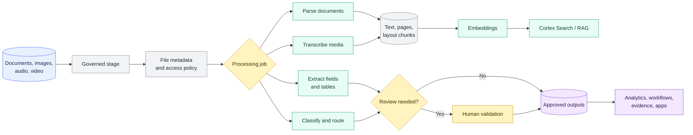

# Document and Multimodal AI

> [!abstract] Consultant lens
> **What it is:** Cortex capabilities for text, documents, images, audio, and video.
>
> **Why it matters:** Turn messy files and media into searchable, structured, reviewable data products.

## Executive Summary

- **What it is:** Snowflake Cortex document and multimodal AI capabilities for parsing documents, extracting fields, classifying content, transcribing media, generating embeddings, and feeding search/RAG or analytics workflows.
- **Why it matters:** Banks run on files as much as tables: KYC packs, contracts, credit memos, call recordings, research PDFs, regulatory evidence, trade confirmations, and scanned operational forms.
- **Mental model:** **Parse makes files readable. Extract makes them structured. Classify routes them. Transcribe turns media into text. Embed/Search makes them retrievable. Human review makes high-impact outputs usable.**
- **Best used when:** The file or media workflow should stay close to governed Snowflake data, source files, access controls, lineage, and downstream analytics.
- **Avoid or reconsider when:** The workflow requires deterministic legal judgment, specialist document-management features, unsupported file/media types, very strict regional constraints, or human approval outside Snowflake.

## What It Can Do

- Parse digital-native and scanned documents into text, layout-aware content, page-level outputs, and embedded images where supported.
- Extract structured values, lists, and tables from documents or text using a requested response format.
- Classify documents, images, or text into categories such as KYC document, client agreement, invoice, research note, or exception evidence.
- Transcribe audio and video files into text, with optional word or speaker timestamps.
- Generate text, image, audio, or video embeddings for semantic search, similarity matching, scene retrieval, and content indexing.
- Feed Cortex Search, RAG, document Q&A, compliance review, operational dashboards, and downstream AI apps.
- Keep original files, derived text, extracted fields, embeddings, and review decisions inside a governed Snowflake pattern.

## What It Cannot Do

- Guarantee perfect extraction from poor scans, handwritten notes, ambiguous contracts, or inconsistent templates.
- Replace legal, compliance, credit, or model-risk review for regulated decisions.
- Make probabilistic AI outputs into source-of-record facts without validation.
- Remove regional availability, cross-region inference, access-control, or data-retention considerations.
- Replace a full document-management platform for legal hold, workflow, versioning, signing, or records management.
- Keep legacy Document AI UI workflows alive after decommissioning.

## Core Concepts

| Concept | Meaning | Why it matters |
|---|---|---|
| `AI_PARSE_DOCUMENT` | Function that extracts document content from a staged file, using OCR or layout mode | Foundation for document search, summarization, and downstream extraction |
| OCR mode | Text-only extraction from a document | Useful for simpler scanned/text-heavy files |
| Layout mode | Text plus document structure such as tables and layout relationships | Better for complex PDFs, reports, statements, and image extraction |
| `AI_EXTRACT` | Function that extracts structured fields, lists, or tables from text or files | Turns documents into columns that can be validated and used in pipelines |
| `AI_CLASSIFY` | Function that classifies text, image, or document input into provided categories | Helps route mixed document streams to the right process |
| `AI_TRANSCRIBE` | Function that transcribes staged audio or video files | Turns meetings, client calls, and recordings into analyzable text |
| `AI_EMBED` | Function that creates embeddings for text or images | Useful for vector search and similarity over text/image content |
| `AI_MULTI_EMBED` | Function that creates multimodal embeddings for text, images, audio, or video | Supports semantic search across media, segments, and modalities |
| Source traceability | Storing file path, checksum/version, page/segment, timestamp, and extraction run metadata | Lets reviewers and auditors trace every output back to evidence |
| Human review threshold | Rule that decides when extracted/classified output must be reviewed before publication | Critical for bank-grade trust and regulated workflows |
| Legacy Document AI | Older Document AI UI and `<model_build_name>!PREDICT` workflow | Decommissioned on March 16, 2026; new work should use Cortex document functions |

## How It Works (Simple Flow)

1. Land or reference files in governed internal or external stages.
2. Track file metadata such as owner, source system, classification, checksum, document type, and processing status.
3. Route files by type and use case: parse documents, extract fields, classify categories, transcribe media, or create embeddings.
4. Normalize outputs into durable tables: parsed text, page chunks, extracted fields, transcripts, embeddings, scores, and error details.
5. Preserve source traceability from every derived row back to the original file, page, timestamp, or segment.
6. Validate outputs with extraction scores, business rules, sampling, and human review queues.
7. Publish approved outputs to analytics tables, Cortex Search services, RAG apps, operational workflows, or compliance evidence stores.
8. Monitor freshness, cost, failure rates, permissions, regional inference behavior, and downstream answer quality.

## Visuals



## Readable Snippets

### Parse a complex PDF

```sql
-- Parse a complex PDF while preserving layout and page boundaries.
SELECT AI_PARSE_DOCUMENT(
  TO_FILE('@docs_stage', 'client_agreement.pdf'),
  {'mode': 'LAYOUT', 'page_split': TRUE}
) AS parsed_document;
```

### Extract reviewable fields

```sql
-- Extract reviewable structured fields from a document.
SELECT AI_EXTRACT(
  file => TO_FILE('@docs_stage', 'client_agreement.pdf'),
  responseFormat => {
    'counterparty_name': 'What is the legal name of the counterparty?',
    'agreement_date': 'What is the date of this agreement?',
    'governing_law': 'What governing law applies?',
    'termination_notice_days': 'How many days of notice are required for termination?'
  },
  scores => TRUE
) AS extracted_fields;
```

### Classify incoming files

```sql
-- Classify incoming files before sending them to different extraction workflows.
SELECT
  relative_path,
  AI_CLASSIFY(
    TO_FILE('@inbound_docs', relative_path),
    ['kyc_identity_document', 'client_agreement', 'tax_form', 'statement', 'other']
  ) AS document_class
FROM DIRECTORY(@inbound_docs);
```

> [!example]- Additional media-processing patterns
> ### Transcribe audio or video
>
> ```sql
> -- Transcribe a recorded meeting or client call with speaker turns.
> SELECT AI_TRANSCRIBE(
>   TO_FILE('@call_recordings', 'client_call_2026_07_01.mp4'),
>   {'timestamp_granularity': 'speaker'}
> ) AS transcript;
> ```
>
> ### Create multimodal embeddings
>
> ```sql
> -- Create multimodal embeddings for staged videos.
> -- Store and search the returned vectors/metadata in a governed table.
> CREATE OR REPLACE TABLE video_embeddings AS
> SELECT
>   relative_path,
>   AI_MULTI_EMBED(
>     'twelvelabs-marengo-embed-3-0',
>     TO_FILE('@surveillance_video', relative_path),
>     {
>       'embedding_scope': ['clip'],
>       'embedding_options': ['visual', 'audio', 'transcription']
>     }
>   ) AS embeddings
> FROM DIRECTORY(@surveillance_video);
> ```

## Important Terms

| Term | Meaning |
|---|---|
| Parse | Convert a document into machine-readable text, layout, pages, tables, or images |
| Extract | Pull specific fields, entities, lists, or tables into structured output |
| Classify | Assign a document, image, or text item to a defined category |
| Transcribe | Convert audio or video speech into text, optionally with word or speaker timestamps |
| Embedding | Numerical vector representation used to compare meaning or similarity |
| Multimodal embedding | Embedding that can represent content across text, image, audio, or video |
| Chunk | Smaller text/page/segment unit used for search and RAG |
| Review queue | Operational workflow where uncertain or high-impact AI outputs are manually validated |
| Extraction score | Optional signal that helps prioritize review, sampling, or rejection |
| Derived data product | The approved table, search index, transcript, or feature created from files/media |

## Consultant Talking Points

- **Client question this answers:** "Can Snowflake process our documents, PDFs, scanned forms, images, audio, and video without exporting them to a separate AI stack?"
- **Trade-offs to mention:** Snowflake-native processing gives governance and data proximity, while specialist document platforms may still be better for complex review workflows, legal records, or niche extraction needs.
- **Risk or governance angle:** Documents can contain PII, MNPI, legal clauses, client secrets, and regulated evidence; access, review thresholds, regional inference, retention, and audit trails matter.
- **Cost/performance angle:** Document pages, images, audio/video duration, repeated inference, extraction scores, and embedding refreshes can become expensive unless processed incrementally and persisted.

## Bank Example

A bank wants to automate part of client onboarding and compliance evidence handling.

| Step | Snowflake pattern | Why it matters |
|---|---|---|
| Ingest files | Store PDFs, images, and forms in governed stages | Keeps original evidence under access control |
| Route document types | `AI_CLASSIFY` on inbound files | Sends passports, tax forms, contracts, and statements to different review paths |
| Extract known fields | `AI_EXTRACT` with response formats and scores | Produces reviewable fields such as name, registration number, dates, and clauses |
| Parse full context | `AI_PARSE_DOCUMENT` in layout mode | Preserves tables, pages, and report structure for search or analyst review |
| Transcribe calls | `AI_TRANSCRIBE` on approved recordings | Turns audio/video into searchable text with speaker context |
| Search evidence | Parsed chunks plus Cortex Search/RAG | Lets analysts find relevant clauses, policies, or prior evidence quickly |
| Validate output | Human review for high-risk fields | Prevents AI output from becoming unchecked regulatory evidence |
| Publish result | Approved tables with source traceability | Creates auditable downstream data products |

## Where This Fits

| Situation | Recommend |
|---|---|
| Need raw text/layout from PDFs, PPTX, DOCX, or scans | `AI_PARSE_DOCUMENT` |
| Need specific fields, entities, lists, or tables | `AI_EXTRACT` |
| Need to route mixed inbound document streams | `AI_CLASSIFY` |
| Need Q&A/search over policies, contracts, reports, or transcripts | Parse/transcribe, chunk, then Cortex Search/RAG |
| Need to analyze meeting, call, or video speech | `AI_TRANSCRIBE` |
| Need semantic search over images or visual content | `AI_EMBED` or `AI_MULTI_EMBED` depending on modality |
| Need scene/media retrieval across video/audio/image/text | `AI_MULTI_EMBED` |
| Need high-stakes legal, KYC, credit, or compliance outputs | AI-assisted extraction plus human review and source traceability |
| Existing workflow uses old Document AI UI or `<model_build_name>!PREDICT` | Migrate to Cortex document functions or migrated Model Registry legacy model pattern |
| Need full records lifecycle, legal hold, signing, or workflow case management | Integrate a specialist document platform with Snowflake outputs |

## Common Pitfalls

- Treating document parsing as the same thing as trusted extraction.
- Publishing extracted fields without review thresholds, sampling, or business validation.
- Losing the link between extracted values and the original file, page, timestamp, or processing run.
- Reprocessing the same large files repeatedly instead of persisting parsed text, transcripts, embeddings, and approved outputs.
- Building RAG over documents without document-level access filters and source citations.
- Ignoring regional availability, cross-region inference, and whether sensitive content is allowed through the selected AI function.
- Assuming every file type, size, language, handwriting style, or media duration is supported.
- Forgetting token/function costs for high-volume extraction, classification, transcription, and embedding jobs.
- Continuing to design around the old Document AI UI/PREDICT pattern after the March 16, 2026 decommission date.

## When to Recommend What (Decision Table)

| Situation | Recommend | Why | Watch-outs |
|---|---|---|---|
| Text-heavy PDFs need search | `AI_PARSE_DOCUMENT` plus Cortex Search | Converts documents into chunks users can retrieve | Chunking, access filters, freshness, citations |
| Known fields need extraction from contracts/forms | `AI_EXTRACT` with schema-like response format | Produces structured, reviewable outputs | Scores, human review, schema drift |
| Mixed document inbox needs routing | `AI_CLASSIFY` | Simple first-pass categorization | Category quality and edge cases |
| Call recordings need analysis | `AI_TRANSCRIBE` | Converts speech to text for search, surveillance, or summaries | Consent, retention, speaker accuracy |
| Videos/images need semantic retrieval | `AI_MULTI_EMBED` or image `AI_EMBED` | Searches meaning rather than filenames/tags | Regional availability, media limits, vector storage |
| Users want answers over document collections | Parse/transcribe plus Cortex Search/RAG | Retrieval-first pattern reduces hallucination risk | Source permissions and prompt injection |
| Extracted outputs affect compliance, credit, or legal decisions | Human-reviewed AI pipeline | AI speeds work but humans own high-impact decisions | Slower workflow and evidence requirements |
| Client has mature records platform | Integrate with Snowflake rather than replace | Keeps lifecycle controls where they already exist | Integration and ownership complexity |

## Related Topics

- [[01 Snowflake/05 Advanced Analytics and AI/Advanced Analytics and AI Overview]]
- [[01 Snowflake/05 Advanced Analytics and AI/33 Cortex AI Functions]]
- [[01 Snowflake/05 Advanced Analytics and AI/37 Cortex Search and RAG]]
- [[01 Snowflake/05 Advanced Analytics and AI/39 AI Governance, Guardrails, Observability, and Cost]]
- [[01 Snowflake/04 Data Engineering/31 Unstructured File Pipelines and Document Processing]]
- [[01 Snowflake/06 Cost Management and Operations/44 Credit Consumption Model]]

## Related Decision Notes

- [[80 Comparisons and Decision Notes/Decision Notes/Snowflake/Decisions - Choosing a Snowflake AI and ML Pattern]]

## Questions

- Which file and media types are in scope, and which are scanned, image-heavy, multilingual, handwritten, or poor quality?
- Which source files contain PII, MNPI, client secrets, legal evidence, or regulated communications?
- Which outputs are allowed to be automated, and which require human review before publication?
- What source traceability is required: file path, checksum, page number, timestamp, speaker, model/function version, and prompt/response format?
- Which region and cross-region inference policy applies?
- Should derived text/chunks/embeddings inherit document-level access controls?
- How will quality, cost, failure rate, and drift in document templates be monitored?

## Sources To Revisit

- [Snowflake Docs: Cortex AI Functions for documents](https://docs.snowflake.com/en/user-guide/snowflake-cortex/ai-documents)
- [Snowflake Docs: AI_PARSE_DOCUMENT](https://docs.snowflake.com/en/sql-reference/functions/ai_parse_document)
- [Snowflake Docs: AI_EXTRACT](https://docs.snowflake.com/en/sql-reference/functions/ai_extract)
- [Snowflake Docs: AI_CLASSIFY](https://docs.snowflake.com/en/sql-reference/functions/ai_classify)
- [Snowflake Docs: AI_TRANSCRIBE](https://docs.snowflake.com/en/sql-reference/functions/ai_transcribe)
- [Snowflake Docs: AI_EMBED](https://docs.snowflake.com/en/sql-reference/functions/ai_embed)
- [Snowflake Docs: AI_MULTI_EMBED](https://docs.snowflake.com/en/sql-reference/functions/ai_multi_embed)
- [Snowflake Docs: Cortex AI Functions for multimodal](https://docs.snowflake.com/en/user-guide/snowflake-cortex/ai-multimodal)
- [Snowflake Docs: Document AI decommission](https://docs.snowflake.com/en/release-notes/bcr-bundles/un-bundled/bcr-2156)
