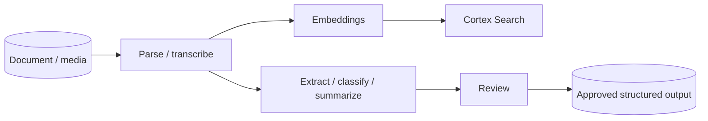

# Document and Multimodal AI

> Cortex capabilities for text, documents, images, audio, and video. Consultant lens: distinguish file processing, extraction, search, summarization, and human-reviewed decisions.

## Executive Summary

- **What it is:** Snowflake Cortex functions and patterns for parsing, extracting, classifying, summarizing, translating, redacting, transcribing, and embedding non-tabular content.
- **Why it matters:** Finance workflows often involve reports, PDFs, contracts, filings, emails, voice/video transcripts, and scanned documents.
- **Mental model:** Parse turns files into machine-readable content; extract turns content into structured fields; search retrieves context; generation summarizes or answers with review.
- **Best used when:** Unstructured data already belongs near Snowflake-governed analytics and can be processed within approved regions and controls.
- **Avoid or reconsider when:** The workflow requires specialist document review systems, strict deterministic extraction, or unsupported media/file types.

## What It Can Do

- Parse documents into text, layout, and images where supported.
- Extract structured fields from text or documents.
- Classify and summarize documents or images.
- Transcribe audio/video and support downstream analysis.
- Create embeddings for semantic search and RAG.

## What It Cannot Do

- Guarantee correct extraction from every document.
- Remove OCR/layout/document-quality issues.
- Replace legal review or regulated approval workflows.
- Keep older Document AI UI workflows alive after decommissioning.

## Core Concepts

| Concept | Meaning | Why it matters |
|---|---|---|
| AI_PARSE_DOCUMENT | Function for document text/layout/image extraction | Foundation for document pipelines |
| AI_EXTRACT | Function for structured extraction from text/documents | Replaces many old Document AI-style workflows |
| Multimodal | Models/functions over text plus images/audio/video | Expands beyond plain text |
| Embedding | Vector representation of content | Powers search and RAG |
| Review threshold | Rule for human validation | Controls production risk |

## How It Works (Simple Flow)

1. Put documents or media in a governed stage.
2. Parse or transcribe content into text/layout/metadata.
3. Extract fields, classify content, summarize, or create embeddings.
4. Validate outputs with scores, sampling, review queues, or business rules.
5. Persist approved outputs and link them back to the original file.
6. Use the results in search, analytics, workflows, or downstream AI apps.

## Visuals



## Readable Snippets

```sql
-- Representative pattern:
-- parse document -> extract fields -> persist reviewed output.
-- Exact syntax depends on file location, mode, and function options.
```

## Consultant Talking Points

- **Client question this answers:** "Can Snowflake help us process documents and media, not just rows and columns?"
- **Trade-offs to mention:** Faster Snowflake-native pipeline versus specialist document AI platforms and accuracy constraints.
- **Risk or governance angle:** Old Document AI UI workflows were decommissioned; new work should use Cortex document functions and governed pipelines.
- **Cost/performance angle:** Document pages, images, audio/video duration, and repeated processing can drive cost.

## Common Pitfalls

- Confusing document parsing with reliable business extraction.
- Treating extracted values as facts without review.
- Forgetting to persist outputs and repeatedly reprocess files.
- Ignoring regional availability and cross-region inference.
- Missing the Document AI decommission and building on old patterns.

## When to Recommend What (Decision Table)

| Situation | Recommend | Why | Watch-outs |
|---|---|---|---|
| Need text/layout from PDFs | AI_PARSE_DOCUMENT-style parsing | Converts files into usable content | OCR/layout quality |
| Need specific fields from documents | AI_EXTRACT-style extraction | Produces structured output | Review and validation |
| Need semantic search over documents | Parse plus Cortex Search | Retrieval-first pattern | Access filters |
| Need high-stakes legal extraction | Human review workflow | Safer governance | Slower and costlier |
| Old Document AI UI process | Migrate to Cortex document functions / Model Registry path | Old UI/PREDICT workflow decommissioned | Migration planning |

## Related Topics

- [[01 Snowflake/05 Advanced Analytics and AI/Advanced Analytics and AI Overview]]
- [[01 Snowflake/05 Advanced Analytics and AI/33 Cortex AI Functions]]
- [[01 Snowflake/05 Advanced Analytics and AI/37 Cortex Search and RAG]]
- [[01 Snowflake/04 Data Engineering/31 Unstructured File Pipelines and Document Processing]]

## Related Decision Notes

- [[80 Comparisons and Decision Notes/Decision Notes/Decisions - Choosing a Snowflake AI and ML Pattern]]

## Questions

- Are documents digital-native, scanned, image-heavy, multilingual, or handwritten?
- Which fields need human review before publication?
- What is the retention and access policy for original files and derived text?

## Sources To Revisit

- [Snowflake Docs: Cortex AI Functions for documents](https://docs.snowflake.com/en/user-guide/snowflake-cortex/ai-documents)
- [Snowflake Docs: AI_PARSE_DOCUMENT](https://docs.snowflake.com/en/user-guide/snowflake-cortex/parse-document)
- [Snowflake Docs: AI_EXTRACT](https://docs.snowflake.com/en/user-guide/snowflake-cortex/document-extraction)
- [Snowflake Docs: Document AI decommission](https://docs.snowflake.com/en/release-notes/bcr-bundles/un-bundled/bcr-2156)

